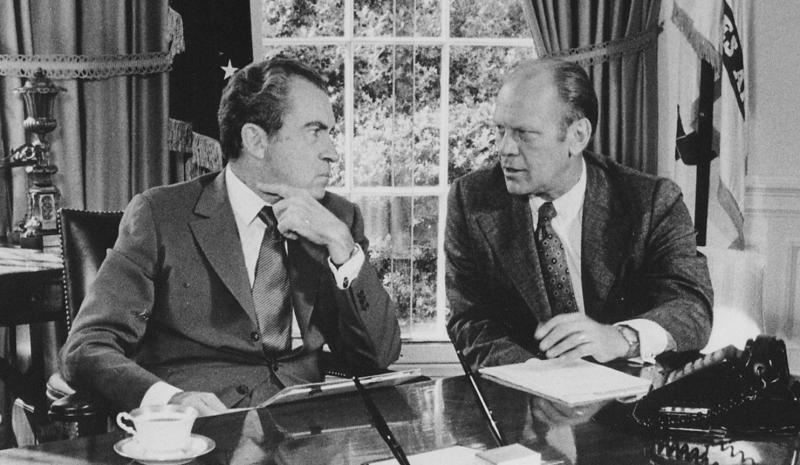

---
 

As I [feared](https://ehrens.substack.com/p/above-the-law), a misguided Democrat has suggested that [Biden pardon Trump](https://www.penncapital-star.com/commentary/pardon-me-why-biden-should-pull-a-gerald-ford-when-it-comes-to-trump-bruce-ledewitz/) when and if he beats Trump at the polls (again). This misguided individual and a self-described Democrat is Bruce Ledewitz, a law professor at Duquesne University, who explicitly mentions Gerald Ford’s famous precedent of pardoning Nixon..

Ledewitz argues that democracy is dying from the downward spiral of violations of norms and laws. He even agrees with former Attorney General William Barr that prosecuting Trump is absolutely justified.

But — so argues the law professor — to hell with the rule of law.

Ledewitz argues that, despite every legal justification and the fact that ignoring crimes like Trump's has brought us to this point, Democrats ought to pardon Trump — not for justice but out of a political calculus intended to mollify MAGA zealots.

For a little historical context, I don't recall the Justice Department *ever* hesitating to prosecute Klan members in Mississippi because some substantial portion of the electorate there didn't want it to happen. But conflict avoidance is at the heart of Ledewitz's argument. And this is a despicable case for a law professor to be making.

Ledewitz employs such ridiculous and simplistic logic that he embarrasses himself. Although it's hard to imagine that he *never* saw an innocent defendant accept a favorable plea deal (in a legal system where more than 90% of all defendants take pleas), Ledewitz's argument is based on a simplistic logic: Biden will offer Trump a pardon and Trump will turn it down if he's not actually guilty. But — so Ledewitz reasons — Trump *is* guilty, *ergo* accepting Biden's pardon will be an admission of his crimes. *Voila*! Case closed. Perry Mason does it again!

But it's not as if Trump doesn't wolf down legal maneuvers along with his cheeseburgers every day. Or that he would *never* take anything given to him freely (by some accounts he was prepared to sell pardons). Or as if Trump's supporters are actually moved by ethics, logic, facts, or respect for the rule of (secular) law. Despite all the damning proof of crimes provided, Trump survived two impeachments precisely because his many enablers just don't care about facts, the rule of law. Or Perry Mason logic.

Let the rest of us — those who actually believe in justice — agree that if Donald Trump broke the law then he must suffer the same consequences as any other citizen. If *especially* a law professor is prepared to reject this basic premise of justice, then let's just open the doors to all the jails and let out all the criminals.

Either we believe in the rule of law, or we don't. I hope *someone* is still teaching that at Duquesne Law School.

