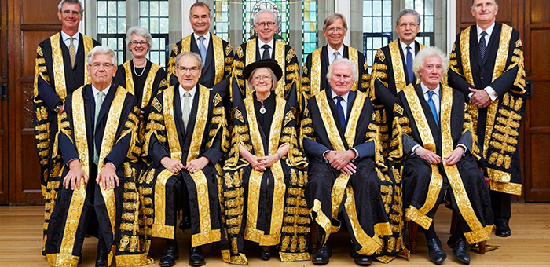

---
 

Donald Trump did tremendous damage to the Supreme Court by appointing two Christian Nationalist zealots during his single term. Trump, a sexual predator in his own right, appointed accused sexual predator Brett Kavanaugh to join accused sexual predator Clarence Thomas in a court already swimming with misogyny.

In a nation where only 23% of all citizens regard themselves as Catholic, 7 of 9 — 78% — of current Supreme Court justices are Catholic (Kagan is Jewish, Jackson is Protestant). Several of the Catholic justices reject the liberal Catholicism that [came out of](https://www.newyorker.com/news/daily-comment/the-sins-of-the-high-courts-supreme-catholics) the Second Vatican Council, a papal nod to modernity, equality, and justice. Amy Coney Barrett, Trump’s last appointment, actually belongs to a [Catholic cult](https://www.theguardian.com/us-news/2020/sep/26/amy-coney-barrett-supreme-court-donald-trump-people-of-praise) replete with [handmaids](https://www.forbes.com/sites/jemimamcevoy/2020/10/07/what-does-it-mean-that-amy-coney-barrett-served-as-a-handmaid-in-a-religious-group/?sh=74329e8a8932) (not precisely what you think). There is not a single gay justice on the Court, although at least 7.2% of all Americans are gay. This is a court that knows little and cares even less about the diverse lives of ordinary Americans.

The Court's recent, explosive rulings both snub their nose at *stare decisis* and dishonestly select cases based on fraudulent *standing* before the court. Where once it took a panel of legal experts to discern the legal principles behind a decision, now it only requires asking the question: what would Donald Trump want?

Worse, the Court is now encroaching upon the functions of the other branches of government. In her dissent to the Court's ruling on [student debt cancellation](https://www.bbc.com/news/world-us-canada-65931653), Justice Elena Kagan wrote that "the result here is that the court substitutes itself for Congress and the Executive Branch in making national policy about student-loan forgiveness".

"Congress authorised the forgiveness plan... the [education secretary] put it in place; and the president would have been accountable for its success or failure," she wrote. "But this court today decides that some 40 million Americans will not receive the benefits of the plan (so says the court) that assistance is too 'significant'".

Most dishonestly, the Court violated a basic legal principle of *standing* (as it also did in the website case) by conjuring up an aggrieved party with [no standing](https://prospect.org/justice/2023-06-19-student-loan-cancellation-supreme-court-mohela/) to actually bring its complaint before the Court. The Court claimed the Missouri Higher Education Loan Authority (MOHELA), a student loan servicer that conducts day-to-day operations on federal student loans, would lose revenue as a consequence of debt cancellation. The only problem is that MOHELA did not bring the suit and said [in its own financial documents](https://protectborrowers.org/wp-content/uploads/2023/01/22-506_Biden-v-NE_ArchCity-Defenders-and-LSEM_AMICI-CURIAE.pdf) that it didn't plan to make any payments in the future.

Furthermore, an [analysis](https://rooseveltinstitute.org/wp-content/uploads/2023/05/RI_Flawed-Claims-of-Legal-Standing-in-Biden-v-Nebraska_brief_202305.pdf) from the Roosevelt Institute and the Debt Collective shows that MOHELA stood to *gain* revenue if debt cancellation had gone forward. In selecting this case and faking the plaintiff, the Court was not settling a dispute; it was going out of its way to preempt both the Executive and Legislative branches of government.

For the past year following the Dobbs decision, the Court has drawn intense criticism, with critics eager to revisit the lies and ethical violations of its black-robed sexual predators, as well as those who took cash and gratuities from billionaires and then ruled on cases affecting these sugar daddies.

But the last straw has been the Court's outrageous violations of judicial precedent and dishonesty in picking and choosing cases as well as manufacturing aggrieved parties. We have finally reached the point where many are calling for impeachment, reforms and court expansion.

The Constitution's Article III, Section 1 says that federal judges can hold their offices "during good behavior." With a corrupt Supreme Court, it’s sobering to consider that the Supreme Court itself may have the last word in deciding if conspiring with your wife on an insurrection, letting billionaires buy your decisions, or violating basic legal principles that would disbar lesser judges constitutes grounds for impeachment. One hopes it is entirely in Congress’s hands.

Reforms can be accomplished by the Court itself, others only by Congress, and others (term limits or court diversity) only by Constitutional amendment. The reform group [Fix the Court](https://fixthecourt.com/) does not advocate the expansion of the Court but does advocate: term limits, tighter ethics and disclosure rules, public access to court proceedings, divestiture of individual stocks by justices, more rigorous recusal rules, comprehensive financial disclosures, and public disclosures of the many media appearances most of us didn't even know that justices make.

Expanding the court, however, does not require altering the Constitution. It could theoretically be done today. This is a position that an increasing number of legislators, including both Massachusetts senators, advocate. The group [Demand Justice](https://demandjustice.org/) advocates for court expansion. Democrats have already filed [legislation](https://www.nbcnews.com/politics/supreme-court/democrats-introduce-bill-expand-supreme-court-9-13-justices-n1264132) to expand the court, though it is unclear why they think it would survive a Constitutional sniff test. Expansion is something the President can do with Senate approval. The only problem is: the current president [refuses to](https://www.nbcnews.com/politics/joe-biden/joe-biden-interviewed-msnbc-scotus-decision-rcna91871) expand the court.

But adding justices is hardly a new idea. Donald Trump's next favorite president (after himself, of course) was Andrew Jackson, who added two justices to the Court in 1836. In 1937 the very *threat* of expanding the Court to 15 justices by Franklin Delano Roosevelt was enough to return several obstructionist justices to less ideologically-motivated positions.

Which is not to say the court does not also need major reform. There is nothing sacred about nine justices or lifetime presidential appointments. The way justices are appointed in other Western nations puts our poorly-defined scheme to shame.

The Supreme Court of Canada is appointed by the Governor in Council and consists of nine justices. The number started out as six, was bumped up to seven, and ultimately became nine. On the surface Canada's looks like ours, but Canada's Supreme Court Act requires that three judges come from Ontario, three from Quebec, two from the Western provinces or Northern Canada and one from the Atlantic provinces. And judges must also retire before their 75th birthdays.

The Supreme Court of the United Kingdom has twelve justices (shown above) and they must have already served on the bench for 15 years, or two on a "federal" bench. The UK convenes a selection commission chosen from judiciaries in Britain, Scotland, Northern Island and Wales, and it strives for at least regional balance. After selection, a justice is formally appointed by the Queen. Even with 12 justices that number can still be increased. Justices must retire at 70 or 75, depending on when they joined the bench.

The German Federal Constitutional Court (*Bundesverfassungsgericht*, or BVerfG), has sixteen justices divided a couple of ways into two senates and three chambers. Judges are elected by both the *Bundestag* and the *Bundesrat*, each of which selects eight justices. A Justice must have previously held a position on the bench and be at least 40 years of age. Justices serve for 12 years or until the age of 68, whichever comes first.

The French Court of *Cassation* is the highest appeal court in France and has an elaborate system of chambers and sitting and administrative judges, but 15 justices head up the court. These 15 judges serve a 9 year term and 3 each are appointed by the President of the Republic and Senate and National Assembly presidents. To become a judge a lawyer must be admitted to the Supreme Court Bar after passing an exam from the National School of the Magistracy. Typically, candidates are already judges in lower courts.

Our Supreme Court selection process is a mess. Not only is it highly politicized, but it lacks regional and demographic representation, professionalism, and justices typically serve well past normal retirement. More importantly, the selection process is simply undemocratic. And timidity, inertia, and a vague Constitution seem to prevent Congress from using its powers to rein in abuses by the Judicial branch.

We need a serious re-do of the selection process as well as term limits for the Supreme Court. And there are many places to look for good ideas, starting with those of our closest allies. Add Supreme Court reform to a long list of Constitutional changes necessary to *update* American democracy rather than *overturn* it — now that we've seen how fragile ours really is.

But in the interim, let's expand the Supreme Court.
