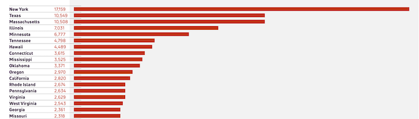
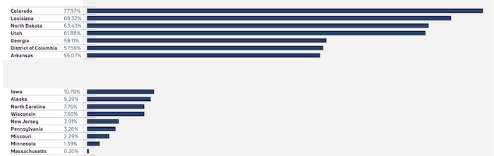

---
 

If you have long suspected that the Massachusetts legislature purposely tanks most progressive pieces of legislation, you'd be half right.

Half right because the Massachusetts legislature actually tanks 99.8% of all legislation filed.

According to ACT ON MASS, the Massachusetts legislature has not been in session since July 31st and is officially the [least effective](https://fiscalnote-marketing.s3.amazonaws.com/FN080823-Most-Effective-States-WP_v2.pdf?emci=1d235cac-b054-ee11-9937-00224832e811&emdi=a99a5731-b854-ee11-9937-00224832e811&ceid=29280234) legislature in the country. But don't blame it all on your local legislators, who rank #3 among the most prolific filers of new legislation:

Blame it instead on the House and Senate leadership who kill legislation by consigning it to "study" or "committee." As a result of this – as well as our habit of electing Republican governors – Massachusetts is dead last in the percentage of legislation actually enacted:

And we can thank House Speaker Ron Mariano and Senate President Karen Spilka for this.

As a consequence of the legislature being prevented from doing its job, ballot initiatives seem to pop up like mushrooms amidst all the dead wood on Beacon Hill. Massachusetts voters can expect as many as [34 ballot questions](https://www.wgbh.org/news/politics/2023-09-06/questions-on-rent-control-mcas-tests-and-more-advance-toward-2024-ballot) before them in the next two election cycles. Many of these will be sponsored (or challenged) by lobbyists, worded deceptively, or funded to the tunes of tens of millions of dollars. All because the legislature can't, or won't, do it's damned job.

In 2021 Massachusetts [ranked 47th](https://democracychronicles.org/why-more-transparency-is-needed-in-massachusetts/) in government transparency according to the Open States project of the Sunlight Foundation. It takes great effort to discover how your representative voted – that is, if they ever get to vote on legislation that is more often than not [tanked](https://www.wgbh.org/news/local/2021-06-27/its-all-in-the-dark-activists-call-for-legislative-transparency-on-beacon-hill) in the House or Senate.

Once again, we can thank House Speaker Ron Mariano and Senate President Karen Spilka for this.

In 2018 an environmental lobbyist [perfectly summed up](https://commonwealthmagazine.org/opinion/ex-lobbyist-reveals-how-the-house-really-works/) the reality in the State House when a young reporter asked him when a bottle bill would come up for a vote:

> “Probably never,” I shot back.
>
> “But isn’t the majority of the committee in favor of it? Won’t they call for a vote?” he queried.
>
> That moment, I broke an unspoken but absolutely firm rule among lobbyists: *never criticize the State House political system*. “Let me be clear,” I asserted. “Don’t confuse what goes on in this building with democracy.”

It is encouraging that State Auditor Donna DiZoglio is fighting to [audit](https://www.mass.gov/audit-reports) both houses. Unlike forensic audits which search out criminal activity, the State Auditor's reports are friendly performance audits that suggest ways to make the organizations studied more efficient and more transparent.

And hopefully more democratic.
