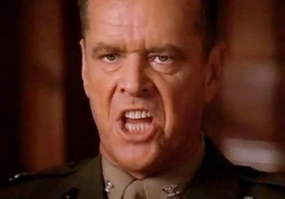
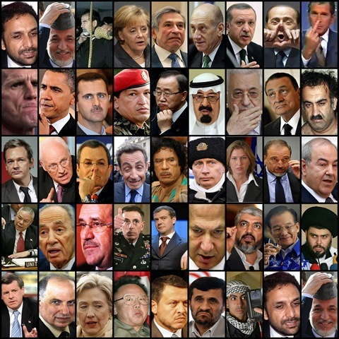

---

There is a scene in the film [A Few Good Men](http://www.youtube.com/watch?v=5j2F4VcBmeo) in which Jack Nicholson's character, Colonel Nathan Jessep, must answer for a soldier's hazing death. He explodes, "You can't handle the truth!" before his classic monolog, explaining how lesser men will never understand the darker side of what it takes to create an effective military.

This scene absolutely nails the American relationship to authoritarian power, but it applies equally toward foreign policy and our rapidly expanding security apparatus. Guantanamo, the end of habeas corpus, imaginary WMDs to justify war, lying at the UN, airport scanners, and now the [Wikileaks](http://en.wikipedia.org/wiki/WikiLeaks) revelations all illustrate the same principle with painful clarity. We just want mommy to make it better. We don't care how she does it. Maybe Colonel Jessep had it right: we can't handle the truth. 

Pundits have had their fun with the Wikileaks disclosures. If you're on the left, they are a confirmation of everything we have learned about our endless wars and the hopeless prospects for "democracy building." If you're [on the right](http://www.weeklystandard.com/articles/wikileaks-iran-and-obama_513334.html), they [justify a third American war](http://bigpeace.com/lklayman/2010/12/05/wikileaks-has-done-the-world-a-service/?utm_source=co2hog) in a decade in Iran. The Wikileaks documents portray compulsive data-gatherers sitting in their offices trying to fit what they have learned into neat little boxes reflecting American interests. Or of dispatches from diplomats who only hear what they want to hear. Or &#8212; as former ambassador Charles Freeman notes &#8212; who are often told only what they want to hear by their foreign contacts. 

Why do we accept military and foreign policy conducted in an antiseptic environment, free of "trivial" moral concerns or inconvenient transparency? We may not usually get it, but we have an expectation of transparency in our elections, economics, health care, tax laws, banking, and other domains. Why should disclosures of foreign policy missteps by both the Bush and Obama administrations be so violently attacked? 

Yes, violently. Canadian Conservative Party advisor [Tom Flanagan](http://www.telegraph.co.uk/news/worldnews/northamerica/canada/8172920/Julian-Assange-should-be-assassinated-Canadian-official-claims.html) called for Wikileaks founder Julian Assange's assassination, as did [Bill O'Reilly](http://www.newser.com/story/106441/oreilly-execute-wikileakers.html), [Mike Huckabee](http://www.rightwingwatch.org/content/huckabee-calls-execution-those-responsible-wikileaks-documents), and [Sarah Palin](http://blogs.abcnews.com/thenote/2010/11/does-palin-want-to-whack-assange.html). National Review Author [Jonah Goldberg](http://www.nationalreview.com/articles/251393/all-quiet-black-ops-front-jonah-goldberg) asked why Assange hasn't been garroted yet. [Daniel Ellsberg](http://www.ellsberg.net/archive/daniel-ellsberg-fears-assanges-in-danger), no stranger to leaks himself, believes Assange is in physical danger. [Senator Joe Lieberman](http://www.readwriteweb.com/cloud/2010/12/amazon-drops-wikileaks.php) pressured Amazon.com to stop hosting Wikileaks in the United States, and domains throughout the world have been under constant denial of service attacks. 

Wikileaks have provided many opportunities for political posturing. For example, Senator Charles Schumer, who wants the US to release Jonathan Pollard, a spy in federal prison for revealing military secrets to a foreign country, now wants new laws to prosecute Assange (an Australian) for publishing military statistics and embarrassing diplomatic cables. 

The [mainstream press](http://www.salon.com/news/opinion/glenn_greenwald/2010/11/30/wikileaks/index.html) can't quite believe its good luck at the endless stream of stories Wikileaks has generated. In general it has shown more interest in what is "newsworthy" than what is valuable to an informed public, depending on "embedded" reporters, softball questions, remaining addicted to talking heads instead of reporting real news. The [Rolling Stone's interview](http://www.rollingstone.com/politics/news/17390/119236) with Stanley McChrystal was a striking exception, and it occurred only after the public really started questioning the war. The truth is: it has taken a dramatic flood of documents from Wikileaks to really get the mainstream media to focus on what is really happening in Iraq and Afghanistan. And, rather than focusing, much of their attention is on the [salacious details](http://www.nytimes.com/2010/10/24/world/24assange.html) of Assange's whereabouts, his safety, or the raciest snippets from the cables. But, like any business, the media only give us what we really want. 

Wikileaks was founded in 2006 by political dissidents. Within a year it had already published over a [million documents](http://213.251.145.96/file/wikileaks_archive.7z). As long as those documents related to China, Somalia, Peru, Iran, Ivory Coast, Kenya, or non-Western states, Wikileaks garnered approval from human rights groups, Western governments and the mainstream media. 

But last April Wikileaks posted a video of the wanton [killing of a number of Iraqi civilians](http://www.collateralmurder.com/) in July 2007, including two Reuters photographers, by American Apache helicopters. In July Wikileaks released 92,000 documents from Afghanistan. Last October Wikileaks released 392,000 documents from Iraq which provided a glimpse into the war between 2004 and 2009. [Both collections](http://www.diarydig.org/) of documents painted a picture of the failed use of force in nations we simply do not understand. Then this month the first of a quarter million [diplomatic cables](http://213.251.145.96/cablegate.html) began to be released. And they haven't been flattering either. 

China, Somalia, and Burma don't have anything on us. Murder, torture, terror, repression, duplicity, lying, and all the things that Colonel Jessep hinted at do not apply to just our enemies. We can do them as well as anybody. 

Transparency. We have a right to know. And I believe we _can_ handle the truth.
