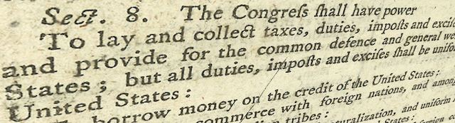

---

If Bashar al-Assad used [chemical weapons](https://theintercept.com/2018/04/14/donald-trump-ordered-syria-strike-based-on-a-secret-legal-justification-even-congress-cant-see/) on civilians, add it to a long list of atrocities and injustices perpetrated daily on this planet. To this same list we should also add Israel's [Passover massacre](https://www.tikkun.org/nextgen/israeli-army-slaughters-nonviolent-protesters-on-eve-of-passover) of civilians in Gaza, the [genocide of the Rohingya](https://www.cbsnews.com/news/report-blames-myanmar-for-rohingya-genocide/), and dictatorships at work in Turkey, Venezuela, Egypt and dozens of other countries. To crimes against humanity we should also add our own "surgical strikes" by drones and missiles which have killed [thousands](https://www.nytimes.com/interactive/2017/05/25/world/middleeast/airstrikes-iraq-syria-civilian-casualties.html) of Syrians in our never-ending "War on Terror." 

But America is focused on Assad — not because we really care about Syrians or any of the other victims of brutality around the world — but because "regime change" is part and parcel of bending the Middle East toward American interests. It's the height of hubris — playing god by remaking the world in our own image. 

I have rarely known a year when the United States was not throwing its weight around, invading another country, murdering its citizens — sometimes by the [hundreds of thousands](https://en.wikipedia.org/wiki/Lancet_surveys_of_Iraq_War_casualties) or [millions](https://www.britannica.com/event/Vietnam-War) in the case of Viet Nam. If Americans really want to stamp out malign evil I suggest we start by looking in the mirror. 

Start with the Boltons who advocate for war, the Hampels who torture in secret prisons and conceal the evidence from even Congress, the Trumps who use American military power for political dog-wagging, the Mattises who manage slaughter like a CEO rolling out a new product, and the many sociopaths in Congress who funnel national wealth away from the care of citizens into a vast war machine. We delude ourselves if we think the United States is the greatest force for good in the world. Quite the opposite. We are the most homicidal nation on the planet.

Which is why no one in their right mind would give one man — especially a volatile racist with dementia — sole power to wage war. [Article I, Section 8 of the Constitution](https://www.law.cornell.edu/constitution/articlei#section8) is quite clear that it is the responsibility of *Congress* to do the dirty work of waging wars:

- **To define and punish** piracies and felonies committed on the high seas, and **offenses against the law of nations;**
- **To declare war, grant letters of marque and reprisal, and make rules concerning captures on land and water;**

Our unhinged president is sufficient example of why Congress must take back this grave responsibility from the Executive Office and must wield it responsibly and only with great reluctance. 

