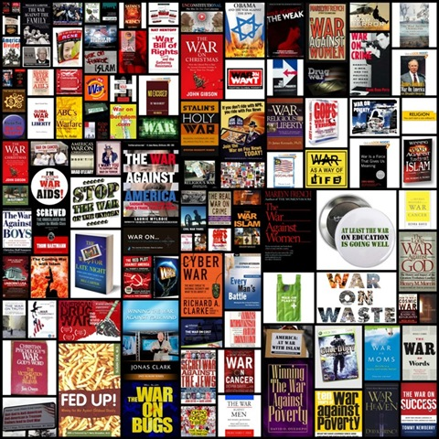

---

Have you ever noticed that every ideological dispute and every problem to be dealt with becomes a war in the United States?

This is often the realm of the far Right's _Kulturkampf_ against creeping liberalism, atheism, and the like. But not exclusively. It can be just as easily attacks on civil liberties or social programs which are likened to war by progressives.

And if it's none of the above, then it's a Federal war on drugs, crime, terror, poverty, childhood obesity... just add your own campaign name.

We are so swamped with thousands of simultaneous wars that we don't have time to understand or stick with any of them. We are a nation in a perpetual state of war. We can't seem to live without it.

