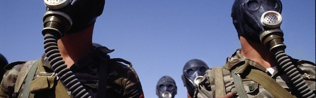
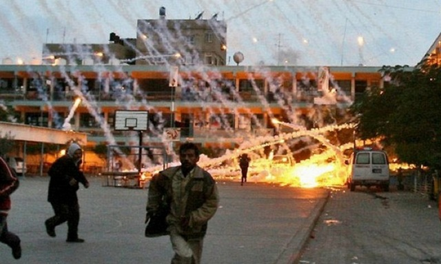

---

According to an article in the [New York Times](http://www.nytimes.com/images/2013/09/01/nytfrontpage/scan.pdf), the president summoned his aides to the Oval Office to discuss his reasons for asking Congress for permission to wage war on Syria -- not that American presidents feel obliged to follow the Constitutionally-mandated procedure: "He had several reasons, he told them, including a sense of isolation after the terrible setback in the British Parliament. But the most compelling one may have been that acting alone would undercut him if in the next three years he needed Congressional authority for his next military confrontation in the Middle East, perhaps with Iran."

If this sounds familiar it's because it happened four years ago, just barely into Obama's second term, when Syria looked every bit like the target it is today and Iran, too, was squarely within American crosshairs. Obama had drawn a moral "red line" in the sand warning Assad against the use of chemical weapons. The U.S. seemed to be on the brink of another war. 

Bush had gotten Saddam. Obama had already dispatched Ghadafy and was now weighing going after Assad. And why not? The Middle East is America's playground and American presidents murder foreign leaders at whim. Accusing foreign leaders of atrocities has always been common and self-serving -- but it's especially hypocritical in light of our own practices.

Franklin Delano Roosevelt launched the nation's first biological weapons program in 1941. From 1943 to 1969, the U.S. developed weaponized anthrax, Q fever, Malta fever, botulinum, cholera, dengue fever, and various dysentery agents.

The American chemical weapons program began even earlier, in 1918, with mustard and phosgene gases, Lewisite, hydrogen cyanide, and cyanogen chloride. After WWII, the U.S. developed sarin, VX nerve agents, and Agent Orange. When it signed the Geneva Protocol, the U.S. specifically exempted itself from defoliants like Agent Orange and gases for riot control. In 1997, the U.S. signed the Chemical Weapons Convention, committing to destroy its 30,000 tons of such weapons. But then it dragged its heels for decades.

A [chemical weapons depot in Tooele, Utah](https://www.army.mil/article/107472/Deseret_Chemical_Depot_closes__transitions_installation_to_Tooele_Army_Depot/) once hosted the largest stockpile of chemical weapons in the world. Tooele stored 14 million tons of chemical agents, blistering agents, and nerve gas -- almost half the U.S. total -- and was closed only five years ago. Depots in Alabama and Maryland are still operational. A facility in Colorado is not expected to complete destruction of its stockpiles before 2019. Another one in Kentucky won't be done before 2023.

The United States is the world's leading arms dealer. Not individuals or corporations -- but the government itself. 78% of the world's arms come from U.S. government sales to foreign nations. In 2008 Israel committed a [war crime](https://www.hrw.org/news/2009/03/25/israel-white-phosphorus-use-evidence-war-crimes) by using white phosphorus against civilians in Gaza. The weapon, which melts human flesh, came from a U.S. stockpile stored in Israel. When Saddam Hussein used chemical weapons against Kurds, they were stamped "Made in the USA." As old archives are opened and foreign policy documents leaked, U.S. culpability in historical atrocities is revealed. The German press recently reported that Chile's dictator, General Augusto Pinochet, had stockpiles of U.S. botulinum toxins.

All the moral "red lines" regarding chemical weapons seem to converge in the United States.

From Havana harbor ("Remember the Maine!"), Laos and Cambodia, to fake yellowcake and invented WMD's in Iraq, the U.S. has seized on many pretexts to bomb, blast, incinerate, and shoot people in faraway lands -- as always, the majority civilians.

At this point, no one knows whether Trump's claims that [Assad is using chemical weapons](http://thehill.com/policy/international/339594-white-house-warns-of-syrian-preparation-for-chemical-attack) are true or whether they're simply a [welcome distraction](http://www.truthdig.com/report/item/seymour_hersh_casts_doubt_on_reported_syrian_gas_attack_20170627) from his many corruption probes. But if history is a guide, "red lines" are never used as moral guideposts. They are usually just cynical pretexts to justify another war.

