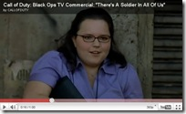

---

 

The latest _Call of Duty Black Ops_ advertisement is absolutely, 100% correctly, titled "There's a Soldier in All of Us."

We have seen the enemy, and he is _indeed_ us.

In the ad, to a track from the Rolling Stones' "Gimme Shelter" (the "Let it Bleed" album), a variety of businessmen, celebrities, fast-food, hotel, and office workers, a young girl, and a short-order cooks blast, shoot, bomb, and kill their way through some unspecified Middle Eastern country. How appropriate! We are, after all, precisely the folks who voted for these wars and donated our children's bodies and souls to fight them.&#160; 

[plugin:youtube](http://www.youtube.com/watch?v=Pblj3JHF-Jo)
