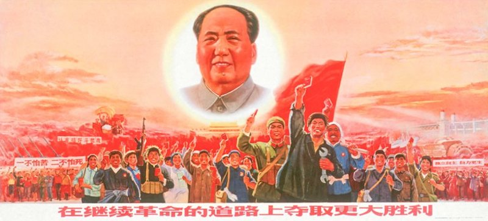

---

Last May China celebrated -- "tried to forget" might be more accurate -- the fiftieth anniversary of the *Great Proletarian Cultural Revolution*.

The Cultural Revolution was little more than a murderous pogrom that took place from about 1966-1976. China's true power elites stood aside and permitted the poor and angry to deflect blame on moderates and intellectuals for all the nation's woes. Mao Zedong claimed that "bourgeois" elements had infiltrated the Party and to make China great again it needed a good old-fashioned Stalinist purge -- and a purge it got. More than 1.7 million Chinese scholars, teachers, and political moderates were murdered in a single decade. 

With Mao Zedong's encouragement, paramilitary groups called the Red Guards screamed the Mandarin equivalent of "Lock Her Up!" as they conducted kangaroo courts and -- like today's Taliban -- tried to physically erase a moderate, traditional Confusian culture from Chinese history. Scholars and intellectuals were sent to the countryside for "re-education" and many never returned.

In 1969 Mao declared that the Cultural Revolution had been a success. But China had to wait for Mao's death in 1976 to restore a measure of normalcy by arresting general Lin Biao and the "Gang of Four," and by instituting reforms under Deng Xiaoping.

In 1981 the Central Committee of the Chinese Communist Party declared the Cultural Revolution had been an abject failure:

> ... on no account should the theories and methods of the “cultural revolution” have been applied. Under socialist conditions, there is no economic or political basis for carrying out a great political revolution in which “one class overthrows another." It decidedly could not come up with any constructive programme, but could only bring grave disorder, damage and retrogression in its train. History has shown that the “cultural revolution," initiated by a leader labouring under a misapprehension and capitalized on by counter-revolutionary cliques, led to domestic turmoil and brought catastrophe to the Party, the state and the whole people.

China survived Mao, and we will survive Trump.

