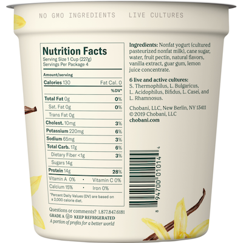

---
 

If you’re a health-conscious consumer, you want to know how much cholesterol, saturated and trans fats, sodium, potassium, or sugar is in the yogurt you’re buying, and whether there's anything unhealthy (like aspartame or additives) in it. Similarly, if you’re an environmentally-conscious energy consumer, you want to know how much solar, wind, biogas, or hydro is in the energy mix you’re buying, and if there’s anything bad (like diesel, gas, coal, or nuclear) in there.

There ought to be a straightforward way to find out, but despite the many conversations I've had and emails I've exchanged with the energy people who provided much of the information in this post, no one can give me a clear answer to the simple question — what exactly is in the energy mix I’m buying and where does it come from?

Part of the problem is that reporting is not geared toward addressing consumer or environmental concerns — but instead on reporting compliance with energy certificate tracking mandated by a series of laws following the 1998 deregulation of the energy industry. Here is the type of information typically shared with energy consumers:

[https://drive.google.com/file/d/1GcoKiggT99cU11Q7wU-0MWx-4DWT0hCE/view](https://drive.google.com/file/d/1GcoKiggT99cU11Q7wU-0MWx-4DWT0hCE/view)

Rather than telling you what's in the yogurt container, *instead* you get numbers that represent a theoretical mix of energy types under Class I RPS Requirements, "Other" RPS Requirements, "Additional" Class I power requirements, and "System Power" requirement ("RPS" stands for "Renewable Energy Portfolio Standard" and "APS" is "Alternative Energy Portfolio Standard"). It all looks like so much word salad for the average consumer.

What these reports tell you is that when you buy "renewable" energy you are buying a mix that can be satisfied from a variable number of generators providing all sorts of energy. Because you don’t know what you’re getting or where it came from, it’s impossible for anyone to describe with any degree of precision the difference in energy mix between Dartmouth's default 50% "renewable" plan and its opt-in 100% "renewable" plan. And that’s a problem if the state is trying to woo consumers to buy greater percentages of renewable energy.

[https://www.mass.gov/service-details/program-summaries](https://www.mass.gov/service-details/program-summaries)

According to the program summary above, "NEPOOL GIS tracks all electricity generated within the ISO New England (ISO-NE) control area and fed onto the New England grid, as well as electricity exchanged between ISO-NE and adjacent control areas." The NEPOOL GIS website is:

[https://nepoolgis.com/public-reports/](https://nepoolgis.com/public-reports/)

It sounds like a promising information source, but when you visit the site this stands out: "Due to the confidentiality reasons, the identity of the generator is masked." This means that a consumer has no ability to learn *who* is generating the energy being purchased, or how much they produce. You'd hope that some of this information might be published by the state in its annual compliance reports, but (for starters) mass.gov's RPS and APS most recent reports are 3 years old:

[https://www.mass.gov/service-details/annual-compliance-reports-and-other-publications](https://www.mass.gov/service-details/annual-compliance-reports-and-other-publications)

None of the data tables in the referenced spreadsheets can answer my consumer question. The 2020 Executive Summary's accompanying spreadsheet does list suppliers (in table 13), but not *what* or *how much* each supplier generates. Dartmouth's supplier, Constellation New Energy, is listed only as a "Competitive Retail Supplier." And only the value of energy credits for the three energy suppliers who *failed* to live up to their contracts are shown in table 14.

[https://www.mass.gov/doc/2020-rps-aps-annual-compliance-report-final-draft/download](https://www.mass.gov/doc/2020-rps-aps-annual-compliance-report-final-draft/download)

[https://www.mass.gov/doc/2020-rps-aps-annual-compliance-report-executive-summary/download](https://www.mass.gov/doc/2020-rps-aps-annual-compliance-report-executive-summary/download)

So the state isn't telling the *consumer* much, and with a goal of 100% renewables by [2037](https://www.thenewlede.org/2023/06/human-caused-warming-to-surpass-paris-agreement-goal-by-2037-analysis-finds/) (if the planet hasn't already burned up by then), the state's energy goals don't reflect much of a sense of urgency. 

If we want to know what we’re actually buying — as well as having information to advocate for more and *faster* adoption of renewables — Massachusetts needs to start requiring energy resellers to put their own “Nutrition Facts” on each consumer’s energy bills.

Because there’s so little that displays energy data in a consumer-friendly format, one suggestion I received was to download an app called "ISO to GO" to track what the state's energy grid is currently powered by.

[https://www.iso-ne.com/about/news-media/iso-to-go](https://www.iso-ne.com/about/news-media/iso-to-go)

It's entertaining, and may give you a sense of what’s in the New England, Mid-Atlantic, and Canadian grids, but it still won’t answer the question of what you’re actually buying and who’s generating it.

Massachusetts needs to do better.
