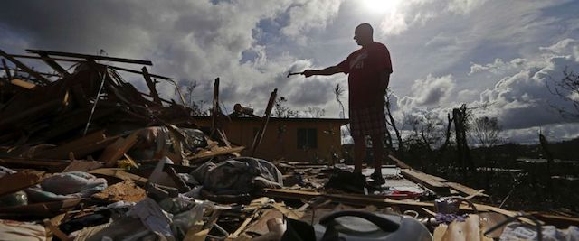

---

Two consecutive hurricanes have demolished much of the infrastructure in the Caribbean. The [president's response](http://www.slate.com/articles/news_and_politics/politics/2017/09/the_trump_administration_s_disaster_response_in_puerto_rico_after_hurricane.html) has been slow, callous, inept, but predictable: [another general](https://www.reuters.com/article/us-usa-puertorico/u-s-appoints-general-to-oversee-military-response-to-puerto-rico-disaster-idUSKCN1C31S8) has been dispatched to solve a humanitarian crisis.

Americans have a special obligation to our brothers and sisters in Puerto Rico who have been [especially hard hit](http://www.latimes.com/nation/la-na-puerto-rico-hurricane-20170921-story.html). Puerto Ricans have also been saddled for decades with [crushing, colonial debt](http://money.cnn.com/2017/09/18/news/economy/puerto-rico-hurricane-maria/index.html) and now by [bipartisan austerity programs](https://www.salon.com/2016/07/01/critics_say_bipartisan_bill_signed_by_obama_imposes_colonial_control_board_on_puerto_rico_puts_hedge_funds_ahead_of_people/). Hedge funds and bankers are [circling the wounded island like sharks](https://www.independent.co.uk/news/world/americas/puerto-rico-rejects-hedge-fund-loans-profit-hurricanes-irma-maria-crisis-aid-a7973446.html), and it occurs to no one in Congress to take hundreds of billions in military aid to Egypt, Saudi Arabia and Israel and instead deploy it for neighbors and fellow citizens.

So, for the time being, it's up to us. Below is a partial list of organizations responding to the crisis, most with [Charity Navigator](https://www.charitynavigator.org/) ratings you can check out if you are a nervous donor.

Choose at least one -- and please give:

- [All Hands • USVI Hurricane Response](http://www.hands.org/projects/usvi-hurricane-response/) -- [4 stars](http://www.charitynavigator.org/index.cfm?bay=search.summary&orgid=13109)
- [Americares: Our Response to Hurricanes Maria, Irma and Harvey](http://www.americares.org/) -- [4 stars](http://www.charitynavigator.org/index.cfm?bay=search.summary&orgid=3289)
- [Catholic Relief Services](http://support.crs.org/donate/hurricane-irma-relief) -- [4 stars](http://www.charitynavigator.org/index.cfm?bay=search.summary&orgid=5934)
- [Fondos Unidos de Puerto Rico](http://www.fondosunidos.org/) -- [3 stars](http://www.charitynavigator.org/index.cfm?bay=search.summary&orgid=5628) 
- [Global Giving Puerto Rico & Caribbean Hurricane Relief Fund](http://www.globalgiving.org/projects/hurricane-maria-caribbean-relief-fund/) -- [4 stars](http://www.charitynavigator.org/index.cfm?bay=search.summary&orgid=11648)
- [Heart to Heart International | Connect to a world in need](http://www.hearttoheart.org/) -- [4 stars](http://www.charitynavigator.org/index.cfm?bay=search.summary&orgid=3807)
- [Hispanic Federation: "Unidos": A Hurricane Relief Fund for Puerto Rico](http://hispanicfederation.org/media/press_releases/a_hurricane_relief_fund_for_hurricane_maria_victims_in_puerto_rico/) -- [4 stars](http://www.charitynavigator.org/index.cfm?bay=search.summary&orgid=4997)
- [International Medical Corps](http://give.internationalmedicalcorps.org/ea-action/action?ea.client.id=1983&ea.campaign.id=77513&ea.tracking.id=DP%7EIRMA%7EDPHPI1809) -- [4 stars](http://www.charitynavigator.org/index.cfm?bay=search.summary&orgid=8158)
- [Massachusetts Unido por Puerto Rico ](http://www.tbf.org/puertorico) -- [4 stars](https://www.charitynavigator.org/index.cfm?bay=search.summary&orgid=3375)
