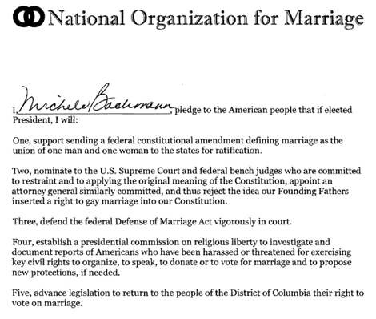

---

Besides all the other pledges the Religious Right takes nowadays &#8212; Anti-Abortion, Balanced Budget Amendments, No New Taxes for the Super-Rich, Defense of Marriage for Straight People, Repudiation of Global Warming, Fighting Evolution, or Promoting the Return of Christian Shariah &#8212; I sometimes wonder if they simply take a basic pledge to waste their time on social issues that are of interest only to a narrow group of narrow people.

Today's Time Waster is Michelle Bachman's new pledge to the [National Organization for Marriage](http://www.nomblog.com/wp-content/uploads/Bachmann-Signed-Pledge.pdf) to defend straight people from harassment by gays and their straight enablers of the sinful gay lifestyle.

I am truly grateful that hordes of rowdy homosexuals and angry lesbians have never come to my street to harass me while I'm trying to have a nice quiet evening with my wife or tried to recruit me to the other team. So far, I'm working on my 3rd decade of marriage without ever receiving a single threat or so much as a peep from this apparently scary constituency. 

On the other hand, I am more than a little disturbed that NOM and its supporters aren't as tolerant when it come to letting gay people have their own quiet evenings without being demonized or asked to attend re-education camps. If anything, the defense of loving relationships is under attack by NOM.

And doesn't Michelle Bachmann have anything better to do?

