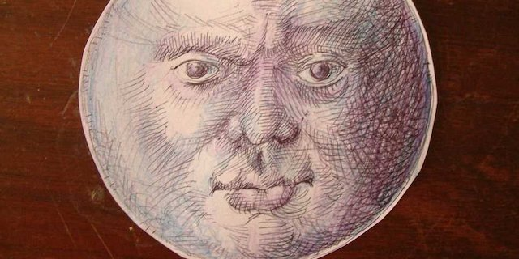
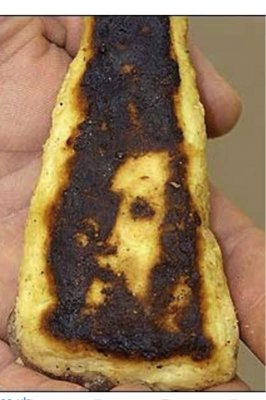

---

Pareidolia is the human ability to see shapes or recognize images, particularly faces, from random sensory stimulus. Common examples are "seeing" people in an inkblot test, canals on Mars, a man in the moon, rabbits in the clouds, an old man's profile in a rock face, or hearing hidden messages in music. Pareidolia taps into the oldest, most primal, parts of our brain.

Then there is our tendency to see images we *want* to see. For centuries people have been seeing the faces of religious figures on everything from walls to their own food. A Virgin Mary on a [slice of toast](http://news.bbc.co.uk/2/hi/4034787.stm) sold for $28,000 on eBay. A Michigan woman discovered the face of [Jesus on a pierogi](http://www.deathandtaxesmag.com/227767/face-of-jesus-found-on-pierogi/) at a church fundraiser. An Ontario man found [Jesus in a burnt fish stick](http://abcnews.go.com/Entertainment/WolfFiles/story?id=307227).

[Tom Miller](http://peacelutherangv.org/multimedia-archive/fish-stick-jesus-christ-king/), a California Lutheran minister, thinks he knows why it is so common. In a sermon he observed:

> "It has to do with our faith and a need to know that God steps across time and space to touch my life and be involved in my life. It has to do with looking for Jesus. [...] We somehow think that we have to look for the dramatic, for the unusual, for the extraordinary. **We’ve gotten the notion from somewhere that if God is at work it has to be in a way that no one would ever believe if we told them.**"

These sightings pop up out of nowhere, have to be truly offbeat, dramatic, and personal. And they are a matter of faith from people so desperate that they are willing to suspend rational thought.

You probably know where this is headed.

The claim that Donald Trump's presidency is checking off wins and keeping promises seems delusional to anyone actually looking at the evidence. But Trump partisanship is not strictly a matter of evidence, nor even of reality. It's a matter of faith from desperate people.

I'm not sure the Democratic National Committee has a strategy to counter any of this. When it comes to religion, science, or even acknowledging observable phenomena like Tweets and climate change, many Republicans live in a completely different world. We can ask all day: "What promises did Trump really keep?" Or we can ask what part of climate change (or evolution, or the moon landing, or Sandy Hook) they dispute. But there is never a rational answer.

Most rational people see the world like the California minister. More importantly, even the California minister prefers to see a world that includes god rationally.

Americans don't need to swallow Trump's blatant lies or pretend there is substance in his extravagant promises. We don't need to look for dramatic and cruel solutions to national problems that speak only to self-interest or primate instincts. We don't need the showmanship of a latter-day P. T. Barnum to sell us on an alternate reality. We can glimpse the reality all around us and take notice of our brothers and sisters on our shared planet. And then we can think about it.

In Miller's sermon he tells his congregants they can find God anywhere by *seeing*, not *imagining*, opening up themselves to the world, not shutting it out:

> "Try looking into the eyes of the person next to you. Try looking at the face of the person at the next desk, or behind the counter. Try looking into the eyes of the people with whom you rub elbows every day. Try looking into the eyes of the person you don’t really want to deal with tomorrow morning, or tomorrow night, or even this afternoon."

Miller seems to be saying that there is an observable, collective reality in this world and compassion and solidarity derive from it. Conversely, compassion and solidarity allow us to perceive the world from many different perspectives, opening up an even greater reality to us. But many Americans, blinding themselves to a connection with the wider world, see only themselves, alone, in a hostile world of "carnage."

A world of imagination where reality is only as firm as the fish sticks.

