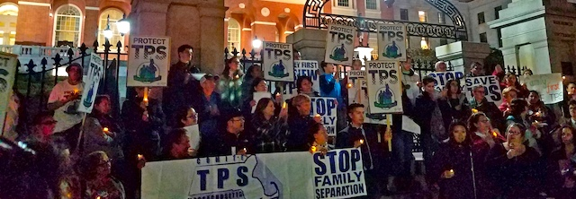

---

**Over 435,000 people** – over 12,000 in Massachusetts alone – depend on **Temporary Protected Status **(TPS) to live and work legally in the U.S. TPS provides safe harbor for people from countries affected by violence or disasters, and it can be renewed for as long as it is unsafe to return.

But the Trump administration is ending TPS for people from Sudan, Nicaragua, and Haiti, and it is likely to do the same for Salvadorans and Hondurans.

If TPS is not extended, those — from *all* these countries — will lose work permits and be subject to deportation. And they’ll have to choose between splitting up their families or placing their children in danger.

We can't let this happen.

Massachusetts’ entire Congressional delegation supports **extending** TPS, as does even Republican **Governor Baker**. But that’s not enough. **We need them to actively fight both to save TPS, and to enable TPS holders to seek permanent residency**.

TPS recipients are our friends, neighbors — even members of our families.

**Please act now**. Call Homeland Security at (202) 282-8495 and urge them to extend TPS for Honduras and El Salvador, and to reinstate protections for those it has terminated.

Then use [this tool](https://actnow.io/rupM4TN) to email your elected officials.

