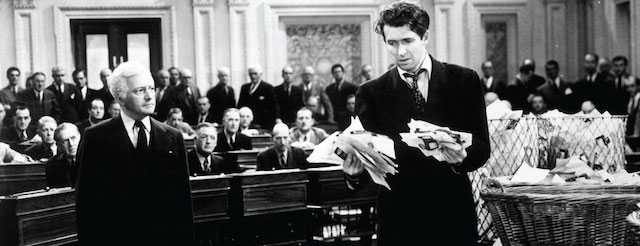

---

##### Today in Science: Politicians may have human DNA

Since January 20th we've lived in a very different country, one where raw power is everything, character is nothing, and concern for others is seen only when cameras are rolling. But yesterday I saw some quiet, unrehearsed kindness. I saw a politician being a *mensch*. It surprised me. And then it surprised me that I’d been surprised. It made me see how cynical I've become. In some things I'm a pretty slow learner. But yesterday I realized that politics is not only local but has to be *personal*.

I had occasion to be in District Court yesterday where I ran into my state representative, Chris Markey, whose politics I have slammed previously. Mr. Markey had stopped and was patiently helping several confused people find their courtrooms, including someone I was there to assist.

Since Inauguration Day it's been all too easy to lose sight of the fact that most of our politicians -- even those we find most frustrating -- are basically decent men and women. Like Chris Markey, like most of the Democrats with whom I have political differences, each is more than merely his office, each is not simply an agenda. For each, their politics are formed by values I may not fully understand or ultimately accept-- but this is all the more reason to listen with respect and seek out opportunities to talk.

So, Chris, let’s talk.

##### Carrier Jobs off to Mexico after all

I am not the only slow learner in America. That honor also belongs to Trump voters.

Donald Trump made a big show of saying he'd crack down on US-bound Mexican criminals by building a big, beautiful wall. But this was always a one-way street for *gringos*. Mexico-bound corporate crooks don't get a protectionist wall but receive instead big, beautiful tax breaks. Trump and Pence claimed they'd save thousands of Indiana jobs at the Carrier subsidiary of defense contractor United Technologies Corporation (UTC). But in typical Trumpian fashion, the *real* number turned out to be closer to 700. And now, in spite of millions of dollars of corporate incentives, [Carrier is chopping 600 of those jobs](http://www.cnbc.com/2017/06/22/trumps-carrier-jobs-deal-is-just-not-living-up-to-the-hype.html) anyway. Off to Mexico! *Adios, ladrones!*

Eventually reality will slowly dawn on Trump's supporters. Instead of *Making America Great Again*, the Billionaire-in-Chief is *actually* presiding over the complete opposite. The Ford [Focus assembly line](http://www.huffingtonpost.com/entry/ford-focus-china_us_5949efbbe4b0177d0b8a556d) is off to China. Saudi Arabia just [took control](http://money.cnn.com/2017/05/01/investing/saudi-arabia-buys-largest-oil-refinery-port-arthur/) of America's largest refinery. And, as for the [33,000 coal mining jobs](http://www.factcheck.org/2017/06/video-trump-coal-jobs/) Trump claims he created, well, it turns out the number is *actually* about 1,000. Where is Trump's infrastructure plan? Where are the real jobs? Even Trump's most vehement supporters have got to eventually start asking some tough questions. Lincoln was right: *You can fool some of the people some of the time...*

And if Mr. *Bigshot Deal Maker* had *really* wanted to save the Carrier jobs, one option might have been to make United Technologies [an offer they couldn't refuse](http://www.courant.com/business/hc-trump-carrier-20161128-story.html) -- to hold defense contracts hostage to American jobs. But that's not how it works in *Trumplandia*. UTC will get even greater corporate welfare thanks to the biggest military budget since the Big Bang. And unemployed Carrier workers -- many of them Trump voters --  will get to pay triple premiums for the worst healthcare in the Western world. That is, if they don't have any preexisting conditions.

And *that's* how it *really* works in Trump's Great New America.

