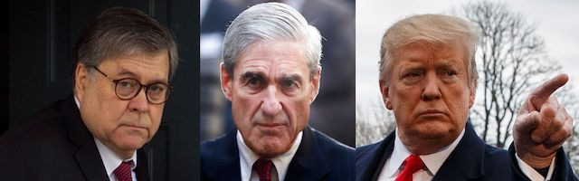

---

Despite Donald Trump's initial [celebratory](https://twitter.com/realDonaldTrump/status/873120139222306817) Tweets, he has not been vindicated by the [Mueller report](https://assets.documentcloud.org/documents/5955210/Redacted-Mueller-Report.pdf). If anything, the stench of corruption is now even greater — now that the cover has been taken off the reeking dumpster that is his administration. As [CNN](https://www.cnn.com/2019/04/20/politics/donald-trump-mueller-report-anger/index.html) pointed out, the “vindication” victory lap didn’t last long before Trump started calling the Mueller Report “total bullshit."

But there *was* a vindication to be celebrated. It turns out, the press, doggedly following leads and the dozens of now-felons who once worked for Trump, and despite some [notable](https://www.nationalreview.com/news/paul-manafort-denies-meeting-with-assange/) screw-ups, had been generally pursuing the truth all along. Despite constant whining from the White House that it was all “fake news,” and despite the spin that Trump’s [personal lawyer James Barr](https://www.justsecurity.org/wp-content/uploads/2018/12/June-2018-Barr-Memo-to-DOJ-Muellers-Obstruction-Theory-1.2.pdf) tried to give it, the press was largely vindicated. 

After years of bald-face lies and embarrassingly transparent prevarication, few believe a word that comes out of Kellyanne Conway’s smirking mouth. But it was quite the revelation that spokeswoman Sarah Huckabee Sanders — whose religious hypocrisy was on full display — actually [lied](https://nypost.com/2019/04/18/sarah-huckabee-sanders-admitted-she-misled-public-about-why-trump-fired-comey/) to the press about James Comey’s firing.

It was disappointing that Robert Mueller’s findings did not establish presidential criminal conduct, but Mueller left plenty of bread crumbs for Congress should it wish to pursue impeachment. Yet even if the House impeaches, the Senate must convict with a supermajority — an almost impossible hurdle to overcome for ridding the nation of a corrupt, mentally unfit, white supremacist president. Equally disappointing, [centrist Democrats](http://time.com/5551306/nancy-pelosi-democrats-trump-impeachment/) with short attention spans have apparently lost the nerve to pursue impeachment — time to move on, national healing, campaigns to run, money to raise.

But the House *must* begin impeachment proceedings. And here’s why.

For one thing, Mueller’s report did not uncover *everything* that will ever be known about Trump’s corrupt dealings and his obstruction of justice. There are at least a dozen ongoing investigations that will eventually yield more insight into Trump’s attempts to obstruct justice and commit (or have others commit) criminal acts. While Office of Legal Counsel rules gave a sitting president a prosecutorial pass like Jessie Smollett’s, declining to prosecute is not the same thing as finding no wrongdoing.

Second, the greatest casualty of Donald Trump’s administration has been the truth. Impeachment proceedings will make it difficult for Americans with even partially open eyes and ears to maintain that it’s all been “fake news.” Impeachment proceedings will keep the Mueller report from fading from public consciousness and will make it difficult for Trump to [ride out](https://www.washingtonpost.com/lifestyle/style/amid-the-cycles-of-outrage-a-strategy-emerges-just-ride-it-out/2019/03/29/d2a202ee-4681-11e9-aaf8-4512a6fe3439_story.html) his crimes and lies, even with his invention of new national “emergencies."

Painful and stressful as impeachment proceedings may be, it will do the nation good to dwell in the truth for a year after steeping in Trump’s lies for two.

