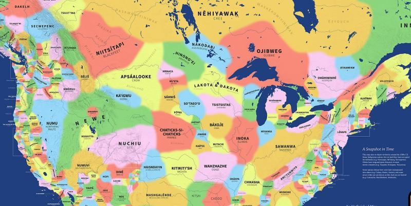

---
 

Since [1977](https://www.uua.org/multiculturalism/racial-justice/dod/indigenous-day) Native Americans have been trying to replace Columbus Day with Indigenous People's Day. The [text of a bill](https://malegislature.gov/Bills/192/S2027/Senate/Bill/Preview) in the Massachusetts legislature is short, sweet, and uncomplicated:

> The governor shall annually issue a proclamation setting apart the second Monday in October as Indigenous Peoples Day and recommending that it be observed by the people, with appropriate exercises in the schools and otherwise, to acknowledge the history of genocide and discrimination against Indigenous peoples, and to recognize and celebrate the thriving cultures and continued resistance and resilience of Indigenous peoples and their tribal nations.

Yet, for whatever reasons, some in the Legislature resist making this simple change. And in so doing they are continuing to honor one of the first perpetrators of genocide and enslavement in the New World — instead of the victims of these atrocities.

Republican culture wars have created very real wounds. Some Democrats are now overly defensive to Republican accusations of "wokeism" and "political correctness." But Democrats ought to first consider from what noxious pit of white supremacy these accusations are coming — and should also be less concerned about so-called "cancel culture" and "erasure" than the *actual* erasure of Native people.

But while Massachusetts legislators dither and squirm, other [states](https://en.wikipedia.org/wiki/Indigenous_Peoples'_Day) have [ratified](https://www.cnn.com/2021/10/11/us/indigenous-peoples-day-2021-states-trnd/index.html) some form of an Indigenous People's Day that either replaces* Columbus Day or coexists with it: Alabama (2019); Alaska* (2015); Arizona (2020); California (2019); District of Columbia* (2019); Hawaii* (1988); Iowa* (2018); Louisiana* (2019); Maine* (2019); Michigan (2019); Minnesota* (2016); Nebraska (2021); Nevada (2020); New Mexico (2019); North Carolina* (2018); Oklahoma (2019); Oregon (2021); South Dakota* (1989); Texas (2021); Vermont* (2016); Virginia (2020); Wisconsin (2019).

Indigenous People's Day is also celebrated in over [130](https://www.smithsonianmag.com/blogs/national-museum-american-indian/2020/10/07/indigenous-peoples-day-2020/) American cities.

In 2021 President Biden signed a proclamation making Indigenous People's Day a federal holiday, although Columbus Day [remains](https://www.opm.gov/policy-data-oversight/pay-leave/federal-holidays/#url=2022).

And, internationally, the United Nations [honors](https://www.un.org/en/observances/indigenous-day) Indigenous people on August 9th.

Despite all this, some of our state legislators still regard indigenous people as a trivial issue that will just go away if they ignore it long enough. But they are mistaken.

If Indigenous People's Day doesn't move out of committee this year, legislators can expect to see it on their desks once again in 2023.

