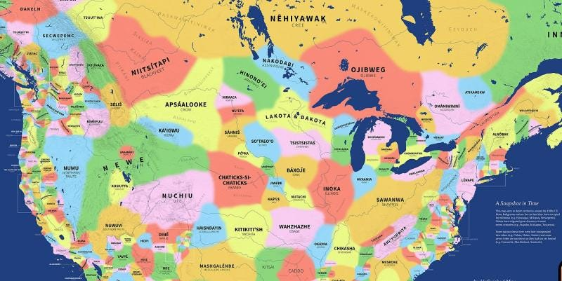
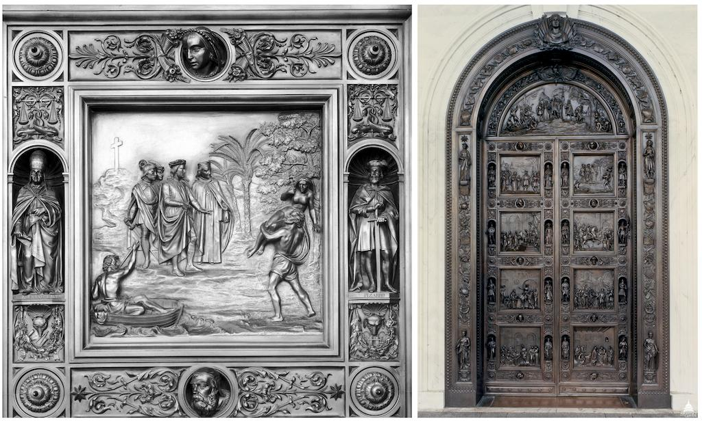

---
 

Since [1977](https://www.uua.org/multiculturalism/racial-justice/dod/indigenous-day) Native Americans have been trying to replace Columbus Day with Indigenous People's Day. The [text of a bill](https://malegislature.gov/Bills/193/S1976) in the Massachusetts legislature is short, sweet, and uncomplicated:

> Chapter 6 of the General Laws is hereby amended by striking out section 12V and inserting in place thereof the following section:–
> Section 12V. The governor shall annually issue a proclamation setting apart the second Monday in October as Indigenous Peoples Day and recommending that it be observed by the people, with appropriate exercises in the schools and otherwise, to acknowledge the history of genocide and discrimination against Indigenous peoples, and to recognize and celebrate the thriving cultures and continued resistance and resilience of Indigenous peoples and their tribal nations. 

Columbus’s First Encounter with the Indians, Senate Doors, Washington DC

*The image above is not just any piece of federal artwork. The “Rogers Doors” (seen in videos of the Capitol insurrection of January 6th) are a set of 17-foot high, 10 ton bronze doors in the Center Building East Portico of the U.S. Capitol building which open into the Rotunda. The panel on the left (top right square on the door) depicts Columbus arriving in the Americas to claim the land and its people; one of Columbus’ sailors is shown carrying off an indigenous woman as his slave. Rape and pillage of Native Americans are a matter of public record and, unfortunately, even official memorialization.*

The culture wars have put many Democrats on the defensive, especially when Republicans accuse them of "wokeism" or "political correctness." But Democrats ought to first consider from what noxious pit of white supremacy these accusations are coming — and should also be less concerned about so-called "cancel culture" and "erasure" than the *actual* historical erasure of Native people.

Yet while Massachusetts legislators dither and squirm, other [states](https://en.wikipedia.org/wiki/Indigenous_Peoples%27_Day) have [ratified](https://www.cnn.com/2021/10/11/us/indigenous-peoples-day-2021-states-trnd/index.html) some form of an Indigenous People's Day that either replaces* Columbus Day outright or (the coward’s choice) coexists with it: Alabama (2019); Alaska* (2015); Arizona (2020); California (2019); District of Columbia* (2019); Hawaii* (1988); Iowa* (2018); Louisiana* (2019); Maine* (2019); Michigan (2019); Minnesota* (2016); Nebraska (2021); Nevada (2020); New Mexico (2019); North Carolina* (2018); Oklahoma (2019); Oregon (2021); South Dakota* (1989); Texas (2021); Vermont* (2016); Virginia (2020); Wisconsin (2019).

Indigenous People's Day is also celebrated in over [130](https://www.smithsonianmag.com/blogs/national-museum-american-indian/2020/10/07/indigenous-peoples-day-2020/) American cities.

In 2021 President Biden signed a proclamation making Indigenous People's Day a federal holiday, although Columbus Day [remains](https://www.opm.gov/policy-data-oversight/pay-leave/federal-holidays/#url=2022).

And, internationally, the United Nations [honors](https://www.un.org/en/observances/indigenous-day) Indigenous people on August 9th.

Despite all this, some Massachusetts state legislators still regard indigenous people as a trivial issue that will go away if they ignore them long enough. But they are mistaken. If Indigenous People's Day doesn't move out of committee (again) this year, legislators can expect to see it on their desks once again in 2024. This has been the sad reality with Massachusetts legislators for 47 years now.

Replacing Columbus Day with Indigenous Peoples Day is one of five legislative priorities of the [Massachusetts Indigenous Legislative Agenda](http://maindigenousagenda.org/) which include: native education, protection of indigenous heritage, replacing the flag and seal, and retiring the 20+ Massachusetts school mascots that still dishonor Native Americans.

To support the Agenda, come to the state house in Boston on Thursday, June 15th, for the 11:30 am to 1:30 pm rally and Advocacy Day. For more information, or to participate even if you are not able to attend in person, RSVP to: [www.facebook.com/MAIndigenousAgenda.org/](https://www.facebook.com/MAIndigenousAgenda.org/) 
