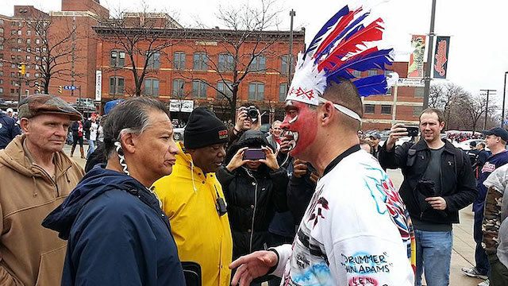
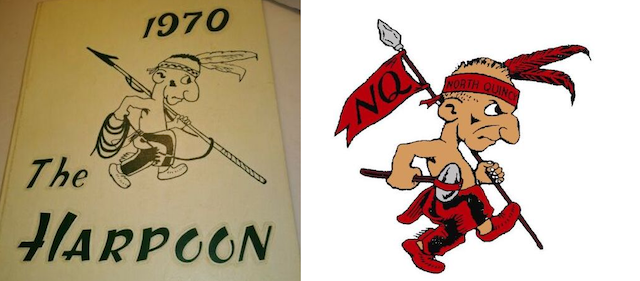
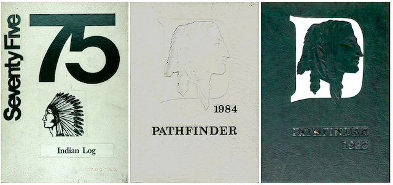
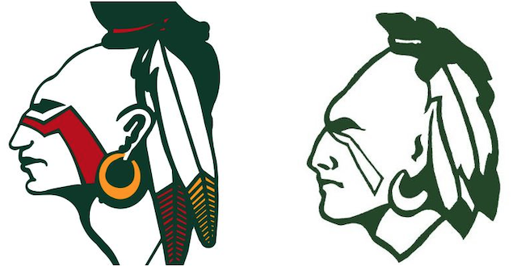
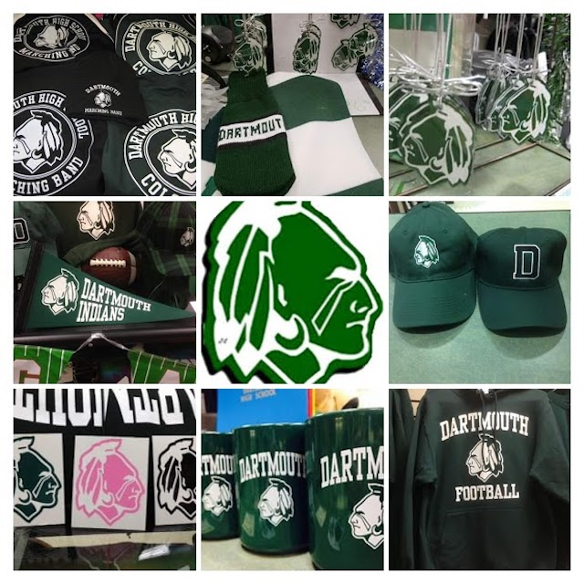

---

Three Massachusetts school districts retired their Native American mascots this week.

But Dartmouth was not one of them.

On August 5th [Barnstable](https://www.capecodtimes.com/news/20200806/barnstable-high-to-replace-red-raider-mascot) School Committee member Kathy Bent described her town's decision: “I think it is time to retire the Red Raider as our mascot” she said. “We can take our time coming up with a new mascot, but that certainly should not be a decision we make as a school committee, but one that the community makes.”

That same day [Hanover](https://www.wickedlocal.com/news/20200805/hanover-to-retire-indians-mascot) Schools retired its "Indian." Libby Corbo, a member of Hanover's School Committee said, “My opinion as a white person as to whether the sacred symbol of Native American heritage is offensive or not frankly doesn’t matter,” said Corbo. “I think the days of the white majority telling minorities what is best for them or how they should feel... it needs to end today with our voice saying this is no longer acceptable in our community.”

Hanover's decision had been informed by a virtual public meeting on July 29th at which Indigenous people, including a Hanover Middle School teacher, explained why their Indian mascot was so offensive.

Again on the same day, [North Quincy](https://www.patriotledger.com/news/20200803/theres-new-yakoo-in-town-north-quincy-mascot-has-been-revamped) announced a new mascot would replace "Yakoo," the racist depiction of a Native American North Quincy's School Committee had retired the previous Monday. The team name, like Barnstable's, is the "Red Raiders," but no decision has been announced on a name change.

In June, while opponents of racist mascots were still gaining steam, Faries Gray, [sagamore](https://www.bostonglobe.com/2020/06/25/metro/wake-black-lives-matter-renewed-push-end-schools-native-american-mascots/) (war chief) of the Massachusett tribe, explained: "These mascots create such a negative environment for the indigenous [people], it is ridiculous that we even have to have a discussion about why this is a racist thing. That is not our culture. It is really disrespectful to us.”

Ridiculous though it may be, Dartmouth school board members would like this whole issue to just magically disappear. This time around they have decided to hand off this hot potato — not viewing it as a human rights or moral issue — to a yet-to-be-named "diversity committee" that will consider the mascot and an anti-racism resolution being voted on by the Massachusetts Association of School Committees. And report back. At some point. Unless they forget.

Last October 2019 the Dartmouth School Committee refused demands to bring the issue of the mascot before a public hearing, providing an account of how the present-day "respectful" mascot was designed by Native American children who were overjoyed at their people finally being honored. In this tale, the childrens' logo is used to this very day. And in this fable, too, Native Americans support the mascot because the words "honor" and "respect" appear in the Student Manual.

https://www.youtube.com/watch?v=Ab2O8cSs4IA 

But last [November](https://www.southcoasttoday.com/news/20200104/tribe-wants-to-talk-to-dartmouth-wampanoag-leaders-say-indian-symbol-should-be-reconsidered), the Standard Times asked Bonnie Gifford, the school superintendent if she had actually contacted any Native Americans. Nope. “We have never had any response from anyone from the tribes,” she told a reporter by email.

But Cheryl Andrews-Maltais, of the Aquinnah tribe, managed to take questions from reporter Jennette Barnes of the Standard Times, noting that, although she helped redesign the Dartmouth “Indian” image as a child, she now thought there should be a public discussion.

The Standard Times also managed to ring up Chief George Spring Buffalo of the Pocasset Wampanoag Tribe of the Pokanoket Nation, who told the same reporter that the Dartmouth mascot issue should have been dealt with *years ago*. “It’s all about cultural respect, so children who go to your school don’t have to feel like they are cartoon characters when it comes to Halloween or Thanksgiving.”

With the Washington Redskins, Aunt Jemima, Land o' Lakes, and Uncle Ben all scrapping their racist images, and legislation to ban school mascots, it would seem to be a good time to reconsider racist images in Dartmouth. But Dartmouth — which had plenty of time to plan, and plenty of cash to fund, a $1.8 million football stadium last Fall — decided to punt the issue to a committee for "study."

A "diversity committee" to include two members of the School Committee, two faculty, two students, two community members, and two administrators will consider the mascot and race issues. All members must be Dartmouth residents. Committee member John Nunes made a point of excluding community members from New Bedford — and the "Dartmouth only" rule will exclude the Maltais family, trotted out regularly as designers of its mascot — because they live on tribal lands outside Dartmouth. And with virtually no Native American students in any of the Dartmouth schools, this is one more constituency the School Committee won't have to listen to.

As a disappointed Maggie Cleveland so eloquently put it last Fall: “Ah, the southcoast region of Massachusetts, where we take pride in our ignorance.” 

Some of that ignorance appears in curriculum. [One example](https://www.dartmouth.school/cms/lib/MA02213179/Centricity/Domain/124/APUnit1%20PROJECT%20Real%20Estate%20Presentations.doc) on the DPS website is guaranteed to insult Native American children, and the exercise itself is maddeningly Eurocentric. The objective of "Rate the Colony" is to attract more European settlers to your 18th Century colony. The exercise goes on to describe Indians as a potential danger to one's health and the colonial enterprise.

The School Committee account of how today's "respectful" mascot came into existence has never been adequately fact-checked. In this mendacious tale, two children proudly designed a logo used to this very day and they continue to support its use, as do the majority of Native Americans consulted.

But the children have changed their tune and most tribes are opposed to the mascot, thanks to a piece in the Standard Times which debunked these parts of the tale. And a hunt for Dartmouth High yearbook covers debunked the rest of the tale by showing that the design the children created was scrapped — only to be replaced with one Dartmouth College abandoned in 1974 because many people thought it was racist.

Dartmouth has apparently never been very original in its choice of mascots. In 1970 the Dartmouth "Indian" was a cartoon character that looks suspiciously like it was lifted from Quincy's now-retired "Yakoo." 

By 1975 the Dartmouth Public Schools were using a newer Indian mascot with a Western headdress. In 1977 the Pathfinder Indian was designed by [Cheryl Andrews-Maltais](https://www.dhsspectrum.com/news/2019/10/20/wampanoags-speak-out-on-the-dhs-indians-mascot/) and her brother while students at Dartmouth High School. That may be the only true part of the tale.

Their Pathfinder appeared on yearbooks until at least 1988 (and possibly longer) but that image bears no resemblance to the one used today. At some point, when replacing the Pathfinder, the [Dartmouth Schools](https://twitter.com/biggreensports) managed to choose virtually the same mascot rejected by [Dartmouth College](https://twitter.com/dartmouthindian) in 1974!

This is the version that brings in royalties to the Dartmouth Schools — royalties not shared with any tribe.

