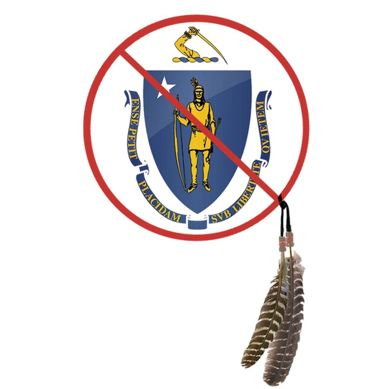

---

Last June I wrote about [legislation](/Native Americans/blue-state-bigotry/) that had been filed to reconsider the racist Massachusetts state seal and flag, and another bill to prohibit the use of racist mascots by school sports teams.

Here in my home town of Dartmouth the "Dartmouth Indian" is hardly different from the Confederate flags and monuments to the legacy of slavery that MAGA America feels is their heritage and their birthright. Dartmouth teenagers in "green face" (as if the Wampanoag were some species of leprechaun) are seen at football and lacrosse games. Community members cry that they "bleed green" and claim their caricature of Native people somehow "honors" them. The Dartmouth Schools even have licensing agreements that have netted thousands of dollars from the "Indian" image. Not a cent was ever returned to Native Americans. 

I am not the only one to find this exploitative and racist. A couple of local tribes of the Wampanoag, letter-writers and historians who have been complaining about this far longer than I, the NAACP New Bedford Branch, and others in the community joined in forming a [small group](https://groups.io/g/new-mascot) to try to do something about it. We wrote letters, attended meetings, asked pretty please. But the [Dartmouth Schools](https://www.youtube.com/watch?v=hVkmStJnJ2I) weren't having any of it. The school committee [shut down](https://www.southcoasttoday.com/opinion/20191030/letter-school-committee-rules-quit-talking) even a *discussion* of their racist caricature. 

Two months after the dust settled a bit, one more tribe affiliated with the Wampanoag came out in [support](https://www.southcoasttoday.com/news/20200104/tribe-wants-to-talk-to-dartmouth-wampanoag-leaders-say-indian-symbol-should-be-reconsidered) of at least talking about it. The committee again refused to even listen to them. As Superintendent Bonnie Gifford finishes up her career, one thing will have changed: the superintendent and her enablers on the school committee can no longer claim — with either straight or green face — that they are "honoring" Native Americans. Too many Native people have told them that this is a bald-faced lie.

In the process of going through this exercise, we met the Native advocacy organization [Massachusetts Indigenous Legislative Agenda](https://changethemassflag.com/2020/01/26/just-two-weeks/), which supports not only the two bills I mentioned above but three others related to education and other issues. 

Two weeks remain for the legislation to be voted out of committee. You can help by going to the [Massachusetts Indigenous Legislative Agenda](https://changethemassflag.com/2020/01/26/just-two-weeks/) website and adding your voice.

But even if this legislation never makes it out of committee, we will be back at it again next year. With more passion and more people.

