---

### About my Berlin Trip
##### September 3, 2016

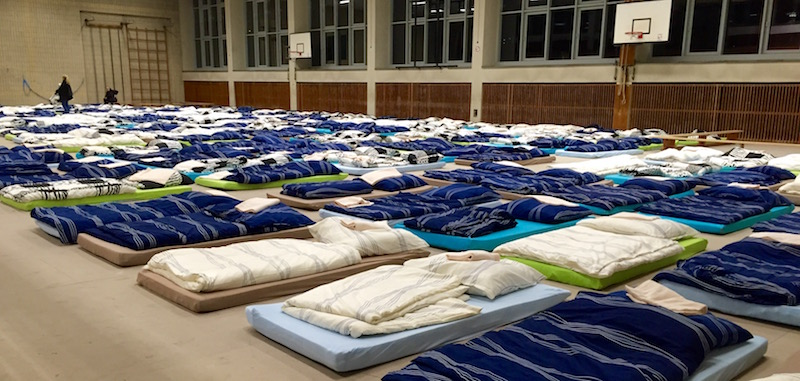

Dear friends and family,

In October I will be in Berlin to see how a nation of 80 million can absorb a million refugees. By contrast, the US, a nation of 330 million, only last week reluctantly (and with much fear and whining) took its 10,000th. I will be volunteering with a German welcome organization and talking to refugees, journalists, political and social service organizations.

If you're interested in following my trip, you can subscribe to an email distribution list here:

<http://tinyletter.com/precaf>

This is an opt-in list. You're on it only if you want to be.

Warm regards,  
David

---

### The World Refugee Crisis
##### September 6, 2016

Dear friends and family,

Thanks for subscribing. I leave on October 1st and will start sending you my impressions and my own photos. But if you don't follow international news, a few facts on the world refugee crisis:

For many years the count of refugees and displaced persons numbered in the tens or twenties of millions. Not pretty numbers, but nothing like last year's shocking **65.3 million**.

<http://s3.amazonaws.com/unhcrsharedmedia/2016/2016-06-20-global-trends/2016-06-14-Global-Trends-2015.pdf>

Of this number, a third (21.3 million) are refugees, almost two-thirds (4.8 million) are internally displaced people (meaning they have had to flee war zones or destroyed homes within their own countries), and 3.2 million have sought asylum.

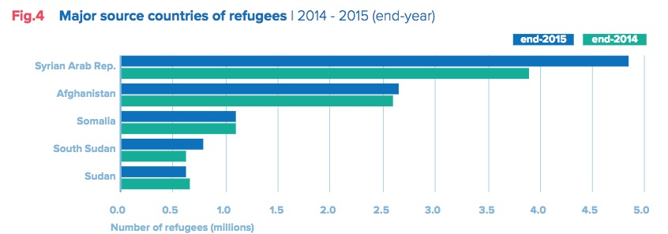

The countries with the most refugees are Syria, Afghanistan, Somalia, Sudan, Congo, CAR, Myanmar, Eritrea, and Colombia.

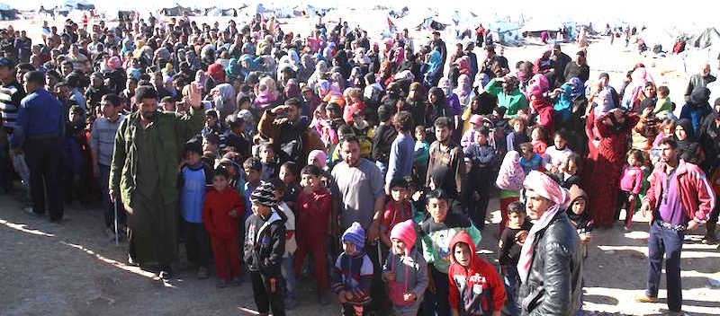

As a consequence of its darker history, Germany has a generous refugee policy. It's not necessarily generosity of spirit, however: it's the law. Article 16a of the German Basic Law (*Grundgesetz*) gives asylum to those who are persecuted or in danger, and they may not be put back in danger (contrast this with the United States practice of sending Mexican, Honduran and Guatemalan refugees back to gangs and death squads). The EU's Dublin Accords also specify rights for asylum seekers, but some countries (notoriously Hungary) abuse the agreement to shunt refugees to other EU nations. Germany and Serbia now receive 75% of all Syrians fleeing Assad, ISIS, and Russian and American bombing. 

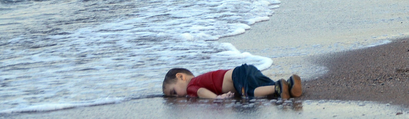

Last year the uncensored images of the body of 3 year-old Aylan Kurdi appeared in the press. Aylan drowned when his family undertook a sea escape from Syria. Soon there followed images of a Hungarian camerawoman kicking a group of Syrians fleeing across a field, amid reports that not every EU nation was doing its part to provide humane care of refugees. Indiana governor (now GOP VP candidate) Mike Pence declared his state off-limits to Syrians, who he described as ISIS militants in disguise. But the United States has only taken 10,000 Syrian refugees, while Germany has been taking that number every day. There are now a million refugees living in Germany.

The world's reaction has either been one of generosity or of callousness. Lebanon, for example, hosts the largest number of refugees per capita than any other nation on earth. The United States is at the other end of the spectrum -- all the more notable because it bears a lot of responsibilty for this human misery.

So how much generosity of spirit -- how much responsibility -- should we Americans be showing? Will we step up to the plate and pay for what we broke? This is, after all, the "Pottery Barn rule" that Colin Powell reminded us of when we launched the war in Iraq:

"You broke it, you bought it."

Unfortunately Americans are often predisposed to let the *other guy* pay for it. And the other guy in this case is Germany. But suddenly the German welcome is wearing out.

This week there was an election in a neglected region of Germany called Mecklenburg-Vorpommern (MV), a state with just over a million people -- Angela Merkel's home state. In many ways the area resembles the region in Massachusetts where I live -- or it could just as easily be anywhere in the US where industry has picked up and moved away. Mecklenburg-Vorpommern has plenty of natural beauty but no industry. It's only 80 miles from Berlin, but it might as well be on the moon. Although there have been a few attempts to bring jobs to the region (a DVD plant, for example), other states generally win out when it comes to development. MV has an inferiority complex. Educational levels are low, and voters are angry. Yesterday's state primary elections shocked everyone when a three year-old political party, Alternatives for Germany (AFD), beat Angela Merkel's CSU in her home state. Even Americans were paying attention:

<http://thedianerehmshow.org/shows/2016-09-07/the-rise-of-populism-and-anti-immigrant-sentiment-in-europe>

AFD waged its campaign largely on the basis of refugees -- although Mecklenburg-Vorpommern actually has very few of them. And the AFD is only one of several right-wing tendencies in German politics.

This is going to be an interesting visit.

Warm regards,  
David

---

### First Day 
##### October 3, 2016

Dear Friends and Family,

I arrived in Berlin late yesterday afternoon and am writing this from my Airbnb room, which is very nice. Because of a Berlin housing ordinance VRBO home and apartment rentals shorter than two months long are forbidden. With home-sharing schemes like Airbnb people renting rooms are usually reluctant to rent for more than a week. I'm caught right in the middle. On the plus side, I'll get to see more of Berlin than if I stayed in just one place.

Today is both the Day of German Unity, a national holiday, and the first day of Rosh Hashana. Everything is closed. Tomorrow I visit a refugee assistance organization called Moabit Hilft (Moabit Helps) and the day after that I am having dinner with a member of the Masorti congregation in Orangienburg with whom I will also be volunteering on the 9th to help Syrian refugees.

This visit is a chance to see how one country is struggling with a terrible humanitarian crisis. Germany now has over a million refugees) and is struggling with its post-war identity. The history of this country is well-known, and for a long time it was a liberal democracy. But a dark new chapter is emerging — as it is all over Europe and our own country. Right-wing parties and movements like the NPD, PEGIDA, and AFD are gaining influence here, and in Angela Merkel's home state the AFD actually won regional elections recently. All this could turn out to be either the same type of phenomenon as the Tea Party's takeover of the Republican Party — or it may herald something much worse.

This trip is also personal for me. For those of us who have lived all over, each place and each language becomes a little part of who we are. When I was 19 I had been working a dead-end job in Philadelphia after running out of money for college, so I went to Germany on a lark. There I found a job in a furniture store and later I worked in a bank. I have returned to Germany a few times since then, but I've always wanted to spend more than a couple of weeks in this city where history, politics and culture converge.

I will try to write every few days. But let me hear from you as well.

Warm regards,  
David

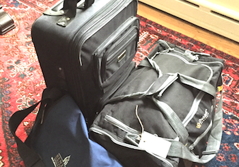

---

### First day at work
##### October 4, 2016

Dear Friends and Family,

Today was my first day "on the job" at Moabit Hilft. The German is starting to come back and there was plenty to do. Moabit Hilft has two locations -- a "store" on Turmstra/e right next to the LaGeSo (Governmental Social Services) processing center, and a small office on Lehrter Stra/e where they help people use computers. I got a quick hello from the director, Christiane Beckmann, who is a force of nature when it comes to her advocacy work, and after visiting the computer training office I returned to the "store."

Working the store is not exactly like retail. No money ever changes hands, there is no haggling, no one asks if you have a shirt in taupe. Everyone just gets whatever fits them and thanks you in the only words of German most of them know. A volunteer's job is basically just keeping shelves and baskets from descending into chaos as a never-ending stream of people paw over the clothes, shoes, toys, and personal necessities available.

I can't list every country our "customers" came from today, but a few who identified themselves were from Syria, Iraq, Egypt, Moldavia, and the Kurdish regions of both Iraq and Syria. One young man I spent the afternoon with had left Iraq after ISIS slaughtered thousands of his neighbors. Another with both excellent English and German had come only a year before from Damascus and was already helping out as a translator.

And so many children. My young colleague taught me to pay attention to how children were dressed and to recommend clothing now that winter is on the way. One girl came in with only pajama bottoms, another three year-old wore only rubber sandals. Several boys had no jackets, not even warm sweatshirts. We didn't let them leave until we had found something warmer than what they came in with.

It is so sobering to see people who present themselves as they arrived in Germany -- in the only clothes they own, and with basically no supplies. And these are the lucky ones -- people who sold everything they had to come to a country that would offer them asylum.

At the end of the day we were out of almost everything. We picked up the empty boxes outside which had previously contained toothpaste, shampoo, and sanitary napkins. After that I was glad to be able to knock off a bit early. It was a rare slow day, so I was told.

Tomorrow these amazing people will do it all over again.

Warm regards,  
David

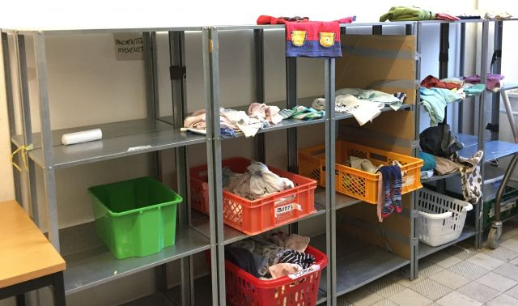

---

### Settling in
##### October 5, 2016

Dear Friends and Family,

Today was another day of tending the store. It was less exhausting than yesterday, but it does take the starch out of you, at least us old guys. I really admire everyone who does this year-in, year-out. Today I had more good political conversations with colleagues and some great moments with the customers. It is starting to get cold and the change in seasons is on the mind of everyone that comes in. Today a man in his 80's came in wearing rubber sandals and it took a while to find him a pair of shoes that would fit. Then another man without shoes, and then another. We were working non-stop until 2:30 when lunch was ready.

*Before I continue*, I would like to personally send a message to every Republican who thinks that helping out traumatized refugees poses a threat to our national security -- come here and work for a day if you can stand some fact-based research. These are just people trying to survive, not terrorists. The volunteer staff here is mostly comprised of Kurds, Afghans, Syrians, Iraqis, and Iranians. It is quite a sight to find all these folks pulling together to help the other guy -- *literally* the other guy. An Iranian helping a Iraqi. A Syrian helping a Kurd. A Kurdish Christian helping a Syrian Muslim. And, while the effort is not going as well as it could, Germans are more than doing their share by the West, helping refugees. Why aren't Americans helping?

But as I was saying -- the pay here stinks and I'm sure they're not giving us the number of coffee breaks German law requires. But they do feed us well. This was lunch today (dessert not pictured):

 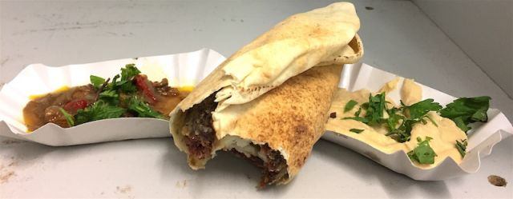

*Evening.*

When it is crisp and sunny Berlin is beautiful. When it is cold and wet and grey the city -- actually, *any* city -- is cold and feels unmerciful. I was on my way to meet with Gerhard Baader, a senior member of the Masorti (Jewish) congregation in Berlin. From his emails I thought I'd be meeting a young man about forty who had his hands in various projects. I was right about everything but his age. The Jewish High Holidays will end in about a week, and there was a police presence in front of the synagogue on Orangienburg. Next door to the synagogue was a stylish restaurant, the Cafe Orange, where I met Gerhard, a man of 87 who met me in jacket and tie and left in windbreaker with his backpack to jump on a train. More on this later.

I am hoping I can get back to the synagogue next week when they do their work with refugees, and maybe I'll throw some lint from my pocket on Yom Kippur. After I've done a bit more homework and put all the pieces together I will try to give you a fuller picture of this very interesting congregation and the Berlin Jewish community in general.

And then I still have to find an Iraqi bakery. But that's a different story.

Warm regards,  
David

---

### Downtime
##### October 6, 2016

Dear Friends and Family,

My lodging in Moabit was available only a week, so today I went apartment-shopping and finally found a room in an area called Wedding. It took the better part of the morning and a bit of the afternoon, and I found myself with a little downtime at about 2:00 pm.

My friend Jim had emailed me with a suggestion to visit a gallery in Charlottenburg where two SouthCoast Massachusetts and Rhode Island artists (who are now in New York) have an exhibition, so this sounded like the right way to finish the day. My Berlin mass-transit skills have improved and I am now less likely to go the wrong way on bus and subway lines. I got to the [Galerie Friedmann-Hahn](http://www.galeriefriedmann-hahn.com/) in less than 30 minutes. Thanks, Google.

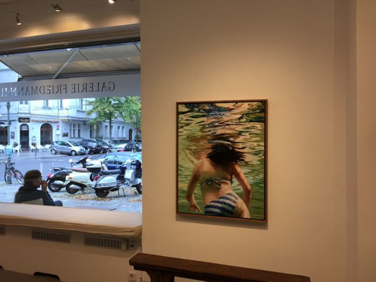

There I found the exhibit of paintings by Anne Leone and Daniel Ludwig which Jim had told me about, and I talked a while with Maxi and Alex and an artist friend. They made me feel very welcome despite the absence of my checkbook or any sophisticated art knowledge. It was just one of those odd connections that makes the world interesting.

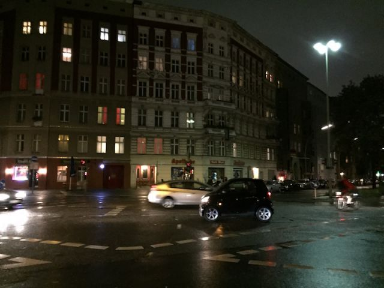

Dartmouth, Massachusetts is roughly 41 degrees North, while Berlin is 52 degrees North. So dark comes pretty early here after Summer has passed. By the time I got home it was already dark. I went out a little later to one of the Turkish fast-food joints that line Perlebergerstra/e and had a Dürüm Döner -- basically, a Turkish burrito. Only a healthy one because it's a wrap filled with chicken, lettuce, cabbage, tomatoes, garlic paste, onions and peppers.

And then I walked home.

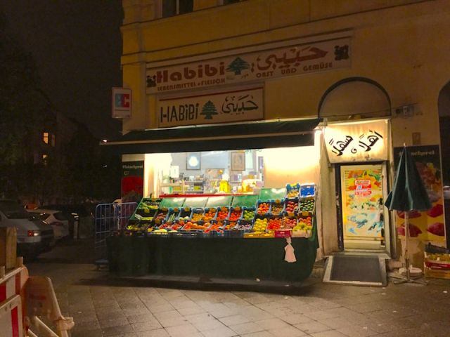

Warm regards,  
David

---

### Desperate men, heartless men, and Ampelmännchen
##### October 7, 2016

Dear Friends and Family,

For those joining the story, I've been working in the "store" that Moabit Hilft runs in Moabit (in Berlin) for refugees. People have arrived from the Middle East and Central Asia with almost nothing, and desperation can make people frantic. Just a few people grabbing everything can quickly deplenish a rack of clothes. There are two ad hoc signs in the children's section that are meant to spell out some basic rules of who can take, and how much they can take:

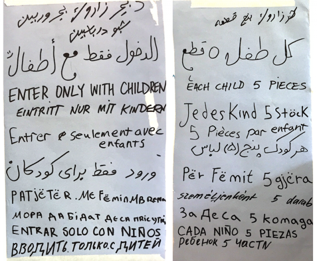

I had an interesting conversation with an Iraqi man today. He was a mechanical engineer from Kirkuk who had fled ISIS with his family. Their transit passes were all stamped with "Germany" as their entry point into Europe from Turkey, and the plan had been to join the rest of the wife's family in Finland. But after eight months in barracks and gymnasia in Finland they were "deported" back to Germany, where the whole process will begin again.

In Greece approximately 20,000 refugees have been [stuck on the island of Lesbos](http://www.telegraph.co.uk/news/worldnews/europe/greece/11847157/UN-calls-for-emergency-evacuation-of-17000-refugees-on-Lesbos.html) for months, their lives in a similar holding pattern. In order to transit through Europe, the refugees have to pass through the Balkans, but Macedonia and Serbia have closed their borders, and the EU and Turkey are still bickering over a deal to distribute asylum seekers.

The basic strategy is to shuffle them around until someone else takes them

A little context.

In Syria alone, a nation \[once\] of 22 million people, half the population has been displaced by war. Half of that half, 5.5 million, have left Syria according to UNHRC, the UN agency for refugees. Talking to a Syrian man this evening, he thought the UN's number was conservative — that half the country was no longer there. Some refugees have fled Syria on foot — [taking astounding routes](http://www.worldvision.org/refugees-news-stories/syrian-refugee-google-map-perspective). Of the 5.5 million who have fled, 2.2 million are in Turkey, many in Lebanon and Jordan, 800,000 in Germany, 30,000 in Canada, and 10,000 in the United States — the country with the most resources and the least interest in helping.

Last week, for example, the "Christian" [governor of Texas turned his back on refugees](http://www.npr.org/sections/thetwo-way/2016/09/30/496098507/texas-pulls-out-of-federal-refugee-resettlement-program) by dropping out of the Federal Refugee Settlement program. There is a line from the aptly-named chapter of the Bible (Exodus) in which Jews are reminded to take care of the stranger "for we were strangers in the land of Egypt." Governor Abbott, who is known for winning a suit to display the Ten Commandments at the Texas State Capitol and is theoretically familiar with the Old Testament, seems to want to pick and choose which biblical precepts he follows. The Republican Vice Presidential candidate, [Mike Pence, just tried this stunt in Indiana](http://www.npr.org/2016/10/03/496466007/federal-court-blocks-gov-pences-attempt-to-block-syrian-refugees-from-indiana) — turning his back on human suffering.

But I would ask the Republicans — if individuals and religious organizations are willing to step up to human and ethical responsibilities, why shouldn't government just get out of the way? Isn't that the usual line from this party? For Democrats the \$64,000 question is — will the next president create more refugees, or will she lead the US to do its share to take care of the ones we've already created?

\* \* \*

I'll leave you with a picture of Ampelmännchen — little traffic guy. I think he is a Berlin thing — and, like the much-reviled Trabant vehicle, he comes from former East Germany, where the street lights looked like this. Ampelmännchen was so beloved that they kept the little dude around — I'd like to think it was to say "welcome back" to the East Germans who rejoined the West.

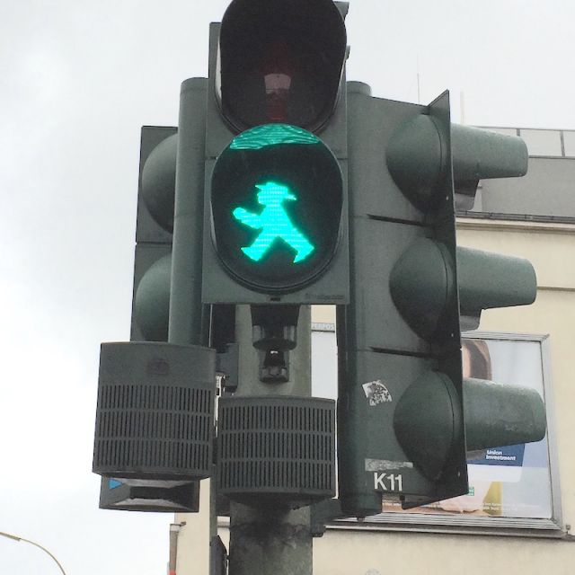

Warm regards,  
David

---

### Moving Day, Meetup
##### October 8, 2016

Dear Friends and Family,

Saturday was moving day — from my Airbnb in Moabit to a new one in Wedding, a busy commercial district. After getting set up, I took a walk and went to a Meetup group for B1-C1 German for foreigners (the class sign below says "stay calm and learn German").

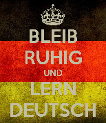

The teacher was a young woman from Humboldt University who is about to become a licensed teacher, and who does all the classroom things one is supposed to do with language students. My classmates were a young and interesting group of students and professionals from all over — Sicily, Ireland, Ukraine, South Korea, Portugal, Spain, Morocco, the UK and the US. As always, I represented the over-40 crowd. 50. 60....

Berlin is poised to become an even more young and cosmopolitan city because of the Brexit. With London out of the picture as Europe's financial capital, I expect this role will quickly go to Berlin.

After class, I walked down to the corner and I saw this — the DDR's own Trabant — a car known for its lack of power, its stinking lawnmower engine — but a cutie nonetheless. Juxtaposed with a Coca Cola sign and used as a prop for a restaurant, this says it all about Berlin's quite literal fusion of East and West Germany. Appropriately, the Trabant sits in front of the Ost-West Cafe on Bernauer Street.

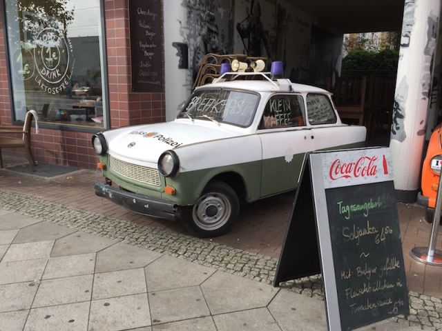

Bernauer Street was the street on which the Berlin Wall was built and which is known for several killings of people trying to escape from East Germany. Here is what it once looked like:

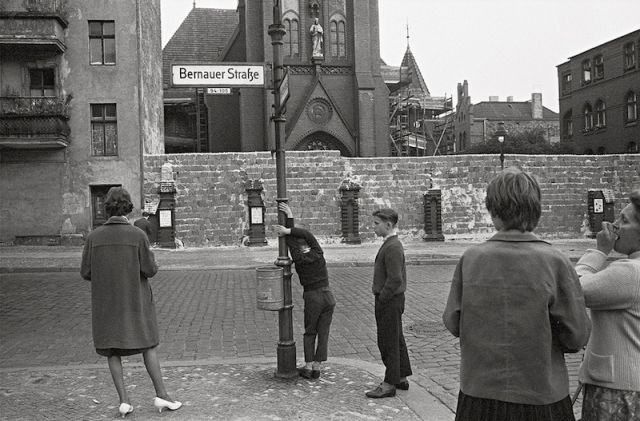

And here is what the same location looks like today after the Wall was torn down:

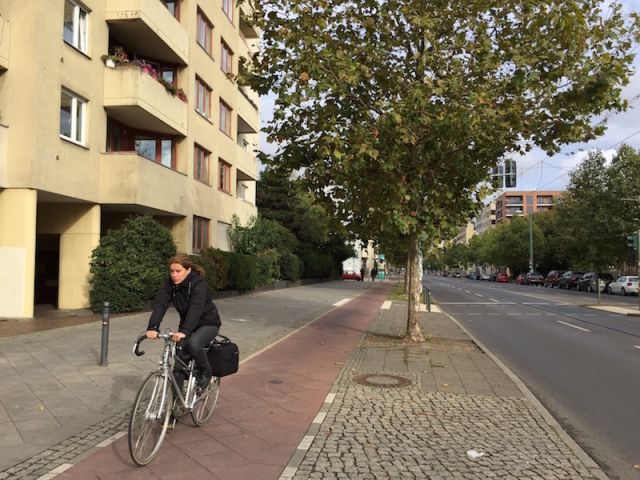

But there are many more walls to be torn down in this world. And certainly no more should ever be built.

Warm regards,  
David

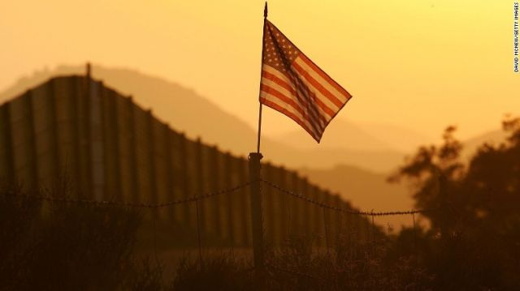

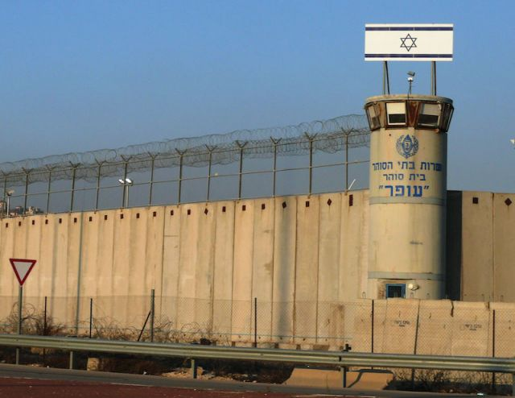

---

### Sonntag
##### October 9, 2016

Dear Friends and Family,

Sunday is a sleepy day in Berlin, especially now that it's the rainy season. Nothing besides cafes and the big megaplex movie theater on the corner are open on *Sonntag*. Church bells ring for sometimes fifteen minutes without stopping — such as the Evangelische (Lutheran) Kapernaum-Kirche immediately across the street from me:

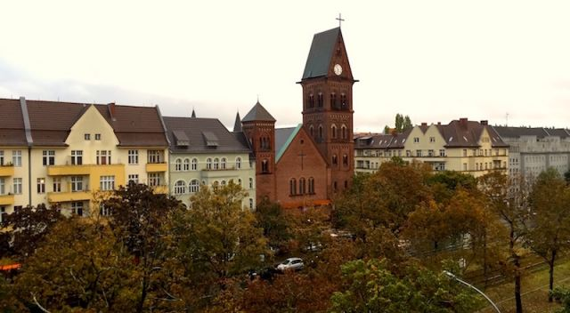

Berliners, who normally rush around at high-speed, have no option but to slow down, meet friends, and even sleep in a bit. It truly is a day of rest.

And so I relaxed, did some laundry, read about Donald Trump's latest hijinks, and consulted the [fivethirtyeight.com poll rollup](http://projects.fivethirtyeight.com/2016-election-forecast/?ex_cid=rrpromo) to reassure myself the nation would still be there when I got back.

And then I went out to meet and thank the journalist who put me in touch with the organization I am now volunteering with. We talked for an hour and a half about refugees, politics, German society -- and *sonstiges* -- and then she had to go pick up her daughter, and I took the U-Bahn back home.

I know Deborah won't believe this — and that probably goes for others of you who know how I pronounce the word "nature" — but I have been walking a lot around the various neighborhoods and on my way to and from subway lines, trolley lines, *schnellbahn* lines, and buses. Possibly even liking it.

Berlin is densely-populated, but there is green everywhere, and only now are the leaves beginning to drop:

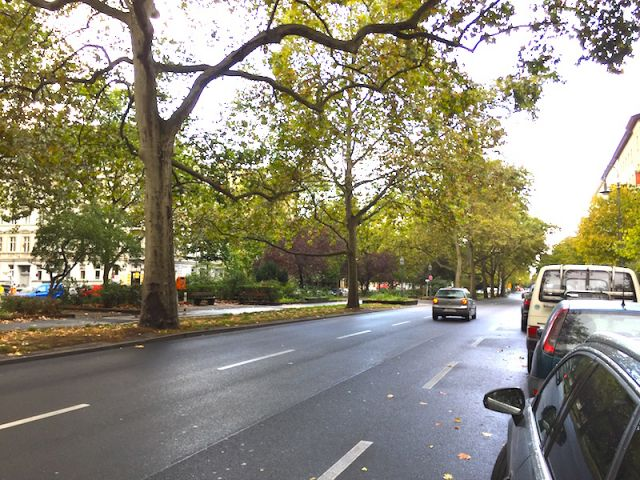

I keep being impressed by all the different ethnicities and languages. For the second time in some days, I ran into people speaking Spanish on the subway. And for the second time it turned out they were from Colombia. But you regularly hear German, English, French, Turkish, Arabic, Greek, and Russian, More than a hundred languages in all are spoken by people here:

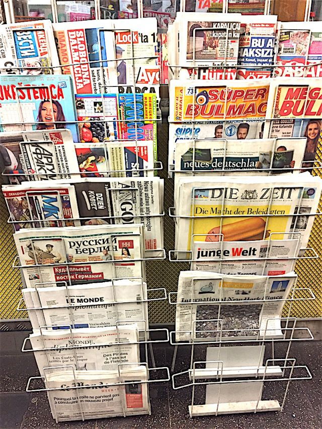

I won't be up at 3AM to watch the debates, but I hope this one finally sinks Trump. And I hope you hardy Democrats will all write the winner to tell her you don't want any more wars of choice in the Middle East.

Warm regards,  
David

---

### How do you say frustration in German?
##### October 10, 2016

Dear Friends and Family,

Last week Moabit Hilft let me change my schedule to spend some time in their main office on Lehrter Strasse. Among other things, this office provides help with job and housing searches and runs German classes every evening. Where the "store" provides the basic necessities of things like toothpaste and sweaters for new arrivals, the office helps people further down the integration pipeline.

Refugees get a stipend to help with housing, but they must compete with college students and an increasingly global workforce in Berlin's ever-shrinking housing market. Finding accommodation is not easy, even with a computer. Moabit Hilft's clients usually come in accompanied by a translator, and they are limited by family size and subsidies to certain types of housing.

There is something called WBS (Wohnberechtigungsschein), which roughly translated means "housing voucher" for public housing. WBS housing is basically like Section 8 Housing — a certain percentage of it has to be built when complexes are developed. On the wall are some guidelines on how to calculate expenses (below). The organization that publishes this is not the German federal government, but the Lutheran Youth and Welfare Agency (more on them another day). But much of the help being given to refugees is private and not funded by taxes.

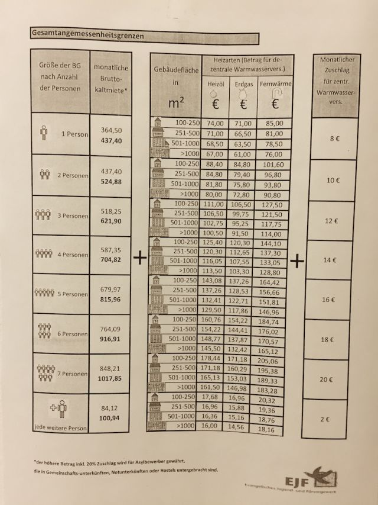

From early afternoon until about 6:30 there is a stream of people coming for help with their housing searches:

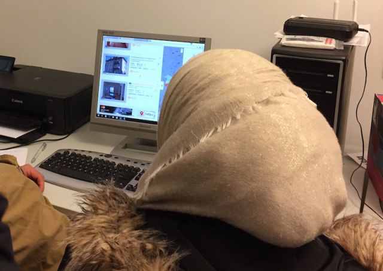

One of the wrinkles is that refugees must be counseled to avoid areas where there are significant numbers of neo-Nazis. These areas strongly correlate to precincts where the AfD (Alternatives for Deutschland Party) won the biggest numbers of votes (blue sections of the map, former East Berlin):

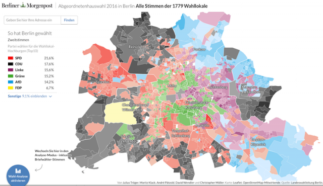

At 5:00pm the German classes begin. Language classes in Europe all use the [Common European Framework for Reference for Languages](http://en.wikipedia.org/wiki/Common_European_Framework_of_Reference_for_Languages). The one I sat in on was A1.1 — beginner's beginner's German.

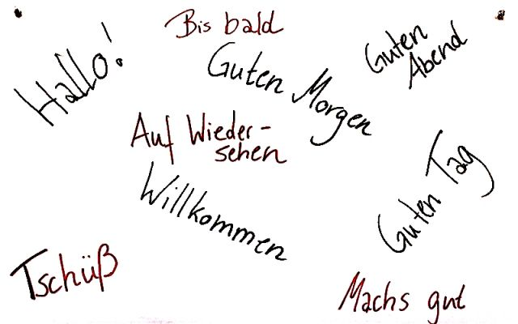

The teacher started the class at 5:00 and -- as drop-in language classes everywhere -- only two students showed up on time. Twenty minutes later, four or five other students arrived and it caused some disruption. One of the early-arriving students was annoyed, and his anger only grew as the class went on. At about 15 minutes from the end of the class one of the late-arriving students interrupted the young man's companion, and the young man began screaming and charged the late arrival. I tried to restrain him but my chair and I both ended up on the floor. Luckily, two other students successfully restrained him before he harmed the latecomer.

But it was a good example of how much frustration is building up in *ad hoc* housing with hardly any privacy, as these folks are stamped, fingerprinted, placed in hour-long lines, and often handled like cattle.

Warm regards,  
David

---

### Mostly pictures
##### October 11, 2016

Dear Friends and Family,

Today was a morning for bookstore browsing and then an afternoon in the office. I also scoped out my third neighborhood for the last ten days of my stay in Berlin. Compared with yesterday, today was pretty sedate except for losing my credit card. And so I will entertain you with some pictures I snapped -- although you will probably be disappointed at the quality compared to those from the [real photographer in the family.](http://debehrens.com)

I'm always amused by the little things, either *just slightly* different or totally the same as at home. I'll leave it to you to guess which.

A prison in a residential neighborhood:

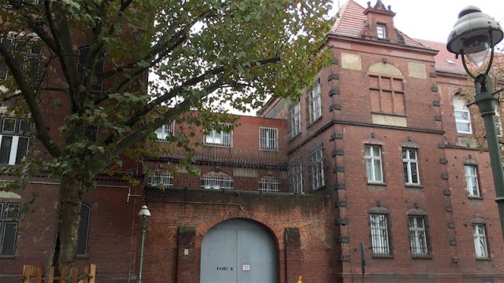

An advertising sign that let you recharge your phone:

A tattoo parlor with dubious claims:

An open house in a school for students who want to go back to college:

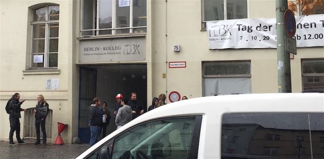

A Lutheran refuge for the homeless:

Yuppification of a poor and working class neighborhood...

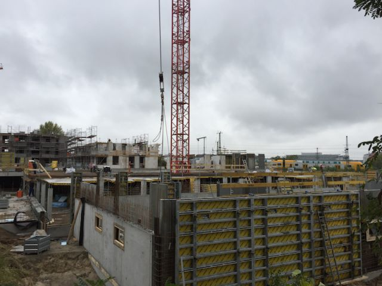

... all for micro-apartment for young professionals. The sign says roughly: "I'm not commuting -- I'll be living in the thick of it."

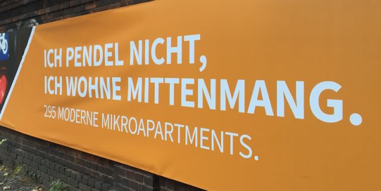

A gay refugee organization -- who knew? -- but then -- of course!

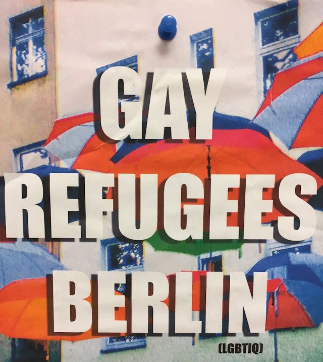

And today's 5:00pm German class, who are already learning the pain of nouns with three genders and declinations of them into four cases. Which immediately reminds me of Mark Twain's famous quote: "I'd rather decline a drink than a German noun." *Er hatte recht.*

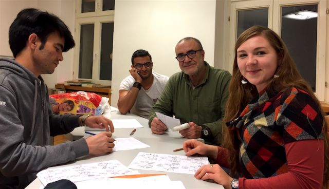

And that's it for today. Tomorrow I should have an interesting interview.

Warm regards,  
David

---

### Moabit in the morning
##### October 12, 2016

Dear Friends and Family,

Today I had an interesting interview, which I'll summarize in a second post today (if time permits). But I was out taking photos in the morning on my stroll around Moabit, a city that reminds me somewhat of Oakland in its rough charm. For German readers, none of this will be very special, but for Americans the pictures may provoke a smile.

A miniature rental car (I didn't see the driver getting out):

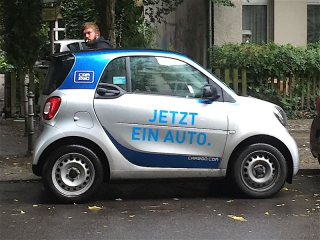

An Afro-German center:

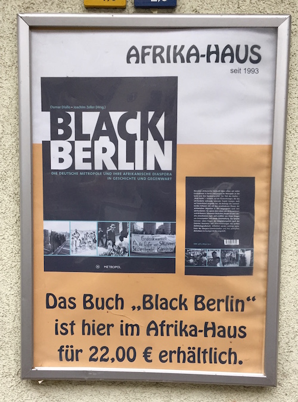

The German version of a dollar store:

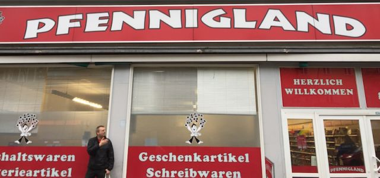

When you gotta go, you gotta go:

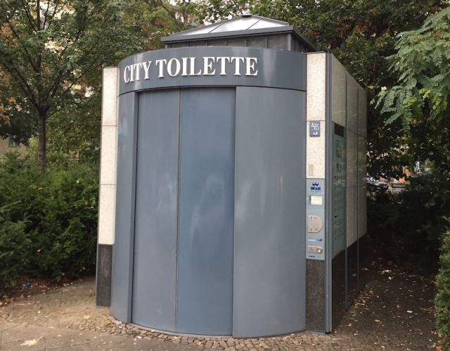

Notice anything? Let me rephrase that: notice anything missing? Hint: power lines:

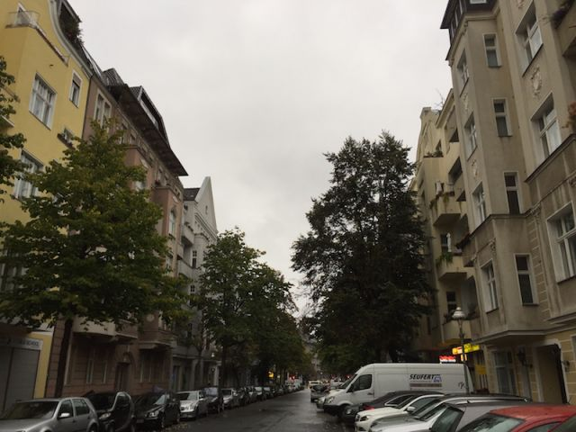

A center to promote family values -- with an unwelcome ad out front:

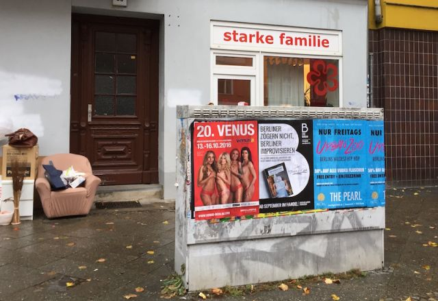

This is the only correct way to serve hot chocolate on a cold rainy day:

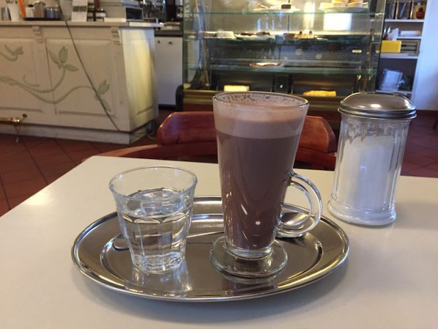

The morning headline: a small fire in the EuropaCenter had some Berliners thinking of something much more serious. But it was 10/11 and not 9/11:

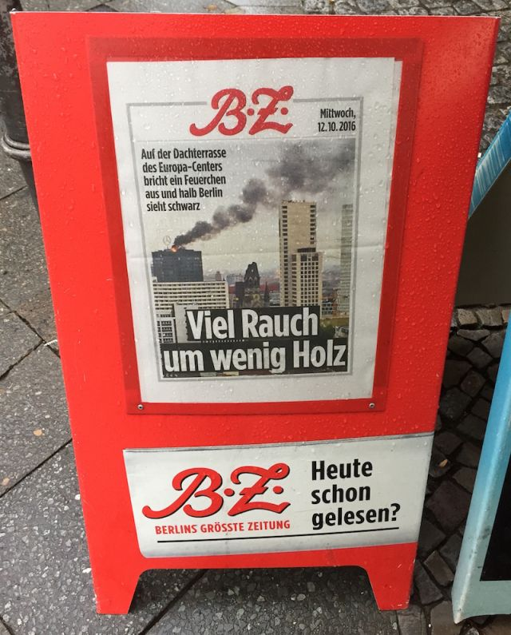

Missionaries camped outside a refugee center, hoping to snatch some souls. You can see the refugee tents in the background, left:

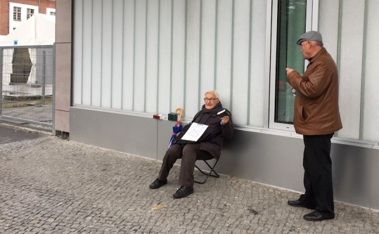

And finally, the man who made my lunch today (yeah, I really like those Döners):

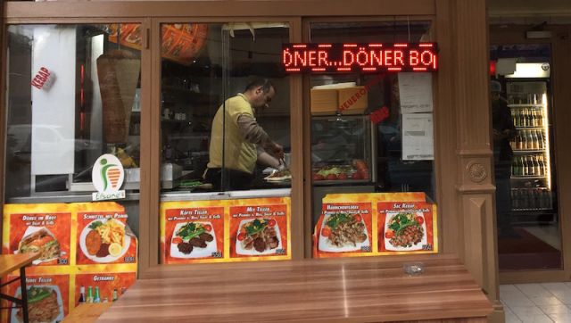

Inside the restaurant a black man was bussing tables and being as helpful as he could. The hint, I think, was that he was working for a tip. When I asked him where he was from, he told me: Mozambique. We chatted in Spanish with a sprinkle of Portuguese for a while, and then I took the hint.

It's now been 40+ degrees outside for several days, and rainy, and it's going to be a long winter for men like this.

Warm regards,  
David

---

### Small world, small goof, small delay
##### October 13, 2016

Dear Friends and Family,

I had a post for you tonight, but I need to rewrite it for reasons *tomorrow's* post will explain.

We have run out of memory to install in the donated laptops I was working on, so I have returned to the "store" to hand out clothes. This weekend I will look around for a few more sticks of memory so I can finish the project if it's not too expensive.

My morning began with a cup of strong Arabic coffee some Syrian volunteers had made (4 giant thermoses of it), tidying up the children's section of the store, then wandering around to talk to people. There is a room in which every sort of personal care product is handed out, including sanitary napkins. I noticed that this was the menstrual product stocked almost exclusively, and one of the women volunteers explained to me that this was done because 1) it's safer for people who don't know how to use tampons, and 2) most of the refugees don't.

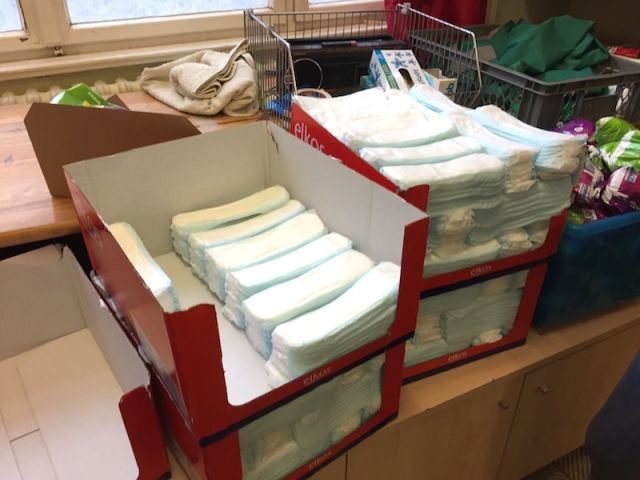

The volunteer had an unmistakable accent, and I asked her where she was from — Israel, she said. There are about 70,000 Israelis who have left the country and are now living in Berlin, she told me. Germany has a "Law of Return" of its own which grants citizenship to the grandchildren of expelled Jews. So for many young Israelis, a European passport, job opportunities, and religious freedom — or perhaps better expressed as freedom from *coercive* religion — make Berlin an appealing destination. A representative of the Jewish community in Berlin told me last week that 10,000 Israelis had come last month alone.

My young colleague told me she had met Jewish refugees at Moabit Hilft from Macedonia and war zones in mainly Kurdish territory. And I have been meeting Palestinians whose families, after expulsion from Israel in 1948 and later, had fled to Syria. As an ironic side-story, Jews and Palestinians are both getting it in this Syrian war.

The volunteer told me it was her obligation as a Jew to help refugees, that her grandparents had had to flee themselves. I mentioned the line — "for we were strangers in Egypt" — and she said, "Exactly."

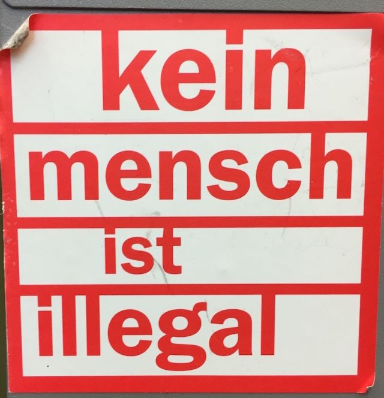

As we chatted, I found out she belonged to *[Jüdische Stimme](http://www.juedische-stimme.de/)* — the German sister organization of [Jewish Voice for Peace](http://jewishvoiceforpeace.org/). I had been wondering if I'd run into any other lefty Jews in Germany. And then she put me in touch with *another* one.

Later in the morning, a Dutch film crew came in and I discovered one of the filmmakers was from Guatemala. He and I were chatting about the "Mayans" in New Bedford, Massachusetts, when the mother of a volunteer jumped into our Spanish conversation. It turned out she was visiting her daughter from Queretaro, Mexico, where Deborah and I have been a few times.

The world is getting smaller all the time.

Later I tweaked the translation of a PowerPoint presentation, and then returned to my post. I enjoy talking to the children who come in. I have found that most of them speak German and can be *Dolmetschers* for their parents — so I ask them their age, compliment them on their German, ask them where they are from, how long they've been here, how they're doing in school. They all ask for toys, and we really have only stuffed bears and sad little plastic things to give them. I may be hitting you all up for some donations. Actually, you can count on it.

After work, I was supposed to go visit the Berlin Quakers, who also do refugee work — *almost*. My meeting is actually *next* Thursday night, and I had misread my calendar. But I made it to Friedrichstra/e and got a pure tourist shot of the Spree river:

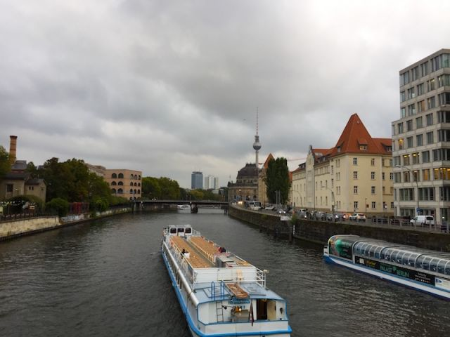

This part of Berlin is rolling in dough, luxury hotels, and shi-shi restaurants. Still, in the most wealthy country in Europe there is poverty and homelessness, alcoholism and neglect a block away:

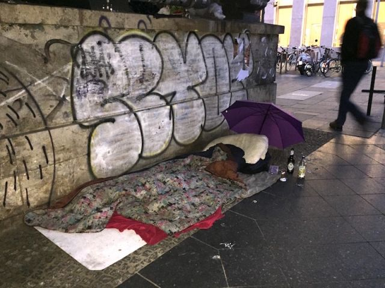

Next week I will return to my friends, the Friends:

Until tomorrow,

Warm regards,  
David

---

### Zentralrat der Muslime in Deutschland (ZMD)
##### October 14, 2016

Dear Friends and Family,

Two of the reasons that brought me to Germany were refugees and the return of the German Far Right. Both issues are focused on Muslims yet Muslims themselves are often not asked for their views in the mainstream media. I've had a number of one-on-one conversations with refugees but I thought I'd go talk to a group that advocates for Muslims in broader German society — one that might help me understand the bigger picture.

So I made an appointment with the [Zentralrat der Muslime in Deutschland](http://zentralrat.de/) e.V. (Central Muslim Council in Germany) and — given that Muslims have huge targets on their back — I was quite surprised to be welcomed to their offices in such a friendly fashion. But the representative I spoke to asked me to not disclose their address, publish his picture, or use any names — so for the purposes of this letter, I'm just going to call him "Bob."

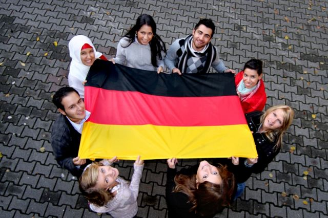

The Zentralrat der Muslime in Deutschland (ZMD) advocates for Muslims in German society. Its main office is in Köln but the press office is in Berlin. The ZMD was established in 1994 and represents 300 mosques and their local communities, and 35 associations with over 100.000 members.

Many of the Muslim communities in Germany are distinguished by national and linguistic differences, and there are many *Vereine* (associations) throughout. Most large urban areas like Berlin, Hamburg, and Bonn have their own community organizations. Turks, Albanians, and other ethnicities have their own associations as well.

Germany, a country with a population a quarter of the size of the United States, has 4.6 million Muslims and there are also now 600,000 Muslim refugees — about 1.9 million more Muslims than in the US. Something like 5% of all Germans are Muslim, a demographic change that began during Germany's *Wirtschaftswunder* (the economic miracle) of the 60's, when millions of Turks came to Germany to work.

Although entire Anatolian villages were emptied to provide cheap labor for Germany in the Sixties, [many Germans were disappointed when they didn't all automatically rush back to Turkey](http://www.spiegel.de/international/germany/turkish-immigration-to-germany-a-sorry-history-of-self-deception-and-wasted-opportunities-a-716067.html). A poll by the Heinrich Böll Foundation and the Rosa Luxemburg Foundation found 40% of Germans no longer want Muslims in the country. A Friedrich Ebert Foundation poll revealed that 56% of Germans are hostile to Islam. In Germany today there are clothing bans for Muslim women in most German states, and the community call to prayer is outlawed. And these are the *legal* forms of discrimination against Muslims in a country with a tax that goes to your choice of church.

Bob told me there have been over 50 attacks on mosques recently, including a bomb attack last week, 1,000 attacks on individuals (mainly women), and that Germany has an estimated 70,000 right-wing extremists who regularly target "foreigners." Existing laws criminalizing hate crimes against Jews do not yet apply to Muslims, but Bob told me that by next year this loophole should be fixed.

ZMD is involved in outreach programs intended to both help the Muslim community and allay fears by non-Muslims. "[Wir sind Paten](http://www.wirsindpaten.com/en/home/)" (with the implication of "We'll be there for you") is a program in different cities throughout Germany which provides volunteers to stand by refugees and Muslim newcomers — to show them the ropes and to help navigate the confusing structures of a new society. "Wir sind Paten" also creates a network of helpers who share information about cities, training, language, laws, and navigating red tape. The volunteers support not only the newcomers, but each other.

Another ZMD program is called "[Safer Spaces](http://www.saferspaces.de/)." This is designed to help communities spot troubled young men and intervene before they go off the rails. The vast majority of cases of radicalization have been social misfits, people who have been damaged by trauma — *Einzelfälle* (individual cases), Bob told me. When I mentioned the American term "lone wolf," Bob nodded in agreement — yes, that described the *Einzelfälle* pretty well.

ZMD also collaborates with the [Deutsche Islam Konferenz](http://www.deutsche-islam-konferenz.de/DIK/EN/Startseite/startseite-node.html) (DIK), an organization which shares many of the same goals with the [Council on American-Islamic Relations](http://www.cair.com/) in the US. Bob stressed that the ZMD's core mission is pretty straightforward — to improve the lives of Muslims in Germany and to promote integration into German society.

75% of all German Muslims are Sunni, and the remainder are Alevis, Twelver Shi'a, Alawites, and Ahmadiyya, while Sufis, Ismailis, Zaydis, and Ibadis each are less than 1%. 63% of Germany's Muslims are from Turkey and most German Muslims live in Berlin, but there are significant numbers in Saxony and other states. Berlin is interestingly also the site of Germany's first Muslim cemetery, established in 1798. [Muslims have been in Germany a long time, and they're here to stay](http://www.deutsche-islam-konferenz.de/DIK/EN/Magazin/Lebenswelten/ZahlenDatenFakten/GeschichteIslam/geschichteislam-node.html).

Are the various communities islands unto themselves? I wondered. Bob said, no, there was actually a lot of unity among Muslims in Germany. He said it was not uncommon for Shia and Sunni to worship together, and that being a minority (together) in Germany might even make this more likely than in the old country. After all, now everyone's in the same boat.

Just as American Jews are largely Democrats, German Muslims are probably most at home in the [SPD](http://www.spd.de/) and the [Green Party](http://www.gruene.de), and to a lesser extent the [CDU](http://www.cducsu.de/) — Angela Merkel's party — which has now changed its slogan to "we want to know who's entering the country."

When I mentioned Merkel's original phrase regarding handling refugees — *wir schaffen das* (we'll manage it), Bob grinned and said, "Yeah, like *Yes we can*."

To some extent, the handing of refugees *has* been a logistical disaster — for reasons I will explore in a later email — so implying the Chancellor's words are mere sloganeering is rather harsh, even by Bob's own admission. But he gave the Chancellor praise for making a moral issue a national challenge, even if her own party is not solidly behind her.

Tell me about the Far Right, I asked. The [NPD](http://npd.de/) and [PEGIDA](http://www.facebook.com/pegidaevdresden/) are basically unrepentant Neo-Nazis, he said. Bob also repeated some of the NPD's slogans — *Goodbye Ali! — Don't touch me! — Eva and Maria instead of Shariah!* Bob recalled an incident on German Unity Day in Dresden in which the ZMD's leadership was threatened by twenty PEGIDA members, including PEGIDA's national leader [Lutz Bachmann](http://www.youtube.com/watch?v=21UaSAE7AlE). A neo-Nazi contingent showed up at a "unity tent" comprised of Germany's main religions. "We had to call the police."

In some ways, [Alternatives for Deutschland](http://afd.berlin/) (AfD) is even worse, Bob said, because the party is slick, uses telegenic speakers, and couches its xenophobia and Islamophobia in dry, economic jargon. And this is what I've been hearing for the last twelve days I've been here, from just about every person I've talked to.

The rise of the Far Right in Germany is a result of Germany taking its eye off the ball, my host told me. "In the old days the police would intervene immediately — with even the slightest hint of neo-Nazism. But now both politicians and police give them too much leeway. Worse, the police have been infiltrated by the Far Right." He mentioned a case in Dresden involving a police chief. And Bob worries that the Far Right has also found its way into federal security agencies. An [underground National-Socialist organization](http://en.wikipedia.org/wiki/National_Socialist_Underground) (NSU) was uncovered in 2011 — 13 years late, and the case also featured murders of witnesses and shredded evidence.

Germans once used to refer to *Nächstenliebe* — to love your brother as yourself. This principle is what once differentiated the German CDU — the *Christian* Democratic Party — from their economic policy brethren, American Republicans. But while the economics may be similar, for American Republicans *Nächstenliebe* is a bunch of lefty hooey.

Unfortunately this now seems to be what's happening in Germany as well. "The lack of empathy is a real problem," Bob told me. Discrimination is quite common against Muslims, in all same the ways it is with Blacks in America. A woman with a non-German name will be told, "This job is not right for you." The same often applies to those with Slavic names "but they can more easily change or alter their names." Although the German *Grundgesetz* (Basic Law) prohibits this type of discrimination, it has to be constantly monitored and reported. "You have to fight for the rights you already have," Bob stressed.

The future isn't totally gloomy, though. Bob told me that the village of Hainichen, in Saxony, is only 9,000 people but has [opened its doors and its hearts to refugees](http://www.jmem-hainichen.de/refugee-ministry). "It's a hero village," he smiled. But like everything in Germany, there's a bit more to the story. More than a few of Hainichen's residents remember — [Hainichen was one of the Third Reich's earliest concentration camps](http://en.wikipedia.org/wiki/Hainichen_concentration_camp).

History can be learned and changed. Or it *will* be repeated.

Warm regards,  
David

---

### Formulas make bad movies in any language
##### October 14, 2016

Dear Friends and Family,

Tonight I had a notion to watch a good movie at the neighborhood theater. But the Dartmouth AMC theater at home doesn't usually show my sort of thing, and neither did the Alhambra Cineplex in Wedding:

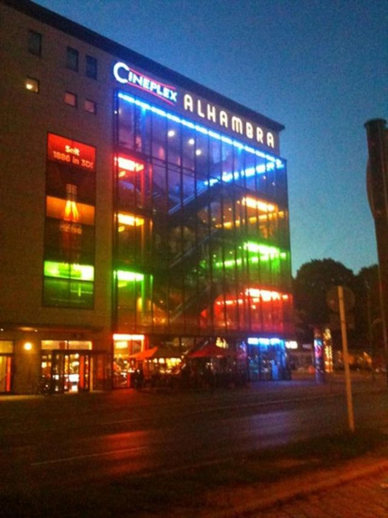

Here's what was playing tonight. Sad to say, but movie formulas make bad movies in any language. But it was interesting that the intended audience for many films was not assumed to all be native German speakers:

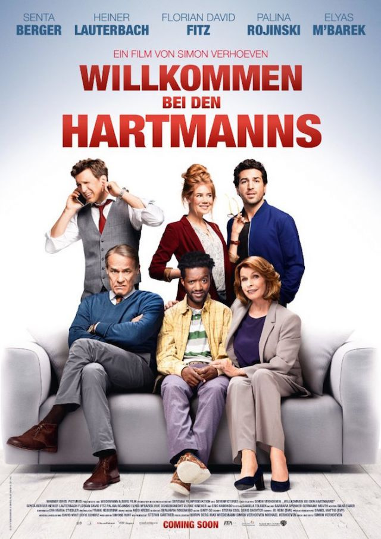

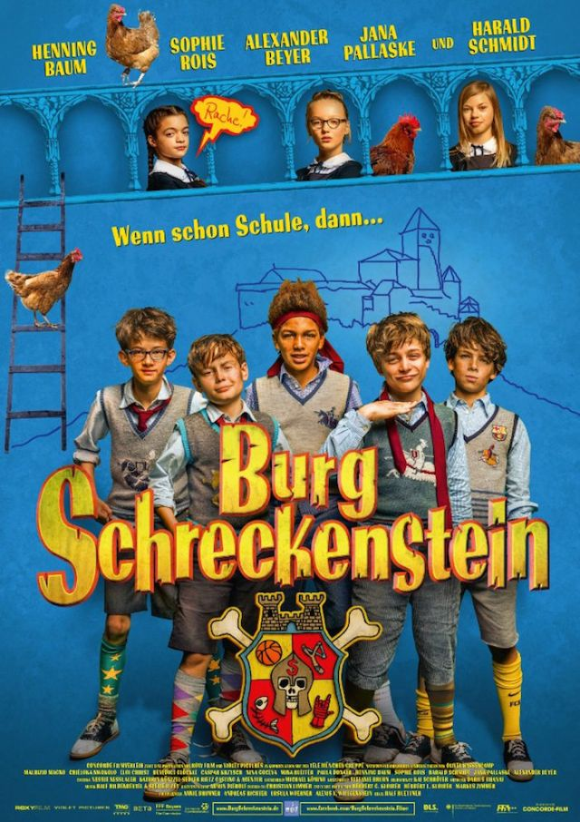

Warm regards,  
David

---

### Die Liberale Synagoge
##### October 15, 2016

Dear Friends and Family,

This morning I went to *shul*. Jewish readers will know at once that this means *synagogue*, but German readers may wonder at the similarity to the word *Schule* (school). In Jewish life at one time they were one in the same. As soon as I had written and expressed a desire to visit, I was invited to attend by no less than four people. There is a constant police presence at the synagogue, so I had a little trouble getting in until I showed one of the officers an email from someone he knew. Once in the building, I went through an airport-style security screening.

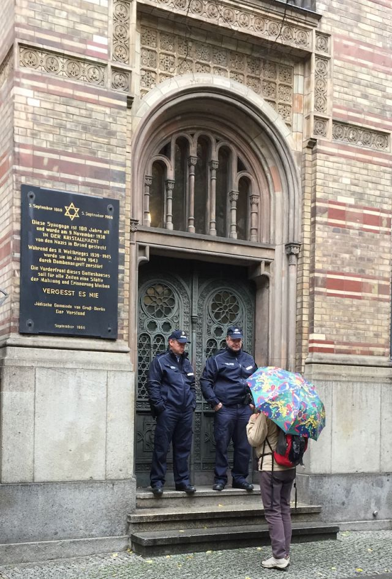

The foundation stone for *die Liberale Synagoge* was laid in 1859 after it was designed by Karl Heinrich Knoblauch. After Knoblauch became sick, construction continued under the supervision of Friedrich August Stüler. When Stüler was unable to continue, the work resumed under Knoblauch's son, Heinrich Gustav. A [slew of engineers and specialists](http://www.luise-berlin.de/gedenktafeln/mit/n/neue_synagoge.htm) finally completed the work on November 6, 1866, and there was a face-lift in 1901. But in 1938 *die Liberale Synagoge* was torched by the Nazis and subsequently bombed in 1943 by the Allies. Yet somehow it was meant to survive. Renovation began in 1988 and in 1991 the work was complete.

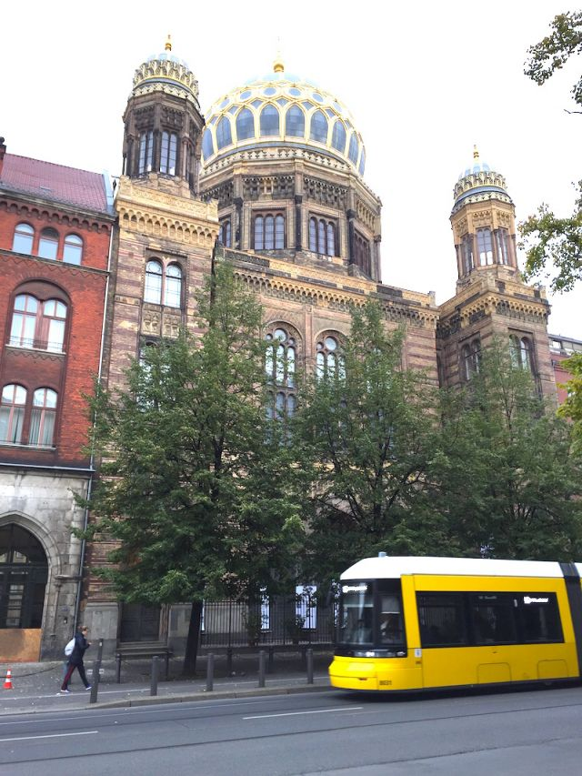

The plaque on the building (in the first picture) reads:

> This synagogue is 100 years old and was set on fire on the 9th of November 1938 ON KRISTALLNACHT by the Nazis. During the Second World War 1939-1945 it was destroyed by bombing in 1943. The face of this House of God should remain a site of warning and memory for all time. NEVER FORGET IT. The Board of the Jewish Congregation of Greater Berlin. September 1956.

The congregation I was visiting is the Masorti Jewish congregation on Orangienburger Stra/e near Tucholkystra/e. Both the rabbi, Gesa Ederberg, and the *hazzan* (cantor), Avitall Gerstetter, are women, and both received training in the United States. The congregation is egalitarian and very welcoming. The hazzan explained to me that the return of Masorti Judaism in Germany owes a lot to their American Jewish cousins. For non-Jewish readers, [Masorti Judaism](http://www.masorti.de/ueber_uns_en.html) preserves a lot of tradition but is not Orthodox.

My instructions were to go up the elevator and hang a left, so I followed some people who were doing just that. I introduced myself as a visitor to a couple of people, one of whom turned out to be the cantor. I was greeted by a friendly young man who offered me a Chumash (bible) in either German or English, and a Siddur (prayer book) in either language as well. The Chumash was *Etz Hayim* with its familiar deep red cover.

I got a little confused whenever the rabbi shot out page numbers almost simultaneously in German and English. Peeking over people's shoulders didn't help much either because everyone was in the *zone*, doing their own thing, on their own page. But they all were singing the same words, and beautifully too. I can't recall a moment in the service where anyone merely *read* Hebrew. It was always sung, and by more than a few skilled singers who added harmony. The cantor also had a lovely voice. Even in the prayers that followed lunch, everything was sung — at length. It was incredibly musical, and very moving.

And although I'm not wired for prayer myself, I know that everyone in that room was doing all they could to please God.

As everywhere today, the Torah portion this morning was [Ha'azinu: Deuteronomy 32:1-52](http://www.chabad.org/parshah/torahreading.asp?tDate=10/15/2016&p=complete). Somewhere in the middle of the portion, God seems to rather harshly command Moses to go die on the mountain he is climbing. He tells Moses he will only be able to see from afar where his efforts will eventually lead. In the rabbi's *D'var Torah* (words) after the *parsha* (part of the reading), which she gave in German, she observed that many of us never get to see the fruition of our work — and she gave some contemporary political examples — but that we still keep at it. It's what we do. Idealism or faith — whatever you choose to call it — can be a pretty good thing.

And then I thought of all the people who had worked at keeping this very building alive for 150 years, and all those who had kept trying to re-establish a Jewish community in Germany.

At lunch I found a table with a father who had brought his three year-old to *shul*. He was from Hungary, his wife from Russia. We talked for quite a while, then I said I really should go thank the rabbi for the invitation. But before he let me go he invited me to Shabbat dinner next week.

Like my lunch companion, the congregation is young, and it numbers about 200, though today the number was between 40 and 50. "Post Yom Kippur fatigue," someone joked. An overwhelming majority are English-speaking, from the United States, Canada, the UK, and Australia. But I also talked to people from France and Hungary, and I assume many more European states are represented. Germany's "Right of Return" law for Jews has brought back the grandchildren of Holocaust victims. I asked a young ex-New Yorker who was doing a master's degree here how she liked Berlin. "I love it, but I know it's not like the rest of Germany." She told me her father respected her decision to come to Berlin but he had only visited her once because Germany brings up such strong feelings for him.

And then I thought of that *parsha* again.

Warm regards,  
David

---

### IKEA
##### October 16, 2016

Dear Friends and Family,

Today I had arranged to have lunch with a man about my age from Syria and he asked me to meet him at IKEA. Who knew IKEA had a cafeteria with really inexpensive food? Getting out to Pankow took a while, undoubtedly longer than an experienced Berliner would have required. The part of Pankow I visited reminded me of Canton (MA), Warwick (RI), or King of Prussia (PA). My lunch buddy was not the only one who thought of this:

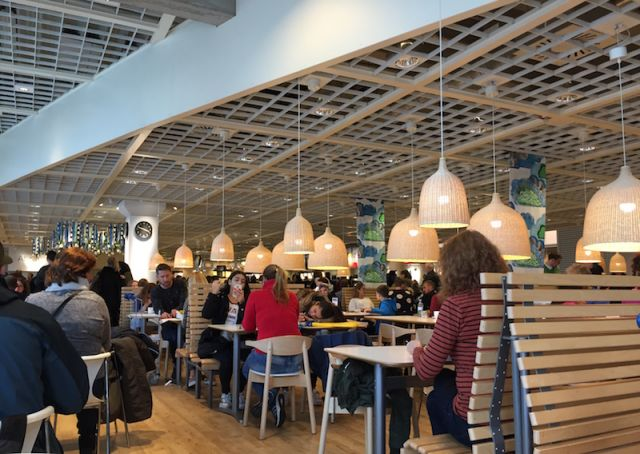

We talked for about five hours over too many coffees, than it got late and I went my way as he queued up to pay for his kitchen gear. Getting back to the *Schnellbahn* took me through more industrial park, a long walk over a freeway, and then finally to the station. I was getting lost and a bit desperate when a couple who turned out to be Iranian and Palestinian took mercy on the clearly lost foreigner and walked me right to my platform.

The Iranian lady and I chatted about her sister studying in Boston, her own studies in Heidelberg, and how Heidelberg had really changed.

A lot has changed in this country of 80 million.

Warm regards,  
David

---

### Alternative für Deutschland - no interviews
##### October 17, 2016

Dear Friends and Family,

One of my goals when coming to Germany was to see where the Far Right was headed. I was advised by a number of people to avoid the [NPD](http://en.wikipedia.org/wiki/National_Democratic_Party_of_Germany) and [PEGIDA](http://en.wikipedia.org/wiki/Pegida), both of which use violence. I heeded their advice. However, I really wanted to meet with [Alternative für Deutschland](http://en.wikipedia.org/wiki/Alternative_for_Germany), the AfD. It's a new party that popped up rather recently, in 2013, and has gotten about 12% of the vote in Berlin. Politically, it has an ultraconservative economic program, but culturally it appeals to the same neo-Nazis who fill the NPD (which is declining in political influence) and PEGIDA.

The AfD is on its way to becoming what the Republican party has already transformed into.

While the left and center parties in Germany are pretty *bunt* — brightly colored (i.e., multicultural), the AfD is as lily white (and old) as the Republican Party. Here, for example, is the party leadership in Berlin:

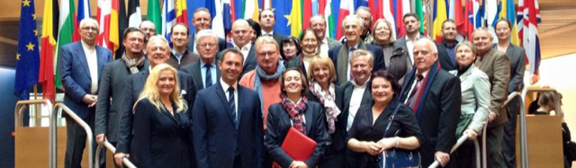

In the United States, most of the "Tea Parties" that eventually took control of the Republican Party are xenophobic and racist organizations. The [NAACP did a study in 2010](http://donate.naacp.org/page/-/TeaParty/TeaPartyNationalism.pdf) which showed that six out of seven were brimming with neo-Nazis and the Ku Klux Klan. But Dick Armey's FreedomWorks Tea Party appealed to voters more on economic terms, although Mexicans and "Welfare Queens" were soon identified as the root cause of all our economic woes.

I thought of this when I contacted the AfD. Do they deserve the benefit of the doubt if, *really*, they are all just free market fundamentalists like Dick Armey? Hmmm. But I also wanted to find out how their platform applied to immigrants, refugees, and Germany's own poor — all of whom receive benefits under the [Harz IV program](http://en.wikipedia.org/wiki/Hartz_concept). I wanted to know about their foreign policy (they hate the EU but love NATO). How do they *really* feel about multiculturalism? (One party leader said it belongs on a manure pile).

So for the last two weeks I have contacted the AfD four times for interviews — or even just a chat — anything. Recently I received an email from the Berlin office telling me they wanted me to submit questions in writing, which I then did:

> From: Lydia Axtmann &lt;...@beatrixvonstorch.de&gt;
> date: 10/10/2016 9:17 AM
> Subject: RE: Request for an interview
>
> Dear Mr. Ehrens,
>
> thanks for your request for an interview with Mrs. von Storch and your
> interest in the AfD policy in Berlin.
>
> Unfortunately it is very hard to make an appointment with Mrs. Storch
> in the next few weeks, so I suggest we prepare the appointment by
> clarifying some details.
>
> 1.  For which magazine or newspaper do you work?
> 2.  Which policy field are you interested in?
> 3.  What will be the questions, Mrs. von Storch will have to answer.
>
> For more information and to answer your questions, please contact me
> by email.
>
> Lydia Axtmann, Ass. iur.
> press officer to Beatrix von Storch, MEP
> Abgeordnetenbüro Beatrix von Storch
> Zionskirchstra/e 3
> 10119 Berlin
> Tel: +49 30 24 33 97 40

Accordingly, I jumped through Frau Axtmann's hoops and put a number questions to Frau von Storch, which were all based on the party's platform:

<http://afd.berlin/wp-content/uploads/2016/07/AfD_Leitlinien_2015_DE.pdf>

But I guess they didn't like my questions All I got was a wish for a fun
time in Old Germany:

> From: Lydia Axtmann &lt;...@beatrixvonstorch.de&gt;
> date: 10/17/2016 11:17 AM
> Subject: Re: Request for an interview
>
> Dear Mr. Ehrens,
>
> thanks for your e-mail. Unfortunately it is not possible to meet Mrs.
> Storch because of other appointments she has to meet. Maybe it is
> possible to meet her when you are in Germany next time. We are very
> sorry for giving you a negative answer.
>
> Nevertheless we hope you will enjoy your stay in Berlin.
>
> Kind regards
> Lydia Axtmann
>
> Lydia Axtmann, Ass. iur.
> Presse & Kommunikation
> Abgeordnetenbüro Beatrix von Storch
> Zionskirchstra/e 3
> 10119 Berlin
> Tel: +49 30 24 33 97 40
> Mobil: +49 170 3 55 25 67

What's clear to me is that the AfD is good at curating its image, avoiding being seen as the same overt racists and violent thugs the other far-right groups unapologetically represent.

No, what the AfD says is that it simply has an *economic platform*, and if it happens to offend people — like the lazy parasites that get help from the state, or the shiftless foreigners who come here to suck jobs away from *real* Germans — well, *screw Political Correctness!* We're just telling it like it really is.

Sound familiar?

Warm regards,  
David

---

### Sounds
##### October 18, 2016

Dear Friends and Family,

Nothing new in the store. Just a steady flow of customers from morning to mid-afternoon. I thought you might like to "hear" what I hear every day -- the whirr of people speaking in a dozen different languages, and the sounds of little children making the sounds that little children make everywhere...

[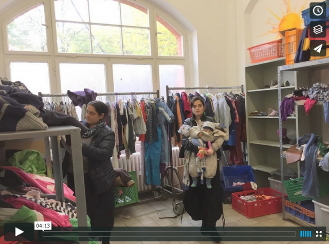](https://vimeo.com/187857743)

Warm regards,  
David

---

### Turmstra/e
##### October 19, 2016

Dear Friends and Family,

The [LaGeSo](http://www.berlin.de/lageso/) (*Landesamt für Gesundheit und Soziales* - Department of Health and Human Services) and [Moabit Hilft](http://moabit-hilft.com/), where I am volunteering, both have an address on Turmstra/e (tower street). The street — so says a sign as you exit the subway — is so named because you can see church towers (and also a court's tower) all up and down the street.

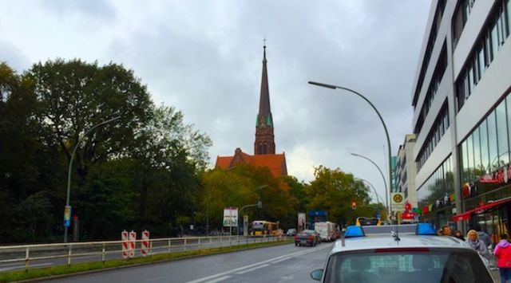

Within the same complex there are a number of private organizations, and throughout Berlin there are hundreds, many of them run by either the Lutheran church which is stronger in Northern Germany, or to a lesser extent by the Catholic church. There is more than a little irony in the fact that, despite widespread xenophobia, so many Christians have stepped up to help people who are predominantly Muslims.

Several people told me of a Christian concept called *Nächstenliebe* — loving your neighbor as yourself. It sounded like something New Testament-y until I looked up the line in which the German word appears — only to discover it's actually from the Torah:

> You shall neither take revenge from nor bear a grudge against the members of your people; you shall love your neighbor as yourself. I am the Lord. (Leviticus 18:19).

And when the Torah says "I am the Lord," it's not just a *suggestion* — it's the law.

I keep hearing about the [EJF](http://www.ejf.de/), the *Evangelisches Jugend- und Fürsorgewerk* (Lutheran Youth and Welfare) — and this being Northern Germany, I wanted to find out what they were up to with refugees. I wrote them several emails which were never answered, but then discovered the reason: they had moved their offices. So I tracked down and stopped by the new office one morning to see whom I might run into. A security guard told me to come back on Wednesday morning at 8:00 am and maybe someone could help. It sounded rather unlikely — but why not?

So this morning, at 8:00 am in a cold rain, I stepped into the vestibule of the EJF offices with a group of soggy refugees who were all there for social service counseling. I explained (to a different guard this time) that I was hoping to ask an administrator a few questions and — amazingly — he said, "follow me." After about twenty minutes of being shuffled around by various staff, a young woman came out into the hall. I apologized for ambushing them and said I knew they were probably quite busy. "Yes, actually this is a really bad time," she said like a true Berliner, "but why don't you send me your questions and I will give them to my colleague." So that I did, and I hope to have the responses for you soon.

The EJF was busy taking care of people who needed their time a lot more than I did.

While even fiscally-conservative Germans are doing something for refugees, our American Republicans are running away from basic human responsibility. Loving your neighbor may be the gold standard in whatever religion most of them profess, but the GOP can't even manage the low bar when they demonize Muslims:

> You shall not hate your brother in your heart. You shall surely rebuke your fellow, but you shall not bear a sin on his account. (Leviticus 18:18).

Warm regards,  
David

---

### Die Quäker
##### October 20, 2016

Dear Friends and Family,

Tonight I visited the [Quaker Meeting in Berlin](http://quaeker-berlin.de/english/). It was even the correct night (see my post from October 13).

To get there from Wedding, you take the U6 subway and walk a bit. *Easy peasey*. I'm beginning to feel like I almost live here, but Saturday I have to move again — so this will mean learning another subway line.

At 6:30 pm the city is still crowded, and the subway reminds me not so much of a rat race as a stockyard:

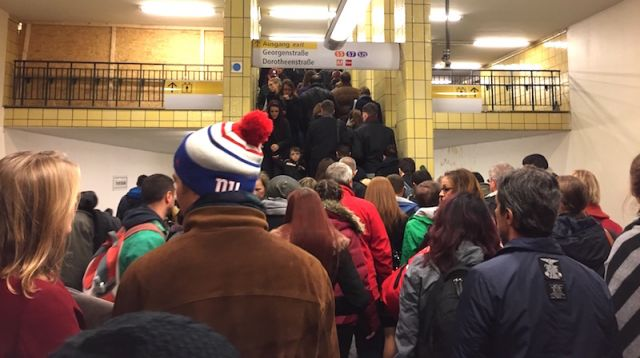

After coming up from the Friedrichstra/e subway I arrived at the Meeting, not far from the train station and not far from the Spree River, in a lovely courtyard. I rang the bell and the door was opened by Gisela Faust, who at 91 is old enough to [remember the Nazi era](http://quaekernachrichten.blogspot.de/2013/05/gisela-faust-spricht.html), and young enough to keep up with the young Friends who participate in a bi-weekly *Gesprächskreis* (conversation circle).

Gisela told me that there are about 250 Quakers in all of Germany, and about 20 in Berlin. The Berlin Meeting follows devotional practices like those I have visited in Pennsylvania and Massachusetts. It is distnguished by *Stille Andacht* (silent worship). There is a [Yearly Meeting](http://quaeker.org/information-in-english/) for all of Germany, a German-language [Quaker magazine](http://quaeker.org/zeitschrift-quaeker/), and [book distribution](http://quaeker.org/medien/buecher/). The Meeting also hosts a wartime research archive, paid for with support from American Quakers, which helps pay the rent.

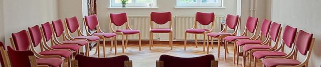

Because the Berlin Meeting welcomes visitors, I assumed tonight's conversation would be a social or some broad ethical topic. Not quite. It actually turned out to be a Quaker study circle. After more than a year, the seven participants had made a considerable dent in a book called *Quäker Glaube und Wirken* (Quaker Belief and Practice) and were now at chapter 20.72 — a paragraph on conflict resolution.

[Quakers in Germany](http://www.friendsjournal.org/2010034/) have a long history and a short history. The long history dates back to the 17th Century, before many emigrated to North America. The short history goes back to World War I, when the Society of Friends, as they are formally known, were just about the only religious organization to help Germans, who like everyone else were traumatized by the war. Even a decade after the war German children were still starving, so the Quakers set up stations that fed almost a million children. From this act of kindness Quakerism again took root in Germany.

In 1938 the very same Meeting where we were sipping tea, which is only two blocks from the Friedrichstra/e train station, handled [last-minute emigration requests](http://spartacus-educational.com/GERchristianity.htm) for 10,000 Jewish children to be sent to England on what were called *Kindertransporte*. Later, when there was not much that could be done to help Jews, Quakers hid them and some Quakers paid the ultimate price for this "crime."

We sat around the kitchen table drinking our tea, slowly going through each paragraph. Rather than dwelling on the nature of conflict, many of the discussions were about recognizing the truth in what someone says, working to see the world through their eyes, or the impossibility of this always happening. One woman related her experience in the criminal justice system, a man discussed how difficult it was for his father to be known as the "impartial" one, one woman talked about how difficult it was to tell a suicidal co-worker that there was hope without minimizing the difficulties of recovery. Another talked about a complex child custody case, another the challenges of marriage.

Words were parsed, personal experiences shared, but then we got to a quote with a cryptic sentence: "Unless you speak the truth there will never be love." Hmm. Maybe those Quakers knew what that meant. Things *were* just starting to get *interesting* — the quote at least demanded some attention — but, *no*, it was precisely 8:00 pm in Germany, and suddenly books were closed, coats pulled on, scarves wrapped around necks — and before I knew it two of my photographic subjects had escaped into the cool city night. But I did manage to get a picture of Gisela with three of the kitchen table circle before she locked up for the night (*note the jackets; they too were plotting their escapes*).

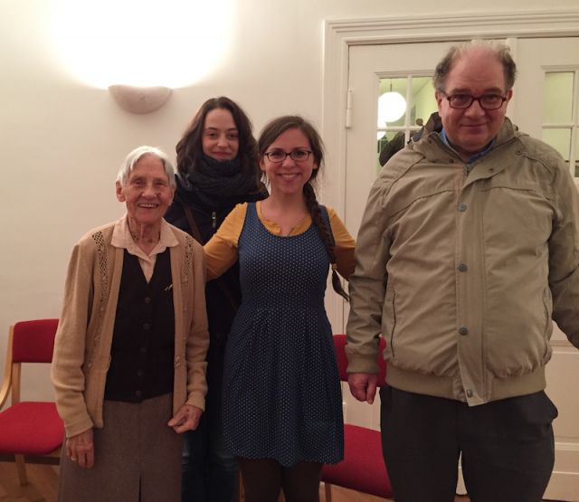

Out on the street one of the young women in the group said that she had been to a Quaker meeting in Ohio. From this I gathered she had decided to be a Quaker herself, so I asked her what drew her to it.

"Oh, no. I grew up in this Meeting," she said. "My whole family is Quaker."

Warm regards,  
David

---

### Spandau
##### October 21, 2016

Dear Friends and Family,

On my visit to the Orangienburg synagogue I was invited to spend Friday night (erev shabbat) in Spandau with a Hungarian-Russian couple, their three year old son, a *bubbe* (grandmother), and an aunt. There was a lot of singing of Yiddish songs before the meal and (as had been the case in synagogue) virtually every Shabbat prayer was sung. The dinner conversation centered around the right turn of European and American politics. I had a lovely evening.

To get to Spandau my fastest option was by train:

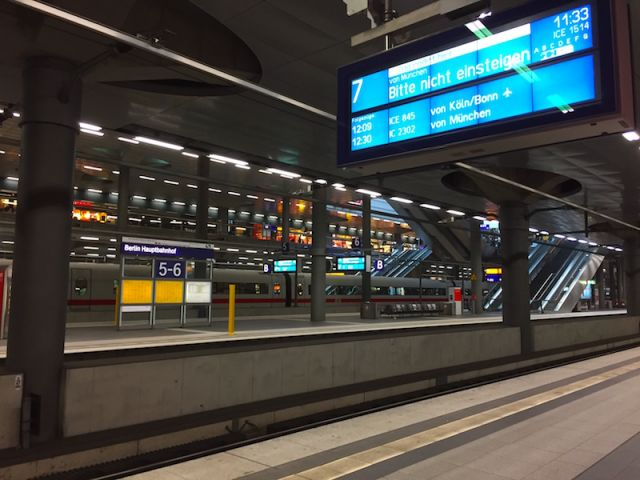

Who doesn't love trains?

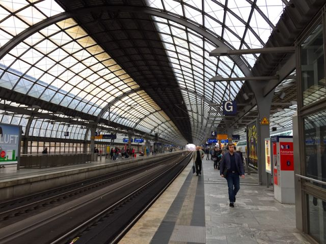

Compared with the center of Berlin, Spandau has a relaxed, old-timey feeling:

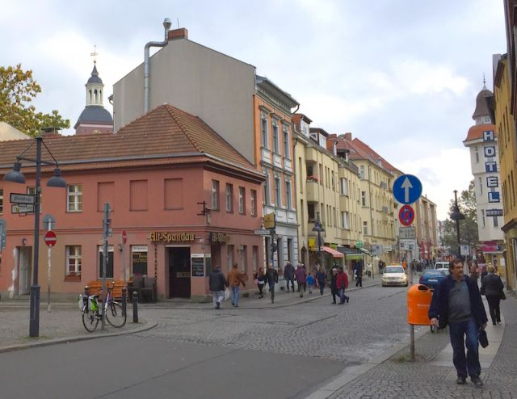

There is a lot of open space:

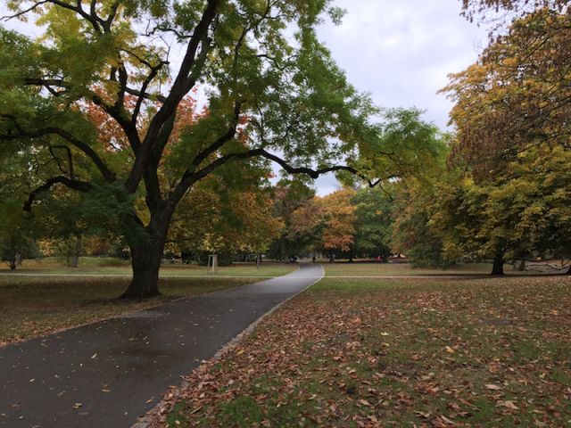

And a canal runs through the old part of town:

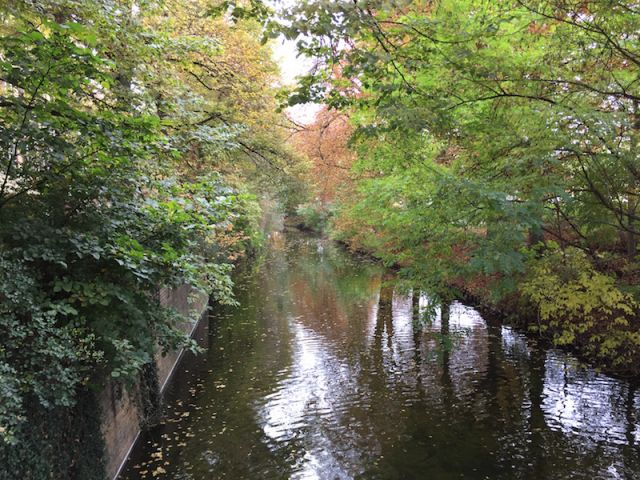

The streets are picturesque in the same cobblestoned way that downtown New Bedford (MA) is:

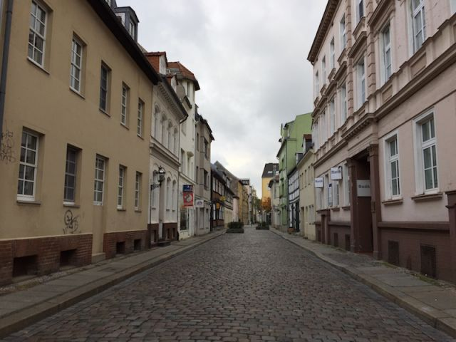

A quarter of Spandau is from somewhere else. Spandau is equally Slavic and Middle Eastern, many Russians live in the borough, the neighborhood Catholic church has services in Polish, and Turks have long been fixtures of the community — and now the refugees are coming. I snapped this picture of a group of young Arab men on a street corner — maybe you can make out the name...

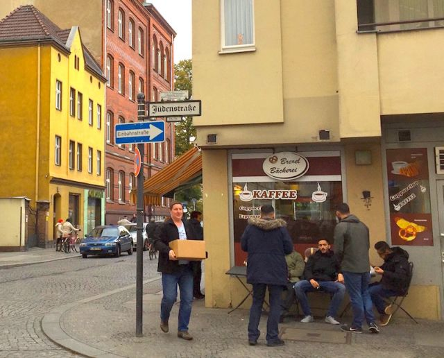

Warm regards,  
David

---

### Moving Day (#3)
##### October 22, 2016

Dear Friends and Family,

Today I bid a fond farewell to Wedding and the U6 subway line, which has served me well in getting around the city. Sometime in the next few hours I will (hopefully) hear from my next AirBnb host and will be off — back — to Moabit. Communication is not my new host's strong suit, so my day is kind of a mess.

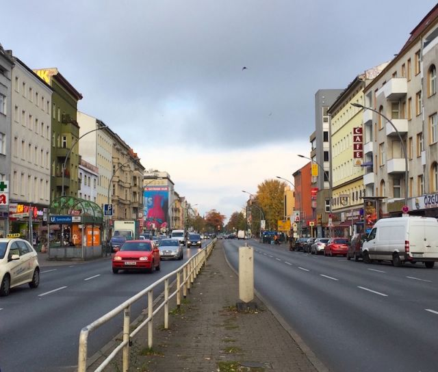

I had hoped to move into my new digs and then scoot off to a conference organized by [Junge Islam Konferenz](http://www.j-i-k.de/). Among other things, the morning session promised a Muslim feminist, an imam who organized an LGBTQ mosque, and a Far Right blogger with a Youtube following — all the panelists discussing the integration of Muslims into German society and the EU. It would have been really interesting:

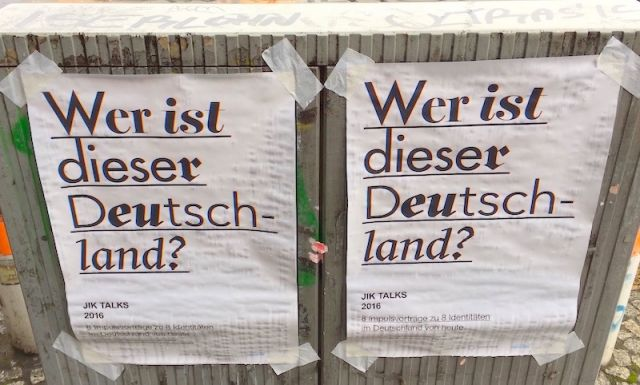

But while all this is going on I'll be waiting for the call that will get me into my next apartment.

Next week is my last week in Berlin. As things draw to a close I will be working a bit on a writing project, then will be traveling to [Dettelbach](http://www.frankentourismus.de/orte/dettelbach-152/) in Franconia to visit the family of our former exchange student. Then home.

The [German Book Prize](http://www.deutscher-buchpreis.de/en/) was announced a few days ago, and many of the titles looked interesting, but I have probably already exceeded the weight allowance for my return flight. Since I couldn't meet with the AfD, I settled for a book by Hajo (Hans Joachim) Funke, an expert on the extreme Right. I had actually been in contact with Lamya Kaddor and had hoped to meet her, but I'm settling for her very engaging book on German Islamophobia. A couple of plays, a book to help me remember my German grammar, and a book on Germany's "forgotten generation" — all this should hold me for a while.

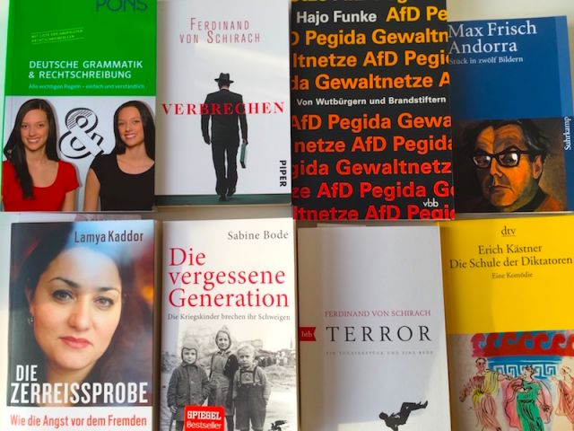

Someday I hope to return to the excitement and the linguistic smorgasbord of Berlin — but as of this minute I'm really looking forward to returning to my quiet little house on the Massachusetts coast and my wonderful family and friends.

And voting.

Warm regards,  
David

---

### East and West, and Sunshine
##### October 23, 2016

Dear Friends and Family,

Yesterday was a day of moving from one AirBnb to another. I checked into my new place, which is on the sixth floor of an apartment building. Looking out my window I could see people making dinner, working at their computers, having animated conversations, all of us wrapped in the anonymity of night.

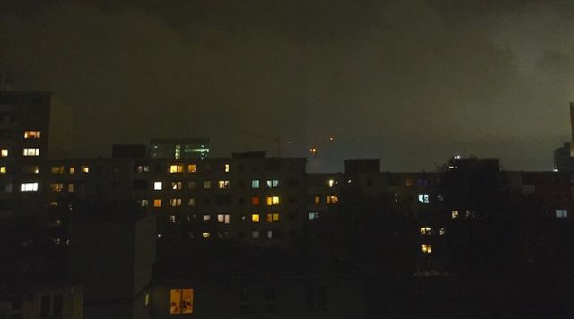

I'm not a morning person — what with all that light and the cruel early hour — and when I woke up, the magic was gone. The blinking red lights from the night before were simply part of a construction crane. And it was another Sunday in Berlin — pretty much everything closed — and one either reads the paper, has friends over, goes out to eat, or goes to a museum. I chose the latter.

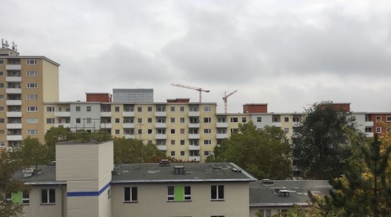

When I was in Berlin in 2014 the Stasi Museum was closed. But I decided to go there this morning. For people who don't know what the Stasi is — it was the East German Staatssicherheitsdienst — those nice people who looked out for East Germans' safety and well-being. Looking out for [the lives of others](http://www.imdb.com/title/tt0405094/) was what they did. Similar organizations exist in every country — the NSA, FBI, GCHQ, even Germany's present-day BND. Homeland Security.

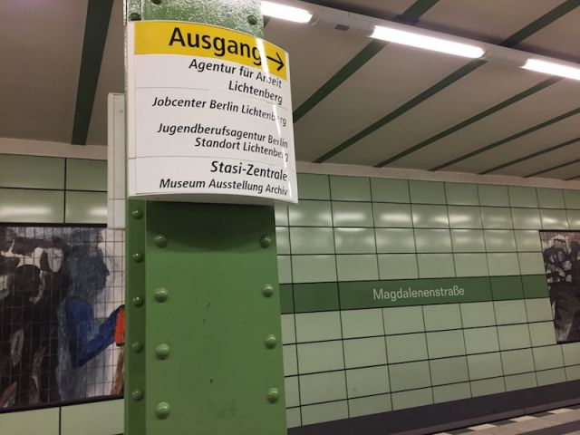

East Berlin isn't "East Berlin" anymore, but there is something spare and just a little bleaker than the rest of the city.

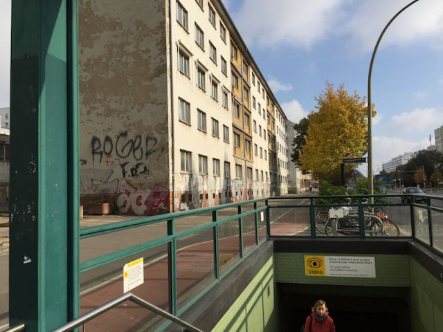

The east half bears the fingerprints of both Communism and advanced Capitalism:

The Stasi museum is quite easy to get to from the subway:

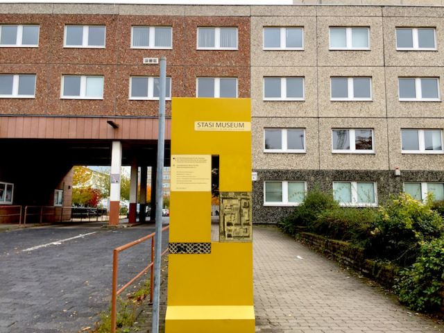

And I imagine it's never looked so good:

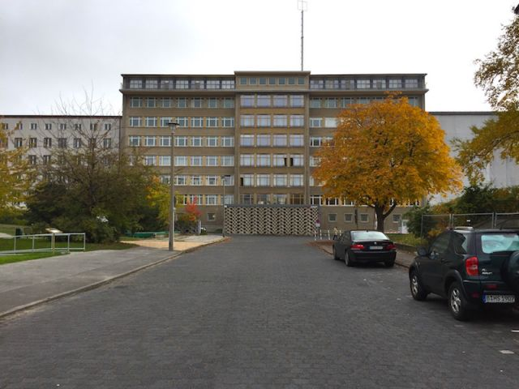

Outside there is a display with the chronology of the rise and fall of the East German state in picture form. I snapped those. I also took photos inside the museum itself. Of those photos.

As I entered the museum, I joked with the man at the counter — Die Gedanken sind frei, aber der Eintritt nicht — thoughts are free, but not entry to the museum. He joked back — only good people with good thoughts could enter; everyone else was in deep shit.

Which was pretty much the story of East Germany.

After the war, an altruistic Soviet Union was supposed to guide East Germans in creating a worker's paradise:

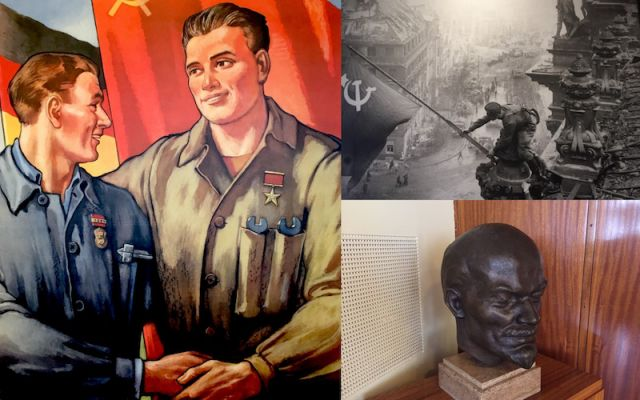

Only it didn't quite work out that way. No surprise: the Dictatorship of the Proletariat was a dictatorship. People were miserable. The tattoo on the man's back, for example, reads — Only when I'm dreaming am I free.

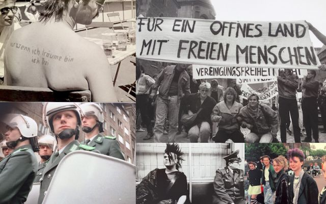

Within short order, East Germany became a police state. As you tour the Stasi offices, you're shocked by how bland, bureaucratic, systematized, automated, and widespread the surveillance was. This wasn't a spy museum with secret codes, disappearing ink, and agents in trench coats. This was the nerve center of something that put half the country under observation. For their own good.

I met a group of students from Yorkshire, England, who had come with their teachers for an enrichment program. They were shaking their heads in disbelief. I asked one of their teachers if they were equally shocked at the GCHQ and Britain's ubiquitous CCTV cameras. He winced and said, "yeah..."

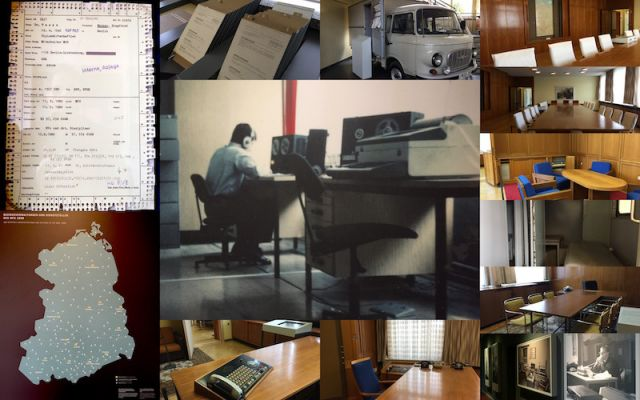

It didn't take long for East Germany fall to pieces. In the United States we like to believe that the fall of the Berlin Wall was due to Ronald Reagan's persistent anti-Soviet efforts — or our good old-fashioned American out-spending the Evil Empire until it went bankrupt.

But the truth is — from the very beginning East Germans wanted their freedom and organized relentlessly for it. Rallies, manifestos, citizen groups, covert groups, demonstrations, petitions, candle-light vigils — all the peaceful means at citizens' disposal, and occasionally not-so-peaceful means. But the same thing was happening in other Soviet satellite nations, too.

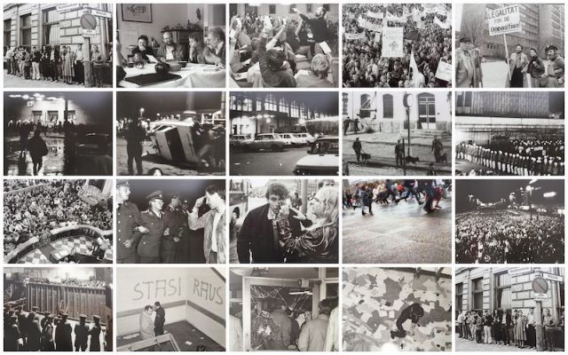

Finally the wall came down.

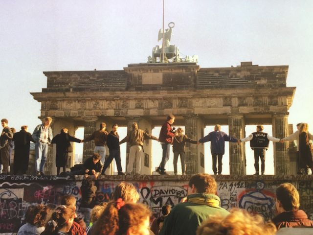

A huge number of East Germans flooded into West Germany — and they were housed and fed...

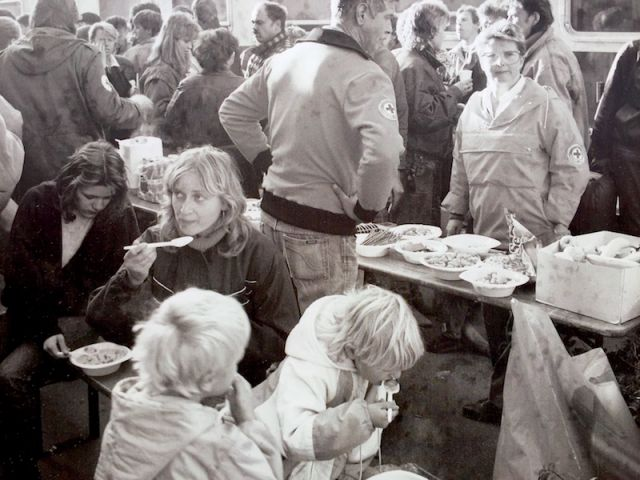

And Germans welcomed them... just as they have (sometimes begrudgingly) welcomed today's refugees.

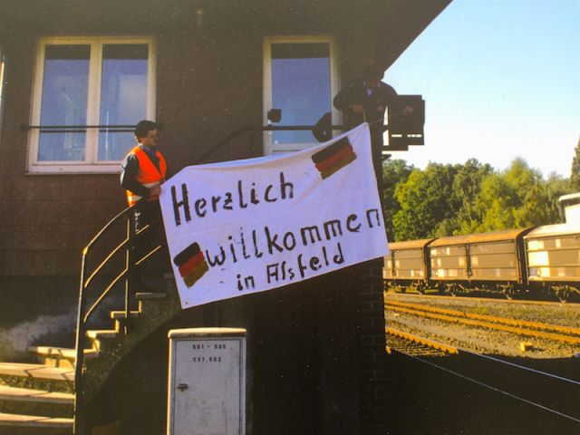

On my way home, I looked on my Google Maps and noticed that my apartment — at the bottom of Moabit, a block from the Hauptbahnhof, the main train station — is also within walking distance of the heart of the German government.

After an 8-minute walk I got a photo of Angela Merkel's offices:

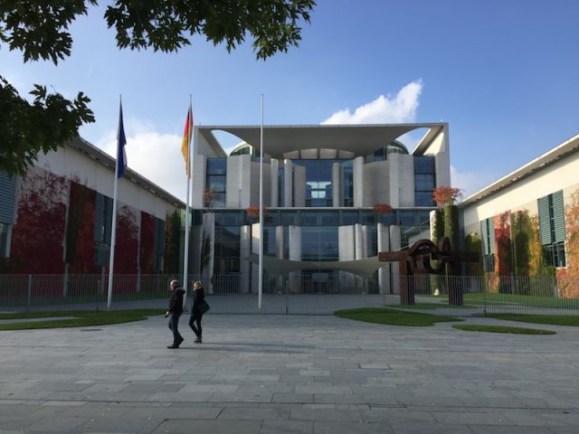

This is the parliament building, three minutes from the Chancellor's offices:

And this is a huge government annex right next to the parliament:

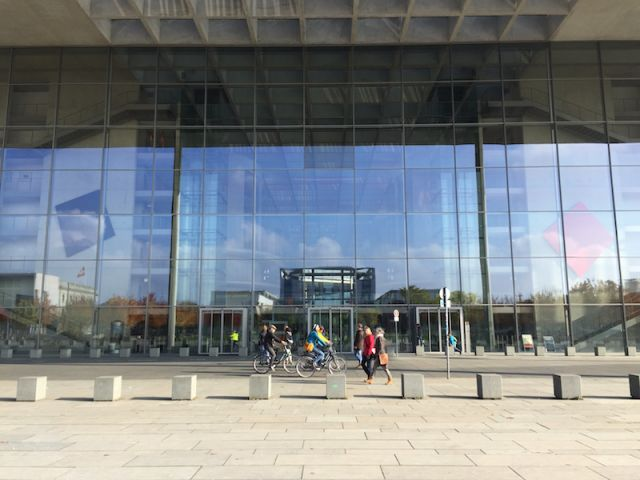

As I walked up to the Reichstag, the parliament, there was music and someone was speaking. They had erected a huge display arguing that Germany doesn't exist — it's still in the hands of a shadowy group. Perhaps the Illuminati?

I walked toward the annex building and ran into two women about my age who were warming themselves in the first sunshine anyone has seen around here for — well, since I got here. One of them told me that anyone could exercise their Constitutional rights on the green — even the crazies. We chatted about Trump and Hillary — and she seemed worried that the American election was going to be so close, so I showed her the current polling. We talked about Angela Merkel and sunshine woman said she thought Merkel was a decent Christian and hoped Merkel would have a third term.

"Merkel and Clinton — how about that," I said. She straightened right up: "It's time for the women."

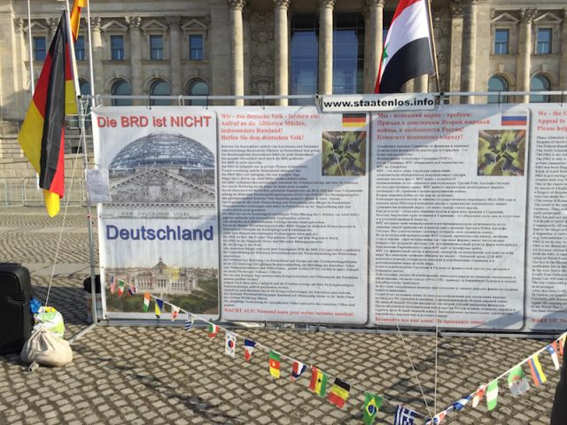

As I got ready to walk back "home" behind me I noticed a token police presence at the edge of the Reichstag.

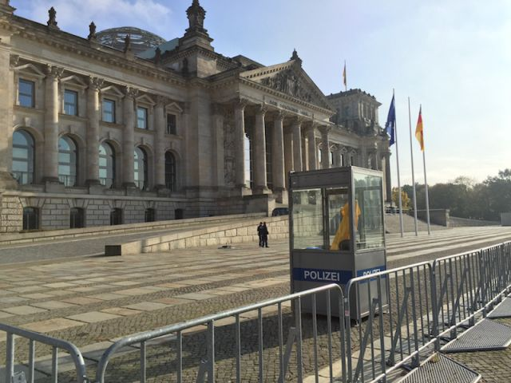

A state governs by consent of the governed. But sometimes it does without consent. And, then again, it also protects us from the crazies.

Democracy.

Warm regards,  
David

---

### Goodbye for now
##### October 24, 2016

Dear Friends and Family,

There are still about ten days before I return home, but my letters will be ending tonight for a couple of reasons.

One is that I am now in a routine of going to my volunteer job every day — catching the \#123 bus and stopping at my favorite Turkish breakfast joint before arriving at the center. Nothing so interesting about that. Another is that I am donating my laptop this Wednesday, so writing long text won't be so easy. I've never made the easy transition to mobile devices. Yeah, I know. That makes me old. *Nolo contendere.*

Besides my personal reasons for coming here, Germany is in many ways a mirror of our own nation. It has been fascinating trying to understand where things stand here in terms of politics and culture — as much as anyone, especially a foreigner, can ever hope to in a few short weeks. But all the same issues are surfacing both here and in the US, and for many of the same reasons. It has been a privilege to have had some great conversations with people who love to discuss politics as much as I do.

The Stasi Museum I visited yesterday had a rack of handouts, human rights brochures, interesting tidbits about the DDR (East Germany), and a newsletter called *Der Stacheldraht* (The Barbed Wire). It's aptly named — in many ways it's barbed and bitter, as victims of the Stasi probably have every right to be.

The brochure on life in the DDR had this tidbit:

> To excape this all-pervasive political and social control, many East Germans withdrew into their private lives — so far as this was possible and tolerated... The dacha and the Trabi with a roof tent are examples in the exhibition of this withdrawal.

What was the Trabi roof tent? Someone figured out a way to stick a tent on the top of one of the ridiculously underpowered, stinking little bathtubs. Perhaps it was the East German version of Wal\*Mart, NASCAR, Facebook, or Reality TV.

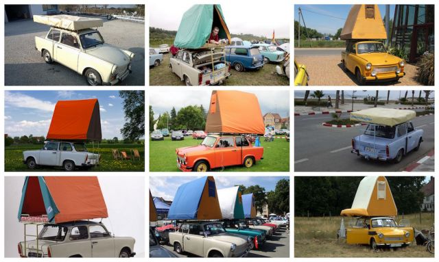

We all have our ways of withdrawing from the world.

I never heard back from the AfD — but in the *Stacheldraht* newsletter I picked up, I found this:

> We once heard from statesmen like De Gaulle, Adenauer, Brandt, and Kohl, to name a few, who used to described the European Union as a union of homelands, all peacefully united in their own democratic traditions. But today this sounds a whole lot different. Now we're headed, without anyone clearly saying it, toward a European State. Those who feel things have gone too far — those who want to preserve their own national sovereignty, who want to remain Germans, Frenchmen, Danes, Italians, Greeks, etc. — are called reactionary nationalists or relics. And if they point toward the centuries-old Christian tradition to which their country belongs, or dare to call it "the dominant culture," there's not much more to say than that they've joined the ranks of cultural arsonists.

Here is a glimpse (whether we agree with it or not) of why some former citizens of East Germany (and maybe some of our own emigres) might see the EU as just another Soviet Union. Besides the loss of their German nationality within a Soviet system, the USSR/DDR also denigrated the culture and religion that many valued — including Merkel, also an East German, whose father was a minister. So in many ways the sudden and inexplicable alliance between some former Communists and the Far Right is maybe not so inexplicable after all.

Warm regards,  
David

---

### Reichsburger
##### October 25, 2016

Dear Friends and Family,

I'm sorry to annoy anyone by "un-quitting" sending you letters, but this is a correction. And maybe not *auf Wiedersehen*, either, because I'm doing this on an iPad.

The other day I posted a picture of a conspiracy theorist at the Reichstag (never a good combination) without realizing who and what he really was. As I was reading the newspaper today, it described a new phenomenon in Germany called the "Reichburger" — a "Citizen of the Reich" or what in the USA is called a "Sovereign citizen." That's what this is:

One of these Citizens of the Reich shot a policeman in Franconia last week, and in Bavaria two policemen were fired for being involved with these groups. In Sachsen-Anhalt three policemen were also recently canned. The Berlin Police Department has circulated documents internally meant to help officers recognize other officers who many be involved.

The Berliner Zeitung says that an estimated 100 Citizens of the Reich are active in Berlin. Some are anti-Semitic. Others hold fantastic conspiracy theories, "such as, that Adolf Hitler took off with a contingent of aircraft at the end of the Second World War, heading to the Arctic, where they built the nation of 'New Schwabenland.'"

Laughable were it not for their weapons and their hate.

Another American import to Germany is the KKK, which first appeared in the 1920's — before Hitler took power. There are now four separate Klans here. Since 2001 they have been involved in 68 hate crimes. At least one police officer in Baden-Wuerttemberg is known to have been involved with the Klan.

The "Right Turn" in Europe and America gets more interesting by the minute.

Warm regards,  
David

---

### Prison
##### October 29, 2016

Dear Friends and Family,

I was out for a walk last night and ran into my friendly neighborhood prison. In the US, our prisons are usually way the hell out of town, where no upstanding citizens have to think about crime — and they are also difficult institutions for the families of prisoners to visit.

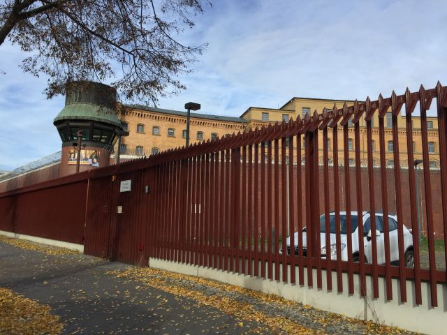

This one, on Alt-Moabit Strasse, is right across the street from a daycare.

That got me wondering about prisons in Germany, about the number of people incarcerated, but particularly the *percentage* of citizens sitting in jail. I easily found this document (in English) on the Berlin Prisons website, which describes how treatment programs are developed for inmates.

[Berlin Prison Document (English)](http://www.berlin.de/justizvollzug/_assets/senjustv/sonstiges/broschuere-justizvollzug-englisch.pdf)

When an inmate leaves prison in Germany, they have a support system to reintegrate into society, not just \$100 and a bus ticket to nowhere.

In contrast, the United States incarcerates almost 9 times more people per 100,000 than Germany, and recidivism is much higher because we never treat the causes of criminal behavior, and we actually make it more difficult for him to function in the world to which he returns:

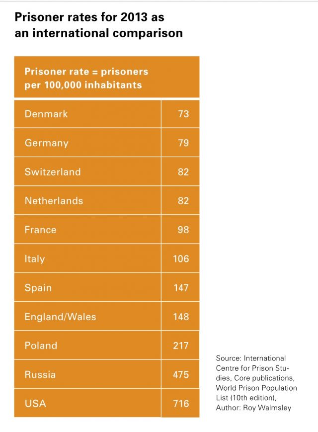

Can a nation like ours, with so many people behind bars, truly be called a democracy?

Warm regards,  
David

---

### Trains to Death, or Trains to Life
##### October 31, 2016

Dear Friends and Family,

Throughout Germany there are *[Stolpersteine](http://en.m.wikipedia.org/wiki/Stolperstein)* — literally, stumble-stones. They are usually memorials to people who were hauled off to concentration camps or who died at the hands of the Nazis. One reads: "Here lived Ida Arensberg. née Benjamin - 1870 - deported 1942. Murdered in Theresienstadt on 18.9.1942."

History is hard *not* to notice here.

This morning I went down to Friedrichstra/e because I have worn out my shoes, and there is a Clark's, a Timberland, a Shoe City, and a bunch of other retail shoe stores. I was not really thinking about the time change — even after specifically talking to Deborah about it the night before — but I had forgotten to change the time on my watch. For younger readers, the *watch* was an error-prone personal analog device that people in the 20th century once used to tell time.

So there I was, wandering around a half hour before any of the shoe stores actually opened. I ducked back into the train station to get a coffee, and there on the outside of the building I noticed a couple of historical plaques.

The very same train station — now with both a McDonald's and a Burger King — had once been used to transport Jews to their deaths:

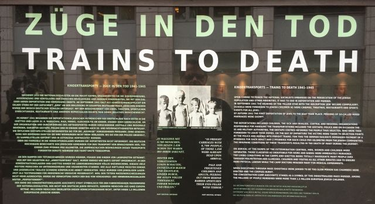

And, as I mentioned in the letter about the Quakers, the Friedrichstra/e station was also used to save the lives of about 10,000 children by sending them on *Kindertransporte* to England:

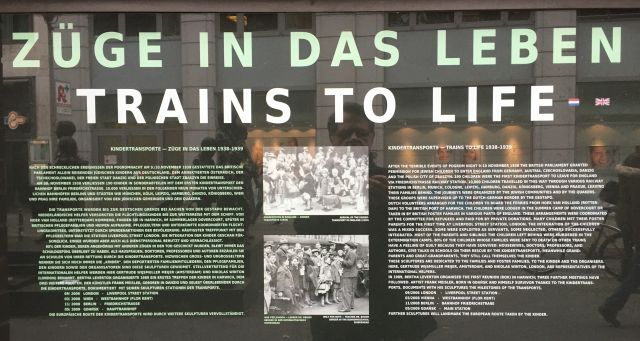

The Germans, for all their dark history, at least look it in the eye everyday.

I wonder when the day will come that Americans will have our own *Stolpersteine* to acknowledge slavery, lynchings, shootings, prisons, torture, genocide, and all the wars of choice — our own dark legacy.

Warm regards,  
David

---

### So it begins
##### November 13, 2016

Dear Friends and Family,

So it begins.

Today President-elect Trump announced that he was going to follow through on his campaign pledge to [round up millions of people](http://www.latimes.com/politics/la-na-pol-trump-immigration-20161113-story.html) he claims are "criminals" and deport them. We haven't seen [mass-deportations like this](http://www.npr.org/sections/codeswitch/2015/09/08/437579834/mass-deportation-may-sound-unlikely-but-its-happened-before) since the Thirties. And it wasn't just Nazi Germany where this occurred.

The measure of any society is not how much power one group can wield against others. Only a compassionate society that cares for and respects its own citizens — and the rights of those who come to it for help — is worthy of our respect.

And when a government turns its back on the helpless, becoming a force of injustice, it is our responsibility to step forward and do what we can as individuals.

I am very grateful to [Moabit Hilft](http://moabit-hilft.com/) in Berlin for the month I spent there meeting refugees and the people who care about them. Please consider making a contribution:

[Donate to Moabit Hilft](http://www.betterplace.org/en/organisations/27765-moabit-hilft-e-v/iframe_donations/new#wcp)

Closer to home, the New Bedford [Immigrant's Assistance Center](http://www.immigrantsassistancecenter.org/dear-friends-and-supporters/) is going to need our help from this moment forward. Those in our community who have become our friends and people we care about — they desperately need our help right now:

[Donate to Immigrants Assistance Center](http://www.immigrantsassistancecenter.org/donate/)

It's time to get off our asses and do something about this mess. This certainly isn't the nation I want to live in.

Warm regards,  
David

---

