---

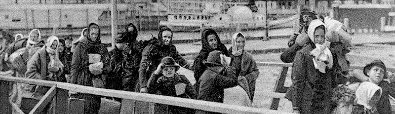

*Today's remarks from Iowa's unrepentant White Supremacist, [Rep. Steve King](http://thehill.com/homenews/house/323633-king-says-he-meant-tweet-endorsing-far-right-dutch-politician), just underscores the difference between the GOP's new proto-fascist vision for America -- and the one [engraved on the Statue of Liberty](https://www.nps.gov/stli/learn/historyculture/colossus.htm) that celebrates a nation of immigrants.*

---

American history is not just the stories of heroes, sinners, and survivors -- or tales of presidents, generals and inventors. It is a record of the struggles of immigrants for a place at the American table. It's also a personal story.

Almost twenty years ago I became fascinated by genealogy. My mother's family lived in the United States long before it became a nation. They can be traced back five or six centuries to little Welsh and English villages, and somebody somewhere has a book with all the dry details of begats and property transfers, including the *manumission* of slaves.

My father's family had no such privileged roots and were double -- maybe even triple -- immigrants. My father used to say that his g-g-g-g-grandfather was born on the sea. And, after ordering Canadian archival records, it turned out he was right. Johannes Mooß was born "auf dem Meer" (on the sea) in 1828, enroute from some German-speaking village to Nova Scotia:

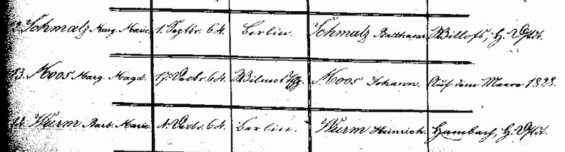

I say "German-speaking" because it wasn't until after the Napoleonic Wars that the Holy Roman Empire was finally dissolved. And it wasn't until 1815 that the German Confederation, mainly a trade and tax agreement, united German-speaking states. And it wasn't until 1866 when a Northern German Confederation, and then Otto von Bismarck, founded something akin to the modern state of Germany. But when Margarete Mooß arrived in Nova Scotia, the Europe she knew resembled this:

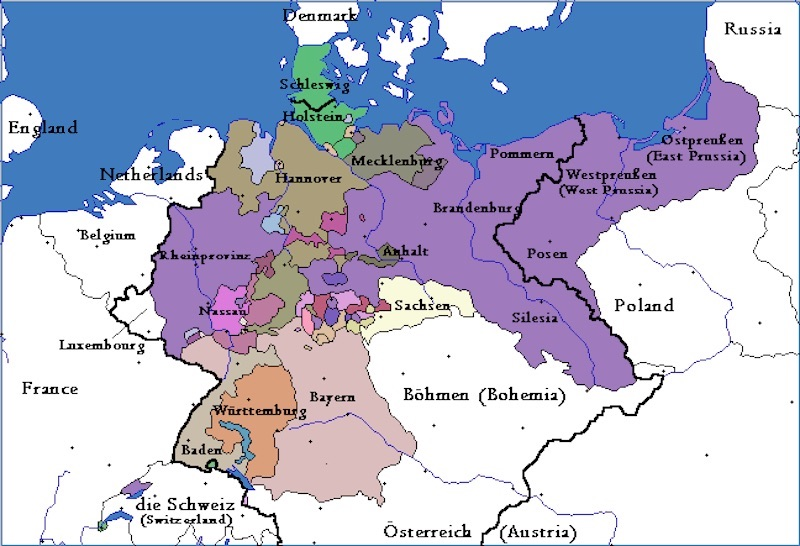

The land my ancestors arrived in was hardly modern Canada. The French had ceded territory to the English under the Treaty of Utrecht a century before, but "New France" maintained control in Upper Canada. It had been only 70 years since *Le Grand Dérangement*, or the *Arcadian genocide* -- the forcible expulsion of 14,000 Arcadians from what is now Canada's Maritime provinces, which killed 9,000 of them. Many people in New England and Louisiana know this history well because they are descendants of Acadian refugees.

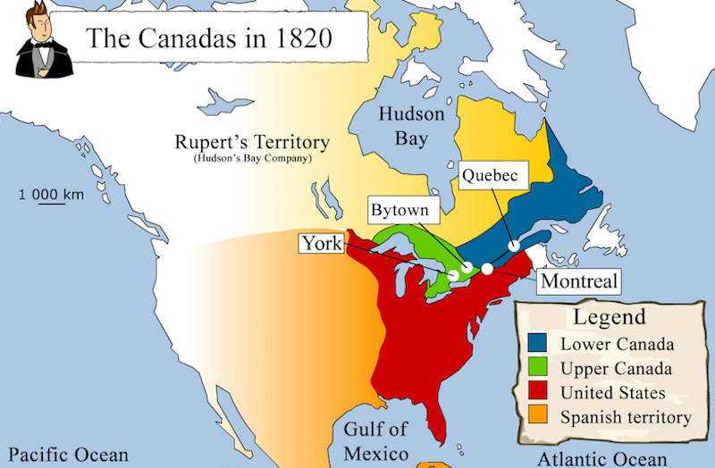

Likewise, the United States of 1828 was hardly recognizable as the nation it is today. Michigan, in which my grandfather, father, and I were born, was not yet a state. Mexico owned all of California, Texas, Arizona, and the Southwest. Years later, when the United States grabbed this territory from Mexico, Mexicans suddenly  became "Americans."

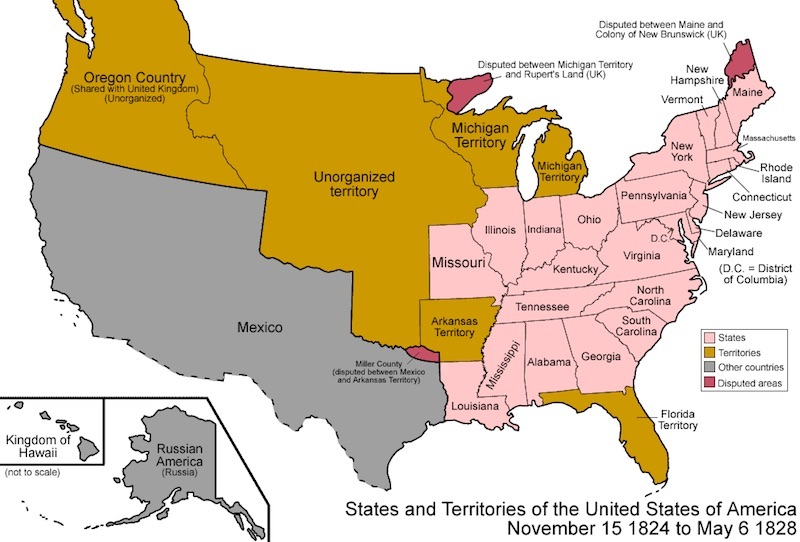

We haven't always had $40 billion walls separating us from other nations. On both my father's father's side and his mother's side there are multiple connections to Canada. The borders between both nations were once as porous as sand -- still are -- and some of my *Quebecois* ancestors -- the unwanted refuse of Alsace and Normandy -- even made a brief appearance in Attleboro, Massachusetts before ending up in Northern Michigan.

Sometime in the mid-1800's my father's family migrated to Upper Canada (now Ontario). And sometime during the beginning of the 20th Century my father's people emigrated once again -- or maybe they simply sneaked across the non-existent border -- and by pure luck all of us since then have been American citizens.

Fully bitten by the genealogy bug I made phone calls, sent out emails, and scoured genealogy boards. I gathered family trees from Midwestern German and French cousins, Francophone ancestors, people I'm related to in Maryland, Virginia, Michigan, Illinois, Kansas, Missouri, Ontario and British Columbia. Through marriage on my father's side it turns out I have Chinese and Indian cousins -- "India" Indian and Native American. My sister's daughters share her background and also that of their Puerto Rican father. Several of my cousins are part Polish. A young cousin married into a Mexican-American family. My own children share all the ancestry I've described, plus the Lithuanian and Ukrainian heritage of my wife.

Despite all the ugliness happening right now, our histories and families are literally fusing. This is the reality of America, and its beauty.

As I've worked on the family trees, I've unearthed Ellis Island records from my wife's grandfather and his brothers:

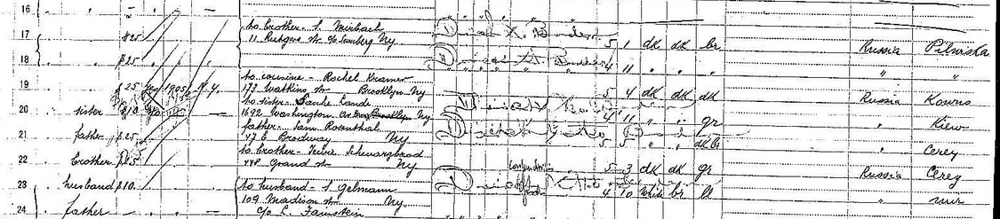

I found the *stedtl* in Lithuania the brothers came from, and a marker that identifies where all those who remained in that village, including a sister Perla, were slaughtered by *Einsatzgruppen* and xenophobic neighbors on September 11, 1941:

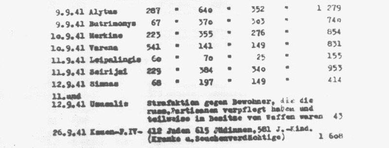

At the time the United States had immigration quotas for Jews, even though everyone knew what was happening in Europe. Today the lesson of protecting vulnerable people is one we have failed to learn.

I've never been able to determine where in Germany my father's people came from, and I've followed many false leads. Some of them have been fascinating. Who knew that Germans were invited to live in Bessarabia (Russia) by a czarina in the early 19th century? Or that a century later they were disinvited by another czar and instantly became refugees -- some fleeing to North Dakota. Who knew that other German refugees were brought to Nova Scotia to offset Catholic population?

As I've researched names on census rolls, cemetery lists, and ship manifests, I've discovered a lot about the fragile lives of immigrants of every era. Certainly some come for economic reasons. But unless you are hungry or have been made a refugee, who would choose to leave everything behind, pack a few belongings into a suitcase, and start all over again with almost nothing?

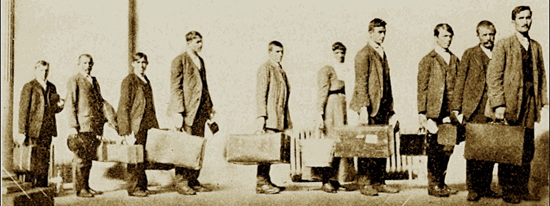

The ancestor born on the sea arrived in steerage and became an indentured servant as a boy. Pitted against citizens already established, and pitted against each other, immigrants work without savings, language, security, the support of nearby family -- or much of anything -- until they either become part of the fabric of a new nation. Or have to start all over again.

My own family story is nothing special. We all have a story like this. What is both amazing and shocking is that the nation's xenophobes and racists have as little notion of who they are as of American history.

\* \* \*

Modern day stories of today's immigrants are no different. Like refugees from Guatemala, Honduras, El Salvador and elsewhere, many have escaped death squads and military juntas:

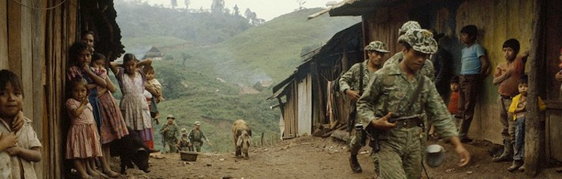

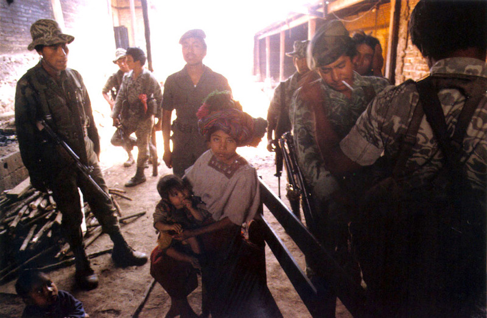

\* \* \*

Immigrants today are just as likely to be fleeing drug cartels and pan-national gangs as those arriving a century ago were fleeing from cossacks or the Czar. Or, like the Acadians, today's refugees may be escaping genocide:

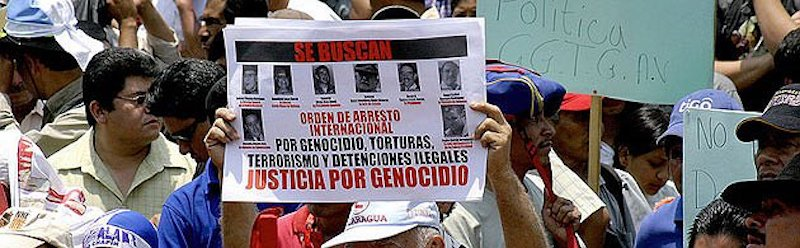

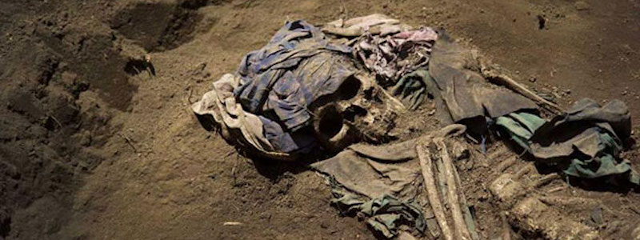

Whatever you choose to call them -- immigrants, refugees, seekers, dreamers, illegals -- they're not here to take American jobs. They're here to survive.

\* \* \*

For Trump and his collection of racists and xenophobes, Syrian refugees are not victims -- or people or families -- but simply a danger to be contained. The most ludicrous aspect of Trump's dehumanizing Muslim Ban is that it is *Europe* -- not the United States -- that has taken responsibility for the human tragedy that perpetual American Wars of Choice have caused.

Building a massive, shameful, wasteful wall and doubling or trebling the number of ICE agents may not be equivalent to another *Kristallnacht*, but from Trump and Bannon we hear strong echoes of the same fascist rhetoric.

Last October I [traveled to Berlin](http://lander.byethost11.com/berlin/) to find out how Germans were dealing with the huge number of refugees literally washing up on European shores, and I worked with a refugee aid group. For a month I handed out shoes, clothing, and supplies to people from all over the Middle East. Many were from Aleppo, a city racked by a civil war the United States has played a major role in. Many were from Afghanistan, Iraq, and other countries the U.S. has been waging wars against for two decades.

This is what the cowardly 45th President of the United States is afraid of -- people fleeing war zones with their children:

In Germany there is opposition to the large number of people transiting through the country, to be sure. But many Germans have been welcoming. As the sign below says: "we are all foreigners."

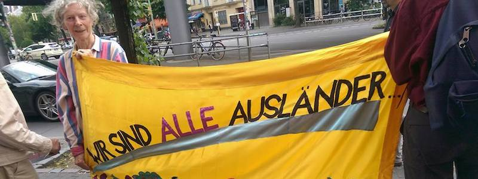

And if more Americans dug into their own family trees and stories, they would recognize just how much we have in common with those we should be welcoming.

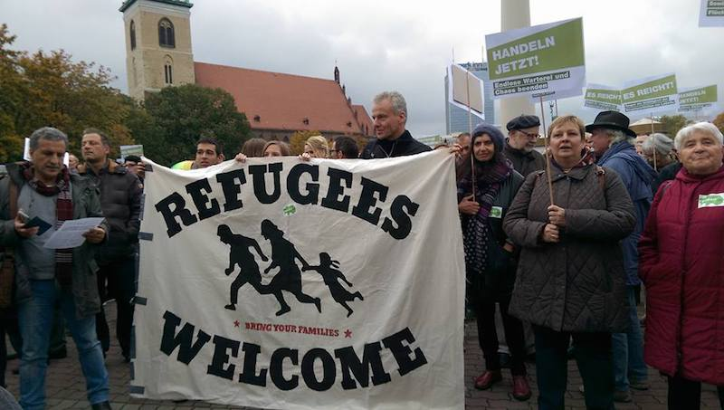