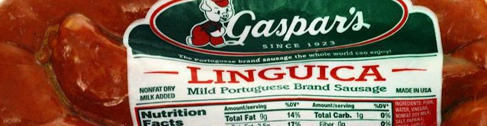

It is one of life's great joys to have adult children I can argue with. Smart people with the right and the obligation to keep the old man honest. The other night I was having a phone conversation with my son, who expressed his annoyance with not only right-wing flacks but with flaming liberals.

And I was included on his list.

I argued that we can't reach agreement with the Far Right because (1) they are highly averse to facts; and that (2) most of our disagreements can't be settled with a New England stone wall (you live your life, I'll live mine on my side of the wall) -- when the Far Right's idea of freedom *really* means the right to take civil rights away from a multicultural majority. And (3) -- I questioned whether, at the end of the day, any amount of polite chitchat would ever really change their commitment to taking my rights away.

My son disagreed and said -- well, you have to start somewhere. You *will* reach some of them. And anyway -- what's the alternative, dad?

This, of course, was the grown-up way of looking at the problem. And maybe my grown up son is right. Maybe we just start where luck and serendipity take us.

\* \* \*

Another of life's great joys is to have second chances to spend time with your grown children. We are in South Carolina for a few weeks avoiding the New England winter, and our daughter flew down to run in a race and to visit with friends.

Yesterday we were all sunning ourselves in Waterfront Park in Charleston when a man with an NRA cap and a "Lifetime NRA member" T-shirt stopped in front of our bench and asked, "Where y'all from?" Massachusetts, we answered. "Where 'bouts in Massachusetts?" he pressed us. I replied by asking if he knew where New Bedford is. "Hell, I was BORN in New Bedford. 115 Pleasant Street. But I haven't been back in 40 years."

We talked about the area. He remembered random local geography and history, including Joshua Slocum, and he couldn't remember the name of "that Portuguese sausage,"  Linguica, I said. "Linguica," he repeated with a happy grin. "Yeah, that's really good."

My new NRA friend stood in the sun a moment remembering New England, while I sat under one of South Carolina's famous palmetto trees enjoying the winter warmth. Then he stepped forward and offered his hand and gave me his name, and I did the same. And we shook hands like we meant it.

I have my doubts, but my son is probably right. We have to start somewhere. And maybe the only things we will ever have in common with those of wildly different political views are things like food and warmth.

But maybe a shared appreciation for what we all bring to each other is enough to make that start.

