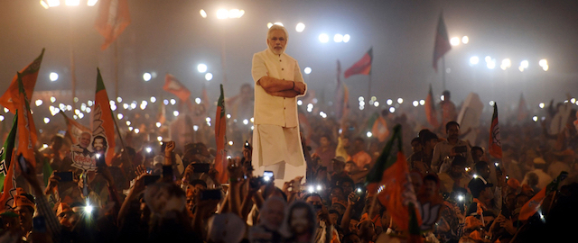
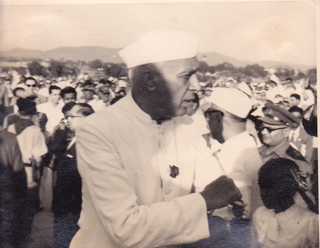
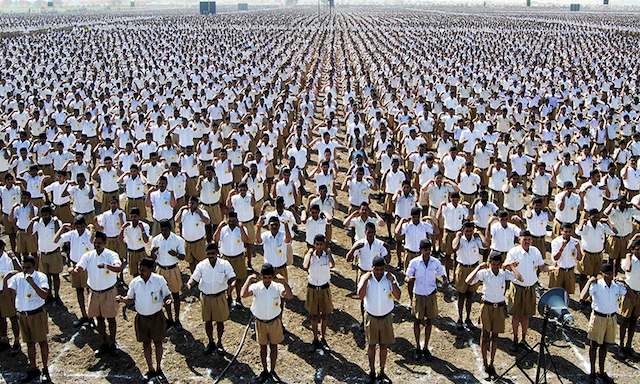

---

All politics is personal. It’s impossible to look away from the mirror of history you’ve been part of. And it’s impossible not to have emotions about places that have been significant parts of your life. Our complicated feelings for the United States go without saying. For migrants and visitors to other lands, the same is true. They become part of us.

I sometimes start to say that I "grew up in" — but correct myself because I *came into sentience* in India in the 1950’s, a boy only a couple of years younger than India itself. My sister and I began our formal education at the [Beldhi Church School](https://www.churchschoolbeldih.in/institution/archive) in Jamshedpur, in the state of Jharkhand (Bihar when we lived there). Every day we’d pass through school gates, past the poor and the sick, to a little sandstone building where we received instruction from Indian Baptist nuns. Today the sandstone building is still there — it’s an administration building — but the school is now a secondary school with an impressive campus.

Our family was in India for several years because my father, an engineer, had been conscripted into an army of international contractors to build, at the time, the largest steel mill in Asia for Tisco, the steel division of the Tata family. The company’s (and town’s) founder, Jamsetji Tata, had taken to heart Thomas Carlyle’s quip that “the nation which gains control of iron soon acquires the control of gold." Besides learning English and maths, we practiced writing our Sanskrit letters on lined paper. My classmates were all Americans, Brits, Germans, Russians, Icelanders, and Anglo-Indians. I grew up — rather, *came into sentience* — reading the wonderful *Times of India* comics section and devouring British children's books left over from the last days of colonial rule.

My parents were in their late twenties and early thirties — both from small-town America that even today cares very little about the rest of the world. The one thing this mismatched couple had in common was the love they both had for India. We often drove into the countryside where my father’s Leica and my mother’s Roloflex recorded thousands of scenes of a country coming into its own after centuries of colonialism. We paid tolls to cross one-laned roads blocked by elephants. We sat on our roof and watched Divali lights twinkling below stars arrayed differently from those in the northern hemisphere. 

My father’s hobby, if you can call it that, was to impersonate a Western journalist and crash Indian Congress Party events. In this way he met Jawaharlal Nehru, “covered" a reception for the Panchen Lama, and had a drink with Marshal Tito. My mother, enamored with India’s diversity, visited temples of every sort — Hindu, Buddhist, Jain — and snapped photos of Ashura parades. After requiring major surgery and a long convalescence, she bicycled from Shimla back to Jamshedpur on her own, recording people all along the route. When my son made a trip of his own to India a few years ago, we calculated that my mother's trip had been just short of a thousand miles.

These are all recollections from a child’s charmed memories of a lost world — or, more likely, a world that never really existed, a white boy’s simplistic view of a complicated country where class, caste, and colonialism played out just as they have here in the United States. And yet, for all the gauze and distortion of these memories, my connection to India includes the beginnings of an understanding of a larger world beyond my own. My continuing love for India is enmeshed in all this, and that affection is as real as the country’s complicated history.

Scarcely a generation had passed since Jawaharlal Nehru served as the country’s first Prime Minister when the same sort of religious nationalism that killed Mohandas (Mahatma) Gandhi in 1948 led to India's war with Pakistan in 1971. In 1975 Prime Minister Indira Gandhi (Nehru’s daughter) declared a two-year state of emergency which jailed political opponents, censored the press, and shut down opposition groups (future Prime Minister Narendra Modi wrote a book about it). It surprised no one when Gandhi was assassinated by her own bodyguard in 1984 after conducting a raid on the [Sikh] Golden Temple in Amritsar in the Punjab.

In 1998 India became a nuclear power. The Tatas, the Parsi family that brought *our* family to India, continued to amass vast wealth and political power, spinning off ventures in Information Technology, automobiles, chemicals, beverages, ceramics, fashion, pharmaceuticals, energy, and investment. At some point after 2000, Bengaluru overtook Silicon Valley as the world’s leading Information Technology hub. But the caste system, poverty, xenophobia, violence against women, illiteracy, and lack of sanitation still exist alongside India’s new malls, gated industrial parks, and dot-com millionaires. Income inequality has thrived in India’s neoliberal “democracy.” 

And neoliberalism breeds autocrats.

Prime Minister Narendra Modi came of age politically in the Seventies during Indira Gandhi's “emergencies." Modi got his political start in the [Rashtriya Swayamsevak Sangh](https://www.dawn.com/news/1212815) (RSS), originally an anti-colonial group predating India’s founding but now a right-wing nationalist paramilitary organization. It was a former member of the RSS who killed Mohandas (Mahatma) Gandhi in 1948 and it was RSS members who destroyed the 16th Century Babri Masjid in 1992. 

Like Sinn Fein’s relationship to the IRA, the Bharatiya Janata Party (BJP) is the political wing of a nationalist movement that includes a paramilitary wing, the RSS. As Prime Minister, Modi has filled many government posts with RSS members and has set about implementing RSS’s racist and nationalist prescriptions.

As a freshly-appointed Chief Minister of the state of Gujurat, Modi encouraged anti-Muslim riots in 2002 and promoted unvarnished Hindu nationalism — *Hindutva*. In 2014, when the BJP took control of India’s “lower” house, the Lok Sabha, for the first time, Modi became Prime Minister and he firmly entrenched *Hindutva* in his party’s policies.

On May 23rd, 2019, running even more overtly as a nationalist, using his old Twitter handle *Chowkidar* — [watchman](https://www.nytimes.com/2019/05/23/world/asia/narendra-modi-election-win.html) —  Modi was re-elected for another five-year term amid widespread voter disenfranchisement of Muslim and Dalit (Untouchable) voters. Still, India has 900 million eligible voters and 67% turned out to give Modi 543 seats in the Lok Sabha (Congress), where only 272 seats are necessary for a majority.

During the last election BJP president Amit Shah promised to rid the country of “infiltrators” — meaning *Muslims* by specifically exempting every other group from this threat. Like the American Republican Party, the BJP has become safe haven for violent extremism. One BJP candidate, Pragya Thakur, stands accused of planning the bombing of a mosque in 2008.

In 2017, after Rahul Gandhi filed his candidacy papers for the 2019 elections, Modi took a swipe at Gandhi’s “anointment” by dubbing him “Aurangzeb Raj,” a Mughal king appointed by his father. Like Donald Trump’s digs at Hillary Clinton’s virtual coronation, there was a certain truth to the jibe. 

Rahul Gandhi, who is also the current head of the Indian National Congress, is the son of Congress Party leader Sonia Gandhi and former Prime Minister Rajiv Gandhi; grandson of Prime Minister Indira Gandhi; great-grandson of Jawaharlal Nehru, India’s first Prime Minister; and great-great grandson of Motilal Nehru, the founder of the Indian National Congress. Mirroring Trump's “birther” tactics, The BJP circulated the rumor that Rahul Gandhi was actually an Italian citizen. But there is no question that, throughout India’s entire history, the Congress Party has been the family business (or visa versa).

India is sometimes described as the “largest democracy in the world.” Yet [Congress Party](https://www.washingtonpost.com/opinions/2019/05/23/this-is-modis-india-now/) hegemony and corruption, and now the country's extreme turn to the right, blatant Islamophobia, and violence against non-Hindu minorities all raise the question of what sort of democracy India really is. Accompanying Modi's far-right turn is the move to turn India into an Orwellian [surveillance state](https://www.buzzfeednews.com/article/pranavdixit/one-id-to-rule-them-all-controversy-plagues-indias-aadhaar). Each of India's billion citizens is now required to participate in a system that allows the government to track them by National ID.

I still remember India eight years after its Independence. Of course, those memories are colored by nostalgia and the ignorance of the child who preserved them. But what many Indians remember of that brief moment in history was an optimistic nation trying to turn centuries of colonialism into a democracy [for all](https://foreignpolicy.com/2019/05/23/modis-coming-back-to-power-but-hell-take-over-a-different-india-narendra-modi-bjp/) of its many people. 

But those days are long gone. It’s Modi’s India now.

