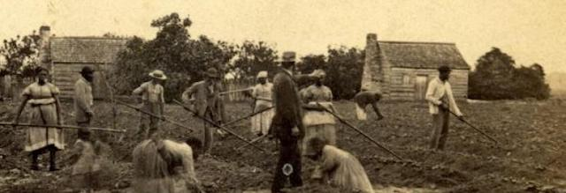
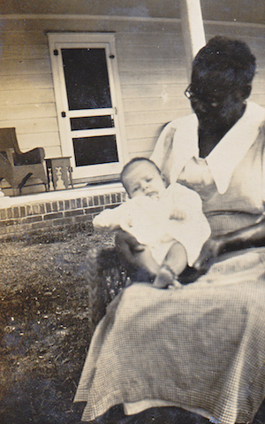
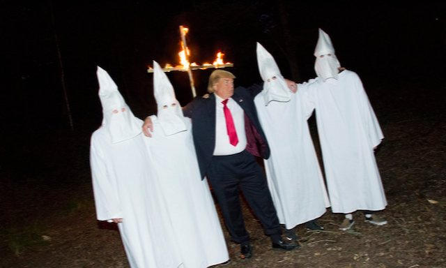
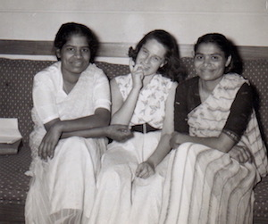

---

American history is not simply the tales of presidents, generals and explorers — or of the many wars to which the U.S. has sent its children. History is not some abstract account of other people. Our own families and communities have created traces that demand to be viewed in the mirror of history. American history, then — *our* history — is both a personal story and a personal reckoning.

Almost twenty years ago I became interested in genealogy. My mother's ancestors lived in the United States long before it became a republic. They can be traced back five or six centuries to little Welsh and English villages, and somebody somewhere has a book with all the dry details of begats, property transfers, and manumissions of slaves. Slave ownership among white families, even by Northerners, is a dirty little secret [some](https://www.washingtonpost.com/news/morning-mix/wp/2015/06/25/after-omitting-details-of-ben-afflecks-slave-owning-ancestor-finding-your-roots-is-suspended-by-pbs/) would rather forget.

In among all the yellowing photo albums is a picture of my mother as a two month old, cradled in the arms of an old black woman. Below the photo, in my mother's scrawl: *Louisa was born a slave*.

Of course, this was 1930, it was the South, and much has changed since then.

But, as Charlottesville reminded us not that long ago, a lot has *not* changed. Slavery may be gone, but it ended recently enough that we still find reminders in our family albums. For Louisa, the Jim Crow South kept her living in poverty, taking care of someone else's children, her sons farming for someone else, and it placed incalculable obstacles before her grandchildren. For all the recent talk of flags and monuments and legacy, it is not so much Confederate (or Union) symbols but racist institutions that represent our true heritage. And like our family albums, these institutions persist to this day.

Many view white supremacy as dead and cold as Confederate statues. Yet the white supremacy on which slavery was based is hot and pulsing, alive and malign. White supremacy is such a major part of the national DNA that it has shaped our justice and economic systems, healthcare, immigration, foreign policy, policing, the prison system — every aspect of American life, North and South. It is the source of America's great wealth, our expeditionary militarism, and a daily contributor to income inequality. White supremacy lies behind the doctrines of Manifest Destiny and American Exceptionalism. White supremacy has justified most of our wars of choice, not just the Civil War. And just like actual DNA, white supremacy seems to be transmitted across generations like a deadly gene.

My mother once told me an unflattering story about her own mother. It was 1940 and Franklin Delano Roosevelt had been president for eight years. Like Obama, Roosevelt was despised throughout the South and was accused of being a race traitor and a Communist. For all the epithets hurled at FDR by my grandmother and those like her, the New Deal had improved the lives of poor people of every race and America was changing — and for the better. On one particular day in April that year, a black census lady came to my grandmother's front door. My grandmother told her crisply to go to the back. The census worker replied, "I can do it here, or not at all."

She didn't know it at the time, but my grandmother's world had already changed — into something she would never accept. A genteel Sunday school teacher with Southern breeding, my grandmother would have despised today's racists as so much "white trash" for mixing Southern "heritage" with the Nazism America was then fighting. But on matters of race my grandmother held exactly the same views as today's white supremacists.

Tea Party Republicans now own the party and the presidency — and they warn us the gloves are off and the bare knuckles out. But so too are the white satin sheets and coarse brown shirts out of the closet. We now know exactly what these men and women are — and we shouldn't hesitate to use the proper terms: *fascists and white supremacists*. A frighteningly large segment of white America no longer feels any shame about public expressions of their hate. Racism without consequence has become re-enshrined in law and Jim Crow is making a comeback. Worse, "mere" racism seems to be making the transition to fascism.

Adolf Hitler may never have been a member of the Confederacy but today's white supremacists just as easily *sieg Heil* to a Nazi *Hakenkreuz* as they salute a Confederate flag or monument. Today it's almost impossible to distinguish racism from fascism because, in the end, what's the difference when dehumanization, deportation, ethnic cleansing and murder are shared objectives?

But the silver lining — if there is one — is that Charlottesville released a flood of essays, meditations and documentaries on our Original Sin, on the magnitude of *our* problem with white supremacy — and I must agree with [Jamelle Bouie](http://www.slate.com/articles/news_and_politics/politics/2017/08/white_americans_can_end_the_fight_over_confederate_monuments.html) and others who identify it as a *white* problem.

Among the best pieces I read immediately after Charlottesville, in no particular order:

- [When Heritage Equals Hate: ACLU on Confederate monuments](https://www.youtube.com/watch?v=QOPGpE-sXh0)
- [Stone Mountain: the disgrace that hate built](http://www.georgiaencyclopedia.org/articles/geography-environment/stone-mountain)
- [Where are all the monuments to Black lynching? Bill Moyers](http://billmoyers.com/story/4000-black-people-lynched-south-monuments/)
- [America was never White](http://historynewsnetwork.org/article/166734)
- [When Nazis filled Madison Square Garden](http://www.politico.com/magazine/story/2017/08/23/nazi-german-american-bund-rally-madison-square-garden-215522)
- [Hate Rising: Jorge Ramos](https://fusion.net/video/364883/hate-rising-racism-in-america/)
- [CNN Interview with Jared Taylor](https://www.youtube.com/watch?v=Ol6GA4dMZw4)
- [Charlottesville - Race and Terror: VICE News](https://www.youtube.com/watch?v=RIrcB1sAN8I)
- [White Americans have to make a Choice: Jamelle Bouie](http://www.slate.com/articles/news_and_politics/politics/2017/08/white_americans_can_end_the_fight_over_confederate_monuments.html)

If all this is overwhelming and heartbreaking, it should be. We should be overwhelmed with shame and remorse and anger. We should be crying and we should be screaming. We can never fix what's wrong with this country without acknowledging the deepest foundational injustice that almost every other injustice is based on.

And we can never change society without [changing ourselves](https://confrontingrace.wordpress.com/). It is not enough for Liberals to champion civil rights at home and deny them to others abroad. It is not enough for Liberals to ask for a minimum wage and family leave domestically, while ensuring that workers overseas work in horrific sweat shops to build iPhones and sew designer jeans. Besides white supremacy, liberal white America must firmly reject colonialism and militarism. Justice must be universal, equality must know no borders. No deity confers special blessings on the United States. We are simply one nation among two hundred and some others.

The baby in the picture was born into a narrow, racist world. Things she'd say would provoke tears and winces. Until the day she died it was obvious where she had grown up, and in what kind of world. But like all of us my mother was a work in progress and she ended up a kinder and more compassionate person than the generations that preceded her. 

I must believe we all are works in progress — and so is the country each of us loves and hates with alternating passion and despondency. But if we really mean to repair it in earnest — it means not fearing to look squarely into that mirror of history.

