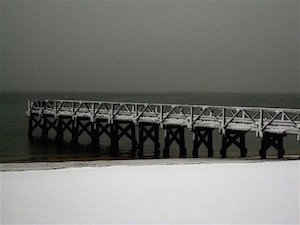
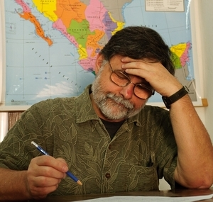
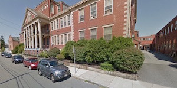
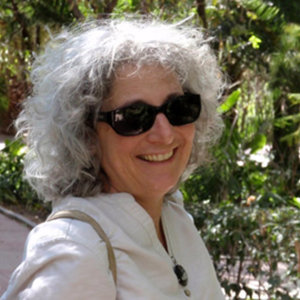
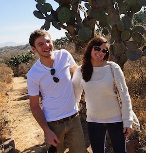
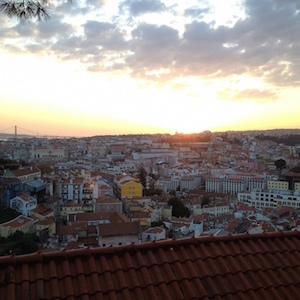
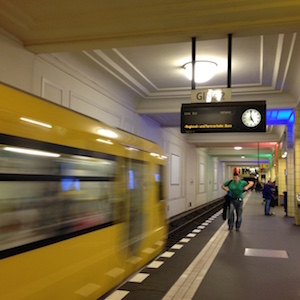

---

Dear Friends and Family,

I dropped out of Facebook a couple of years ago and do miss keeping up with people. But I'm not sure either Mr. Zuckerberg or the NSA have my best interests in mind, so I prefer to go low-tech or retro. No, I'm not talking about hand-written letters. Just ole-fashioned email.

For the last few years we have spent our winters in warm places like Mexico and New Mexico. This year we decided to stay close to home and see if global warming might work in our favor. So far, so good, but we'll know around February just how good an idea it really was. But winter here is beautiful...

One thing about sticking around for the winter is that it provides continuity and opportunities to commit to things year-round. Since leaving the computer world, I've gotten rid of almost all my computer books (anybody want the rest?) and have been trying (mostly unsuccessfully) to write. Letters to the editor flow easily from responses to the daily insanity all around us. Plays and fiction, however, are much more difficult. 

Telling stories people want to watch, or read, requires a lot of skill, patience, practice, and observation of humans as they go about their business. Needless to say, a career in computers did not completely prepare me for this. Still, I do have things to say and -- as a Boston writer who began in his seventies told me recently -- after you retire there's really only one deadline.

Besides writing, I have been volunteering. Last year I took a training class to learn how to teach English as a Second Language and I'm now putting it to good use at New Bedford's Adult Learning Center -- part of the city schools for adults returning to earn high school equivalency degrees and for immigrants to learn English. I really like it a lot. It has all the perks of teaching -- watching people light up when they finally understand something -- and none of the downside -- classroom management or detailed lesson planning. 

On Mondays I work with two separate groups of 4-6 students on some aspect of high school equivalency -- English or Math, generally. I work from existing lesson plans and just add my 2c worth. Tuesdays and Wednesdays I work with students whose native languages are Vietnamese, Chinese, Haitian Creole, Portuguese and Spanish. I get a kick out of speaking Spanish (mine isn't too awful), Portuguese (which is pretty atrocious), and resurrecting my French. 

In addition to all the other things she does, Deborah continues to do great photography. You can see what she's up to at [http://debehrens.com/](http://debehrens.com/). Since she does not share my tin-foil hat, semi-Luddite sentiments, she is on Facebook and I presume everyone is already up-to-date on what she had for breakfast this morning. 

Amelia just graduated from Bentley University with an MBA and a master's in marketing analytics and starts a new job in September after doing some travel and improving her Spanish. The plan is to move to Philadelphia and commute to work in Wilmington, Delaware. She and Deborah had a chance to travel to Iceland together last Fall and we have some great pictures of the both of them looking like serious outdoorswomen with their ice picks, standing on glaciers that will not be around in 50 years. You can download a [PDF](IcelandRoadTrip.pdf) version of the book that Deborah did after the trip.

Ben graduated with a degree in economics from the University of Puget Sound and worked for a couple of tech companies in Utah before concluding that office life is not for him. He did some traveling and thinking about the future over the summer -- to India and then Portugal, where I met him after he had been there for six weeks. He's currently looking for work that doesn't involve life in a cubicle.

Ben and I traveled for two weeks through Portugal and Spain together. How many dads get to do this with their grown sons? Portugal was beautiful and the people were really nice, but I can't speak Portuguese very well. It was obvious I was a tourist and I didn't really get a sense of confidence back until we had arrived in Spain, where I can handle the language. I had forgotten to get an international driver's license, so Ben did all the driving for a week -- which was just as well because the rotaries in Spain are even more terrifying than the ones in Boston.

We used AirBnb instead of hotels, which turned out to be really great and inexpensive. The people we met were really nice, and we ended up staying in Cartagena with a couple who owned a gallery in town. I would go back to Cartagena in a heartbeat, and I really liked Valencia too, although it is a very busy city. But at 2:00pm it's as if the lights have gone out. Boom! Siesta. Things don't resume until 4:45. In a cascade of clock time, dinner is then later and people then stay up till the wee hours, even taking their kids to toddler-friendly bars (if you can imagine such a thing). Barcelona was interesting, busy, and filled with things to see and do too, but it seemed to be more weary and sad than Valencia.

We got to the Barcelona airport early one morning and both departed within 15 minutes of each other. Ben went back to the States via Stockholm, and I went on to Berlin -- a city that's been on my "bucket list" for some time. I don't have much talent for videos, epublications, or photos, but I managed to put together a [slide show with some highlights](http://vimeo.com/115863125) of my trip.

Going on to Germany by myself was a good thing. I had lived and worked in Germany in the 1970s and, though I keep up somewhat by reading, I have had very few opportunites to speak the language. I wanted to see some plays auf Deutsch and I did. One, Tape, was merely OK, even though the actress, Nina Hoss, was famous even outside Germany. But the other play, Verrücktes Blut, was outstanding. In it, a group of immigrant high-schoolers practically terrorizes their sweet little German teacher. A gun falls from someone's backpack, the teacher grabs it and holds the students hostage, and they are forced to act out Schiller's Die Räuber as both teacher and students learn something about multiculturalism. The play was stunning, excellent, and the acting was as well. The cast came out for maybe 10 curtain calls.

You can't go anywhere in Berlin without running into history -- whether it's Prussian, Nazi, East German, artistic, literary, scientific or Jewish. The Jewish museum is built at odd angles and the whole effect is disorienting. There is one exhibit in which you trudge through a roomful of metal disks making a terrific clanging, hammering sound. If you look down you notice each disk was cut by torch into the face of a person. As you look out before you, there is a veritable sea of humanity being walked upon. Most of the exhibits, though, inform younger Germans how the Holocaust happened and remind them of the huge loss of a part of their society.

I had many great conversations with my AirBnb host who gave me a tour of Kreuzberg (sort of the Berkeley or Cambridge of Berlin). And as you walk around the city, you hear every language spoken. It is an incredibly cosmopolitan city, and Berliners are proud that it is -- once again. As always, people are people. I was in a rush to catch a bus to an Eastern district where an old Soviet park had been built. I arrived at the bus stop where the driver was having a smoke. I asked him if this was where one catches the so-and-so bus. *Was? Kein Guten Tag?* What? No Howdy Do? he asked. Having appropriately busted my chops, I apologized for my brusqueness and then -- I was 20 minutes early -- we had a long conversation about life in East Germany, where he had lived before the wall came down. When it was time to get going he told me to sit behind him and he'd tell me exactly where to get out of the bus to find the Soviet memorial. Otherwise you'll miss it. You can't go anywhere in Berlin without running into history.

And so I'm here for the winter, I think of it as being in experimental mode. But I'm surrounded by family and friends, and have interesting and meaningful things to do. That's almost the definition of blessed.

I hope 2015 brings you the same blessings, health and Peace and Goodwill -- though experience says hoping for these last two is a bit unreasonable.

Well, the hell with it. Here's to a Happy and Healthy 2015 -- and unreasonable expectations!

With warm regards,

David

