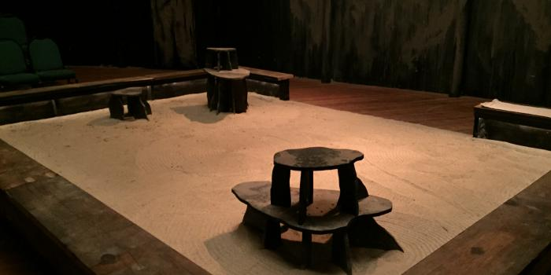

---
 

I have about 30 unfinished plays. As I learn more about plays that "work" I have concluded that most of these moldering first attempts are probably not worth salvaging, although a few could work with major rewrites. But I've also realized that maybe I should just say *kaddish* for my characters and start from scratch.

Together with the many *plays* I've read are books on structure, plot, character, and dramaturgy. Of the ambitious *compendia*, Richard Toscan's *Playwriting Seminars 2.0* is very good. And Louis E. Catron's *Elements of Playwriting* was also very helpful. Lenora Inez Brown's *The Art of Active Dramaturgy* talks about how a dramaturg works with a playwright and a theatre company to tune a play for production. In my *head* I know a lot about what makes a good play, yet for all the books and writing workshops, I’ve never really known *how* (or been confident enough) to tackle the complex *process* of *completing* a play. Now that the light is dawning somewhat, it’s clear that if you know even *something* about process, you will write much more confidently.

Recently I have been listening to playwriting podcasts. The most helpful (to me) of these is by a young Australian playwright, Emily Sheehan. Her *Playwright's Process* podcast is just that: full of wisdom and ideas for tackling *process* step by step. Another podcast I found helpful is Jonah Knight's *Theatrically Speaking*, which focuses on writing plays that can *actually be produced* as well as suggestions for submitting plays. There are numerous podcasts from the British National Theatre which are excellent. Another, *Not True, but Useful,* is a British podcast that highlights the work of a couple of roving theatre producers and designers. Add to these: *Hey, Playwright; Women Playwrights Podcast; Playwright's Spotlight; Necessary Exposure; Not in Print; Pint Size Playwriting; Playwright to Playwright; Playwright's Horizon; Playwriting Real-Life; The Cultivated Playwright; The Subtext; Women and Playwriting;* and many more than I have time to listen to.

If you are in the same boat (dinghy, inflatable raft) as I am, hopefully some of these mentions are useful. The world may need major repair. But it has always relied on good theatre to remind us of our humanity.

