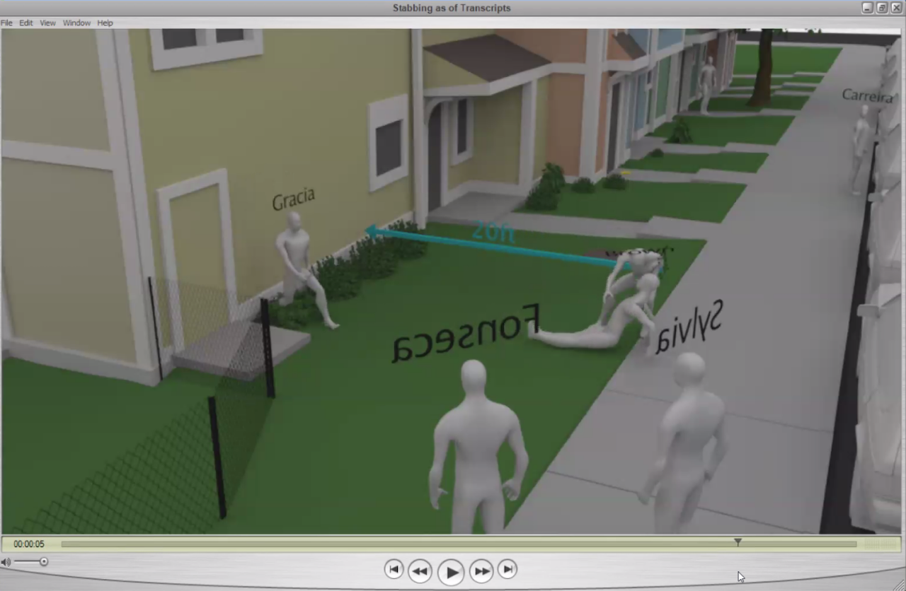
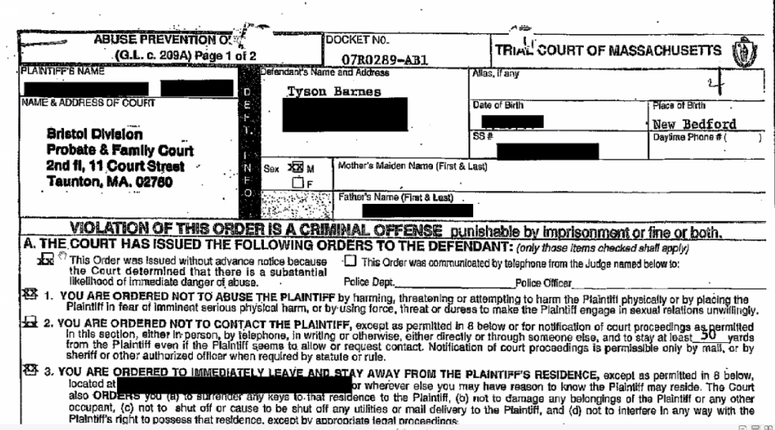
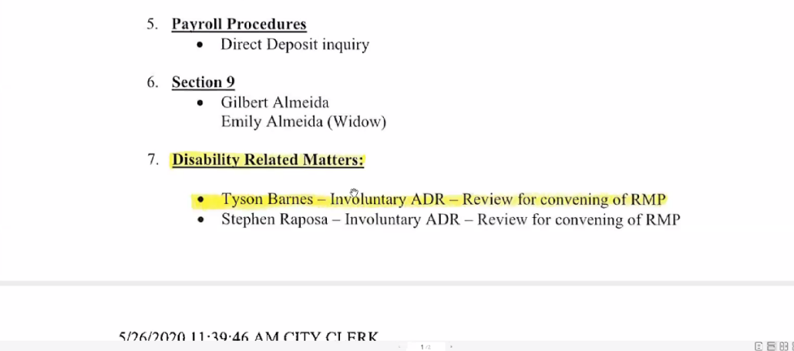

---

#### Introduction

On May 17, 2012 15 year-old Malcolm Gracia was shot by New Bedford police. The circumstances of the killing are something that today would receive a more thorough investigation than the Gracia family got in 2012. Following a $500K settlement for the unconstitutional stop that triggered Gracia's murder, various reports which exculpated the City and New Bedford Police, an effort to conceal information from the public, and finally a gag order to muzzle the family attorney, many people thought the Gracia story had gone away.

But Don Brisson, the family's lawyer, just can't let it go. In a Zoom meeting on September 20th, Brisson said there are a number of things that continue to haunt him about the Gracia case. Foremost is the fact that police didn't have to illegally stop, and then assault, Gracia. If they thought he was a gang member, they could have gone back to their offices and checked their photo registry.

Despite Brisson's ambling pace and a four-hour marathon Zoom meeting, it was impossible to leave the online meeting. Brisson raises some very disturbing questions. His walk through the evidence reveals an unnecessary killing, an improbable tale concocted and clearly coordinated by officers on the scene, revealing contradictions between police and a civilian witness, overly friendly questioning by the state police, a DA whitewash, with much information about the case sealed by a gag order to this day. 

Brisson raises questions that still deserve an answer.

Named as defendants in the Gracia family's civil suit were police officers Tyson Barnes, David Brown, Paul Fonseca, Brian Safioleas and Trevor Sylvia, along with the city of New  Bedford and the estate of David Provencher, who was the police chief at  the time.

The heart of Brisson's marathon 4 hour presentation was a review of witness reports of the altercation between Tyson Barnes and Malcolm Gracia, an examination of DA Sutter's report, and a summary of Barnes' medical records. 

#### DA Sam Sutter

Sam Sutter was the Bristol County District Attorny at the time. Brisson notes that Sutter's report is full of omissions and failed to ask criticial questions. For example, it does not mention Detective David Brown's initial assault on Malcolm Gracia.

Sutter's report also claims Gracia grasped Barnes' back, removed his knife from a sheath, thrust the knife twice into Barnes' abdomen and made repeated attempts to stab him after that. Then, carrying the sheath, Gracia runs at another officer. Brisson points out that Barnes, if he actually feared for this life, could have shot Gracia but did not. Although Sutter's report says that eyewitnesses corrorobate police accounts, this is not actually true.

#### Det. Tyson Barnes

Brisson reviewed testimony from various witnesses. Despite the fact that the interviews referenced diagrams and witnesses occasionally physically acted out events they were discussing, video interviews were apparently banned. What the public has going on a decade later is audio-only.

In Barnes' interview eight days after the shooting  he says his Taser was discharged while he was on the ground. According to Brisson, Barnes is lying because Gracia was Tased between the 3rd and 4th shots that killed him. Barnes says Gracia began running South and was no longer a threat. "I just knew he wasn't a threat anymore." But there was no mention of jamming Gracia against the building, which several other witnesses recalled.

The questioner, State Police Sergeant Dolan, never asks why Barnes doesn't shoot Gracia if he is in fact attacking other officers. Dolan also never asks Barnes about the extent of his injuries — an issue of considerable controversy. Sergeant Dolan asks Barnes about being stabbed in the "chest" (not in the abdomen). So which was it?

There are numerous pauses in the questioning, as if to provide officers to get their stories straight. After one such pause, upon requestioning, Barnes now says he was in a lot of pain, while previously he claims not to have felt anything. Suddenly Barnes hears "officer down, suspect down" A Detective Gangi is now applying pressure to his chest, Detective Fonseca is calling for an ambulance, and Trooper Mark Lavoie takes Barnes' belt and gun. EMS staff cut off Barnes' clothes as he is transported to the hospital, supposedly with a "sucking chest wound." Barnes says he gets his gun back several days later.

#### Det. David Brown

Dolan interviews Detective David Brown twelve days after the shooting, again audio-only. Brown contradicts Barnes' testimony about seeing the unholstering of the knife. Brown says Barnes immediately grabs him and drives him into the building. Then Gracia "controls" Barnes and stabs him twice. Now Brown says Barnes is in shock, white as a ghost, suprised at events.

Brisson asks how it is possible that a steroid-infused 200 pound 5'11" detective with two hands could be controlled by a 5'8" 150 pound kid with one hand on his shoulder. And why doesn't Brown either Tase or shoot Gracia, given that he has just purportedly stabbed Barnes? And why would Barnes be surprised, given that he had just assaulted a kid?

Brisson again questions the pauses in the interrogations, the hints, the guided testimony, the lack of video, the "clarifications" and the leading questions. Brisson finds it totally biased. No tough questions are asked.

#### Det. Trevor Sylvia

Before encountering Barnes, Detective Sylvia recounts Gracia running, Barnes is running to intercept Gracia, then Gracia turns around, fumbling in his waistband. Sylvia does not pull his own weapon and warn Gracia. Dolan asks Sylvia if anyone has issued verbal commands, and Sylvia says "no." Barnes catches up with Gracia and tackles him from the side and pushes him into the house. Then Sylvia says he hears someone say "he's got a knife" — which contradicts both Brown and Barnes. Also, Sylvia reports Gracia switching to his non-dominant hand when attacking Barnes.

#### Det. Paul Fonseca

Paul Fonseca is the officer who shoots Gracia through the head. He claims not tp know if Barnes has grabbed Gracia or not (despite the running tackle Sylvia describes). Fonseca claims Barnes pushes him with his shoulders into the building as Gracia tries to control him. Brisson asks why the Asst. DA, DA Sutter, Sergeant Dolan, and others fail to ask if Gracia may have felt threatened. Fonseca says Gracia says is grabbing Barnes by the back of the head. Brisson asks how this is possible, given the difference in height and physical stature between Barnes and Gracia, and why the location (head/shoulders) is not consistent.

#### Postmortem Trial by Press

An EMS report mentions a "sucking chest wound" and WBZ and CBS report "serious life-threatening injuries."   The exaggeration of injuries and demonization of Gracia by Gracia's former teacher Nick Baptiste are fodder for news articles. Sutter's report also exaggerates the threat Gracia posed and omits mention of the Taser. The press loves pictures of Gracia's knife, a scary-looking gut hook (fishing knife). The press also indulge in arm-chair psychology, imagining why a crazed teen killer was trying to go out in a blaze of glory, taking as many cops with him as possible. Such demonization, as we see in many police shootings, is either launched by the police or the press. Take your pick.

#### Medical records

Interrogrator Dolan asks Barnes' lawyer Gambaccini for a description of his injuries — no one apparently ever looked at RI Hospital records and it is now subject to gag order. The question of whose blood is on the knife was never answered as no one ever tested the knife. Under his T-shirt, Barnes was wearing a white muscle shirt. There was no blood on it. A photo of Barnes' torso shows a small 1cm superficial scratch. Barnes didn't need either stitches or trauma treatment. He got two percosets and ibuprofen. Barnes was cleared to go home without restriction. He arrived in the hospital at 9pm. He was cleared by doctors by 11:43pm. X-rays ruled out pneumothorax involvement. Barnes was observed overnight. No antibiotics were administered. He got a tetanus shot. Vital signs were normal. Barnes had been taking prednisone, percosets, and valium for a "back injury." He was discharged at 5:12am. Barnes' tox screen, which Brisson had to fight to obtain, revealed benzodiazepine and opiates. Valium lowers inhibitions, Brisson points out. Prescriptions written by Barnes' doctor were never delivered to Superior Court — in violation of a subpoena.

DA Sutter's report never mentions Barnes' tox screen — only the marijuana in Gracia's system.

#### Medical Record requests by Brisson

Despite police and EMS concern for Barnes' injuries — they considered medevac at one point — Brisson ask why EMS didn't stop at Charlton or St. Anne's if Barnes' injuries were truly life-threatening.

#### Animation

An animation depicts the improbable 20 foot distance that Barnes fell back, according to his follow detectives' accounts. The animation also raises questions about why no one tried to stop Gracia. There are also discrepancies in where shell casings were found.

#### Misc

After the killing Barnes goes out on disability for a non-injury.

#### Restraining Order

Brisson raises the issue of Barnes' mental health and behavior. 

It turns out that Barnes, in addition to having questionable drugs in his system at the time of the shooting, has a restraining order requiring his weapon to be confiscated.

The restraining order is not found in personnel file. Brisson asks why the NBPD didn't ask for Barnes' weapon. Brisson has to fight for discovery of injury, drug, and personnel records on Barnes, which it turns out strongly call his conduct in question. Brisson asks why Sutter didn't drag Barnes through the same mud as he did Gracia? 

Barnes apparently received explicit photos from another officer's wife or girlfriend at some point. He meets with the officer regarding this dispute at a city Burger King and threatens to shoot the other officer. Then Police Chief Provencher gives Barnes a one-day suspension — which Mayor Scott Lang simply voids.

#### Disability

Fast forward to 2020. Barnes is now applying for disability.

#### Next Week: Physical evidence

To watch the final Zoom presentation, contact MalcolmGraciaEvidence@gmail.com.

