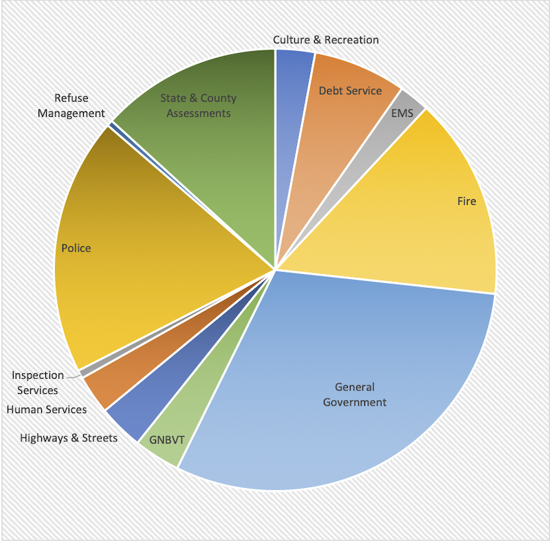

---

#### Part 1: Introduction to New Bedford's City Budget

In the wake of a national moment of reckoning with policing in America, while some communities are making deep cuts to their police budgets, others have begun to examine them. To my knowledge no one has yet started the process of studying the New Bedford Police budget, so I offer this introduction to the City Budget as nothing more than a starting point for anyone who wants to open an honest conversation about how the City spends taxpayer money.

Download and read through the 333-page [FY2021 New Bedford City budget](https://s3.amazonaws.com/newbedford-ma/wp-content/uploads/20201030152341/FY-2021-ADOPTED-BUDGET-DOCUMENT.pdf). You may also want to [download the spreadsheet I created](NBBudget2021.xlsx) from the budget numbers (I also talked with the City's CFO, Ari Sky, to obtain additional insight into the percentages of pension and healthcare money spent on various departments).

The 2021 New Bedford City budget is slightly over a third of a billion dollars — \$363,897,500. Of that amount, local taxes raise 8%, real estate and property taxes pull in 36.7%, and borrowing and grants account for another 2.77%. But the largest chunk of revenue — a whopping \$190,962,433, or more than 52% of the budget — comes in the form of state aid.

The \$190 million in revenue from the Commonwealth is very nearly the entire cost of running the New Bedford Schools. The remaining revenue, which New Bedford residents themselves contribute through assessments and property taxes, is \$167,247,075 and must be used to pay for everything else.

Of this portion paid by New Bedford taxpayers, 20% goes to the New Bedford Police, 15% to the Fire Department, 14% to state and county assessments, 7% to debt service, and the rest to running a variety of municipal services — highways and streets, inspections, human services, culture and recreation, refuse management, and many others. Naturally, the greatest expenses occur in departments which offer pensions and healthcare to large numbers of employees. My spreadsheet reflects departmental pensions and healthcare in Department budgets.

According to the FY2021 budget the City will employ 3,227 people — 2,162 school employees and an additional 1,065, including 302 police officers, 211 firemen, 88 Water Department employees, 70 City fleet mechanics, 64 Public Infrastructure workers, 42 EMS technicians, 34 Wastewater workers, 25 zoo employees, and 24 library workers. Many of these other services appear under "General Government" in the graph above. The [New Bedford labor force](https://www.infoplease.com/us/census/massachusetts/new-bedford/economic-statistics) numbers roughly 42,308. Of these, 38,482 are employed. This means the City of New Bedford is a major employer, providing work for approximately 8.3%, or one out of twelve people.

What is striking about the budget numbers is that, while two-thirds of all City jobs are in the New Bedford Schools, of the remaining jobs almost a third are police officers.

So read the budget yourself. Crunch the numbers yourself. Create a budget with your own priorities.

And ask yourself — should a hard-luck city that can't even pay a half of its own expenses be spending 20% of its taxpayer money on police — and reserving 30% of its non-teaching jobs for police?

Wouldn't New Bedford's many pressing needs be more appropriately met by employees whose toolkits aren't limited to a Glock and a Taser?

