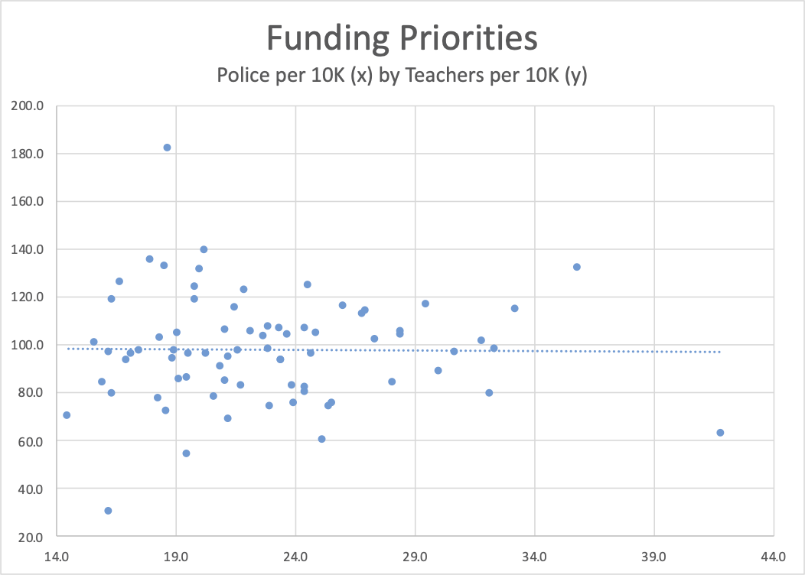
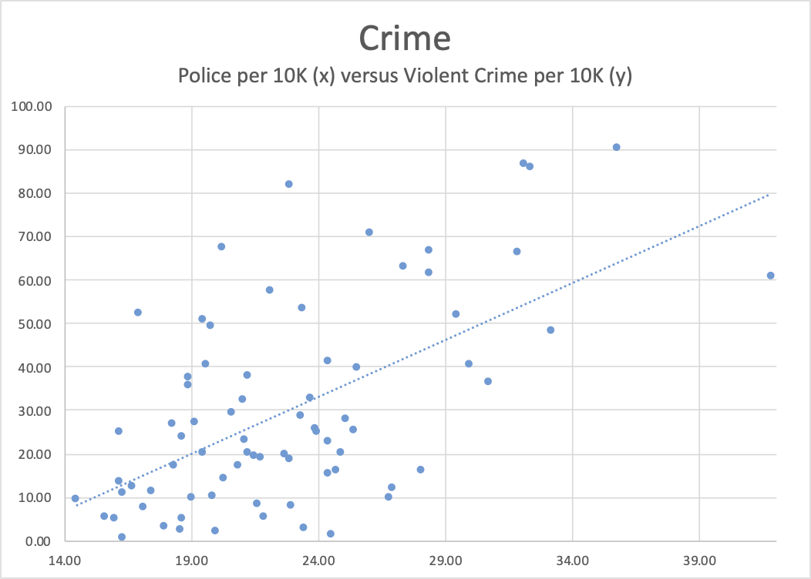
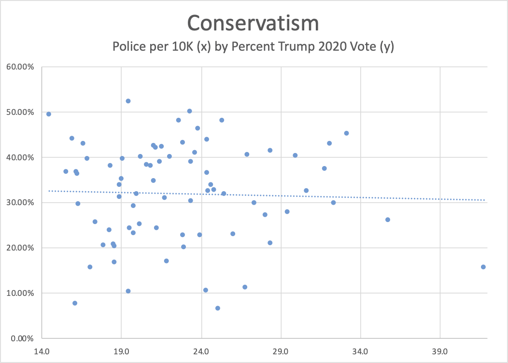
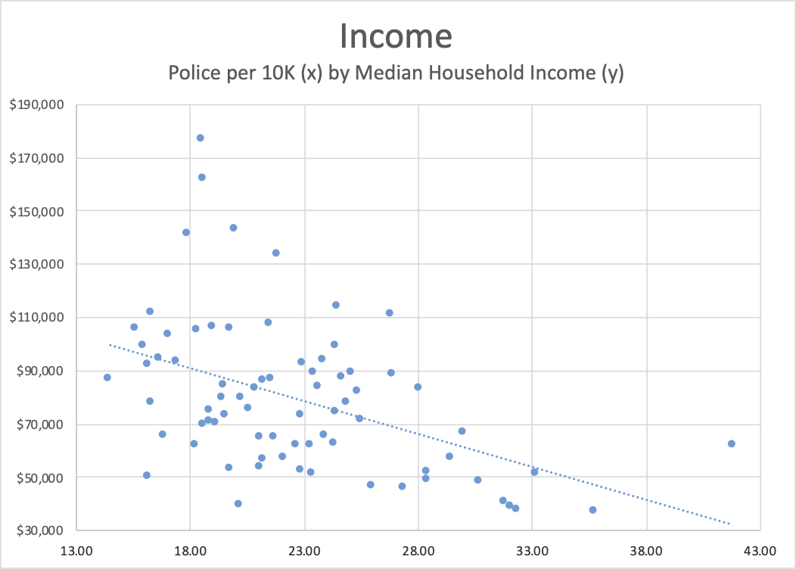
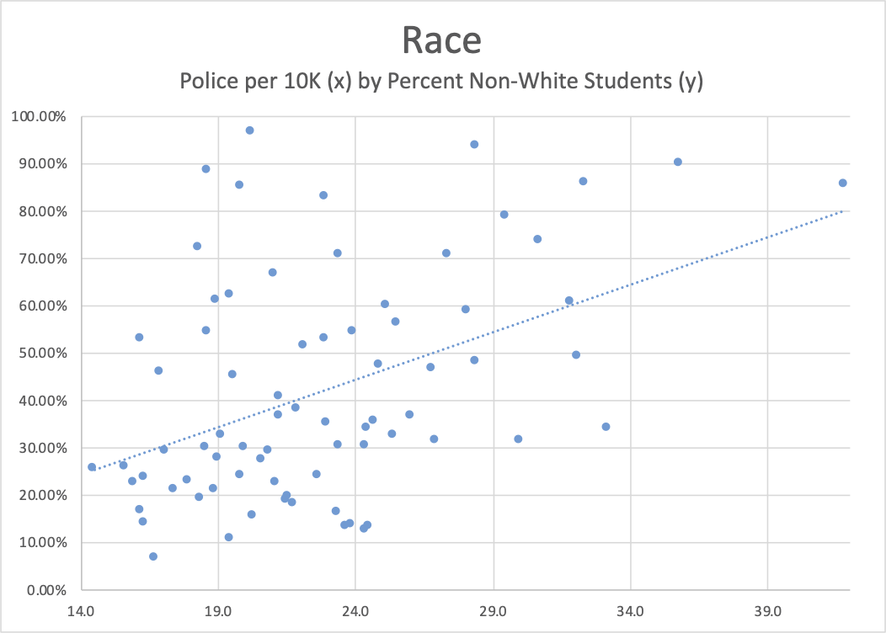

---

#### Part 3: Comparing your city's police spending to others

Part 1 of this series was a [quick overview](/Police Abuse/nbpd-budget-1/) of New Bedford’s 333-page [FY2021 city budget](https://s3.amazonaws.com/newbedford-ma/wp-content/uploads/20201030152341/FY-2021-ADOPTED-BUDGET-DOCUMENT.pdf) along with a [spreadsheet](NBBudget2021.xlsx) created from those numbers. Part 2 was a look at New Bedford's department funding and how it changed from last year’s numbers. In general, the New Bedford Police is being spared the brutal “defunding” that other departments will suffer — even as COVID-19 wipes out the city's cash reserves.

What should a community *really* be spending on policing? How much is enough? What do similar-sized communities to ours spend? Is there a relationship between spending on policing and crime? Education and police? Do grants and state subsidies permit municipalities to spend more on police? How are poverty and race related to policing?

There are 75 communities in Massachusetts with populations over 25,000 for which more extensive demographic, economic, racial, and policing data are available than the state's smaller towns. Since larger communities wrestle more with police issues we'll focus on this subset.

You can find some useful data here:

- [FBI Law Enforcement Staffing data](https://ucr.fbi.gov/crime-in-the-u.s/2019/crime-in-the-u.s.-2019/tables/table-78/table-78-state-cuts/massachusetts.xls)
- [FBI Violent and Property Crime data](https://ucr.fbi.gov/crime-in-the-u.s/2019/crime-in-the-u.s.-2019/tables/table-8/table-8-state-cuts/massachusetts.xls)
- [MA 12-Month Average Unemployment data](https://lmi.dua.eol.mass.gov/LMI/Data/Index/12MonthAvg.xlsx)
- [MA DESE data on the racial composition of students](https://profiles.doe.mass.edu/statereport/classsizebyraceethnicity.aspx)
- [MA DESE Full Time Teaching Staff data](https://profiles.doe.mass.edu/statereport/teacherdata.aspx)
- [MA Median Household income from the Census bureau](https://www.bostonglobe.com/metro/2018/12/11/full-list-massachusetts-median-household-incomes-town/eZpgJkpB1uF2FVmpM4O8XO/story.html)
- [MA Presidential Election results 2020](https://www.wbur.org/news/2020/11/03/2020-massachusetts-election-map)

From these downloaded numbers I constructed a second [spreadsheet](statistics.xls) and built multiple worksheets which look at policing rates (measured as officers per 10K population) compared to staffing of teachers, crime rates, median family income, degree of political conservatism, and race.

You can refer to the [spreadsheet](statistics.xls) for city-specific data, but the graphs depict only the general relationships between factors.

1. Increasing officers per 10K did not affect (raise or lower) teachers per 10K population. In Massachusetts many communities are free to spend a greater percentage of their budgets on police since they know the state will pick up the tab for education. New Bedford is one of these. Not every community spends similar proportions of their budget on police or teachers; and the data shows it.

2. Increases in police per 10K population correspond to increases in violent crime. Note that some communities with lower crime rates have the same proportion of officers per 10K as others with higher crime rates. There is great variation in what a community deems an appropriate level of policing for the crime it experiences.

3. The next graph surprised me. There seems to be no connection between the degree of a community's political conservatism and an increase in officers per 10K. I had suspected that the more conservative the community, the larger its police force would be. But in fact the trend line for officers per 10K decreases almost imperceptibly as Trump support rises. Go figure. Massachusetts.

4. Another result that matched prediction was that the higher a community's median family income, the lower the police per 10K. The trend line shows that upscale [and usually whiter] communities do not police themselves as intensively as poorer communities. 

5. Finally, race. I computed the percentage of non-white students in each community's public schools and plotted them against policing per 10K. As I had suspected, as the percentage of Black and brown children increases, police per 10K increases as well.

We have known for a long time that poverty is an incubator for crime, and that racism creates conditions that create and sustain generational poverty.

A simple-minded solution for dealing with crime is to militarize, surveil, and occupy neighborhoods with over-policing, and to fill jails and prisons with people who after entering the "system" will never work, vote, or have sustained connection to their children or communities again.

For many of our elected officials there is always some excuse for slashing social programs but there is always money in the budget for mass-incarceration and increasing police presence on our streets and in our schools.

So while we debate whether the New Bedford police budget ought to be $32 million or some other arbitrary number, or if armed police serve any useful purpose in our schools, we should not forget that lifting people out of poverty, not promoting a police state, is the only thing that reduces crime in the long run.

