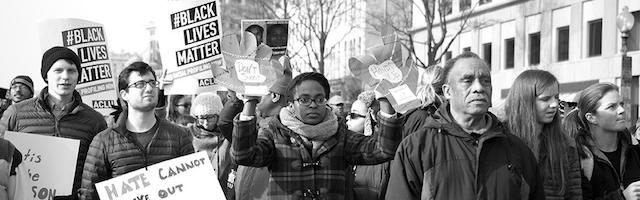

---

Math and language are both quite clear what "all" means. If some parts of a whole are missing, overlooked, undervalued, forgotten — or routinely shot by police — then it's nonsense to say that "all lives matter." The hundreds of black people — many unarmed — whose lives are ended by police each year is a testament to how little black lives really do seem to matter — and the severity of a national crisis that demands comprehensive police reform and accountability.

Tanisha Anderson, Sandra Bland, Rumain Brisbon, Michael Brown, Philando Castile, Stephon Clark, John Crawford, Ezell Ford, Eric Garner, Freddie Gray, Akai Gurley, Eric Harris, Laquan McDonald, Dante Parker, Tamir Rice, Walter Scott, Alton Sterling. And now, most recently: Saheed Vassell.

The names just keep adding up. In 2015 a [Guardian headline](https://www.theguardian.com/us-news/2015/dec/31/the-counted-police-killings-2015-young-black-men) reported the scope of this carnage: "Young black men killed by US police at highest rate in year of 1,134 deaths." The Guardian found that young black men are nine times more likely than any other American to be killed by police. Brittany Packnett, a member of Obama's White House task force on policing, called the killings an "[epidemic](https://www.theguardian.com/us-news/2015/dec/31/the-counted-police-killings-2015-young-black-men)."

Fast forward to 2017 and we now have a very different White House. When [fielding a question](https://www.politico.com/story/2018/03/28/white-house-african-american-shootings-489850) about the 2016 killing of Alton Sterling by two Baton Rouge policemen, Trump's spokeswoman called the killing a "local matter." When pressed on the president's responsibility to deal with an epidemic of police murders, Sarah Huckabee Sanders said the president's role was to keep Americans safe from immigrants, to "grow the economy" and to avoid divisive issues. Meanwhile, Trump's Justice Department, led by an unrepentant segregationist, wants to return to [failed](https://bostonreview.net/race/victor-ray-broken-windows-stop-frisk) "broken windows" policing.

But we can't blame everything on Trump and the Republican Party. For decades Americans have had better things to do than deal with police abuse.

In 1956 J. Edgar Hoover's FBI set up the [COINTELPRO program](http://www.law.harvard.edu/students/orgs/blj/vol18/soffiyah.pdf) which, among other victims, targeted black dissident groups. It was inconceivable to White America that African-American unrest could be a response to second-class citizenship. Instead, dissidence was seen as a product of "outside agitation" by Communists and COINTELPRO was intended to "disrupt" and "neutralize" the agitators. In 1969 the FBI and Chicago police took "neutralization" to extremes when they murdered two Black Panthers, Fred Hampton and Mark Clay, in their sleep during a pre-dawn raid. Besides African-American groups, the Justice Department and FBI also [launched attacks](http://www.law.harvard.edu/students/orgs/blj/vol18/soffiyah.pdf) on indigenous rights groups, the peace movement, and numerous organizations on the left.

In 1967 Lyndon Johnson commissioned the National Advisory Commission on Civil Disorders, otherwise known as the [Kerner Commission](https://www.washingtonpost.com/news/powerpost/wp/2018/03/02/kerner-commission-member-staffers-recall-controversial-report-at-its-50th-anniversary-blaming-racism-for-civil-disorders/?utm_term=.4f35c8764f5d). The 1968 Kerner Report chastised White America for its racism, though the word "racism" only appeared in a summary of the full report. Its dismal prediction was: "Our Nation is moving toward two societies, one black, one white — separate and unequal." The Kerner Report was attacked from both right and left and its recommendations were generally ignored.

Chapter 11 of the Kerner Report ("Police and the Community") looked at the toxic relationship between police and African-American communities and offered a number of [recommendations](http://www.eisenhowerfoundation.org/docs/kerner.pdf) including: reviewing police operations and eliminating "abrasive" practices; improving security in black communities; countering "dual standards" in law enforcement; establishing avenues for grievances and police accountability; adopting policy guidelines for community policing; developing community outreach programs; recruiting more African-American police officers and ensuring equal promotion; and funding "junior police officer" programs for young people in the community. It never happened.

In 1998 the [Heritage Foundation](https://www.heritage.org/poverty-and-inequality/report/the-kerner-commission-report) re-examined the Kerner Commission's recommendations and concluded it was hogwash concocted by a "Who's Who of liberal elites." The real problem, the foundation's white Conservatives decided, was that poverty, drugs, and crime were symptoms of liberal coddling: "The greatest barrier that the poor face is not racism; it is elitism." And, specifically, the second-class citizenship of Blacks was the result of their own *moral* failure: "The crisis we face as a country is fundamentally spiritual, and its answer lies in supporting the moral centers of influence that exist in our communities." 

Fifty years later White America still won't face reality. If [Rodney King](https://www.cbsnews.com/news/march-3rd-1991-rodney-king-lapd-beating-caught-on-video/) didn't show us that something was seriously wrong with the LAPD in 1991 — or if [Amadou Diallo](https://en.wikipedia.org/wiki/Shooting_of_Amadou_Diallo) didn't demonstrate how savage the NYPD's racism was in 1999 — or if revelations of the existence of racist [torture centers](https://www.nytimes.com/2016/10/31/opinion/chicagos-grim-era-of-police-torture.html) run by the Chicago police didn't shock us — then [Michael Brown's](https://www.nytimes.com/interactive/2014/08/13/us/ferguson-missouri-town-under-siege-after-police-shooting.html) murder in 2014 couldn't possibly faze us either. None of the shockingly routine murders of black and brown men and children we see on YouTube ever seem to prick our consciences or lead to meaningful police reform.

The United States is swimming in badges and guns. To whites the nation increasingly feels like a police state, though it has long been such to African-Americans. [New York City](https://citylimits.org/2015/04/14/the-nypd-has-more-cops-than-45-states/), with a population of 8.5 million, has 35,000 officers — down from 40,000 in 2000. The U.S. has between [200](https://www.statista.com/statistics/529925/police-personnel-rate-in-canada-and-us/) and [241](http://blog.skepticallibertarian.com/2016/07/24/how-many-police-are-there-in-the-united-states/) police officers for every 100,000 people. That's about three quarters of a million officers. Many these policemen are armed with unprecedented military and surveillance gear. SWAT teams regularly deliver simple warrants or conduct raids for small amounts of marijuana. We've seen armed personnel carriers and tanks in city streets. And when police show up at a demonstration nowadays, they're dressed and armed to kill.

Since 9-11 more than [2 million American](http://abcnews.go.com/Politics/us-veterans-numbers/story?id=14928136)s have been deployed to Iraq and Afghanistan. The Department of Justice runs a program called [COPS](https://cops.usdoj.gov/Default.asp?Item=2630) (Community Oriented Policing Services) which provides grants to communities to turn "vets to cops." In [2016](https://www.justice.gov/opa/pr/department-justice-awards-119-million-hire-community-policing-officers) the DOJ handed out $119 million to help pay for approximately 900 policemen. The International Association of Chiefs of Police ([IACP](http://www.discoverpolicing.org/find_your_career/?fa=military_veterans)) has created a recruitment guide for veterans, and veterans can use their GI Bill benefits while attending police academy. America increasingly says "thank you for your service" to its warriors by re-deploying them domestically.

But programs like these, and hiring practices that [favor](https://www.csmonitor.com/USA/2012/0625/Military-veterans-to-get-priority-for-police-jobs-under-COPS-grants) ex-military, have a serious downside. By prioritizing military experience over diversity, police departments put communities at risk. For example, the [San Jose Police Department](https://www.sjpd.org/joinsjpdblue/Veterans.html), a force with [serious racism](http://abc7news.com/society/report-sjpd-has-big-problem-being-racially-biased/649558/) problems, sees veterans as naturals for the police "because we have a paramilitary structure, [and] military veterans often times can easily integrate."

Then there is the residue of war. [Ellen Kirshman](https://www.psychologytoday.com/us/blog/cop-doc/201706/cops-and-ptsd-0), a psychologist who works with police officers, says that between 19% and 34% of all officers show some sign of PTSD: "This is pretty alarming. An officer with PTSD cannot think clearly. Is probably hyper vigilant, has a short fuse, may not be sleeping well because of nightmares, might be policing in a reckless manner…" And this is precisely what one frequently sees in videos of police encounters with black citizens.

One of the recommendations of the Kerner Report was what we might today call "community policing." But this is a vague phrase that often translates to "public relations." Citizen ride-alongs, walk-alongs, Police Athletic Leagues, toy drives, and pretty blue coffee mugs (like mine) are substitutes for real citizen oversight of hiring, management, and holding sworn peace officers to account.

But community policing has always been a vague [buzzword](https://www.policeone.com/community-policing/articles/168916006-What-does-community-policing-really-mean/) — from the 1968 Kerner Commission to the 1970 Knapp Commission. Vague or not, last year Senator Jeanne Shaheen sponsored unanimously-adopted resolution [S.288](https://www.govtrack.us/congress/bills/115/sres288) recognizing "National Community Policing Week." America may be a little hazy on what community policing actually entails — but we're crystal clear that it shouldn't involve oversight or accountability.

In 1991 Rep. William Edwards introduced [H.R.2972](https://www.govtrack.us/congress/bills/102/hr2972/summary), the Police Accountability Act of 1991. The bill made it "unlawful for any governmental authority to engage in a pattern or practice of conduct by law enforcement officers that deprives persons of their constitutional or statutory rights, privileges, or immunities." The bill had only 10 co-sponsors and never made it out of committee.

In 2000 John Conyers Jr. sponsored [H.R. 3927](https://www.govtrack.us/congress/bills/106/hr3927/text), the Law Enforcement Trust and Integrity Act of 2000, which sought to impose national standards on law enforcement as we currently do in education. It had only thirteen Democratic co-sponsors and never made it to a vote. In 2015 Conyers again filed [H.R.2875](https://www.congress.gov/bill/114th-congress/house-bill/2875/text), this time with 48 co-sponsors. But again it died.

In 2015 Rep. Henry Johnson Jr. sponsored H.R.1102, the Police Accountability Act of 2015, which had 15 co-sponsors and died. The bill amended "title 18, United States Code, to provide a penalty for assault or homicide committed by certain State or local law enforcement officers, and for other purposes." Again in 2017 Johnson filed [H.R.4331](https://www.govtrack.us/congress/bills/115/hr4331/details), with 8 lonely co-sponsors. Again, it died.

In 2017 Rep. Gwen Moore sponsored [H.R. 3060](https://www.govtrack.us/congress/bills/115/hr3060/details), Preventing Tragedies between Police and Communities Act of 2017, which required that police departments receiving federal funding train officers in de-escalation techniques. The bill had only 24 co-sponsors and died in committee — having also failed in 2016.

In 2017 Rep. Sheila Jackson Lee sponsored [H.R.47](https://www.govtrack.us/congress/bills/115/hr47): Kalief's Law, which sought to amend the Omnibus Crime Control and Safe Streets Act of 1968 to provide for the humane treatment of youths in police custody. The bill had only one co-sponsor and there was never a roll call vote.

Whether a majority or minority in Congress, police accountability has never been a priority for Democrats or Republicans. [E. Tammy Kim](https://www.thenation.com/article/what-to-do-about-the-police/), in an excellent piece in the *Nation* ("What to Do About the Police"), writes that, "as it stands, the three branches of government are unwilling to regulate the police. Mayors and governors defer to police chiefs and union presidents; judges make cheesecloth of the Fourth and 14th Amendments; and legislators vote again and again to increase law-enforcement budgets."

In a [2015 ruling](http://www.latimes.com/nation/la-na-supreme-court-police-shootings-20151109-story.html) the Supreme Court gave police broad latitude to shoot at citizens recklessly and with impunity, when it rejected a suit against a Texas police officer who fired into a car with a high power rifle from an overpass, paralyzing a driver. The officer joked: "How's that for proactive?" Just this week the Supreme Court again ruled 7-2 in [Kisela v. Hughes](https://www.nytimes.com/2018/04/02/us/politics/supreme-court-rules-for-police-officer-in-excessive-force-case.html) that police officers can not be sued for arbitrary and unnecessary shootings — effectively granting law enforcement a different set of Constitutional rights than the average citizen enjoys. In dissenting Justice Sonia Sotomayor called the ruling another sign of "unflinching willingness" to protect rogue cops and wrote that the decision "transforms the doctrine [of qualified immunity] into an absolute shield for law enforcement officers."

White America may have no appetite for dealing with the racism at the heart of so much police abuse, but we could still hire cops who better represent communities and hold the bad apples accountable. The [National Urban League](http://www.iamempowered.com/content/police-reform-and-accountability-recommendations) has proposed ten Police Reform and Accountability Recommendations and the [ACLU](https://www.aclu.org/issues/criminal-law-reform/reforming-police-practices) and [NAACP](http://www.naacpldf.org/case-issue/policing-reform-campaign) have proposed reforms as well.

If the Supreme Court sees police as above the law, then it is incumbent upon Congress to clarify the responsibilities of, and punishments for, sworn officers of the law. But this may be a long way off — or even impossible to achieve in many states. For this reason it is up to municipal voters to select district attorneys and [mayors](https://www.thenation.com/article/a-crop-of-reform-minded-mayors-are-trying-to-fix-policing-and-fight-mass-incarceration/) willing to investigate and prosecute police misconduct. It is up to [municipalities](https://murray.seattle.gov/state-city-police-accountability-legislation/) to create oversight boards with real powers to conduct independent investigations. It is up to state [attorneys general](http://thehill.com/blogs/blog-briefing-room/news/380481-california-ag-to-hold-independent-investigation-into-shooting) to conduct automatic investigations into *any* police killing. Citizens must know that they can [observe and film officers](http://www.slate.com/articles/news_and_politics/politics/2014/08/policing_the_police_america_s_law_enforcement_needs_greater_accountability.html) doing their work and not be arrested for exercising their Constitutional right to do so. And yet some states have actually passed [laws that limit police accountability](https://www.cnn.com/2016/07/12/politics/north-carolina-police-recording-law/index.html).

America needs to begin taking its epidemic of police murders seriously and pass tough reform legislation. Voters need to start choosing politicians willing to take on the root causes of this epidemic. With one exception, every piece of reform legislation mentioned above was sponsored by an African-American. And that ought to tell you something — that if citizens *really* want police reform with teeth, then maybe we ought to vote for more candidates who have a personal stake in actually making it happen.

