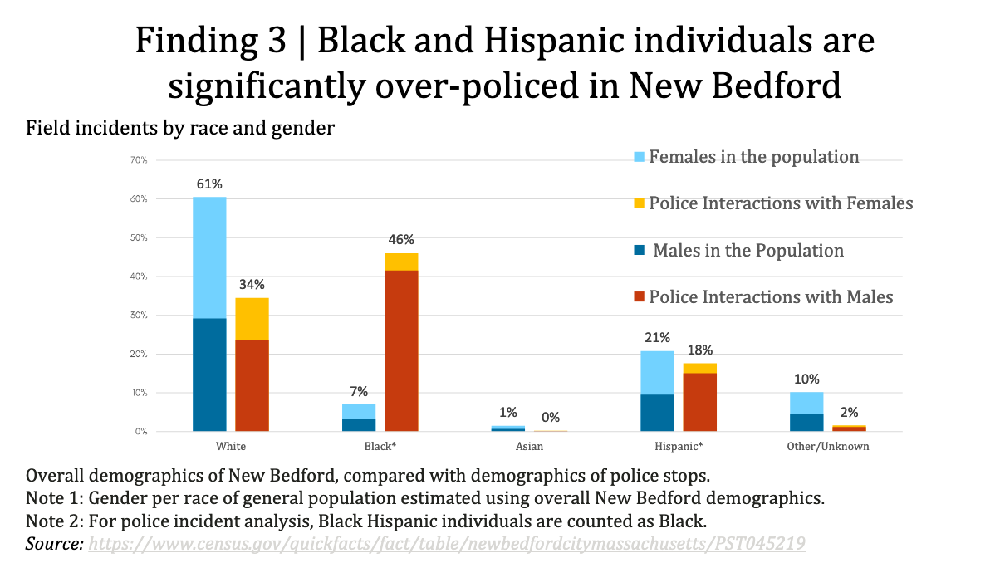

---
When the Citizens for Juvenile Justice report on [racial profiling by the New Bedford Police](https://www.cfjj.org/we-are-the-prey) was released in April 2021, the usual police zealots and members of city government attacked CFJJ's numbers and screamed that New Bedford was different from those "other" cities. We couldn't *possibly* be racists.

But it's not as if police racism has ever been a secret or a surprise. For years local governments *everywhere* have brushed off community complaints of racial profiling, harassment, and police violence. But over the years a massive body of research has been amassed, showing that — and precisely *how* — so many of our institutions are corrupted by institutional racism. Sure, there may be a few bad apples in the barrel, but the point is — the barrel *itself* is rotten. But again, we have long known this and also how to fix it. We just choose *not* to.

Below is just a small selection of articles on racial profiling available in April 2021, as the Citizens for Juvenile Justice Report was released. While hardly exhaustive, they demonstrate that the NBPD's racial profiling of Black and Hispanic youth is not unheard of. *Everywhere*. CFJJ's numbers are not anomalous. [At least one article](https://www.bc.edu/content/dam/files/schools/law/bclawreview/pdf/49_1/05_whitney_web.pdf) makes the case that statistical data like CFJJ's not only *confirms* the *reality of racial profiling*, but "furthermore, strong statistical associations should support an inference of *discriminatory intent*."

And I agree. Politicians and policy experts have known about the many insidious forms of racial profiling and their costs to society's most vulnerable for *decades*, as these articles illustrate. And when cities know the costs of racial profiling and racist policing and *still* refuse to stop it, then, yes, that's racism by design.

-   [1/3 Of People Killed By Police After A Traffic Stop This Year Were Black \| The Crime Report](https://thecrimereport.org/2015/12/25/2015-12-race-and-fatal-traffic-stops/)

-   [2018 Executive Summary](https://ago.mo.gov/home/vehicle-stops-report/2018-executive-summary)

-   [24 Frightening Racial Profiling Statistics - Vittana.org](https://vittana.org/24-frightening-racial-profiling-statistics)

-   [A large-scale analysis of racial disparities in police stops across the United States \| Nature Human Behaviour](https://www.nature.com/articles/s41562-020-0858-1)

-   [A new statistical test shows racial profiling in police traffic stops \| Stanford School of Engineering](https://engineering.stanford.edu/magazine/article/new-statistical-test-shows-racial-profiling-police-traffic-stops)

-   [Activists back Senate approach to traffic stop data - News - The Herald News, Fall River, MA - Fall River, MA](https://www.heraldnews.com/news/20191023/activists-back-senate-approach-to-traffic-stop-data)

-   [Analysis: LAPD searches blacks and Latinos more often - Los Angeles Times](https://www.latimes.com/local/lanow/la-me-lapd-searches-20190605-story.html)

-   [Are Traffic Stops Prone to Racial Bias? \| The Marshall Project](https://www.themarshallproject.org/2016/06/21/are-traffic-stops-prone-to-racial-bias)

-   [Arizona Traffic Stop Data Analysis Study: Year 3 Final Report - 2009](https://www.azdps.gov/sites/default/files/media/Traffic_Stop_Data_Report_2009.pdf)

-   [Bill would require collection of race data in traffic stops](https://www.wlbt.com/2021/04/22/bill-would-require-collection-race-data-traffic-stops/)

-   [Black men are 8 times more likely to be stopped by Oakland police than White men, data shows - ABC7 San Francisco](https://abc7news.com/oakland-police-opd-racial-profiling-traffic-stops/6414305/)

-   [Black men fleeing the police is reasonable, Massachusetts court rules \| PBS NewsHour](https://www.pbs.org/newshour/nation/black-men-fleeing-police-reasonable-massachusetts-highest-court-rules)

-   [Black, Hispanic drivers searched more often than white drivers, data shows](https://www.wcvb.com/article/black-hispanic-drivers-searched-more-often-than-white-drivers-data-shows/13532030#)

-   [Bureau of Justice Statistics (BJS) - Traffic Stops](https://www.bjs.gov/index.cfm?ty=tp&tid=702)

-   [Chicago police more likely to stop Black drivers without citing them, data investigation reveals - ABC7 Chicago](https://abc7chicago.com/chicago-police-racial-profiling-traffic-stops-department/6416266/)

-   [Cleveland Heights police cited by CSU Diversity Institute over 3:1 racial disparity in traffic stops - cleveland.com](https://www.cleveland.com/community/2021/04/cleveland-heights-police-cited-by-csu-diversity-institute-over-31-racial-disparity-in-traffic-stops.html)

-   [Confronting allegations of racial profiling in Massachusetts - Harvard Law Today](https://today.law.harvard.edu/confronting-allegations-of-racial-profiling-in-massachusetts/)

-   [Connecticut data reveal racial disparities in policing \| DataHaven](https://www.ctdatahaven.org/blog/connecticut-data-reveal-racial-disparities-policing)

-   [Connecticut Racial Profiling Prohibition Data Project - CTRP3 - CTData Collaborative](http://trafficstops.ctdata.org/)

-   [COPS Evaluation Brief - Promoting Cooperative Strategies to Reduce Racial Profiling - 2008](https://cops.usdoj.gov/RIC/Publications/cops-p146-pub.pdf)

-   [Data suggests racial bias in NH traffic stops](https://www.seacoastonline.com/story/news/state/2021/02/09/data-suggests-racial-bias-in-nh-traffic-stops/4435395001/)

-   [Decades of Data Suggest Racial Profiling is Getting Worse, Not Better](https://www.flatlandkc.org/stopped-profiling-the-police/decades-of-data-suggest-racial-profiling-is-getting-worse-not-better/)

-   [Do Maryland police target minorities? The data can't tell us - CNS Maryland](https://cnsmaryland.org/baltimore-data)

-   [Does the Minneapolis Police Department Traffic Stop Data Reveal Racial Bias? - Minnesota Journal of Law & Inequality](https://lawandinequality.org/2020/11/24/does-the-minneapolis-police-department-traffic-stop-data-reveal-racial-bias/)

-   [Driving while Black: ABC News analysis of traffic stops reveals racial disparities in several US cities - ABC News](https://abcnews.go.com/US/driving-black-abc-news-analysis-traffic-stops-reveals/story?id=72891419)

-   [Duluth group examines apparent racial disparities in DPD traffic stop data, NAACP asks for change](https://kbjr6.com/2021/04/14/duluth-group-examines-apparent-racial-disparities-in-dpd-traffic-stop-data-naacp-asks-for-change/)

-   [Duluth to take closer look at police race bias, traffic stops - StarTribune.com](https://www.startribune.com/duluth-to-take-closer-look-at-police-race-bias-traffic-stops/600050511/)

-   [FBI Data: Racial Profiling Is Real ... and Ferguson Is Just the Tipping Point](https://www.diversityinc.com/fbi-data-racial-profiling-real-ferguson-just-tipping-point/)

-   [Few states require local police to collect race data on traffic stops - pennlive.com](https://www.pennlive.com/news/2019/12/few-states-require-local-police-to-collect-race-data-on-traffic-stops.html)

-   [Findings - The Stanford Open Policing Project](https://openpolicing.stanford.edu/findings/)

-   [Grand Rapids police oversight department to start collecting racial disparities in arrest, traffic stop data - mlive.com](https://www.mlive.com/news/grand-rapids/2020/08/grand-rapids-police-oversight-department-to-start-collecting-racial-disparities-in-arrest-traffic-stop-data.html)

-   [Houston Police Department's analysis of motor vehicle stop data for 2015](http://www.houstontx.gov/police/department_reports/racial_profiling/2015_Annual_Racial_Profiling_Report.pdf)

-   [Illinois Traffic and Pedestrian Stop Study - Data from 2004 to 2019](https://idot.illinois.gov/transportation-system/local-transportation-partners/law-enforcement/illinois-traffic-stop-study)

-   [Inside 100 million police traffic stops: New evidence of racial bias](https://www.nbcnews.com/news/us-news/inside-100-million-police-traffic-stops-new-evidence-racial-bias-n980556)

-   [It's time to start collecting stop data: A case for comprehensive statewide legislation — The Policing Project](https://www.policingproject.org/news-main/2019/9/27/its-time-to-start-collecting-stop-data-a-case-for-comprehensive-statewide-legislation)

-   [Mapping Police Violence - Database and GIS Mapping](https://mappingpoliceviolence.org/)

-   [Mass Police Reform -- Working to Reform Policy & Practice](http://masspolicereform.org/)

-   [Mass. High Court Lowers Burden For Proving Racial Bias In Police Stops \| WBUR News](https://www.wbur.org/news/2020/09/17/police-stop-racial-bias)

-   [Mass. SJC wants lawmakers to require racial data on traffic stops \| Boston.com](https://www.boston.com/news/policy/2020/09/23/massachusetts-sjc-traffic-stops-racial-data)

-   [Massachusetts Police Data Points to Disparities In Arrests - NBC Boston](https://www.nbcboston.com/investigations/massachusetts-police-data-points-to-racial-disparities-in-arrests/2344745/)

-   [Massachusetts Racial and Gender Profiling Study - Final Report May 2004](https://repository.library.northeastern.edu/files/neu:344627/fulltext.pdf)

-   [Massachusetts Statute for the Collection of Data Relative to Traffic Stops](https://aele.org/massprofile.html)

-   [Newsday analysis: Suffolk police stopped, searched minority drivers at higher rates \| Newsday](https://www.newsday.com/long-island/investigations/police-traffic-stops-1.50041710)

-   [North Carolina State Bureau of Investigation - Traffic Stop Statistics](https://www.ncsbi.gov/Services/SBI-Statistics/Traffic-Stops)

-   [Ohio State Highway Patrol \| Statistics](https://www.statepatrol.ohio.gov/statistics/statspage2.asp)

-   [Pa. State Police resume tracking racial data during traffic stops in response to Spotlight PA report](https://www.inquirer.com/news/pennsylvania/spl/pa-state-police-traffic-stops-racial-profiling-data-collection-20210112.html)

-   [Police data collection project (New Bedford Police Department) • MuckRock](https://www.muckrock.com/foi/new-bedford-595/police-data-collection-project-new-bedford-police-department-97760/)

-   [Police Stop Black Drivers At Higher Rate Than Whites In California \| HuffPost](https://www.huffpost.com/entry/black-drivers-traffic-stops-california_n_5e0facbac5b6b5a713ba350c)

-   [Police stops are still marred by racial discrimination, new data shows. \| Prison Policy Initiative](https://www.prisonpolicy.org/blog/2018/10/12/policing/)

-   [Policing and Racial Justice \| The Kansas Data Project: Injustice by the Numbers](https://dashboards.mysidewalk.com/aclu-ks/policing-and-racial-justice)

-   [Portland Police Bureau Traffic Stop and Search Data - Sep 23 2009](https://www.portlandoregon.gov/police/article/299174)

-   [Project CommUNITY: Massachusetts not immune to racial bias in policing](https://www.wcvb.com/article/project-community-massachusetts-not-immune-to-racial-bias-in-policing/32947264)

-   [Race and Policing - 100+ studies](https://raceandpolicing.issuelab.org/?author=&categories=&coverage=&funder=&keywords=&pubdate_end_year=1&pubdate_start_year=1&publisher=&sort=&wikitopic_categories=)

-   [Race-Based Traffic Stop Data Dashboard - 2019](https://app.powerbigov.us/view?r=eyJrIjoiYzQzNzY0ZmYtNTdhMy00ZjAxLWE1Y2YtMjE1OTU1MWUzOTY2IiwidCI6IjYwYWZlOWUyLTQ5Y2QtNDliMS04ODUxLTY0ZGYwMjc2YTJlOCJ9)

-   [Racial Disparities in Traffic Stop Outcomes](http://fbaum.unc.edu/articles/RacialDisparitiesInTrafficStops.pdf)

-   [Racial Disparities In Traffic Stops Decrease, But Inequalities Remain \| Connecticut Public Radio](https://www.wnpr.org/post/racial-disparities-traffic-stops-decrease-inequalities-remain)

-   [Racial disparities revealed in massive traffic stop dataset - UofSC News & Events \| University of South Carolina](https://www.sc.edu/uofsc/posts/2020/06/racial_disparities_traffic_stops.php)

-   [Racial gap found in traffic stops in Milwaukee](https://archive.jsonline.com/watchdog/watchdogreports/racial-gap-found-in-traffic-stops-in-milwaukee-ke1hsip-134977408.html)

-   [Racial Profiling and Mandatory Data Collection in Nevada: How will Law Enforcement Respond? will Law Enforcement Respond?](https://digitalscholarship.unlv.edu/cgi/viewcontent.cgi?article=1427&context=thesesdissertations)

-   [Racial Profiling and Traffic Stops \| National Institute of Justice](https://nij.ojp.gov/topics/articles/racial-profiling-and-traffic-stops)

-   [Racial Profiling? A Multivariate Analysis of Police Traffic Stop Data - Michael R. Smith, Matthew Petrocelli, 2001](https://journals.sagepub.com/doi/abs/10.1177/1098611101004001001)

-   [SAGE Journals: Your gateway to world-class journal research](https://journals.sagepub.com/action/cookieAbsent)

-   [San Diego Has Fallen Behind on Combating Police Racial Profiling](https://www.voiceofsandiego.org/topics/public-safety/san-diego-has-fallen-behind-on-combating-police-racial-profiling/)

-   [Session Law - Acts of 2000 Chapter 228](https://malegislature.gov/Laws/SessionLaws/Acts/2000/Chapter228)

-   [State of California Department of Justice - OpenJustice](https://openjustice.doj.ca.gov/exploration/stop-data)

-   [State police traffic stop data shows racial disparities remain  - VTDigger](https://vtdigger.org/2020/08/19/state-police-traffic-stop-data-shows-racial-disparities-remain-/)

-   [State-commissioned study finds racial disparities in R.I. traffic stops for 4th year in a row - The Boston Globe](https://www.bostonglobe.com/2021/03/12/metro/state-commissioned-study-finds-racial-disparities-ri-traffic-stops-4th-year-row/)

-   [States Face Up To Realities Of Police Racial Profiling \| The Pew Charitable Trusts](https://www.pewtrusts.org/en/research-and-analysis/blogs/stateline/1999/05/10/states-face-up-to-realities-of-police-racial-profiling)

-   [Stops, Citations, and Arrests - Police Data Initiative](https://www.policedatainitiative.org/datasets/stops-citations-and-arrests/)

-   [Study of 100 million police stops finds black motorists are more likely to be pulled over \| CNN](https://www.cnn.com/2019/03/21/us/police-stops-race-stanford-study-trnd/index.html)

-   [Ten years' worth of NC traffic stop data reveal racial disparities in searches in North Carolina](https://pulse.ncpolicywatch.org/2021/03/02/ten-years-worth-of-nc-traffic-stop-data-reveals-racial-disparities-in-searches)

-   [Texas was supposed to collect racial-profiling data. It left out most of the 'racial' part.](https://www.msn.com/en-us/news/us/traffic-stop-data-can-spotlight-racial-profiling-but-texas-doesn-t-collect-the-right-data/ar-BB15XNUU)

-   [The Long Road to Ending Pretextual Stops \| Harvard Civil Rights-Civil Liberties Law Review](https://harvardcrcl.org/the-long-road-to-ending-pretextual-stops/)

-   [The Statistical Evidence of Racial Profiling in Traffic Stops and Searches: Rethinking the Use of Statistics to Prove Discriminatory Intent](https://www.bc.edu/content/dam/files/schools/law/bclawreview/pdf/49_1/05_whitney_web.pdf)

-   [Traffic Stop Data \| Arizona Department of Public Safety](https://www.azdps.gov/about/reports/traffic-stop)

-   [Traffic Stop Data Reporting - Governor's Office of Crime Prevention, Youth, and Victim Services](http://goccp.maryland.gov/reports-publications/law-enforcement-reports/traffic-stop-data/)

-   [Traffic stop report shows lack of progress on racial disparities - VTDigger](https://vtdigger.org/2021/02/01/traffic-stop-report-shows-lack-of-progress-on-racial-disparities/)

-   [Traffic-stop data won't halt debate over racial profiling \| The Seattle Times](https://archive.seattletimes.com/archive/?date=20020315&slug=racialprofiling15m)

-   [UTEP Analysis of San Jose Police Department Stop Data Focuses on Racial Disparities](https://utep.edu/newsfeed/campus/UTEP-Analysis-of-San-Jose-Police-Department-Stop-Data-Focuses-on-Racial-Disparities.html)

-   [Vehicle Stop Data Collection - City of Sacramento](https://www.cityofsacramento.org/Police/Transparency/Vehicle-Stop-Data-History-and-Information)

-   [Vehicle Stops Report - Missouria 2020](https://www.ago.mo.gov/home/vehicle-stops-report)

-   [VSP releases 2019 traffic-stop data, racial disparities remain \| Vermont Business Magazine](https://vermontbiz.com/news/2020/august/19/vsp-releases-2019-traffic-stop-data-racial-disparities-remain)

-   [What data on 20 million traffic stops can tell us about 'driving while black' - The Washington Post](https://www.washingtonpost.com/news/monkey-cage/wp/2018/07/17/what-data-on-20-million-traffic-stops-can-tell-us-about-driving-while-black/)

-   [What decades of traffic stop data reveals about police bias - CBS News](https://www.cbsnews.com/news/what-decades-of-traffic-stop-data-reveals-about-police-bias/)

-   [Wisconsin State Police Stops: How Choices in Madison have led to Missing Racial Data and Other Outcomes \| Data Science Blog](https://nycdatascience.com/blog/student-works/wisconsin-state-police-stops-choices-madison-led-missing-racial-data-outcomes/)

-   [Would taking police out of traffic stops make a difference in reform?](https://www.thetimesnews.com/in-depth/news/2021/03/22/police-reform-fayetteville-burlington-nc-traffic-stops-policing/4622232001/)

