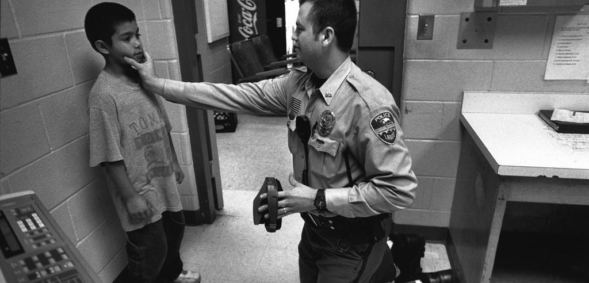
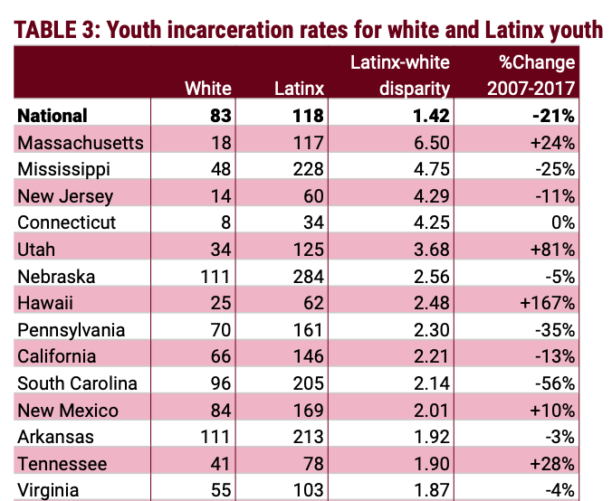

---

On February 3rd the Sentencing Project published a new study, [Racial Disparities in Youth Incarceration Persist](https://www.sentencingproject.org/publications/racial-disparities-in-youth-incarceration-persist/), by Josh Rovner, Senior Advocate Associate at the Sentencing Project. It examines disparities in arrests of white children and children of color, and it does not paint an encouraging picture.

For the NAACP the findings are no surprise. Black, Native, and Latino youth have been historically disciplined and arrested in disproportionate numbers and make up a lopsided percentage of those who are fed into the criminal justice system.

The good news from the [study](https://www.sentencingproject.org/wp-content/uploads/2021/02/Racial-Disparities-in-Youth-Incarceration-Persist.pdf) is that in the last decade youth incarceration has been cut in half. The bad news is that, for children of color, they are still targets of overzealous and racist policing and school discipline. Disparities in Latino youth incarceration have dropped by 21% — still not on par with national improvement — but Black and Native youth incarceration disparities have remained "essentially unchanged" in the last decade. 

The [Sentencing Project study](https://www.sentencingproject.org/wp-content/uploads/2021/02/Racial-Disparities-in-Youth-Incarceration-Persist.pdf)  quotes Tufts University Sociologist Daaniki Gordon, who notes that "police are [...] more likely to intervene in behavior by youth of color that would go unremarked or ignored by police in neighborhoods where white youth predominantly live. Residential segregation leads to school segregation, and students of color often experience their misbehaviors treated as a disciplinary or policing issue while their white peers’ misbehaviors are more frequently seen as behavioral health concerns, potentially meriting a modified curriculum and additional school support personnel to assist with behavioral needs." 

As the study notes, criminalization of children of color often begins with, and right in, the schools. With very good reason schools have been correctly identified as the first stop in the school-to-prison pipeline. It is NAACP policy that armed police have no place in school hallways. Now that Massachusetts police reform has given school superintendents complete discretion over SRO programs, especially with [case](https://www.youtube.com/watch?v=tv_62mkTd6M) after [case](https://www.youtube.com/watch?v=tv_62mkTd6M) after [case](https://www.youtube.com/watch?v=teGR2t9mh-U) after [case](https://www.youtube.com/watch?v=3B6fB5iVwBE) after [case](https://www.youtube.com/watch?v=9prOZqKQUkI) after [case](https://www.youtube.com/watch?v=ljhWV54memg) of children abused by SROs, it is up to school superintendents to prove that these programs do no harm to children of color. We call on Superintendent Thomas Anderson to stop the SRO program immediately and prove to city residents that it serves some positive function.

While Massachusetts has the fifth lowest youth incarceration rate in the United States, these low rates do not extend to Black, Native or Latino Children. Massachusetts has the **ninth highest disparity** between Black and white youth incarceration rates and is **#1 in disparity in the nation** between Latino and white youth incarceration — and it's only worsening.

The Sentencing Project has offered three recommendations for state, city, and school policy makers:

1. **Racial impact statements**: States and localities should require the use of racial impact statements to educate policymakers about how changes in sentencing or law enforcement policies and practices might impact racial and ethnic disparities in the justice system.
2. **Publish demographic data quarterly**: States and counties should publish demographic data quarterly on the number of incarcerated or justice-system involved youth, including race and ethnicity. The federal government should disseminate this information nationwide.
3. **Invest in communities**: States and localities must invest in communities to strengthen public infrastructures, such as schools and medical and mental health services, with particular focus on accommodating the needs of children of color.

Let's look at how these are — or are *not* — being addressed currently.

As we learned in last week's [forum on Juvenile Justice and School Resource Officers](https://naacpnewbedford.org/2021/01/sro-justice/), racial impact and racial justice are poorly-considered factors in both school and policing policy, or are simply not considered at all. Juvenile justice data is either not collected — in violation of state law — or it must be obtained by FOIA request or lawsuit. And budget priorities for communities frequently overlook social and human services in favor of simply throwing more money at policing.

The NAACP believes that this study adds to what many Americans have finally woken up to — that the American criminal justice system is deeply racist and needs much more reform than the band-aids and minimal reforms that timid legislators have come up with to-date.

You can download a [PDF of the full Sentencing Project study](https://www.sentencingproject.org/wp-content/uploads/2021/02/Racial-Disparities-in-Youth-Incarceration-Persist.pdf) from their [website](https://www.sentencingproject.org/).

