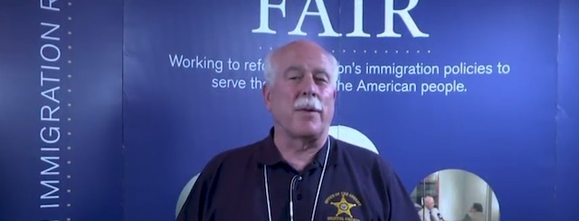
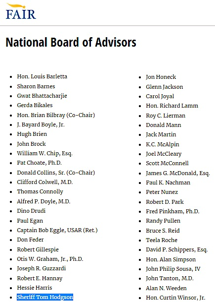
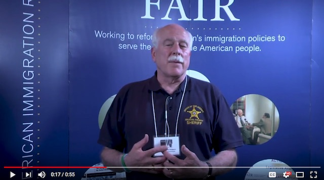
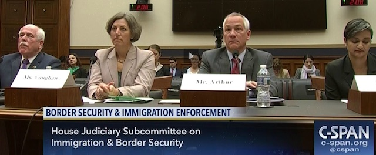
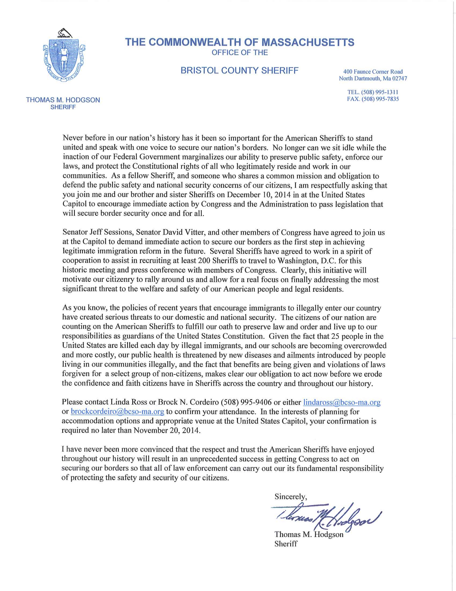

---

*“He that walketh with wise men shall be wise: but a companion of fools shall be destroyed.” — Proverbs 13:20*

Sheriff Tom Hodgson often claims that everything he does is to keep us safe, but Hodgson’s job description is to run the county jail. Instead, the sheriff frequently steps outside his areas of responsibility and competence, neglecting official duties and leaving chaos, conflict, and mismanagement in his wake.

Hodgson is less interested in being a county sheriff than a xenophobic mouthpiece for far-right views. With his continual attacks on immigrants, that a [*Boston Globe editorial*](https://www.bostonglobe.com/opinion/editorials/2017/06/24/bristol-county-deserves-better-sheriff-than-hodgson/ipneUr85oZ9R6qPlrSZ4zO/story.html) characterized as crossing the "line of decency," Bristol County’s own Joe Arpaio wannabe frequently makes the Trump-like claim that more immigrants equals more crime. 

At a state committee hearing last month State Senator Sonia Chang-Diaz challenged Hodgson to prove it. For a moment the sheriff looked like a deer in the headlights, mumbling that he’d have to get back to her. And when he finally did, his numbers were not scientific studies but talking points from an organization the Southern Poverty Law Center [*classifies*](https://www.splcenter.org/fighting-hate/intelligence-report/2010/fudging-facts-look-cis-studies) as a hate group. 

But this is an old story. In 2011, Duval Patrick opposed the Department of Homeland Security’s efforts to turn local lawmen into federal immigration officers. Hodgson [*thumbed his nose*](http://www.heraldnews.com/article/20110928/News/309289894) at the governor’s “moronic” stance and signed onto the DHS program [*anyway*](http://blogs.southcoasttoday.com/new-bedford-crime/2011/06/09/sheriff-hodgson-on-secure-communities-and-undocumented-immigrants/). Patrick then vetoed budget earmarks for Hodgson, and Hodgson responded by echoing right-wing conspiracy sites that Patrick (and Obama) were flying in [*plane-loads*](http://www.bostonherald.com/news_opinion/local_coverage/2014/07/illegal_immigrants_flown_to_bay_state) of illegal immigrants (and Muslim terrorists) into Massachusetts. And he [*threaten*](https://www.bostonglobe.com/metro/2012/10/01/bristol-sheriff-threatens-close-jail/SHn1BGVq9ZscTXX4jT892O/story.html)ed to shut down the Ash Street jail.

This is classic Hodgson – a martinet who once tried to shame prisoners on work release by literally placing them in chains. Who illegally charged them housing and medical fees. Who puts “his” inmates on food restrictions and limits contact to family members. Who presides over the county lockup with the worst suicide rate in the state. Who oversees a prison population three times the size the facility was designed to hold. Who advocates putting political adversaries like Somerville mayor Joe Curtatone in jail. Who, in his inauguration speech, promised to send inmates to build Donald J. Trump’s Great Wall.

Tom Hodgson was appointed Bristol County Sheriff by William Weld in 1997 to fill a retirement vacancy, and he's been the incumbent ever since. Hodgson is the Massachusetts county sheriff with the greatest share of suicides at his jail, the Trump Wall sheriff, the chain gang sheriff, the Joe Arpaio wannabe who wants to arrest mayors of sanctuary cities. Hodgson has been accused of flouting a Massachusetts SJC ruling on ICE detentions, of political patronage schemes, and of abusing prisoners. Hodgson spends so much of his time on talk radio flogging dubious anti-immigration "facts" and conspiracy theories that it's a miracle he ever clocks in at his day job. But most galling, the sheriff claims to speak for the people of Bristol County — when in fact much of the time Hodgson is out of the office representing a hate group, the Federation for American Immigration Reform (FAIR).

And it seems everybody’s got a Tom Hodgson story.

A retired Fall River cop [*recall*](http://www.heraldnews.com/opinion/20170425/letter-to-editor-putting-sheriff-in-charge-of-city-jail-ridiculous-idea)s in a recent editorial that the sheriff wanted to patrol the streets of Fall River. That was a no-go. Fall River mayor [*Jasiel Correia*](http://www.heraldnews.com/news/20170420/correias-plan-to-increase-fall-river-police-ranks-meets-opposition) tried an end-run around his own police department, inviting Hodgson to run the city jail and involving Rep. Paul Schmid in funding it. That too was a no-go.

In 2015 the sheriff deputized thirteen military recruiters. But as soon as they had been sworn-in, the Department of Defense launched an [*inquiry*](http://www.heraldnews.com/article/20150910/NEWS/150919317), sending a Naval petty officer to investigate. There were [*obvious questions*](http://www.heraldnews.com/article/20150910/NEWS/150919317) about members of the armed forces performing law enforcement functions – since the Constitution specifically prohibits it. Hodgson’s reasoning: "We’re doing these things for the right reasons, certainly for the public’s protection and for our national security." Great. But what about running the *jail*?

Recently the publicity hound sheriff played Dr. Phil when he offered up his deep psychological insights into Aaron Hernandez on TMZ, WLNE, WBZ and others. Viewers learned that [Hodgson regarded himself](https://www.bostonmagazine.com/news/2014/04/29/thomas-hodgson-aaron-hernandez-bristol-county-jail/) as a “fatherly influence,” recommending the Bible and “Tuesdays with Morrie” to Hernandez.

Hodgon spends so much time out of the office, providing psychological counseling to celebrity prisoners, or trying to become one himself, that he is apparently unable to keep up with the paperwork. The [*Lawyer's Committee for Civil Rights and Economic Justice*](http://lawyerscom.org/bristol-countys-lawless-sheriff-will-answer-to-the-court/) had to file a lawsuit to obtain records related to the BCSO's participation in federal ICE programs, but Hodgson violated the state's public records law by failing to produce the documents. “Sheriff Hodgson appears to think he is above the law,” said Sophia Hall, Staff Attorney at the Lawyers’ Committee. "But as President Trump has learned, that is why we have courts."

Since 2012 inmates in county lockups in Massachusetts are twice as likely to commit suicide as prisoners in state facilities. Of the 14 county lockups the worst offender is the Bristol County Sheriff’s Office (BCSO) facility. Since 2008 there have been 14 suicides at the BCSO jail, 50% more than Suffolk County and twice the number at Essex and Worcester facilities. The BCSO jail represents almost a quarter of all 65 county prison suicides from 2006 to 2016 but only 13% percent of the total county prison population. The BCSO lockup also spends the least amount of money [*per inmate*](http://wpri.com/2017/05/17/study-bristol-co-spends-lowest-amount-per-inmate-in-the-state/) of any facility in the state. 

For all the bibles and the tough talk, the sheriff’s management style isn’t working – and it’s cruel. In 2013, when Aaron Brito committed suicide in Hodgson's lockup, his mother received a call from an anonymous BCSO employee: "Your son died today. If you want more information today, call St. Luke’s Hospital."

Tom Hodgson has had a contentious relationship with his corrections officers. Five officers were punished for speaking about labor negotiations with the sheriff and by 2008 Hodgson had spent \$1 million on a losing case he took all the way to the Supreme Court. Hodgson also spent \$3.7 million on other legal cases, making him far and away the most profligate legal spender of all county sheriffs. Before a new round of lawsuits in 2018, Hodgson had already flushed [*\$4.7 million*](http://www.southcoasttoday.com/article/20100620/news/6200338) of taxpayer money down the drain. \$1.3 million of that was handed over to “Special Deputy” attorney Bruce Assad and \$1.3 million to attorney Ronald Lowenstein, another donor whose family was flagged in 2004 for giving more than the legally permitted campaign maximum.

Many of the sheriff’s employees or contractors are also donors. Filings with the [*Massachusetts Office of Campaign and Political Finance*](http://www.ocpf.us/) show a current quarter million dollar war chest and a history of \$1.3 million in donations. Occupations from hundreds of entries in donor records include: corrections officer, canine officer, captain, warrant apprehension officer, internal affairs officer, deputy, chief, contractor, investigator, or simply BCSO. An audit of these records might lay to rest persistent accusations of patronage.

\* \* \*

[FAIR](https://fairus.org/) is probably the most influential anti-immigrant hate group in the United States. It was founded in 1979 by a Michigan ophthalmologist, [John Tanton](https://www.splcenter.org/fighting-hate/extremist-files/individual/john-tanton), functions as a lobbying group, and is [deeply embedded](https://news.vice.com/story/fair-trump-white-house-federation-for-american-immigration-reform) in the Trump administration. [MediaMatters](https://www.mediamatters.org/blog/2011/08/19/cnn-turns-to-anti-immigrant-hate-group-fair-for/183858) notes that the mainstream media often uses FAIR's "statistics" without realizing that it's a hate group. The [CATO Institute](https://www.cato.org/blog/fairs-fiscal-burden-illegal-immigration-study-fatally-flawed) has slammed FAIR's studies and statistics as "fatally flawed" and "sloppy." The [Southern Poverty Law Center](https://www.splcenter.org/fighting-hate/intelligence-report/2015/john-tantons-network) lists FAIR and a number of other groups in the [Tanton Network](https://www.sourcewatch.org/index.php/John_Tanton_Network) as hate groups. Yet many journalists just keep quoting FAIR's "facts."

\* \* \*

In 2015 Tom Hodgson [appeared with](http://stoughton.wickedlocal.com/article/20150505/NEWS/150507909) Dennis Michael Lynch at an Islamophobic venue in Stoughton which had previously hosted Dutch neo-fascist [Geert Wilders](http://forward.com/news/353234/clergy-protest-anti-islam-speakers-at-boston-synagogue/). Lynch is an Islamophobe, a white supremacist, a supporter of the [Constitutional Sheriff Movement](https://www.publicintegrity.org/2016/04/18/19568/army-set-our-nation-free) and of sovereign citizen Cliven Bundy, about whom he made a film.

That same year Hodgson appeared with a representative of the Federation for Immigration Reform (FAIR) at the [Fisherman's Club](http://redmassgroup.com/2015/03/immigration-forum-with-sheriff-tom-hodgson-federation-for-american-immigration-reform-fair/) in New Bedford. Despite the name, FAIR has little to do with reform. Instead, its goal is assuring [White Anglo-Saxon dominance](https://www.splcenter.org/fighting-hate/extremist-files/group/federation-american-immigration-reform). According to the Southern Poverty Law Center, FAIR has links to white supremacists and eugenicists. Its founder, [John Tanton](https://www.splcenter.org/fighting-hate/extremist-files/individual/john-tanton), wrote to one eugenicist: "I've come to the point of view that for European-American society and culture to persist requires a European-American majority, and a clear one at that."

In 2016 the Sheriff was one of three speakers at a "Patriots Unity Day" rally in Randolph. The second speaker was [Jessica Vaughan](http://imagine2050.newcomm.org/2017/10/02/cross-post-meet-jessica-vaughan-anti-immigrant-movements-representative-tomorrows-senate-judiciary-committee-hearing-daca/), of the nativist organization Center for Immigration Studies (CIS). Like FAIR, CIS was founded by John Tanton and [publishes dubious statistics](https://www.splcenter.org/fighting-hate/intelligence-report/2010/fudging-facts-look-cis-studies) on immigration. According to the Southern Poverty Law Center, CIS also maintains [links to white supremacist and anti-semitic groups](https://www.splcenter.org/hatewatch/2017/10/02/meet-jessica-vaughan-anti-immigrant-movement's-representative-tomorrow's-senate-judiciary). CIS executive director [Mark Krikorian quipped](https://www.dailykos.com/stories/2010/1/22/828950/-) after the deadly 2010 Haitian earthquake: “My guess is that Haiti’s so screwed up because it wasn’t colonized long enough.” The third speaker was Raymond Hanna with the anti-Muslim hate group [ACT for America](https://www.adl.org/education/resources/profiles/act-for-america), which also has white supremacist ties. In Arkansas ACT's "March Against Shariah" events were [organized by a Nazi](https://www.huffingtonpost.com/entry/anti-sharia-group-with-close-ties-to-trump-has-a-nazi-problem_us_59d2a231e4b048a44324852b) and publicized on *Stormfront*.

In June this year [the Sheriff appeared with](https://afr.net/podcasts/sandy-rios-in-the-morning/2017/june/live-from-the-hold-their-feet-to-the-fire-event-with-dan-stein-michelle-malkin-and-sheriff-hodgson/) Dan Stein and Michelle Malkin at an annual "Hold their feet to the fire" broadcast with [anti-gay bigot Sandy Rios](https://www.splcenter.org/hatewatch/2017/07/07/trump-adviser-hate-group-leaders-and-anti-immigrant-politicians-attend-fair's-hold-their). Stein is [executive director of FAIR](https://www.splcenter.org/fighting-hate/extremist-files/individual/dan-stein), and characterizes America’s immigration laws as an effort “[to retaliate against Anglo-Saxon dominance](https://www.splcenter.org/fighting-hate/extremist-files/individual/dan-stein).” Stein describes Central American immigrants as engaged in “competitive breeding” and asks: "Should we be subsidizing people with low IQs to have as many children as possible, and not subsidizing those with high ones?" Malkin too has [links to white supremacist groups](https://www.huffingtonpost.com/alex-koppelman/michelle-malkins-white-su_b_20873.html), including VDARE, and to Islamophobic groups. Malkin opposes the 14th Amendment, which gave citizenship to slaves.

On October 19, 2017 the SouthCoast Chamber of Commerce hosted Bristol County sheriff Tom Hodgson and Helena DaSilva Hughes at the Wamsutta Club to [discuss immigration](https://www.newbedfordguide.com/event/seminar-immigration-in-the-southcoast). During his presentation the sheriff cited [questionable statistics](https://fairus.org/issue/publications-resources/fiscal-burden-illegal-immigration-united-states-taxpayers) from the Federation for American Immigration Reform (FAIR), claiming that illegal immigration costs taxpayers \$116 billion a year. The [CATO Institute](https://www.cato.org/blog/fairs-fiscal-burden-illegal-immigration-study-fatally-flawed) calls FAIR's new study "fatally flawed" and "even more sloppy" than their previous one.

According to FAIR's 2011 annual report, that was the year [the organization began cultivating](http://imagine2050.newcomm.org/wp-content/uploads/2017/07/Crossing-the-Line_FINAL.pdf) sheriffs like Hodgson. "In 2011, we identified sheriffs who expressed concerns about illegal immigration." FAIR staff “met with these sheriffs and their deputies, supplied them with a steady stream of information, established regular conference calls so they could share information and experiences, and invited them to come to Washington to meet with FAIR’s senior staff.” Since roughly that time Hodgson's main job has been as a [FAIR spokesman](http://imagine2050.newcomm.org/resources/crossing-line-u-s-sheriffs-colluding-anti-immigrant-movement/).

\* \* \*

Not so focused on law and order as it claims to be, FAIR sees its true mission as the preservation of Anglo-Saxon civilization from rapacious hordes of brown non-English speakers. FAIR peddles white supremacy, eugenics, and dubious statistics on immigration. The following quotes from John Tanton — Hodgson's colleague on the advisory board — betray FAIR's chief preoccupations:

> "**As Whites see their power and control over their lives declining, will they simply go quietly** into the night? Or will there be an explosion?" ([October 1986](https://www.splcenter.org/fighting-hate/intelligence-report/2015/witan-memo-iii))

and

> "I've come to the point of view that **for European-American society and culture to persist requires a European-American majority**, and a clear one at that." ([December 1993](https://www.adl.org/news/article/ties-between-anti-immigrant-movement-and-eugenics))

FAIR's current president, [Dan Stein](https://www.splcenter.org/fighting-hate/extremist-files/individual/dan-stein) — with whom Tom Hodgson appeared at an [event last June](https://afr.net/podcasts/sandy-rios-in-the-morning/2017/june/live-from-the-hold-their-feet-to-the-fire-event-with-dan-stein-michelle-malkin-and-sheriff-hodgson/) — likes to add a dash of anti-Irish conspiracy theory to *his* white supremacy:

> "I blame ninety-eight percent of responsibility for this country's immigration crisis on Ted Kennedy and his political allies, who decided some time back in 1958, earlier perhaps, that **immigration was a great way to retaliate against Anglo-Saxon dominance** and hubris, and the immigration laws from the 1920s were just this symbol of that, and it's a form of revengism..." ([August 1994](https://www.salon.com/2016/12/06/fairs-big-play-onetime-fringe-group-hopes-to-drive-donald-trumps-immigration-policy/))

In an interview with "Alt-Right" darling Tucker Carlson, Stein maintains that *Latinx* immigrants coming to the U.S. are godless, low-IQ haters:

> "Immigrants don't come all church-loving, freedom-loving, God-fearing … Many of them hate America, hate everything that the United States stands for. Talk to some of these Central Americans. \[…\] **Should we be subsidizing people with low IQs to have as many children as possible**, and not subsidizing those with high ones?" ([October 1997](https://www.adl.org/news/article/activists-with-extremist-ties-behind-oregon-immigration-referendum))

For FAIR it's not just about white culture, church, and the English language. As Stein's quote above shows, like their goose-stepping cousins FAIR sees America threatened by inferior races. But here's Tanton again:

> "Do we leave it to individuals to decide that they are the intelligent ones who should have more kids? And more troublesome, **what about the less intelligent, who logically should have less?** Who is going to break the bad news \[to less intelligent individuals\], and how will it be implemented?" ([September 1996](http://www.rightwingwatch.org/post/trumps-anti-immigrant-campaign-is-rooted-in-white-nationalist-sentiment/))

How, indeed, does FAIR want to see it *implemented*?

FAIR's "final solution" is the preservation of "Anglo-Saxon dominance" by privileging white people through overtly racist immigration policies and the use of mass deportation and eugenics for ethnic cleansing.

Schemes like this didn't work out so great for the Third Reich. And they're not going to work for Tom Hodgson and his brownshirted buddies at FAIR.

\* \* \*

Tom Hodgson has spent the majority of his life in law enforcement and took only a few criminal justice classes in college before dropping out. But by the frequency with which he offers up his views, he is an expert on *everything* — 911, Criminal Justice reform, the second amendment, the Constitution, the psychology of Aaron Hernandez, the Iran deal, Islam, drug abuse, Obama, the military, religion as therapy — and Immigration.

Among members of the Hodgson's right-wing echo chamber: Howie Carr, Chris Resendes (a former employee of the Sheriff), John Keller, NRATV, Fox and Friends, Jeanine Pirro, Laura Ingraham, and Lou Dobbs.

Some of Hodgson's like-minded friends: Dan Rea, Rick Wiles, Robert Spencer, Sandy Rios, Tom Roten, Jessica Vaughan, Dennis Michael Lynch, ACT America, FAIR, CIS, NumbersUSA, VDARE.

\* \* \*

Bristol County Sheriff Tom Hodgson's passion is badmouthing immigrants, though his day job is running a county jail. But Hodgson is less interested in being a county sheriff than a mouthpiece for far-right views. His continual attacks on immigrants prompted the [Boston Globe](https://www.bostonglobe.com/opinion/editorials/2017/06/24/bristol-county-deserves-better-sheriff-than-hodgson/ipneUr85oZ9R6qPlrSZ4zO/story.html) to accuse him of crossing the "line of decency," 

Last year Hodgson [joined the national advisory board](http://imagine2050.newcomm.org/2017/11/29/anti-immigrant-sheriff-thomas-hodgson-joins-fairs-advisory-board/) of the Federation for American Immigration Reform (FAIR). This formalized a long relationship with the organization. FAIR, CIS, and several sisters organizations were founded by fellow advisory council member John Tanton, a white supremacist who believes in applying eugenics to controlling non-white population.

In July 2017 the Center for New Community [published a report](http://imagine2050.newcomm.org/wp-content/uploads/2017/07/Crossing-the-Line_FINAL.pdf), "Crossing the Line: U.S. Sheriffs Colluding with Anti-Immigrant Movement," which described Hodgson's relationship with FAIR starting around 2011. 

FAIR's 2011 Annual Report describes a strategy of identifying "sheriffs who expressed concerns about illegal immigration." FAIR "met with these sheriffs and their deputies, supplied them with a steady stream of information, established regular conference calls so they could share information and experiences, and invited them to come to Washington to meet with FAIR’s senior staff."

https://www.youtube.com/watch?v=Je2OlEEsU64

New Community reported that FAIR seemed to capitalize upon blurry lines between sheriffs' official duties and their work for FAIR:

> "Despite Hodgson’s endorsement, FAIR’s recruitment event did draw some scrutiny. When inviting sheriffs, FAIR used materials suggesting the event was sanctioned by the High Intensity Drug Trafficking Area program (HIDTA), a U.S. Office of National Drug Control Policy (ONDCP) program. FAIR’s flyer for the event featured HIDTA’s official logo and stated that participants’ travel and lodging costs “may be covered by your agency’s HIDTA funding.' ONDCP officials sternly rebuked that claim. 'In no way is the ‘border school’ sanctioned, co-hosted, or endorsed by the High Intensity Drug Trafficking Area Program,' Rafael Lemaitre, ONDCP’s associate director for public affairs, told the Southern Poverty Law Center. 'Any use of the program’s logo to imply support for this conference is unacceptable, and the local HIDTA director has asked for this to be corrected as soon as possible,' Lemaitre added. 'Additionally, at no time have any HIDTA training funds been requested or been approved for use in association with this conference."
>

In 2014 Hodgson, Brock Cordeiro, and Linda Ross used Bristol County Sheriff's Office [letterhead and email addresses](http://c3.nrostatic.com/sites/default/files/SheriffsAgainstAmnesty.pdf) to organize a meeting in Washington, DC, to support Senators Jeff Sessions and David Vitter in promoting anti-immigrant policies. 

It is not known whether Hodgson himself spent Massachusetts taxpayer money on these activities or on travel to Washington. Massachusetts [Office of Campaign and Political Finance](http://www.ocpf.us/Home/) (OCPF) data shows no travel expenses paid by his campaign, and [public information requests](https://www.muckrock.com/foi/bristol-county-213/bristol-county-sheriff-absences-54706/) for the Sheriff's travel records have been ignored since May 23, 2018.

In recent weeks it has become clear that the Sheriff's views on immigration deeply influence how the Bristol County House of Correction operates.

In May 2018, an [ICE detainee described](https://imm-print.com/nobody-should-endure-the-negligence-that-i-experienced-50523c816b80) in detail the medical neglect he received at the Bristol County House of Correction. In June 2018 Tom Hodgson was sued by the Lawyers’ Committee for Civil Rights and Economic Justice and Latham and Watkins LLP for [violating the rights of an ICE detainee](http://lawyerscom.org/federal-court-complaint-challenges-unlawful-detention-of-immigrants-in-ma/) and thumbing his nose at the Supreme Judicial Court's Lunn Ruling. That same month [Freedom for Immigrants](http://www.freedomforimmigrants.org/) released its [National Report on Abuse Motivated by Hate](https://www.freedomforimmigrants.org/report-on-hate), which focuses on bias- and hate-motivated abuse in ICE  detention facilities. Bristol County was mentioned in the report several times. Aída Chávez reported on the Bristol County abuses in the [Intercept](https://theintercept.com/2018/06/26/immigration-detention-center-abuse-ice/). According to the report, detainees were abused physically and verbally, prodded to battle in gladiator-style fights and were called "gorillas" and "baboons."

In 2017 the New Bedford [Standard Times](http://www.southcoasttoday.com/news/20170725/hodgson-accused-of-colluding-with-white-majority-agenda) reported that the Southern Poverty Law Center classifies FAIR as a hate group, and that the Anti-Defamation League considers it an "extreme anti-immigrant group." The Standard-Times asked Sheriff Hodgson for comment and he waved the notion of racism away: “I’ve never run into anybody that’s even hinted at that kind of thing." The newspaper asked FAIR executive director Bob Danes for comment and quoted a statement from the organization's website: "immigration policy should not discriminate on the basis of race, creed, color, religion, gender, or nationality."

Besides Tom Hodgson's amateur psychoanalysis of Aaron Hernandez, no other topic interests him as much as immigration. Hodgson has left quite the trail of commentary. Anyone interested can view [these videos](http://bccjustice.org/tiny/hodgson-vid) featuring Hodgson's "expert" views on immigrants or [these videos](http://bccjustice.org/tiny/hodgson-vid) demonstrating the sort of racist propaganda FAIR disseminates.

\* \* \*

Hodgson's Office of Campaign and Political Finance filings show he is a member of the Constitutional Sheriff's Association:

Here, then, is the assortment of racists, xenophobes, Islamophobes, birthers, gay-bashers, conspiracy nuts, and white supremacists who serve on the national advisory board with Tom Hodgson.

\* \* \*

[Lou Barletta](http://www.nndb.com/people/578/000258801/) - as mayor of Hazelton, PA, signed anti-immigration legislation in 2006 that was declared illegal a year later

[Sharon Barnes](https://immigrationreform.com/2017/01/13/apprehension-and-removal-of-illegal-aliens-a-revolving-door/) - apparently no DACA supporter, who wrote recently: "It is our country. They and their parents need to be kicked out \[...\] strengthen our laws and get rid of the *locusts*."

[Gerda Bikales](http://www.nytimes.com/1986/10/26/weekinreview/resentment-against-new-immigrants.html) - who shudders at bilingual education and regards Spanish as a ghetto language: ''I don't think Yiddish or Italian represented a threat to the union. But we are now setting ourselves up for an entrenched language ghetto.''

[William Chip](https://www.youtube.com/watch?v=h0W65dA9cc0) - who would like to repeal the 14th Amendment

[Donald A. Collins](http://www.vdare.com/users/donald-a-collins-0) - who has published a number of recent articles on the extremist white national [VDARE](http://www.vdare.com/writers) website

[Dino Drudi](http://www.vdare.com/articles/lynn-massachusetts-just-the-beginning-immigration-becoming-key-issue-nationwide) - another Massachusetts zealot Mr. Hodgson probably knows; they sound alike

[Bob Eggle](https://imprimis.hillsdale.edu/immigration-the-war-on-terror-and-the-rule-of-law/) - whose son Kris, a park ranger, was killed by drug dealers on the US-Mexico border

[Don Feder](http://www.grasstopsusa.com/) - rightwing Islamophobe

[Robert Gillespie](https://www.sourcewatch.org/index.php/Robert_Gillespie) - a proponent of population control in developing countries

[Otis Graham](https://www.splcenter.org/hatewatch/2010/06/10/fair-files-founder-proposed-'european-american-defense'-group) - the first director of John Tanton's Center for Immigration Studies, and a man the [Southern Poverty Law Center](https://www.splcenter.org/hatewatch/2010/03/16/answering-our-critics-splc-'smear'-dissected) (SPLC) says has extensive contacts with American white supremacists

The relationship between Otis Graham and his friend John Tanton is instructive. From the [Southern Poverty Law Center's profile](https://www.splcenter.org/hatewatch/2010/06/10/fair-files-founder-proposed-'european-american-defense'-group):

> But documents stored in George Washington University’s Gelman Library by Otis Graham, a close friend of Tanton who helped him launch and run FAIR in the 1980s and who currently serves as a board member at the Center for Immigration Studies (CIS), make the point about Tanton’s interest in race one more time. Most instructive is a Tanton plan in the files to create what he called a “League for European-American Defense, Education and Research” or, to use Tanton’s acronym, LEADERs. In a 1993 cover memo attached to his LEADERs plan, Tanton, who is white, wrote to Graham: “For a decade or more, I have been musing about the drift in our society back toward organization along group lines, all the while realizing that there was no group for me – no legitimate group that I could join to further or defend my own particular social, cultural or linguistic interests.”

> A serial creator of organizations, Tanton, who by then had already funded and founded an array of anti-immigration groups that included FAIR and CIS, added that “with the establishment of several national organizations behind me, I need to pick my targets carefully and in a way that reinforces what has gone before.” The plan makes clear that Tanton saw LEADERs as bolstering his anti-immigration work.

> The document offers an argument as to why LEADERs, which is clearly a “European-American” (read: white) version of the NAACP’s Legal Defense and Educational Fund, is needed: “\[T\[here is currently no socially acceptable umbrella organization to which persons of European ancestry can belong to defend and promote their common interests. Absent such an organization in a highly organized society, European-Americans will continue to see their history rewritten, their character and accomplishments denigrated, and their faults magnified. They will steadily lose ground and position to other groups… . For those not resigned to this gradual or not so gradual decline, a new organization tailored to the needs and interests of European-Americans as a group is essential.”

[Joseph Guzzardi](https://www.splcenter.org/fighting-hate/extremist-files/group/vdare) - listed as a member of white nationalist group VDARE's "editorial collective"

[Carol Joyal](https://americanpatrol.com/IRAW/carol_joyal.html) - a frightened suburbanite with odd notions of how immigrants parent their children and whose [review](https://www.thesocialcontract.com/artman2/publish/tsc1004/article_895.shtml) of [The Camp of the Saints](https://en.wikipedia.org/wiki/The_Camp_of_the_Saints) terms it a "prophecy" of the Third World destruction of the West; everyone else just called the book [racist](https://theweek.com/articles/611274/dystopian-antiimmigration-book-camp-saints-really-racist-why-are-bunch-smart-conservatives-praising)

[Richard Lamm](https://www.splcenter.org/fighting-hate/intelligence-report/2004/racist-anti-immigration-ads-denounce-republicans-and-democrats) - former Colorado governor who said that "new cultures" in the U.S. are "diluting what we are and who we are."

Once again, here's what the [Southern Poverty Law Center](https://www.splcenter.org/fighting-hate/intelligence-report/2007/federation-american-immigration-reform's-hate-filled-track-record) has to say about Lamb, FAIR, and their connections to the Pioneer Fund:

> Probably the best-known evidence of FAIR's extremism is its acceptance of funds from a notorious, New York City-based hate group, the Pioneer Fund. In the mid-1980s, when FAIR's budgets were still in the hundreds of thousands of dollars, the group reached out to Pioneer Fund, which was established in 1937 to promote the racial stock of the original colonists, finance studies of race and intelligence, and foster policies of "racial betterment." \[...\]

> The Pioneer Fund liked what it saw and, between 1985 and 1994, disbursed about \$1.2 million to FAIR. In 1997, when the Phoenix New Times confronted Tanton about the matter, he "claimed ignorance about the Pioneer Fund's connection to numerous researchers seemingly intent on proving the inferiority of blacks, as well as its unsavory ties to Nazism." \[...\]

> One of FAIR's long-time leaders, and a personal hero to Tanton, is the late Garrett Hardin, a committed eugenicist and for years a professor of human ecology at the University of California. Hardin, who died in 2003, was himself a Pioneer Fund grantee, using the fund's money to expand his 1968 essay, "The Tragedy of the Commons." In it, Hardin wrote, "Freedom to breed will bring ruin to all." \[...\]

> Hardin wasn't alone. A current FAIR board member, three-time Democratic governor of Colorado Richard Lamm, sounded a similar theme in 1984, while still governor, saying "terminally ill people have a duty to die and get out of the way."

[K.C. McAlpin](https://www.splcenter.org/hatewatch/2015/01/07/fair-advisory-board-member-bashes-muslims-…-again) - an Islamophobe who wants to ban Muslims for ideological reasons: “Congress has used that power in the past to ban the immigration of Communist Party and National Socialist (Nazi) party members who were deemed to be threats to our national security. This case is no different.”

[Scott McConnell](http://www.vdare.com/users/scott-mcconnell) - executive director at [Lifeway Research](https://en.wikipedia.org/wiki/LifeWay_Christian_Resources) ("be ready when homosexuality devastates") and member of the [Family Research Council](https://www.splcenter.org/hatewatch/2017/11/03/anti-lgbt-roundup-events-and-activities-11317), also with white nationalist VDARE connections

[Paul Nachman](https://www.splcenter.org/hatewatch/2016/08/08/trump’s-oregon-campaign-manager-set-address-nativist-extremist-group-weekend) - Montana white supremacist who [writes for VDARE](http://www.vdare.com/users/paul-nachman), and an admirer of white nationalist [Lawrence Auster](https://en.wikipedia.org/wiki/Lawrence_Auster)

[Robert D. Park](https://www.thesocialcontract.com/pdf/twelve-two/xii-2-110.pdf) - formerly with the Border Patrol, founder of the "Article IV - Section 4 Foundation," a group which maintains that a [Constitutional](https://www.law.cornell.edu/constitution/articleiv) provision provides [justification](https://www.thesocialcontract.com/booklets/common-sense-mass-immigration/invasion-article-4-section-4.html) for defending the U.S. from "invasion"

[Randy Pullen](http://talkingpointsmemo.com/livewire/randy-pullen-democratic-debate-blacks-guns) - former chairman of the Arizona GOP and old white expert on Black Lives Matter: "Yes black lives matter. The best way to end the slaughter of young black men is to take guns away from blacks as they are the main killers."

[David P. Schippers](http://www.chicagomag.com/Chicago-Magazine/October-2002/True-Believer/) - 911 and Oklahoma bombing conspiracy nut

[Alan Simpson](https://www.thedailybeast.com/the-anguish-of-alan-simpson-tragic-hero-of-immigration-reform) - Reagan-era immigration bill sponsor

[John Philip Sousa IV](http://www.motherjones.com/politics/2012/07/john-philip-sousa-iv-arpaio-birther/) - great grandson of the famous Sousa, nutty birther, and friend of Joe Arpaio

[John Tanton](http://www.nytimes.com/2011/04/17/us/17immig.html?pagewanted=all) - read [this](https://www.splcenter.org/fighting-hate/extremist-files/individual/john-tanton) and [this](https://www.sourcewatch.org/index.php/John_Tanton) and [this](http://latinousa.org/2015/08/18/trump-immigration-plan-what-the-media-ignored/) profile of this prolific white nationalist, racist, and eugenicist

[Alan N. Weeden](http://imagine2050.newcomm.org/2011/07/18/conservation-foundations-funding-anti-immigrant-groups/) - member of the family who owns the Weeden Foundation, a major donor to white supremacist initiatives, and proponent of [Secure ID](https://www.greenwichtime.com/local/article/Greenwich-coalition-stresses-need-for-secure-IDs-5116636.php) schemes

\* \* \*

## Additional links

- Louis Barletta  
  <https://barletta.house.gov/11th-district>  
  <http://www.nndb.com/people/578/000258801/>
- Sharon Barnes  
  <https://www.adl.org/blog/anti-immigrant-political-action-committee-sees-rise-in-contributions-for-2012-election-cycle>  
  <https://immigrationreform.com/2017/01/13/apprehension-and-removal-of-illegal-aliens-a-revolving-door/>
- Gwat Bhattacharjie  
  <https://www.cfrw.org/club-Santa_Barbara_RWF_121.htm>  
- Gerda Bikales  
  <http://www.thesocialcontract.com/pdf/three-two/Gerda.pdf>  
  <http://www.amerika.org/tag/gerda-bikales/>
- Brian Bilbray  
  <https://ballotpedia.org/Brian_Bilbray>  
- J. Bayard Boyle  
  <http://www.texasgopvote.com/images-upload/SpiesInTheCamp5Parts.pdf>  
  <https://www.mediamatters.org/research/2006/09/29/colorado-news-outlets-failed-to-identify-conser/140469>
- Hugh Brien  
  <http://www.diggersrealm.com/mt/archives/002327.html>  
- John Brock    
- William W. Chip  
  <http://www.theamericanconservative.com/articles/the-origins-of-trumps-new-immigration-policy/>  
  <https://www.youtube.com/watch?v=h0W65dA9cc0>
- Pat Choate  
  <http://www.nndb.com/people/044/000396850/>  
- Donald Collins  
  <http://www.vdare.com/users/donald-a-collins-0>  
- Clifford Colwell    
- Thomas Connolly    
- Alfred P. Doyle    
- Dino Drudi  
  <http://www.vdare.com/articles/lynn-massachusetts-just-the-beginning-immigration-becoming-key-issue-nationwide>  
- Paul Egan  
  <http://thehill.com/business-a-lobbying/2798-immigration-reform-divides-gop>  
- Bob Eggle  
  <https://imprimis.hillsdale.edu/immigration-the-war-on-terror-and-the-rule-of-law/>  
- Don Feder  
  <http://www.grasstopsusa.com/>  
- Robert Gillespie  
  <https://www.sourcewatch.org/index.php/Robert_Gillespie>  
- Otis W. Graham  
  <https://www.splcenter.org/search?keyword=otis+graham>  
- Joseph R. Guzzardi  
  <https://www.splcenter.org/search?keyword=guzzardi>  
- Robert E. Hannay  
  <http://www.veteransforsecureborders.us/supporters/supporters.html>  
  <https://www.campaignmoney.com/political/contributions/robert-hannay.asp?cycle=12>
- Hessie Harris  
  <https://www.opensecrets.org/pacs/pacgave2.php?cycle=2016&cmte=C00405878>  
- Tom Hodgson    
- Jon Honeck  
  <https://www.canadianinstitute.com/speakers/jon-honeck/>  
- Glenn Jackson    
- Carol Joyal  
  <http://www.thesocialcontract.com/artman2/publish/tsc1004/article_895.shtml>  
  <http://americanpatrol.com/IRAW/carol_joyal.html>
- Richard Lamm  
  <https://www.splcenter.org/search?keyword=lamm>  
  <http://www.nndb.com/people/791/000121428/>
- Roy C. Lierman    
- Donald Mann  
  <http://www.washingtonexaminer.com/shock-80-of-us-population-growth-is-from-immigrants-resources-being-sucked-dry/article/2551464>  
- Jack Martin    
- K.C. McAlpin  
  <https://www.splcenter.org/search?keyword=mcalpin>  
- Joel McCleary    
- Scott McConnell  
  <https://www.splcenter.org/hatewatch/2017/11/03/anti-lgbt-roundup-events-and-activities-11317>  
- James G. McDonald    
- Paul K. Nachman  
  <https://www.splcenter.org/hatewatch/2016/08/08/trump%E2%80%99s-oregon-campaign-manager-set-address-nativist-extremist-group-weekend>  
- Peter Nunez  
  <https://www.splcenter.org/hatewatch/2009/01/18/hate-groups-politicians-reportedly-pushing-california-nativist-measure>  
- Robert D. Park  
  <http://www.thesocialcontract.com/pdf/twelve-two/xii-2-110.pdf>  
  <https://supreme.justia.com/cases/federal/us/520/43/case.html>
- Fred Pinkham    
- Randy Pullen  
  <http://www.elbelconsultingservices.com/portfolio/ecs_randyforchair/info/about_randy_pullen.html>  
- Bruce S. Reid    
- Teela Roche  
  <https://ncvoiceblog.wordpress.com/2007/12/18/leaders-rebuke-minutemans-endorsement-of-mike-huckabee-for-president/>  
- David P. Schippers  
  <http://www.chicagomag.com/Chicago-Magazine/October-2002/True-Believer/>  
- Alan Simpson  
  <https://www.thedailybeast.com/the-anguish-of-alan-simpson-tragic-hero-of-immigration-reform>  
- John Philip Sousa  
  <http://www.motherjones.com/politics/2012/07/john-philip-sousa-iv-arpaio-birther/>  
- John Tanton    
- Alan N. Weeden  
  <http://imagine2050.newcomm.org/2011/07/18/conservation-foundations-funding-anti-immigrant-groups/>  
  <http://www.greenwichtime.com/local/article/Greenwich-coalition-stresses-need-for-secure-IDs-5116636.php>
- Curtin Winsor  
  <https://en.wikipedia.org/wiki/Curtin_Winsor_Jr.>  

