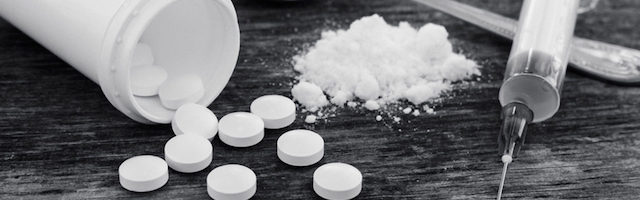

---

[Felice Freyer](https://www.bostonglobe.com/metro/2018/03/29/county-jails-also-receive-inmates-with-addiction-and-some-offer-opioid-medication-treat/dnb1M74zzAwzRjOe3sD4pJ/story.html) at the Globe reports that the US Department of Justice is [investigating violations](https://www.bostonglobe.com/metro/2018/03/28/investigating-treatment-addicted-prisoners-mass/XUDpQI8tdOhB1QPUPljJyM/story.html) of the Americans with Disabilities Act in Massachusetts jails. But Freyer adds that the investigation does not extend to county jails. Prisoners in county lockup basically undergo forced withdrawal ("cold turkey" treatment) because prisons "do not provide the two main medications to treat addiction — buprenorphine and methadone."

Instead, "Massachusetts prisoners nearing discharge are offered a shot of Vivitrol, a drug that blocks the high from opioids for up to a month." *And that's it.* Vivitrol made news recently because the Trump administration's opioid treatment plan is typical of his style of crony capitalism — "a single drug, manufactured by a single company, with mixed views on the evidence regarding its use."  [Vivitrol](https://www.statnews.com/2018/03/26/trump-opioid-plan-alkermes-vivitrol/) will be the only drug treatment given federal prisoners. 

Alkermes, the manufacturer of Vivitrol, works just like a real drug dealer. Through an "Inspiration Grant" [Alkermes gave](http://www.sheriffs.org/nsa-receives-grant-alkermes-assist-medication-assisted-treatment-programs-jails) to the National Sheriff's Association, prison staff and contractors get a "taste" of the drug, then are allowed to buy more with taxpayer money. No wonder that [Vivitrol CEO Richard Pops](https://www.cnbc.com/2018/01/08/alkermes-ceo-our-opioid-addiction-treatment-has-best-days-ahead.html) says "the best days of Vivitrol are still ahead of it."

It is unconscionable that our criminal justice system incarcerates people with drug addictions and then — instead of offering real treatment — administers a questionable drug upon leaving prison for the benefit of a single-source vendor. The Globe's piece only confirms what ex-inmates have told BCCJ. Despite a [quarter of a million dollar grant](http://wbsm.com/bristol-county-sheriffs-department-receives-opioid-grant/) from the Feds for drug treatment, Bristol County is either squandering or simply pocketing the money. The main occupants of our county prisons are substance abusers — and their time spent in these harsh facilities always ends without meaningful drug rehabilitation.

Again, we implore state investigators — the Attorney General, the State Auditor, the governor, *anyone who will listen* — investigate the mis-treatment and non-treatment of people in our county prisons. Prison should be a place for rehabilitation, not abuse.

