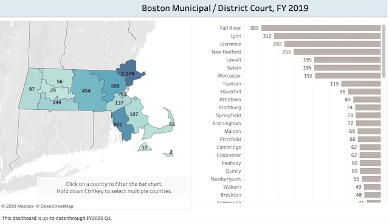

---

Following [two more suicides](/Tom Hodgson/negligent-homicide/) at the Bristol County House of Correction this summer, there has been another death at Tom Hodgson's jail.

While we do not yet know if the cause of death was suicide or an untreated medical issue, it is important to remember that each of these deaths has a human face.

Scott LaJoie, 49, was the father of five children and a grandfather of seven. He was an Army veteran, a musician, and ran a concrete forms business in Westport. On September 27th LaJoie was transported from the jail to Saint Luke's hospital, where he was pronounced dead. His family has asked that donations be sent to [Disabled American Veterans](https://www.potterfuneralservice.com/Obituaries.html).

LaJoie's death occurred while Sheriff Thomas Hodgson was in Washington DC giving President Trump [another award](https://www.southcoasttoday.com/news/20190926/hodgson-congress-border-failure-allows-drugs-to-pour-in). A 2017 suicide at the jail also [coincided](/Tom Hodgson/feet-fire/) with a flurry of anti-immigrant lobbying in Washington by Hodgson.

Following LaJoie's death, his case in [Fall River District Court](court.pdf) (docket #1932CR002613) was dismissed by Judge Kevin J. Finnerty because LaJoie died while never having gotten his day in court. LaJoie had been locked up without even the *possibility* of bail pursuant to Mass General Laws Chapter 276, section 58A.

While Sheriff Tom Hodgson has the highest suicides and the second highest recidivism rate in the state, not to be out-done Bristol County District Attorney Tom Quinn has the highest *per capita* number of 58A hearings and the second (just behind Essex County) *total number* of 58A hearings in
the Commonwealth of Massachusetts, according to [Massachusetts Trial Court data](https://public.tableau.com/profile/drap4687#!/vizhome/MassachusettsTrialCourtDangerousnessHearings/MainDashboard). Democrat Quinn has also [lobbied](/White Supremacy/dangerous-legislation/) for even more draconian provisions in the Dangerousness statutes in concert with Republican Governor Charlie Baker.

Court records tell us that LaJoie had been prescribed various medications. In an April 4th, 2019 entry in docket #1932CR001197, Judge Franco Gobourne allowed LaJoie's motion to see a doctor to get a prescription refilled. It is unclear whether LaJoie ever received those medications. A physician from SouthCoast Health specializing in medical and pharmaceutical management offered condolences.

While it's too early to say if LaJoie's death resulted from jail conditions inducing despair, medical neglect, or the absence of  medically-assisted substance abuse treatment, LaJoie's death is the consequence of overuse of pretrial detention by District Attorney Thomas Quinn and Bristol County judges who rubber-stamp his motions, subjecting prisoners to abusive conditions in the Bristol County Jail.

Court records tell us that LaJoie was locked up in June 2019 when his bail status on an earlier case (docket #1932CR001197) was revoked and prosecutors asked the judge to keep him locked up pursuant to Mass General Laws Chapter 276, section 58A ("Dangerousness") based on the argument that LaJoie was so "dangerous" that *no conditions of release* could ensure the safety of his girlfriend, Rebecca Campbell. 

Campbell had accused LaJoie of threatening to burn down the apartment they shared. As a result, LaJoie was arrested and [incorrectly] charged with an assault on Campbell — and with violating a "no abuse" order issued by the court. The earlier case was dismissed on the trial date, July 16, 2019, when Quinn's office was unprepared to go forward with a trial. Nevertheless, LaJoie remained locked up on the new case (docket #1932CR002613) as a "danger." 

Attorney Sean A. McDermott was then appointed to represent LaJoie. McDermott did not file a single motion in the case and on the pretrial conference report simply checked off a few boxes. So much for zealous legal representation. 

LaJoie's case was scheduled for trial on August 26, 2019 but was continued to September 24, 2019, and then again to October 25, 2019. One can only imagine the despair of a person repeatedly denied bail and kept in perpetual detention without a trial ever in sight.

On September 27th, 2019 Scott LaJoie died at the Bristol County Jail.

