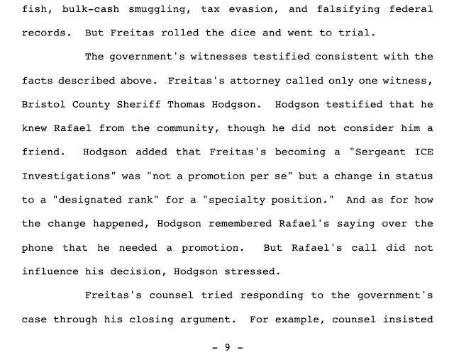
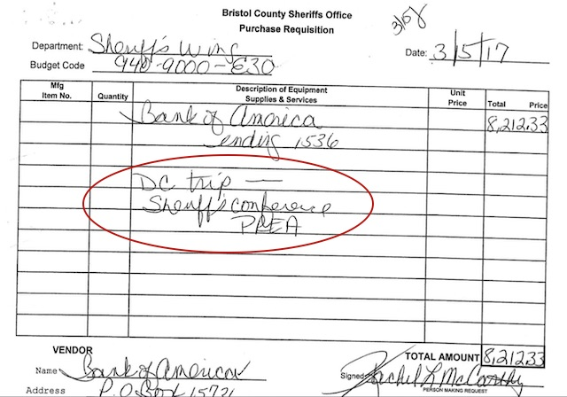
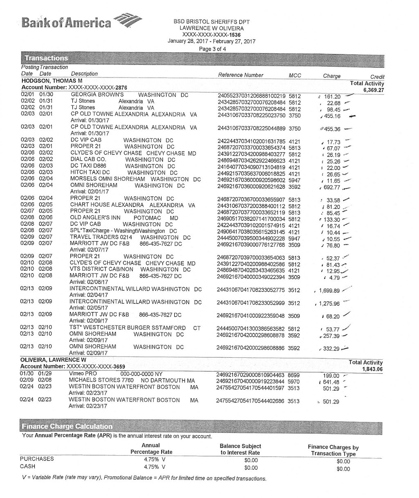
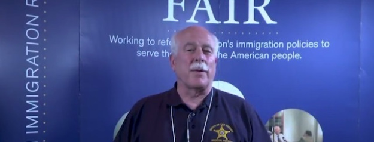

---

Travel [records the ACLU received](https://data.aclum.org/public-records/state-audit-of-bristol-sheriff/) from the Bristol County Sheriff's Office feature the same sloppy paperwork and potential abuses of taxpayer money that a [State Audit warned](https://www.mass.gov/audit/audit-of-the-bristol-county-sheriffs-office) of last February and which Bristol County for Correctional Justice (BCCJ) found in documents from its own [FOIA request](http://bccjustice.org/tiny/bccj-oig) last year. 

BCCJ has previously called for a forensic audit of the Bristol County Sheriff's Office — not just because two of its officers were convicted of [federal money laundering](http://media.ca1.uscourts.gov/pdf.opinions/17-2092P-01A.pdf) charges in the "Godfather" case — and not merely because the sheriff is now being sued for receiving kickbacks from a phone vendor. 

Tom Hodgson has received hundreds of thousands of dollars in grant and forfeiture money that were intended to be used for opioid treatment — and [now we learn](https://data.aclum.org/wp-content/uploads/2019/12/2019.05.29-Response-to-March-18-2019-Request.pdf) that he has never written a single email relating to MAT treatment — and that he lied to the public about his communications with other sheriffs at a 287(g) hearing last April. 

One reasonable conclusion is that the Sheriff's Office is simply pocketing the grant money and using it to subsidize [ICE agreements which actually lose money for the state](/Tom Hodgson/too-good/).

And we've said this before, too: the sheriff is using large sums of taxpayer money to fund a private war on immigrants — a war designed by and coordinated with [white supremacists](/Tom Hodgson/wall-agenda/) within and down the street from the White House. All while neglecting the rehabilitation of prisoners in his jail. 

The ACLU's information request proves it. Their FOIA request shows *hundreds* of Tweets and emails between White House and anti-immigration zealots, including 74 with the White House's resident white supremacist, Stephen Miller — but *nothing* related to helping people with opioid use disorder.

If you believe in math, this is a ratio you can't ignore.

And then there's the sheriff's travel — again. In 2017, shortly after the Trump inauguration, Hodgson spent almost [two weeks in Washington](http://bccjustice.org/tiny/sheriff-travel), DC and in his hometown of Chevy Chase, Maryland. The hand-written cover sheet attached to his travel invoices states that the Sheriff was attending the PREA Conference (the National [Prison Rape Elimination Act Resource Center](https://www.prearesourcecenter.org/) Conference).

This sounds plausible enough — since no one ever really bothers to scrutinize sheriffs' expenses — until you find that the Massachusetts Department of Corrections indeed convened a [PREA Conference](https://www.mass.gov/files/documents/2018/05/23/Final PREA - Annual Report for 2017.pdf) that month, but it was at the Westin Boston Waterfront Hotel — *that's Boston, not DC* — and that Bristol County Sheriff's Office CEO *Lawrence Oliveira* attended it, not Hodgson. 

So what was Hodgson doing in Washington, DC for twelve days between January 30, 2017 and February 12, 2017? The Sheriff's Bank of America statement shows him staying at some pretty swanky places in the nation's capital. And he didn't even send us a thank you.

Absent any oversight of the sheriff's finances — and absent any thorough audits — this would have gone undetected if not for the ACLU's FOIA request.

Was Hodgson visiting family, taking a winter vacation, huddling with his white supremacist buddies at the Federation for American Immigration Reform, meeting with the Trump administration, or what? And why were Massachusetts taxpayers once again footing the bill?

We just don't know. And Hodgson's deceptive record-keeping certainly doesn't shed any light on the truth. It's hard to imagine what sort of pressing county business requires a county sheriff to spend two weeks in luxury hotels in Washington, DC. 

Two decades of friendly "performance" audits by the state have failed to improve Hodgson's record-keeping habits or stop his abuses of taxpayer money. Once [again](/Tom Hodgson/too-good/) we call for a forensic audit of the Bristol County House of Corrections.

