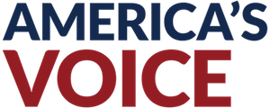

---

### Two Hate Conferences Came to Washington, D.C. Last Week

#### Here’s Who Attended

*by [Zachary Mueller](https://americasvoice.org/blog/who-attended-feet-to-the-fire-act-2018/) on September 10, 2018, re-posted with permission*

Last week the [Federation for American Immigration Reform (FAIR)](https://www.splcenter.org/fighting-hate/extremist-files/group/federation-american-immigration-reform) and [ACT for America](https://www.splcenter.org/fighting-hate/extremist-files/group/act-america), both listed as hate groups by the Southern Poverty Law Center and both with ties to the [Trump Administration](https://americasvoice.org/press_releases/this-week-two-hate-conferences-set-up-shop-in-washington-d-c/), held overlapping conferences in Washington D.C. Despite advocates’ efforts to warn members of Congress away from participating, both featured a number of GOP House members, proving once again that bigotry has unfortunately become a hallmark of today’s Republican Party.

FAIR is an anti-immigrant hate group that was founded by white nationalist John Tanton, who helped create a network of anti-immigrant organizations — many of which are also hate groups. For this year’s “Hold Their Feet to the Fire”, an [annual event](https://www.splcenter.org/hatewatch/2018/09/04/tied-tightly-trump-anti-immigration-group-fair-takes-capital-%E2%80%94-and-airwaves-%E2%80%94-once-again), FAIR brought in anti-immigrant activists and far-right talk radio hosts from across the country to amplify their anti-immigrant messages. The conference also attracted a number of elected and appointed officials.

One of them was [Ronald Vitiello](https://americasvoice.org/press_releases/frank-sharry-to-the-u-s-senate-reject-the-nomination-of-ronald-vitiello-to-head-ice/), the acting director of ICE, who came to speake with [far-right talk radio host Tom Roten](https://twitter.com/TomRoten/status/1037371066438627329). On the show, Vitiello defended the policy of [separating families at the border](https://americasvoice.org/blog/separation-of-children/) and racistly characterized immigrants as the bearers of crime and disease. 

At least ten Republican members of Congress participated in the conference, including Republican Senate candidate and Congressman [Lou Barletta](https://americasvoice.org/blog/lou-barletta/) (PA – 11), Steve King (IA – 04), Andrew Biggs, (AZ – 05), Clay Higgins (LA -03), Mo Brooks (AL – 05), Louie Gohmert (TX-01), Bill Johnson (OH -06), Bradley Byrne (AL – 01), Raúl R. Labrador (ID – 01), Jim Renacci (OH – 16), as well as the candidate for Alabama’s 6th Congressional district Gary Palmer.

FAIR also helped facilitate a gathering of [49 sheriffs](https://twitter.com/NationalSheriff/status/1037448104839180300) from across the country, including known anti-immigrant Sheriff Tom Hodgson of Bristol County, Massachusetts and Sheriff Andy Louderback of Jackson County, Texas. All the sheriffs met with Reps. King, Biggs, Higgins, and Brooks before heading to the White House for an event with both President Trump and Vince President Pence.

[Louderback](https://twitter.com/BCSO1/status/1037427583485456390), at the White House roundtable discussion with Pence, called for greater law enforcement participation in [immigration](https://www.americanprogress.org/issues/immigration/reports/2018/03/20/448172/whats-at-stake/) crackdowns. Hodgson, who sits on FAIR’s board of directors, appeared on the Two Way Radio Show to brag about how he built a immigration detention facility to detain immigrants for ICE and how his deputies would drive immigrants three and a half hours to the JFK airport for ICE. He even encouraged the White House to turn the DMV into a tool for immigration enforcement, and called for the arrest of any elected official that supports [safe city policies](https://americasvoice.org/blog/what-is-a-sanctuary-city/).

Meanwhile, the ACT for America conference featured speeches from Republican Reps. Jeff Duncan, (SC-03), Louie Gohmert (TX-01), and Doug Lamborn (CO-05). Former director of ICE [Thomas Homan ](https://americasvoice.org/blog/thomas-homan/)and Texas Senator Ted Cruz both attended and accepted awards.

ACT for America is an anti-Muslim hate group whose founder, [Brigitte Gabriel](https://www.splcenter.org/hatewatch/2017/03/23/who-real-brigitte-gabriel), stated that “[every practicing Muslim is a radical Muslim”](https://web.archive.org/web/20070907090017/http://www.ajn.com.au/news/news.asp?pgID=3403) and wrote in her 2006 book that Muslims are a “natural threat to civilized people of the world, particularly Western society.” ACT has continually promoted [“anti-Sharia laws”](https://www.splcenter.org/hatewatch/2018/02/05/anti-sharia-law-bills-united-states) and Islamophobic conspiracy theories. They also organized [nationwide anti-Muslim rallies](https://www.huffingtonpost.com/entry/anti-sharia-group-with-close-ties-to-trump-has-a-nazi-problem_us_59d2a231e4b048a44324852b) in June 2017, which attracted the white nationalist and neo-Nazi groups which attended the rally in Charlottesville, Virginia, that following August. 