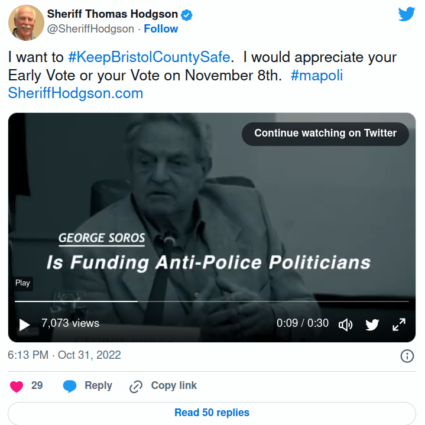
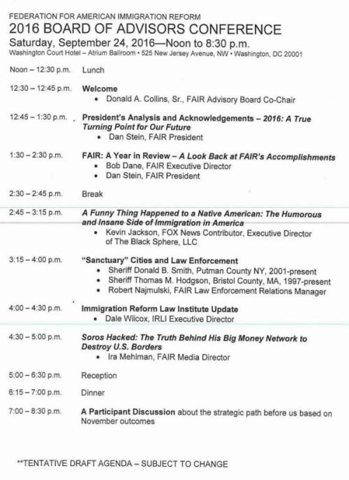

---
 
On October 31st Bristol County Sheriff Thomas Hodgson dropped another [ Willie Horton style campaign ad](https://twitter.com/SheriffHodgson/status/1587206119969079296). He'd already tried to frighten voters by accusing his opponent of coddling pedophiles with a non-existent vote on non-existent legislation.

This time Hodgson's target was George Soros — who Hodgson accused of coddling criminals, funding his opponent, and having the ultimate goal of destroying America: "*They* have their sights set on our way of life," Hodgson warned with an ominous "they."

The hate groups Hodgson works with — and on whose advisory board he sits — all hate Soros, a Hungarian Jewish philanthropist who was *not* involved in funding the anti-Hodgson campaign ads that have so irked the sheriff. Nope, it was [Everytown for Gun Safety](https://www.bloomberg.org/founders-projects/everytown-for-gun-safety/), the work of American Jewish philanthropist Michael Bloomberg, a frequent thorn in the side of NRA shills like Hodgson.

At first blush the sheriff, who already has a racism problem, didn’t seem to be able to keep his Jews straight.

But Hodgson's "mistake" was intentional. Like his dishonest pedophile-coddling scare ad, this one was calculated to reach a certain constituency who watches [ Glen Beck](https://www.thedailybeast.com/glenn-becks-anti-semitic-attack-on-george-soros) ("Soros: The Puppet Master") or [ Tucker Carlson](https://www.foxnews.com/video/6310442726112) ("Soros has decided to destroy the American justice system") — a constituency whose political heroes returned recently from [CPAC-Hungary](https://www.conservative.org/cpac/cpac-hungary/), where autocratic Christian nationalist president Viktor Orban, [ shut down](https://www.cbsnews.com/news/george-soros-funded-central-european-university-forced-out-of-hungary-by-pm-viktor-orban/) a university Soros founded and used the pandemic as a pretext for a [ power grab](https://www.theguardian.com/commentisfree/2020/mar/29/the-guardian-view-on-hungarys-coronavirus-law-orbans-power-grab).

For today's new crop of antisemites, George Soros has replaced a 19th Century *j'accuse* involving financier [Nathan Rothschild](https://www.britannica.com/story/where-do-anti-semitic-conspiracy-theories-about-the-rothschild-family-come-from) which went on to become a 200-year conspiracy theory.

The [sheriff's antisemitic ad](https://twitter.com/SheriffHodgson/status/1587206119969079296) was promptly slammed by Elizabeth [Warren](https://twitter.com/ewarren/status/1587818723611746307), Ed [ Markey](https://www.wpri.com/news/elections/markey-dems-rebuke-sheriff-hodgson-over-campaign-ad-referencing-soros/), Deborah Goldberg, and other Massachusetts politicos. [ Hodgson's Tweet](https://twitter.com/SheriffHodgson/status/1587206119969079296) also drew more than 60 comments, most [ negative](https://bccjustice.org/wp-content/uploads/2022/11/hodgson-antisemitism.html): "Well if that isn't the most antisemitic thing I've heard all day... Honestly Southeastern MA, he is the biggest embarrassment in the Commonwealth... Your mustache is too wide. You gotta trim it to just a little patch under your nose... Halloween's over but maybe next year you can go full Nazi cosplay..."

Another [commented](https://twitter.com/dancindoti/status/1587819151346860034): "These people no longer have dog whistles they have bull horns. It is no longer a silent wink wink it is full out public bigotry…"

In choosing George Soros — the wrong Jew, and he knew it! — Hodgson was trotting out time-worn antisemitic tropes, implying that "they" are unpatriotic and systematically destroying "our way of life" — which MAGA politicians themselves freely call white [ Christian nationalism](https://www.newsweek.com/marjorie-taylor-greene-christian-nationalism-comments-social-media-reaction-1712733). There’s really not much of a line between this and the Charlottesville *tiki-torch* neo-Nazis with their “Jews will not replace us.”

For years the [Anti-Defamation League](https://www.adl.org/about/who-we-are) has tracked two organizations Hodgson is intimately involved with — the Federation for American Immigration Reform ([FAIR](https://www.splcenter.org/fighting-hate/intelligence-report/2007/federation-american-immigration-reform’s-hate-filled-track-record)) and the Center for Immigration Studies ([CIS](https://www.washingtonpost.com/opinions/does-the-center-for-immigration-studies-deserve-to-be-labeled-a-hate-group/2017/03/24/89ab4cda-0f38-11e7-aa57-2ca1b05c41b8_story.html)). The ADL's factsheet "Mainstreaming Hate" describes one a as hate group and the other as an extremist organization. In 2018 the ADL published "The Antisemitism Lurking Behind George Soros Conspiracy Theories," which explains why groups like FAIR and CIS are [ so obsessed with](https://www.adl.org/blog/the-antisemitism-lurking-behind-george-soros-conspiracy-theories) Soros. They routinely employ precisely the same dog whistles Hodgson used not-so-subtly in his antisemitic campaign ad: "They have their sights set on our way of life."

In his defense, Hodgson tweeted that he couldn't possibly be an antisemite because his parents are buried in a private crypt on the Mount of Olives in Jerusalem. Yet antisemitism was no impediment to Hodgson's father, "Sir John," being buried in Israel. According to a [ memoir](https://www.harpercollins.com/products/hiding-out-tina-alexis-allen?variant=32116612759586) written by Hodgson's youngest sister, their parents were given a private crypt in Israel because of "Sir John's" services to the Vatican. The memoir recounts numerous examples of the father's antisemitism. The elder Hodgson's burial in a churchyard says everything about his connection to the Church and nothing about respect for Jews.

For years Hodgson has attended events sponsored by FAIR and its front groups, as well as an event called "Hold their Feet to the Fire," where sheriffs and a variety of homophobes, Neo-confederates, Muslim-bashers, antisemites, and Christian Nationalists fill slots on right-wing talk radio programs. In 2016 Hodgson [ gave a talk](https://bccjustice.org/wp-content/uploads/2022/10/hodgson-2016.jpg) at a FAIR national advisory meeting that preceded one by Ira Mehlman entitled "Soros Hacked: The Truth Behind His Big Money Network to Destroy U.S. Borders."

Mehlman calls Soros’ [ Open Society Institute](https://www.fairus.org/sites/default/files/2017-08/September2016_IR.pdf) a “shadowy foundation” with a “globalist agenda” to attack U.S. immigration policy. But “globalist” is white supremacist code for “Jewish” and FAIR and CIS have an axe to grind with Soros not *only* because he is a liberal philanthropist, but *especially* because he is a liberal Jew.

The American Jewish Committee has [ this](https://www.ajc.org/translatehate/globalist) to say about so-called "globalists":

> "Much like *dual loyalty*, *Globalist* is used to promote the antisemitic conspiracy that Jewish people do not have allegiance to their countries of origin, like the United States, but to some worldwide order—like a global economy or international political system—that will enhance their control over the world’s banks, governments, and media. […] Today, Globalist is a coded word for Jews who are seen as international elites conspiring to weaken or dismantle “Western” society using their international connections and control over big corporations (see [ New World Order](https://www.ajc.org/translatehate/New-World-Order))—all echoing the destructive theory that Jews hold greed and tribe above country."

In 2001 Stephen Steinlight published a report for the [ Center for Immigration Studies](https://cis.org/Report/Jewish-Stake-Americas-Changing-Demography) — a group with which Hodgson has testified at Congress many times — entitled "The Jewish State in America's Changing Demography." Steinlight blasted secular Jews for their historical support for liberal immigration policies, arguing that Mexicans would soon erode Jewish political power. Steinlight said that his own views had been changed though dialogue with CIS Executive Director [ Mark Krikorian](https://www.laprogressive.com/immigration-reform/mark-krikorian-haitis-screwed-wasnt-colonized-long), a racist who once said "My guess is that Haiti’s so screwed up because it wasn’t colonized long enough…"

In 2004 Steinlight [ ratcheted up](https://cis.org/Report/High-Noon-Midnight-Why-Current-Immigration-Policy-Dooms-American-Jewry) his polemics with an essay, "High Noon to Midnight: Why Current Immigration Policy Dooms American Jewry," but he still wasn't making progress with secular Jews. By 2010 Steinlight was frustrated and angry at his co-religionists, [ accusing leading Jewish organizations](https://cis.org/Steinlight/Jewish-Establishment-Censorship-Information-Immigration-Policy) of censorship and repression.

In 2015 Hodgson joined American Family Association’s governmental affairs director and FOX News contributor Sandy Rios on her radio show at the U.S. Capitol. Rios claims that [ secular Jews](https://www.rightwingwatch.org/post/sandy-rios-says-secular-jews-have-been-the-worst-enemies-of-the-country/) have been the worst enemy of the country, that “so many of the Jews in this country are atheist” and “sometimes turn out to be [the worst enemies of the country](https://www.youtube.com/watch?v=W_RpyH8B194&feature=youtu.be)" — a sentiment that former president and Hodgson idol Donald Trump echoed on October 16th when he wrote, "Jews have to get their act together…"

Hodgson is so often found in cesspools with antisemites and racists that he can hardly smell the sewage. A case in point is Hodgson's flirtation with Rick Wiles, a [ virulent antisemite](https://www.adl.org/resources/backgrounders/trunews-and-rick-wiles-end-times-anti-semitism-and-anti-zionism) and Christian nationalist who [ renounced](https://www.dailykos.com/stories/2015/7/3/1399014/-End-Times-broadcaster-Rick-Wiles-Renounces-his-American-Citizenship-because-of-Marriage-Equality) his US citizenship because of marriage equality. Wiles broadcasts an "End Time" radio program that has [featured Hodgson](https://bccjustice.org/wp-content/uploads/2022/11/TRUNEWS-112614.mp4) and received [ Trump White House](https://www.nytimes.com/2020/01/26/business/media/trunews-white-house-press-credentials.html) press credentials.

Hodgson's numerous and habitual problems with hate groups and bigotry are bad enough. But this is what he has chosen to do instead of competently running his jails and making a best effort to rehabilitate people.

Vote this embarrassment out of office on November 8th.

Choose Paul Heroux.

