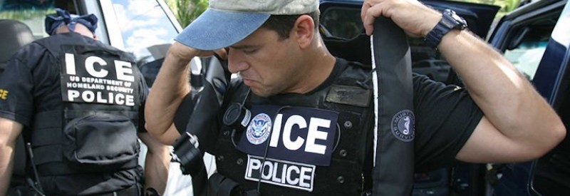
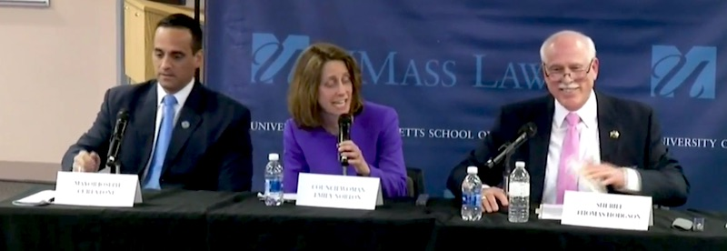

---

They swarm the porch shouting "Police!" But it's a lie.

It sounds like something out of a totalitarian state, and it is -- Immigration and Customs Enforcement (ICE) are [allowed to lie to citizens](http://www.latimes.com/local/lanow/la-me-immigration-deportation-ruses-20170219-story.html) -- even impersonate police officers. But the *real* police don't like it at all. It undermines trust and creates problems. And it's gotten so bad that Los Angeles Mayor Eric Garcetti, the LA City attorney, and City Council President Herb Wesson [sent a letter to ICE](http://losangeles.cbslocal.com/2017/02/23/la-mayor-to-ice-agents-stop-misidentifying-yourselves/) telling them to knock it off.

As the LAPD, the city's police department, had to point out, rousting and terrifying communities [undermines actual police work](http://www.seattletimes.com/opinion/crackdown-on-immigrants-undermines-public-safety/). The problem is so severe and so widespread that a [proposed House Bill](https://www.washingtonpost.com/news/powerpost/wp/2017/04/07/a-new-house-bill-would-ban-ice-agents-from-identifying-themselves-as-police-officers/) seeks to end the practice by prohibiting ICE agents from lying about *who* they are.

This single issue highlights an important point -- that federal and local policing have different objectives. Donald Trump's xenophobic purge of brown people should not be conflated with the needs of American cities.

With already serious problems of police militarization, taser abuse, police shootings, racism and misconduct elsewhere, many communities are trying to do something about it -- regain control over the hiring and firing of officers, conducting public reviews of police misconduct cases, and re-introducing community policing. But now they have *another* problem -- ICE agents eroding the trust of communities that police departments serve.

Police officers are obliged to forward fingerprints and other arrest information to a variety of federal databases, and they often detain suspected criminals on behalf of Immigration and Custom Enforcement -- only as long as the Constitution permits. But in communities with large immigrant and minority populations, many police departments would simply rather not be in the Immigration business. In [Santa Clara County](http://www.mercurynews.com/2017/03/20/editorial-sanctuary-and-public-safety-can-be-compatible-goals/), California, for example, the DA and county police chiefs signed an agreement spelling out their involvement with federal policing:

> “The agencies of this county **will not enforce federal immigration laws**,” said Morgan Hill police Chief David Swing, president of the county chiefs association. “**It is not our mission nor our role** … we will treat all of our residents with dignity regardless of status.”

Conscientious police officials also adhere to the letter of the law by [not honoring ICE detainers beyond certain limits](https://www.policeone.com/legal-issues/articles/323613006-Sheriffs-say-legal-issues-hinder-ICE-cooperation/) -- because? -- well, because the U.S. Constitution says so:

> Two weeks ago, the Department of Homeland Security started issuing a weekly report that aims to identify and **publicly shame law enforcement agencies** that released people from custody despite an ICE detainer request. And U.S. Attorney General Jeff Sessions went a step further last week, promising to withhold federal funding from law enforcement departments that don’t get in line with ICE. But several sheriffs said their defiance is not rooted in ethical or political opposition but legal concerns. Federal court rulings, including one in Oregon where **a judge found that police violated a woman’s constitutional rights by keeping her in jail at ICE’s request**, have left California’s law enforcement officials worrying that they could expose themselves to legal troubles for doing the same.

In fact, according to the National Sheriffs Assocation, a **majority** of sheriffs departments have stopped honoring ICE hold requests because so many of them are unconstitutional.

Tom Hodgson, ever the right-wing grandstander, appeared yesterday at a [forum on immigration at the UMass Law School](https://www.bostonglobe.com/metro/2017/04/06/hodgson-curtatone-spar-debate-over-immigration/oOff5rBkvwSZhMvmdFNXxH/story.html) in [Dartmouth](http://wbsm.com/umass-law-symposium-to-focus-on-immigration-sanctuary-cities/). By the next afternoon he was [making guest appearances](http://wbsm.com/howie-carr-state-reps-sheriff-hodgson-to-appear-at-new-bedford-rally-friday/) with shock jock Howie Carr, auditioning for [Joe Arpaio's](https://en.wikipedia.org/wiki/Joe_Arpaio) old job -- *Wingnut Sheriff of America*.  One wonders why the guy can't put in a full day at work. But I digress..

Besides previously [calling for the arrest](http://www.masslive.com/news/index.ssf/2017/03/bristol_county_sheriff_thomas_1.html) of a co-panelist, Somerville Mayor Joe Curtatone, Hodgson made a number of odd and false claims: that sanctuary cities are hotbeds of crime ([statistics say otherwise](https://www.washingtonpost.com/news/wonk/wp/2017/01/27/trump-says-sanctuary-cities-are-hotbeds-of-crime-data-say-the-opposite/)); that California prohibits reporting to ICE of human traffickers and gun runners (a lie [politifact](http://www.politifact.com/texas/statements/2017/feb/10/dawn-buckingham/dawn-buckingham-incorrectly-says-hundreds-illegal-/) rates as false); that terrorists hide out in sanctuary cities and Massachusetts is a "magnet" for terrorists ("we have terrorists all over this state," he said, sounding a lot like Donald Trump); and that no statistics support that improved policing occurs in cities where openness with officers is improved by not being part-time ICE agents.

On Hodgson's last point -- it's possible that the statistics are as hard to come by as police shooting data, but according to Chuck Wexler, executive director of the Police Executive Research Forum, the nation's police chiefs know something our local talk radio gadfly doesn't -- that [sanctuary cities keep crime down](http://www.latimes.com/opinion/op-ed/la-oe-wexler-sanctuary-cities-immigration-crime-20170306-story.html). And apparently the still unaggregated data confirms it to their satisfaction.

But whether we call them [sanctuary](https://www.washingtonpost.com/graphics/national/sanctuary-cities/) cities, [freedom](https://www.aclu.org/blog/speak-freely/freedom-cities-campaign-resistance-through-progress-local-level) cities, or give them some other designation, the real debate has nothing to do with "sanctuary" -- and everything to do with local control of police departments.

There is no suspension of federal law in cities that do not compel Officer Friendly to become an ICE agent. There is no suspension of federal law in cities that hold all suspects for a Constitutionally permitted period. There is no suspension of federal law when cities complain that ICE agents are lying to citizens and undermining the trust of their communities. There is no suspension of federal law when cities, counties, and states decide -- for themselves -- what kind of community policing they want to do.

There are now three bills in the Massachusetts legislature that would help the Commonwealth protect our communities and community policing programs from ICE and rogue sheriffs.

- The [Safe Communities Act](https://malegislature.gov/Bills/190/S1305), S.1305, proposed by Senator James B. Eldridge
- An [Act Relative to Enforcing Federal Law](https://malegislature.gov/Bills/190/H3033), H.3033, proposed by Rep. Antonio F.D. Cabral
- An [Act Limiting the Use of Prison Labor](https://malegislature.gov/Bills/190/H3034), H.3034, also proposed by Rep. Antonio F.D. Cabral

Next time -- I'll be asking you to call your representatives to support these important pieces of legislation.

