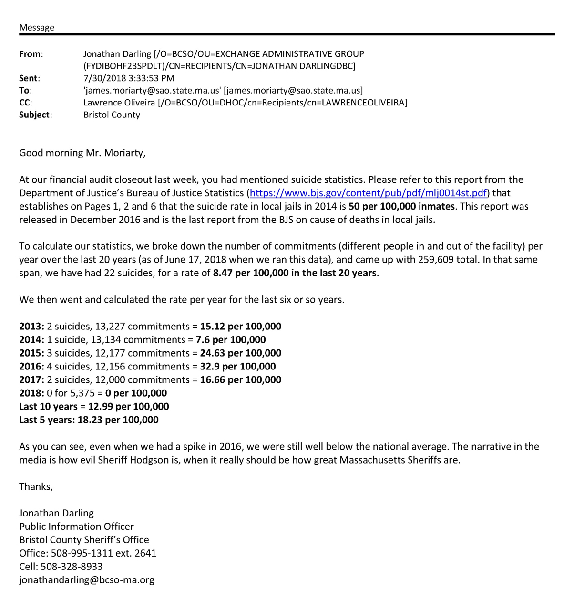

---

The ACLU's FOIA request yielded communication between the Bristol County Sheriff's Office (BCSO) and the Office of the State Auditor, which in 2018 conducted a [performance audit](https://www.mass.gov/audit/audit-of-the-bristol-county-sheriffs-office) that noted the BCSO's (1) failure to reimburse the state $350K until it was caught; (2) failure to update its per-diem custody and care rate for ICE; (3) failure to file inmate total cost reports; and (4) failure to properly document travel records.

The Auditor was asked to look into suicide rates at the jail and her field auditors did. But they looked at only two years of suicide data — 2016 and 2017. It would have been better if the Auditor had used more thorough, accurate and statistically meaningful data, such as that collected by the [New England Center for Investigative Reporting](https://public.tableau.com/profile/new.england.center.for.investigative.reporting#!/vizhome/MassachusettsJailSuicidesbyCounty/JailSuicidesbyCounty), which looked at Massachusetts jail suicides from 2006 to 2016. 

The BCSO, in fact, had 20 years of data and offered numbers for 2013 forward, but it would have been work to compare it to other counties in the state because there is no formal mechanism in Massachusetts government (other than a FOIA request or an audit) to collect mortality data from state correctional facilities. Neither the [Massachusetts Department of Correction](https://www.mass.gov/orgs/massachusetts-department-of-correction) nor the [Massachusetts Sheriff's Association](https://www.mass.gov/orgs/massachusetts-sheriffs-association) collects, much less publishes, such data for public or research. So, for the first time ever by an agency of the state, it was up to bean counters to look at jail suicides while doing a financial audit.

In citing Bureau of Justice (BJS) [statistics](https://www.bjs.gov/content/pub/pdf/mlj0014st.pdf) to Auditor James Moriarty, Jonathan Darling compared BCSO suicides with national averages. According to the BJS report Darling cited, "the suicide rate in local jails in 2014 was 50 per 100,000 local jail inmates. **This is the highest suicide rate observed in local jails since 2000 (table 4).**" 

Having chosen the highest national rate to compare with his jail's suicides, Darling wrote:

> "As you can see, even when we had a spike in 2016, we were still well below the national average. The narrative in the media is how evil Sheriff Hodgson is, when it really should be how great Massachusetts Sheriffs are."

**But several of the families whose loved ones committed suicide on Hodgson's watch didn't think he was such a great sheriff. They have filed wrongful death lawsuits.**

If you want to verify the BJS data Darling cited, it can't be done. Bureau of Justice Statistics "Deaths in Custody Reporting Program" ([DCRP](https://www.bjs.gov/index.cfm?ty=dcdetail&iid=243)) data is collected by [RTI International](https://www.rti.org/impact/deaths-custody-reporting-program), a research group originally founded by USAID. OpenSecrets shows 80% of [RTI's corporate principals](https://www.opensecrets.org/federal-lobbying/clients/lobbyists?id=D000037271&cycle=2019) are connected with a lobbying firm, Cornerstone Government Affairs, otherwise known as the [Pentagon's lobbyist](https://www.intelligenceonline.com/government-intelligence/2016/04/13/cornerstone-pentagon-s-go-to-lobbyist,108145194-eve). The data — even "sanitized" and stripped of personal identification —  [may simply not be accessed](https://www.icpsr.umich.edu/icpsrweb/NACJD/studies/36304/datadocumentation#) by the public:

> Due to the sensitive nature of the data and to protect respondent  confidentiality, the data are restricted from general dissemination. These data are enclave-only and may only be accessed at ICPSR's location in Ann Arbor, MI. Users wishing to view these data must first contact NACJD, complete an Application for use of the ICPSR Data Enclave  (available as part of the documentation for this study), and receive permission to analyze the files before traveling to Ann Arbor. 

But it doesn't matter now. DCRP data has not been updated since 2014 and it appears that the Justice Deparment under Trump has stopped collecting it.

Sheriffs love accountability — for everyone but themselves. But because of the secretive and undependable availability of federal jail death statistics and a lack of public reporting by the Massachusetts Sheriff's Association or the state Department of Correction, the only way to get the data is for Massachusetts legislators to **mandate** the monthly collection and publication of detailed mortality statistics from DOC prisons and county jails.

Let's see the data.

