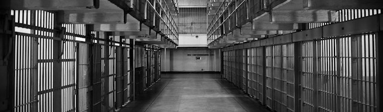
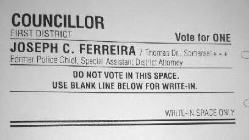

---

We are distracted by so many simultaneous assaults on human and civil rights today that it's easy to forget those caught up in America's massive [prison population](https://www.vox.com/2015/7/13/8913297/mass-incarceration-maps-charts) — the largest in the world. This includes people who need to stay away from the rest of us for a long, long time. But most of those languishing in American prisons today are guilty of lesser offenses — usually drugs and theft to support their addictions. Once they enter the "system" America's Puritanical instincts kick in and we brand them with a scarlet letter for the rest of their lives. And if we don't forget them *completely*, we banish all thought of how prison abuse will scar them — and society — for decades to come. *Lock 'em up and throw away the key.* 

Unfortunately, the criminal "justice" system runs without oversight by elected officials who have the thinnest of mandates.

In September Massachusetts voters will select primary candidates. Forget gerrymandering, forget voter suppression, forget Russian hackers. Massachusetts itself inflicts the most damage on its own democracy through apathy and patronage. In the last state election only 34 of 160 state House races had challengers from more than one party — an [uncontested rate](http://journalgazette.net/news/politics/20170626/uncontestedraces-telling) of 79%. With this level of apathy, voters truly get the democracy they deserve — patronage, careerists or grandstanding politicians. And a substandard, inhuman, expensive prison system.

Southeastern Massachusetts has three Trump Republican sheriffs who participate in Immigration and Customs Enforcement (ICE) 287(g) programs. Bristol County's sheriff sits on the [advisory board](http://imagine2050.newcomm.org/2017/11/29/anti-immigrant-sheriff-thomas-hodgson-joins-fairs-advisory-board/) of a group the Southern Poverty Law Center calls a [hate group](https://www.splcenter.org/hatewatch/2017/07/07/trump-adviser-hate-group-leaders-and-anti-immigrant-politicians-attend-fair%E2%80%99s-hold-their). County Democrats elected a Republican, Thomas Hodgson, over a Democrat in the 2010 sheriff's race. Hodgson's facilities are known for horrific conditions, health and safety violations, abuse of [solitary](http://www.thesunchronicle.com/news/local_news/mentally-ill-inmates-sue-bristol-county-sheriff/article_96ab7be2-6b58-547b-8c25-335ad459b7f6.html) confinement, and [abnormally high suicide rates](https://www.huffingtonpost.com/entry/behind-the-wall-suicides-mount-in-massachusetts-county-jails_us_5910867fe4b0104c7350b69b). Yet Bristol Country voters haven't tried to hold the sheriff accountable, nor have state and local agencies. It will be up to voters to replace him in 2022.

But Hodgson [ran unopposed](http://electionstats.state.ma.us/elections/search/year_from:2016/year_to:2017/office_id:386) in 2016 — like a majority of sheriffs that year.

If the school-to-prison pipeline ends in overcrowded, unsanitary cells or solitary confinement, a critical junction on that line is the DA's office. Nationwide, elected district attorneys have enormous latitude to prosecute (or not), lay on trumped-up charges (or not), send the accused to lockup (or not), set bail (reasonable or not), negotiate plea deals, and seek jail time or diversion programs. 

Often outright [enemies of civil liberties](https://privacysos.org/blog/massachusetts-prosecutors-want-dangerous-new-surveillance-powers-less-48-hours-stop/), Massachusetts district attorneys have destroyed lives, in many cases defending [tainted convictions](https://www.innocenceproject.org/ma-court-dismisses-drug-convictions-tainted-lab-analyst/) with [tainted evidence](https://www.washingtonpost.com/news/true-crime/wp/2017/12/28/massachusetts-prosecutors-to-throw-out-8000-convictions-in-second-drug-lab-scandal/?utm_term=.b5dfa1394be6), and [nine out of eleven](http://www.masslive.com/politics/index.ssf/2017/10/massachusetts_prosecutors_oppo.html) state DAs staunchly opposed criminal justice reform legislation. Nationwide, district attorneys have discovered that running on a "law and order" platform — going after the weakest and most vulnerable in society by labeling them "superpredators" — is a winning election strategy.

In Bristol County, for example, DA Thomas Quinn used the full force of his office to come down with vengeance on a [troubled teenager](https://www.cnn.com/2017/08/03/us/michelle-carter-texting-suicide-sentencing/index.html) who encouraged an equally troubled friend to end his life. Mercifully, a judge gave the defendant a fraction of the 12-20 year sentence the DA wanted. Though [Quinn says](http://www.southcoasttoday.com/news/20180211/with-eyes-on-full-term-district-attorney-quinn-talks-about-experience) he likes the idea of drug courts, he wants to extend incarceration without bail for super "dangerous" individuals from 120 days to one year. Quinn already bears considerable responsibility for the miserable overcrowding in the Bristol County jails *he* has filled, whose inmates are subjected to abusive conditions by the sheriff.

Quinn was [appointed by the governor](https://www.bostonglobe.com/metro/2015/01/16/baker-appoints-quinn-bristol-county/0o7jehsbCQBZLK2n6dAkcK/story.html) after his predecessor's resignation — and then [ran unopposed](http://electionstats.state.ma.us/elections/search/year_from:2016/year_to:2017/office_id:530) in primary and general elections in 2016.

https://www.youtube.com/watch?v=aVPIsuVp9X4

Very few voters know who their county DA is — much less anything about his handiwork. The ACLU recently announced an initiative called [What a difference a DA makes](https://dadifference.org/). Since a district attorney is an elected official who can potentially do a lot of damage, the ACLU's message is — "buyer beware!"  By late summer voters should have a scorecard on their district attorneys. But this still won't solve the problem of uncontested races. And it's a little late for this election cycle.

In Massachusetts judges are *selected*, not elected. Selection is the responsibility of the governor and the [Governor's Council](https://www.mass.gov/service-details/councillors), a body composed of representatives from the state's eight Senatorial districts and chaired by the Lieutenant Governor. Besides selecting judges, notaries, and justices of the peace, the Council considers [pardons and commutations](https://www.mass.gov/service-details/executive-clemency-overview). In Bristol County the previous Councillor for the First District seemed to alternate between [two brothers](http://www.heraldnews.com/article/20121107/News/311079840) — Democrat Oliver Cipollini and Republican Charles Cipollini. Voters didn't seem to notice which brother stood for election or care that the race was uncontested.

Today, representing the First District (Bristol, Plymouth, Barnstable, and Duke counties), we have Joseph C. Ferreira, former police chief in Somerset, a former Assistant DA, and now a lawyer at Lynch & Lynch. At the Democratic caucuses on February 11th Ferreira and his signature collectors signaled he was running on a "law and order" platform — tougher judges, tougher sentences. In a [2015 interview](http://www.heraldnews.com/article/20150104/News/150108999) with the Fall River Herald, Ferreira spelled out one of his rules for selecting judges: “You never want to see someone lean to the left too much." Whether you like Ferreira or not, this is what the Democratic Party is currently offering.

If 2018 is [anything like 2016](http://electionstats.state.ma.us/elections/search/year_from:2016/year_to:2017/office_id:529), Joe Ferreira will run another uncontested race in both the primary and general election.

