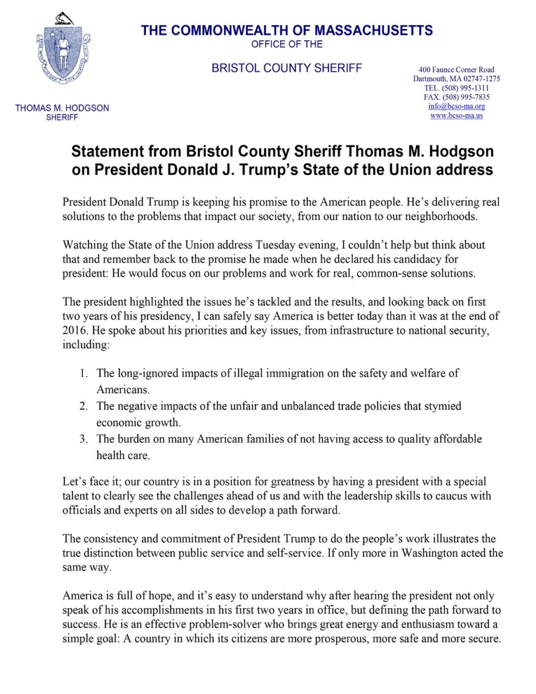

---

### Lickspittle

Like the Anglo-American position of "High Sheriff" the word "lickspittle" is a relic of the 17th century. The phrase "lick the spittle" as a repulsive act dates back to the 1640s.

### Pronunciation

lick·​spit·​tle \| \\ ˈlik-ˌspi-tᵊl \\

### Definition

**lickspittle** *(noun)*: a fawning subordinate, sycophant, abject toady, one who will do any repulsive thing

### Synonyms

apple-polisher; ass-kisser; boot-licker; brown-noser; fawner; flatterer; flunky; groveler; lackey; suck-up; sycophant; toady; truckler; yes-man

### Example

