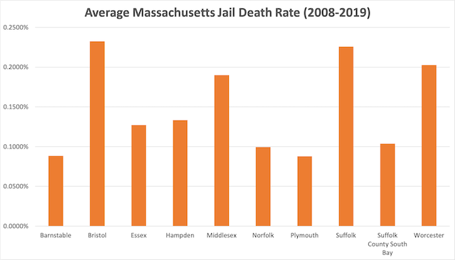

---
 

Bristol County Sheriff Thomas Hodgson must be feeling the stinging criticisms of his substandard jail food, his systematic violations of human rights, his suicides, his recidivism rate, and his refusal to help inmates deal with drug addiction. 

After 24 years in office, only *this week* – barely a week before an election that could well unseat him – Hodgson announced to great fanfare that he had scored a "perfect score" on his [opioid treatment program](https://www.newbedfordguide.com/bristol-sheriffs-office-perfect-score-opioid-treatment-audit-earns-independent-national-accreditation/2022/11/02) from the National Commission on Correctional Health Care, joining his "perfect score" from the American Corrections Association.

#### ***ACA Certifications not worth the paper they're printed on***

Readers of this newsletter are aware that [ACA certifications are not worth the paper they're printed on](https://ehrens.substack.com/p/sham-accreditations). As Senator [Elizabeth Warren](https://www.warren.senate.gov/imo/media/doc/The Accreditation Con - December 2020.pdf) found when investigating them:

> “**The ACA accreditation process is a rubber stamp**. It is almost impossible for a facility to fail an ACA audit. The ACA grants facilities three months’ advance notice of audits; provides facilities with “technical assistance,” including “standards checklists” and an “audit readiness evaluation” that help a facility know when to schedule its audit and what to expect; and, at a facility’s request, will conduct a “mock audit” to help the facility prepare.4 If problems persist despite these ample opportunities to correct—or hide—them, the ACA Commissioners can ignore audit finding altogether and allow a facility that failed its audit to receive accreditation, rendering these standards toothless.”

#### ***Ditto, NCCHC certifications***

It turns out that the **NCCHC certifications are equally meaningless**. A 2016 article in [Prison Legal News](https://www.prisonlegalnews.org/news/2016/jul/6/betraying-promise-accreditation-quis-custodiet-ipsos-custodes/) showed that the NCCCH misrepresents the stringency of its "inspections."

> "Like the ACA, **the NCCHC warns prison officials of upcoming inspections but claims they also conduct unannounced reviews**. Also like the ACA, the NCCHC has historically relied on self-reported information from the facilities it accredits."

Like the ACA, the NCCHC is an opaque organization with too many interests in private prison licensure, and it's little more than a *pay-to-play scheme*:

> "Both the ACA and NCCHC are also plagued by conflicts of interest, including the fact that **they effectively sell accreditation** to their correctional colleagues and promulgate their own voluntary standards with no oversight."

As with the ACA, the NCCHC frequently gives "perfect scores" to institutions that habitually violate the constitutional rights of their inmates. But don't believe *me*. Believe the Department of Justice:

> "The U.S. Department of Justice’s (DOJ) Civil Rights Division issued a letter in April 2008 that found the Worcester County Jail and House of Correction in Massachusetts had **unconstitutional conditions of confinement**. Specifically, the jail failed to protect detainees from harm, failed to protect them “from exposure to unsanitary and unsafe environmental conditions,” and did not provide detainees with adequate mental health care. **County officials rejected the allegations, noting the facility was accredited by both the ACA and NCCHC – which, in light of the DOJ’s findings, indicates the inadequacy of accreditation**."

The PLN [article](https://www.prisonlegalnews.org/news/2016/jul/6/betraying-promise-accreditation-quis-custodiet-ipsos-custodes/) goes on to recount horror stories at the Idaho Correctional Center, where inmates were subjected to "gladiator school" beatings while corrections staff did nothing to intervene. It mentions the Walnut Grove Youth Correction facility in Mississippi where young people were sexually abused and subjected to high levels of violence. It mentions a Federal Bureau of Prisons facility in Texas where prisoners were given substandard medical care. It lists a number of mental health abuses at jails in Texas, Utah, Oklahoma, Puerto Rico, and others – **all where NCCHC certifications papered over the abuses, giving the institutions either "perfect" or passing scores**.

In 2009 – only after the Department of Homeland Security had revoked Maricopa County's Joe Arpaio of his 287(g) program – did the NCCHC revoke Arpaio's certifications that had previously given his facilities glowing reports. A facility that Arpaio himself called a "concentration camp."

#### ***Hodgson's "First in the Nation" drug treatment program***

In the same [self-congratulatory press release](https://www.newbedfordguide.com/bristol-sheriffs-office-perfect-score-opioid-treatment-audit-earns-independent-national-accreditation/2022/11/02) announcing his NCCHC "perfect" score, Hodgson went a step further, announcing a drug treatment program in collaboration with Correctional Psychiatric Services (CPS), Hodgson's healthcare vendor – a [major donor to his campaign](https://www.thepaidjailer.org/).

In another [press release](https://www.newbedfordguide.com/bristol-county-sheriffs-office-treatment-gap-first-nation-inmate-reentry-clinic/2022/11/01), Hodgson described his outpatient drug treatment program as the "brainchild" of CPS president Jorge Veliz and a "first-in-the-nation inmate reentry clinic." Of course it is nothing of the sort. [Hampden County](https://www.wwlp.com/news/local-news/hampden-county/sheriff-cocchi-opioid-stabilization-and-treatment-centers-to-open-in-springfield-ludlow/) Sheriff Nicholas Cocchi has been operating a similar program for four years in conjunction with the Department of Corrections – which ought to be running all county jails. Another Hodgson lie.

#### ***But why now?***

One wonders why it took Hodgson 24 years – other than facing stiff campaign opposition – to take an interest in medically assisted [drug] treatment. In 2019 Hodgson fielded questions from community members at the last 287(g) hearing he ever conducted. In this [clip](https://www.youtube.com/watch?v=RHqvqZM27cs) Hodgson whines that administering MAT treatments to inmates is “controversial,” can take up to 10 minutes, and who has the time for that? Nope, all Hodgson's going to do is give them a *spritz* of vivitrol and wish them good luck on the way out of jail.

<iframe src="https://www.youtube-nocookie.com/embed/RHqvqZM27cs?rel=0&amp;autoplay=0&amp;showinfo=0&amp;enablejsapi=0" loading="lazy" gesture="media" allow="autoplay; fullscreen" allowautoplay="true" allowfullscreen="true" width="728" height="409" frameborder="0"></iframe>

#### ***CPS is part of the problem***

Besides the recidivism and suicides, and the many reports of medical neglect, Hodgson's jail leads in jail deaths. [CPS](https://www.cpshealthcare.org/) has not only presided over the administration of substandard mental health services to inmates; since 2020 there has been clear evidence that it provides demonstrably bad medical care.

In October 2020 [Reuters](https://www.reuters.com/investigates/special-report/usa-jails-graphic/) released a national comparison of jail deaths. Bristol County again was #1 on the wall of shame:

*From Reuters data*

**Roughly one out of 500 detainees in the Bristol County Jail ends up dead compared to less than one per thousand in most other jails**.

Dr. Jorge Raul Veliz, the owner and president and founder of Correctional Psychiatric Services, has a staff of about 200 and contracts with Dukes, Bristol, Middlesex, Norfolk, Plymouth and Suffolk county jails in Massachusetts and has contracts in Pennsylvania, New York, Connecticut, Rhode Island, and Maine. His employees are not unionized. Veliz founded CPS in 1994, co-founded Boston Clinical Consulting (a Guatemalan healthcare company) in 2007, and in 2009 co-founded the Hospital Psiquiatrico Mederi in Guatemala.

In 2017 Barnstable County [downsized](https://www.capecodtimes.com/story/news/politics/county/2017/07/13/county-jail-to-reduce-nursing/20270073007/) its nursing staff, outsourcing care to Correctional Psychiatric Services. Within weeks, there were [two suicides](https://www.bostonglobe.com/metro/2017/08/22/inmate-suicides-barnstable-county-jail-prompt-investigation/jx8a8vV120IJD7mxWVJs0H/story.html) at the Barnstable County jail. Before CPS services even started work, [Barnstable nurse](https://www.capecodtimes.com/story/opinion/columns/2017/07/21/health-care-in-jail-shouldn/20083770007/) Hillarie Gaynor Clarke penned a prescient warning of the risks of using CPS: "I strongly urge the Barnstable County Sheriff’s Office to reconsider CPS as an ally, based on its blatantly poor and sometimes fatal track record. Unfortunately, at this rate, it seems that inmate care will only worsen at our county correctional institution."

CPS employees have been accused repeatedly of medical neglect by both local and ICE detainees. One [report](https://imm-print.com/nobody-should-endure-the-negligence-that-i-experienced-i-do-not-want-this-to-happen-to-anyone-else/) from a California-based immigration group details a case of medical neglect by CPS. A search of nursing licenses for the four caregivers mentioned in the complaint showed one with an Associate Degree in Nursing from Laboure College, another with an LPN from Lindsey Hopkins Technical College, another with a vocational certificate from Diman Regional Vocational Technical High School – all supervised by a Nurse Practitioner from the University of Louisville, who only saw the patient after the worst neglect had already occurred.

Click [here](https://tinyurl.com/jail-deaths) for a longer profile of CPS, the detailed account of medical neglect by an ICE detainee which names CPS employees by name, a presentation on suicide by CPS principals Jorge Veliz and Beth Cheney, and the Reuters data.

#### ***Conflicts of Interest - "The Paid Jailer"***

Besides CPS’s dismal record as a medical and mental health services provider, voters ought to be very skeptical of CPS’s involvement in Hodgson’s latest public relations con.

In January 2022 Common Cause released a [report](https://www.commoncause.org/wp-content/uploads/2022/01/CC_PaidJailer_WEB_FINAL.pdf), "The Paid Jailer," which looks at the role of campaign donations to sheriffs by their vendors. Not surprisingly, the report starts with the Bristol County sheriff:

> "In Bristol County, Massachusetts, more than 30 people have died behind bars in the last 10 years. Overwhelmingly, these are people awaiting trial. Some have died because of substance withdrawal and others by suicide. And **the people who remain incarcerated say that they’re not receiving basic health care**, including one man in Bristol County who has given us permission to share his story anonymously…
>
> Yet Thomas M. Hodgson, the longtime sheriff of Bristol County and the sole leader of the jail facility, has made no changes to the health care provider, CPS Healthcare. **CPS has spent more than $20,365 on sheriffs’ campaigns in Massachusetts, and $12,040 has gone directly to Hodgson**. The State of Massachusetts reports that state sheriffs paid a total of $9.82 million in contracts to CPS Healthcare from 2012 to 2021. Hodgson appears to be the rule, rather than the exception, which we show in The Paid Jailer: How Sheriff Campaign Dollars Shape Mass Incarceration..."

#### ***Final thoughts***

Hodgson's operation is a nightmare. For both inmates and taxpayers. On November 8th voters have a chance to replace death, neglect, starvation, lawsuits, and lies with a sheriff with experience in corrections who takes corrections seriously. Paul Heroux will reform and professionalize a cruel, corrupt, hyper-politicized, patronage-based operation with data-driven programs that actually rehabilitate incarcerated people.

And after all, that’s all Massachusetts sheriffs are *supposed* to do. 

