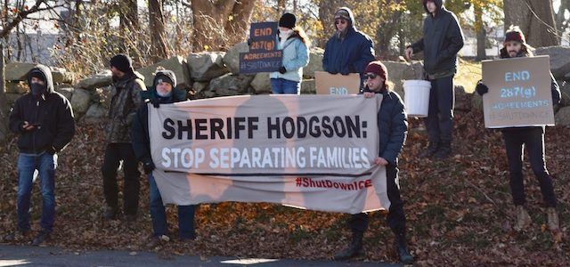

---

The rights to share an opinion, peacefully assemble, and protest are all protected in the Bill of Rights. They're non-negotiable.

Yet Tom Hodgson has called for leaders of so-called "Sanctuary cities" to be arrested. One of them thought Hodgson was a "jack-booted thug" and dared him to "come and get me." But Hodgson has also flouted a [Supreme Judicial Court ruling](http://www.wbur.org/news/2018/06/19/bristol-county-sheriff-sued-immigration) protecting 14th Amendment rights and is being sued for everything from [wrongful deaths](https://www.necir.org/2018/03/09/sheriff-office-sued-alleged-prisoner-mistreatment-2/) to [accepting kickbacks](http://www.tauntongazette.com/news/20180507/lawsuit-claims-sheriff-hodgson-receiving-kickbacks-from-inmate-phone-calls) to [abusing mentally-ill inmates](http://www.plsma.org/medical-and-mental-health/mentally-ill-inmates-sue-bristol-sheriff-over-solitary-confinement/). This is one *bad hombre*.

So it's not surprising that someone like Hodgson, with so little regard for the law, wants to stop people from exercising their right to protest — *him*.

On Thanksgiving morning [Hodgson got a home visit](https://upriseri.com/news/immigration/2018-11-22-hodgson/) from Rhode Island immigration activists of the FANG Collective. FANG was there to protest Hodgson's 287(g) agreement in Dartmouth, which is the nearest ICE facility for Rhode Island detainees. FANG spokesman Nick Katkevich told the Boston Herald, “I think to interrupt his holiday for 30 minutes is definitely appropriate because he is disrupting people’s lives every day.” We completely agree.

According to FANG, Hodgson called the New Bedford Police on the protesters but they were clearly observing the law and continued to deliver their message, leaving after about a half an hour in the unseasonable 16 degree weather.  

Hodgson wasn't happy with the protest, but neither he nor his talk radio buddies could manage to offer a coherent counter-narrative.

Playing the victim, and sounding an imaginary alarm — Hodgson's great talent — he told WBSM talk show host Chris McCarthy that he felt the group was there to try to [intimidate](http://wbsm.com/sheriff-hodgson-comments-on-thanksgiving-day-protest/) him. Speaking with the Boston Herald Hodgson said, "Any time you get groups of people together things can quickly shift into a mob mentality." The Boston Herald ("[Protests taking dangerous turn](http://www.bostonherald.com/opinion/editorials/2018/11/editorial_protests_taking_dangerous_turn)") ignored the [actual] peaceful nature of the protest and instead imagined all the mischief that citizens who confront public officials outside working business hours could make. *Constitutionally-protected mischief.*

WBSM's Ken Pittman showed his customary detachment from reality. [Pittman blamed](http://wbsm.com/leftist-parrots-harass-sheriff-hodgson-at-his-home-opinion/) the protests on "grey haired" New Bedford "Leftist Parrots," actually accusing them of being *paid actors*. Pittman was so unmoored he couldn't even get his activist groups straight, calling the fairly youthful protestors "anarchist Bolsheviks" and making an unhinged remark about helping Ugandan children — which in retrospect can only be interpreted as a desperate plea for help with his mental health.

Two days later Hodgson was back on the [Adriana Cohen show](http://www.bostonherald.com/news/local_coverage/2018/11/more_protests_would_not_surprise_sheriff_thomas_hodgson) at Boston Herald Radio, this time playing less the quaking victim and more the brave gunslinger. “The minute you violate the law, we’re going to lock you up,” Hodgson told Boston Herald Radio, which rather unprofessionally reported that the Sheriff's family had been eating their Thanksgiving meal at 9:00 in the morning when the protestors appeared across the street. Hodgson said it  “wouldn’t surprise” him if protestors show up again, but he boasted he's prepared to take them on all by himself. “I have some security of my own, through my own training.” 

But protests against Hodgson and his [well-documented](https://www.splcenter.org/hatewatch/2018/09/04/tied-tightly-trump-anti-immigration-group-fair-takes-capital-%E2%80%94-and-airwaves-%E2%80%94-once-again) hatred for immigrants are nothing new. 

- In 2011 [protesters interrupted](https://boston.cbslocal.com/2011/09/28/activists-disrupt-sheriffs-immigration-news-conference/) a news conference in Boston at which Worcester Country Sheriff Lew Evangelidis, Bristol County Sheriff Thomas Hodgson, and Plymouth County Sheriff Joseph McDonald announced they were applying to participate in ICE 287(g) agreements.
- In July 2017 [protesters interrupted](http://www.southcoasttoday.com/news/20170726/gop-bill-on-immigration-draws-protests-from-activists?rssfeed=true) Massachusetts House Republicans, including Sheriff Hodgson, with chants of “Keep hate out of our state” during their news conference to promote anti-immigrant legislation.

But Hodgson is right about one thing — the protests are only going to continue.

- In January 2017 [Hodgson himself](https://www.wpri.com/news/local-news/rally-planned-to-protest-sheriff-hodgsons-inmate-plan/1044298765) kicked off the first in a series of protests, and triggered a movement to rein in his abuses, after offering to let Donald Trump use local prison labor for his Mexico wall. 
- Within weeks Bristol County for Correctional Justice ([BCCJustice](https://bccjustice.org/)) had been launched.
- In July prisoners went on a [hunger strike](http://www.heraldnews.com/news/20180726/inmates-refused-to-eat-prepared-meals-at-bristol-county-house-of-corrections) to protest conditions at the Dartmouth facility. In [solidarity](http://www.southcoasttoday.com/news/20180727/activists-to-rally-in-dartmouth-in-support-of-jail-food-protest), [BCCJustice](http://wbsm.com/protest-in-dartmouth-over-treatment-of-bristol-county-inmates/) organized a protest in front of the jail, calling for an [end to abuses](https://dartmouth.theweektoday.com/node/35267), which include the highest suicide rate in the state, second-highest recidivism rate, horrendous food, filthy conditions, lack of medical care, denial of prescribed medications, and the lack of accountability for the many abuses.
- In August several members of the FANG Collective [staged a protest](http://www.southcoasttoday.com/news/20180821/ice-protesters-at-house-of-correction-in-dartmouth-arraigned) in front of the jail on Faunce Corner Road and blocked both entrances. 
- In September the Boston group [FIRE](http://www.southcoasttoday.com/news/20180908/hodgson--object-of-derision-and-scorn-from-prison-protesters) — Fight for Immigrants and Refugees Everywhere — protested Hodgson's history of abusing ICE detainees at the jail, toward the tail end of a national prison strike.
- In October 40 members of BCCJustice [visited the governor](http://www.tauntongazette.com/news/20181019/advocates-request-gov-charlie-baker-investigate-sheriff-hodgson) to demand the investigation of Hodgson's facilities that the Attorney General had asked two Baker appointees to do. 
- And on November 1st, BCCJustice peacefully picketed Tom Hodgson's fundraiser at White's of Westport. Again Hodgson called the police. 

Again the police refused to interfere with a peaceful, orderly protest protected by the Constitution.

Let's keep it that way.
