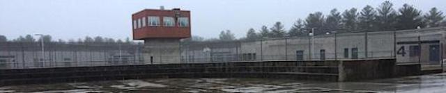
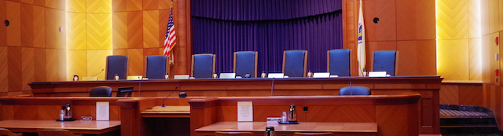

---
 

In Massachusetts, sheriffs and deputies are *law enforcement* officers with limited powers who may *assist* genuine police officers when requested. But they are not *police officers*. Sheriffs run jails, transport prisoners, serve eviction and other notices, and are prohibited from patrolling cities and towns — which are chartered (through state laws) to appoint and hire police officers with *full* police powers (a crucial point mentioned shortly). Sheriffs, however, *do* enjoy a few limited *[police-like](https://malegislature.gov/Laws/GeneralLaws/PartIV/TitleII/Chapter279/Section38)*[ powers](https://malegislature.gov/Laws/GeneralLaws/PartIV/TitleII/Chapter279/Section38); for example, while they are transporting prisoners through a foreign jurisdiction or *when asked* to assist in quelling a riot. And that’s about it.

But like Hershel Walker, Bristol County's Sheriff Thomas Hodgson keeps trying to pass himself off as the police — and whenever Hodgson's tried it, it's either been unappreciated or he's failed at it. Hodgson *implies* he has police powers by claiming to be tough on crime, but since he has very limited police-like powers all he can *really* do is suggest that women carry pepper spray, hand out swag to seniors at "safety" talks, lend out canines, and have his jail officers pose with children and his $250K "Homeland Security" command truck at parades.

It may seem like a trivial matter to Hodgson, but democracies require both the consent of the people to be governed — and to be policed. Only law enforcement officers elected or appointed by chartered Massachusetts municipalities have the *police* powers that Hodgson has repeatedly, and illegally, attempted to usurp.

*But don’t expect to see Sheriff Hodgson show up when you call 911*

In November 2003, Hodgson (without being asked, and even *after* being asked to stop) decided that New Bedford's police force wasn't doing a good-enough job. So he began sending his officers to patrol the city's streets. The New Bedford Police Chief was not amused, nor the mayor, and neither was the District Attorney. [The Standard-Times](https://archive.boston.com/news/local/articles/2003/09/26/city_county_sheriff_in_turf_tussle/) reported, "Bristol District Attorney Paul F. Walsh […] said Hodgson has made no effort to coordinate with city police and has a track record of legal failures when investigating crimes inside his own facilities. Walsh also said that arrests made by the sheriff's deputies, who typically serve warrants and act as guards at the county jail, would be subject to challenges in court. ‘You can't have the guy who was serving mashed potatoes to inmates last week calling himself a drug detective this week,’ Walsh said."

But that's *exactly* Hodgson's *shtick* — playing cop — and he's been doing it throughout his entire time in office.

Between 1991 and 2005 Peter Larkin was Hodgson's "Detective Lieutenant of Internal Affairs." Larkin resigned from the Bristol County Sheriff's Office (BCSO) three years after [botching](https://www.southcoasttoday.com/story/news/2002/11/22/deputies-criticized-as-case-unravels/50453290007/) a drug investigation the BCSO undertook — *again* without "assistance from other police agencies." One lawyer described the low quality of BCSO investigators, "They're not trained for investigative work," while another [called the BCSO](https://www.southcoasttoday.com/story/news/2002/10/09/fbi-mello-set-bounty-on/52942286007/) itself "a task force of goofballs who couldn't cut it as real cops."

ABC6 News [reported](https://www.abc6.com/former-new-bedford-public-school-employee-fired-over-comments-made-on-social-media/) in July 2020 that Larkin, who eventually found work as an attendance officer with the New Bedford Public Schools, had been fired (again) from *that* job for advocating *lynching* Black Lives Matter protesters: "I would roll tanks and bulldozers. Mush any human in the way. Shoot everyone else. Pile up the bodies and burn them on national tv." Within days Larkin had to [resign](https://wbsm.com/report-new-bedford-public-school-staffer-resigns-following-facebook-post/). This news was no surprise given Hodgson's membership in a hate group and memberships in several extremist organizations.

On January 12, 2017 the State Judicial Court, the “Supreme Court” of Massachusetts, considered the legality of a sheriff calling himself a police officer, and drew a clear distinction between *law enforcement officer* and *police officer* in [Commonwealth v. Gernrich](https://www.leagle.com/decision/inmaco20170112199) where it concluded that “sheriff's deputies are *not* police officers.”

The SJC had to consider the case of an inmate in the Worcester County jail who had lied to a deputy and was charged with violating [G. L. c. 269, § 13A](https://malegislature.gov/Laws/GeneralLaws/PartIV/TitleI/Chapter269/Section13A), which reads, "Whoever intentionally and knowingly makes or causes to be made a false report of a crime to *police officers* shall be punished by..." The inmate disputed that the *deputy* he had lied to was a *police officer*, so the matter before the SJC was the "issue whether a deputy sheriff is a police officer within the meaning of G. L. c. 269, § 13A, present[ing] a question of statutory interpretation..." The Justices reviewed Massachusetts law and concluded:

> "For the reasons explained above, *a deputy sheriff is not a 'police officer'* for purposes of G. L. c. 269, § 13A. Thus, we reverse the defendant's conviction, and a judgment of not guilty shall enter."

The reasoning behind the ruling is critical. The Justices wrote that G. L. c. 41, § 98 defines "unique" police powers that other law enforcement officials lack; therefore only *police* can be called *police*:

> Although the term "police officer" appears in a variety of statutory contexts, we adopt the definition in [G. L. c. 41, § 98](https://malegislature.gov/Laws/GeneralLaws/PartI/TitleVII/Chapter41/Section98), to guide our analysis of the issue. *General Laws c. 41, § 98*, which authorizes the appointment of "police officers" for cities and towns, is an appropriate guide for the interpretation of [G. L. c. 269, § 13A](https://malegislature.gov/Laws/GeneralLaws/PartIV/TitleI/Chapter269/Section13A), because it permits a distinction between the broad class of law enforcement officers empowered to perform only certain police duties and those expressly designated as "police officers" without such limitations. The definition of police officer in G. L. c. 41, § 98, encompasses a broad range of authority, including the power to make warrantless arrests, *that is unique* within the class of law enforcement officers. *In other words, a police officer is a law enforcement officer, but not all law enforcement officers are police officers.* It is this broad authority, *granted only to persons appointed as police officers by cities and towns*, that defines the term for the purposes of G. L. c. 269, § 13A.

Bottom line: "a deputy sheriff is *not* a police officer." You'd think that a ruling so clear and from the highest court in the state would stop Hodgson from trying to impersonate a cop.

But no.

Barely three months following the SCJ ruling, the Fall River [Herald News](https://www.heraldnews.com/story/news/politics/county/2017/04/20/correia-s-plan-to-increase/21336722007/) reported that Hodgson and disgraced former mayor (and now incarcerated felon) Jaziel Correia had entered into a backroom deal to have Hodgson run Fall River’s police lockup. Hodgson had tried and failed to sell a similar scheme before when Deval Patrick was governor. This time around Hodgson enlisted the help of a con man. The now incarcerated former mayor swore up and down that two local state representatives had promised to find state funding for Hodgson.

There were just two problems with the Correia-Hodgson deal. The Fall River police reminded all parties that policing by sheriffs was *illegal*. And Carole Fiola, who served on the Joint Ways and Means Committee and whose name Correira dropped, had to set the record straight when she told the Herald: “It was the first time I heard about it and I am not aware there is a budget request.”

The scheme was both illegal and based on lies.

Classic Hodgson.
