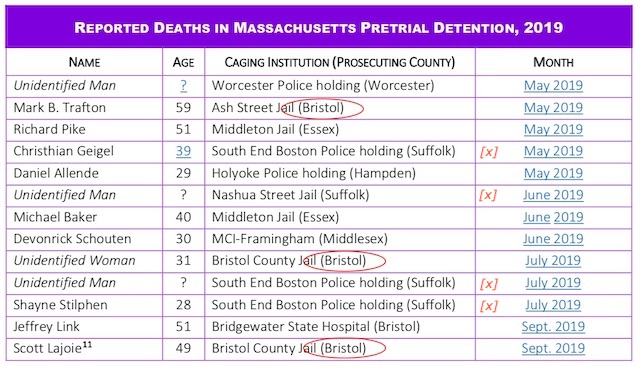

---

On September 27th, the same day Tom Hodgson was [giving the president an award](https://www.facebook.com/BristolCountySheriff/photos/a.1335231376503787/3103308219696085/?type=3&theater) in Washington, DC on the taxpayer dime, one of his prisoners died.

[Scott Lajoie's](https://www.legacy.com/obituaries/heraldnews/obituary.aspx?n=scott-lajoie&pid=194026086&fhid=2426) death set another gruesome record for a sheriff who seems to have no interest in his day job. Already leading the state in suicides and coming in a close second on both recidivism and assaults by correctional officers, **Hodgson's jail now comes in second with three times the state average for pre-trial detention deaths**.

Since January 2019, 13 people have died in pre-trial custody. That's an average of *less than one* per county.

Hodgson's death count is already up to three.

You can download the full Courtwatch report [here](https://www.courtwatchma.org/uploads/4/7/8/9/47895019/rhetoric_not_reform_-_oct._2019.pdf).

