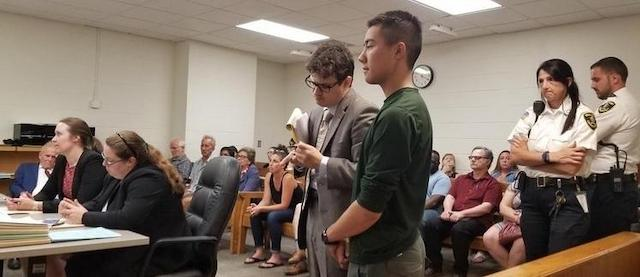
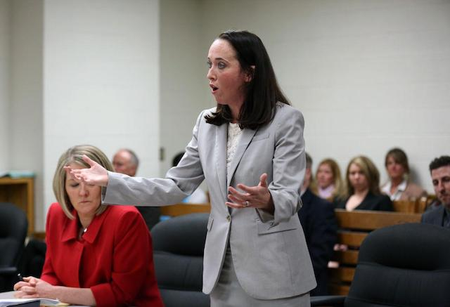

---

Judge Katie Rayburn sentenced FANG activist Amory Zhou-Kourvo to ten days in jail yesterday for blocking the entrance to the Bristol County House of Correction. On August 20, 2018 Zhou-Kourvo and Holly Stein were arrested after [cementing their arms](https://www.heraldnews.com/news/20190716/ice-protester-at-house-of-correction-in-dartmouth-gets-10-days) to a concrete filled tire and fastening bike locks around their necks to a fence. Zhou-Kourvo’s sentence will be shortened by two days already served and Judge Rayburn is considering a request to permit the sentence to be served in Norfolk instead of Bristol County because of the Bristol County House of Correction’s abysmal reputation, and because of its sheriff’s closeness to the case. A dozen FANG supporters, several local activists, and representatives of the NAACP New Bedford attended the hearings. 

After learning of the epidemic of suicides at the jail, widely reported in the Boston Globe and elsewhere, the Attorney General passed the buck to the Department of Corrections and the Executive Office of Public Safety and Security — both headed by Baker appointees. The State Auditor, to her credit, conducted a friendly “performance audit” which, like a previous one, found financial and managerial irregularities at the Sheriff’s Office, but it fell short of a complete investigation that would have shed light on the neglect and deprivation of prisoners. The Office of the Inspector General — also headed by a Baker appointee — was given evidence of the sheriff’s financial abuses of taxpayer money, but again no action was taken. Legislation which would have stopped the sheriff’s giveaways of state money to ICE have been shelved in the Massachusetts House by Speaker DeLeo.

So — hats off to these young people for temporarily inconveniencing a sheriff at the scene of his own crimes.

Sitting through the hearings on Tuesday morning, it took a while to get to Zhou-Kourvo’s case. Right before the nineteen year-old was sentenced to jail, attendees in Katie Rayburn’s court watched her give probation to a fentanyl dealer who had beaten his wife and also been implicated in accessory-to-murder charges. For Rayburn, who insisted on handling the FANG cases herself following the initial arraignments, a message apparently needed to be sent — don’t mess with law enforcement, no matter how crooked it is.

If the name [Katie Rayburn](https://www.marieclaire.com/culture/a28262792/katie-rayburn-i-love-you-now-die-documentary/) rings a bell, you probably just watched the [HBO documentary](https://www.hbo.com/documentaries/i-love-you-now-die-the-commonwealth-v-michelle-carter) on the Michelle Carter case. Rayburn was the ambitious Bristol County Assistant District Attorney who built a case around a story that a calculating 17 year-old ice princess convinced an adult “boyfriend” (who in reality she had met only a handful of times) to commit suicide by text message — from a 40 mile distance. The case raises so many [questions](https://www.sclawyers.net/2017/06/21/wrong-michelle-carters-conviction/) that it is now headed for the [Supreme Court](https://www.masslive.com/news/2019/07/michelle-carter-files-appeal-to-supreme-court-in-texting-suicide-manslaughter-case.html).

The only expert witness in the case, psychiatrist Peter Breggin, who looked at the suite of medications both teens had been prescribed, came to a totally different conclusion about Carter’s culpability than in Rayburn’s tale. Even as Rayburn herself continued to try the case in front of the cameras, she slapped a [gag order](https://www.madinamerica.com/2017/08/michelle-carter-expert-witness-stop-blog/) on Breggin. Rayburn was rewarded for her prosecutorial zeal (if not misconduct) with an appointment to the bench by Governor Charlie Baker.

Having seen the judge in action, it’s clear Rayburn still thinks she’s a prosecutor.
