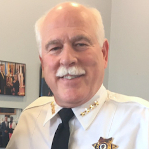
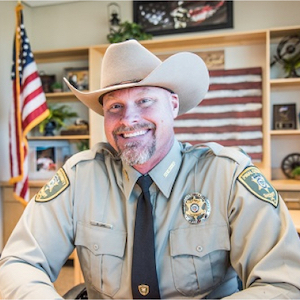
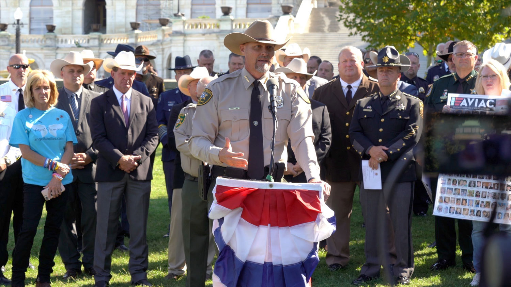
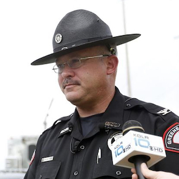
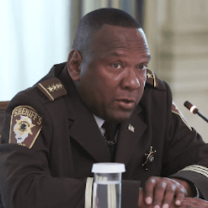
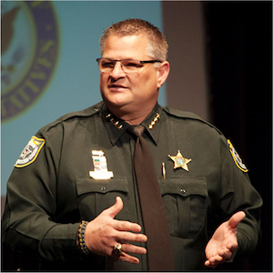
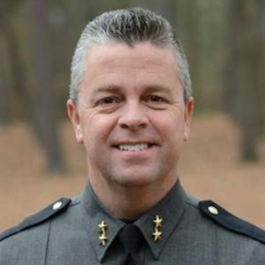
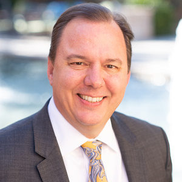
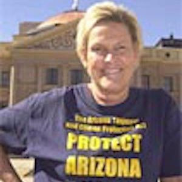
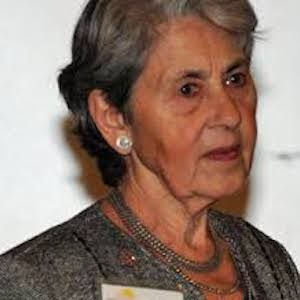

---
 

Those who have watched Bristol County Sheriff Tom Hodgson for any length of time know of his [extensive white supremacist connections](https://www.politicalresearch.org/2020/10/13/new-englands-joe-arpaio) and attention-grabbing moves like instituting chain gangs, offering to have his prisoners build Trump's border wall, informing on his own church in unctuous letters to former immigration advisor Stephen Miller, or personally participating in a jail riot. Hodgson is restless and ambitious, and he spends much of his time traveling at Massachusetts taxpayer expense to events organized by the Republican Party or by the Federation for American Immigration Reform (FAIR), the Center for Immigration Studies (CIS), and spinoffs like Advocates for Illegal Alien Crime (AVIAC), most of which both the ADL and SPLC count as hate groups.

Hodgson's newest project is called *[Protect America Now](https://protectamericanow.com/)*, which purports to be simply seven God-and-Country sheriffs who oppose immigration reform, gun control, voting rights, secularism, and socialism. The sheriffs include: the group's spokesman, Pinal County (AZ) Sheriff Mark Lamb; Green County (MO) Sheriff Jim Arnott; Livingston County (IL) Sheriff Tony Childress; Bristol County (MA) Sheriff Thomas Hodgson; Brevard County (FL) Sheriff Wayne Ivey; Culpeper County (VA) Sheriff Scott Jenkins; and Wicomico County (MD) Sheriff Mike Lewis.

Despite *Protect America Now's* call to help "stand strong against lawlessness," most refuse to enforce state gun control laws or COVID-19 mask or social-distancing [mandates](https://ehrens.substack.com/p/hodgson-supremacy-1?s=r). Instead, the sheriffs support [arming and deputizing](https://www.foxnews.com/us/pinal-county-sheriff-citizens-posse-program-allows-residents-to-be-deputized) their mainly white counties against both urban protesters and border "invaders."

Pinal County (AZ) Sheriff Mark Lamb is the public face of *Protect America Now*. Lamb is a self-promoter with numerous [businesses](https://www.bizapedia.com/people/arizona/mark-lamb.html) and organizations [through which he](https://www.sherifflamb.com/) and his wife [Janel](https://www.sheriffswife.com/) market themselves and their “God and Country” brand of nationalism. He has interests in two pest control businesses with [police themes](https://bugpoliceaz.com/). One of Lamb's "charities," the [American Sheriff Foundation](https://www.americansheriff.com/), took in $50,000 in donations but [can not account](https://www.msn.com/en-us/news/us/charity-founded-by-pinal-county-sheriff-mark-lamb-has-dollar18000-in-unaccounted-spending/ar-BB18ygnB) for $18,000 of it. The Foundation's main function seems to be to sell Lamb's "brand" and the couple's books about themselves. Lamb is [being investigated](https://www.azfamily.com/news/attorney-general-opens-investigation-into-pinal-county-sheriff-mark-lamb/article_97659afe-2ebc-11eb-a83e-cb6e1997a1b4.html) by the Arizona Attorney General for refusing to seize property in 2018 owned by the family of a lobbyist friend.

Lamb is a "[Constitutional Sheriff](https://www.theguardian.com/us-news/2021/jan/17/us-police-far-right-capitol-attack)" who claimed in one speech to the Arizona Police Association that “the constitution is hanging by a thread”. He belongs to the Constitutional Sheriffs and Peace Officers Association founded by former Arizona sheriff Richard Mack and appeared at CSPOA's [2020 Virginia Conference](https://cspoa.org/product/cspoa-2020-virginia-conference-highlight-video-download/). At least three other *Protect America Now* sheriffs, Thomas [Hodgson](https://drive.google.com/file/d/15oeluPOu7ZcoubHa2zJPycyRKy9dEVb3/view?usp=sharing), Scott [Jenkins](https://cspoa.org/product/cspoa-2020-virginia-conference-highlight-video-download/) and Wayne [Ivey](https://therepublic1.blogspot.com/2015/11/florida-public-official-of-month.html), are also CSPOA members.

Jessica Pishko, in a [Slate](https://slate.com/news-and-politics/2021/01/constitutional-sheriffs-white-supremacists-capitol-riot-insurrection.html) article entitled "Sheriffs Helped Lead This Insurrection," hit the nail on the head when she wrote that "[ninety percent of American sheriffs](https://www.blackenterprise.com/new-report-90-of-americas-sheriffs-are-white-men/) are white men, and in recent years they’ve become strongly affiliated with white supremacist groups. Across the country, [sheriffs](https://www.themarshallproject.org/2020/05/18/the-rise-of-the-anti-lockdown-sheriffs) have declared that they will not enforce laws they deem 'unconstitutional,' like COVID-19 public health orders or [gun laws](https://www.nytimes.com/2019/03/11/us/state-gun-laws.html) limiting weapons possession and permits. Their influence has only grown since the pandemic began, as mask wearing became affiliated with progressive liberals and a bare face was a sign of Trump support. Trump has always had an affinity with sheriffs. He met with more [sheriffs at the White House](https://www.bostonglobe.com/news/politics/2020/01/20/all-president-sheriffs-how-one-law-enforcement-group-became-ardent-trump-supporters/YvqIHMRszFqljv0q2oIZpI/story.html) than any other president and pardoned ex-Sheriff Joe Arpaio, who was convicted of contempt of court for failing to abide by a nondiscrimination order, calling him an ['American patriot.'](https://www.theguardian.com/us-news/2017/aug/25/donald-trump-joe-arpaio-pardon-arizona-sheriff)"

The *Protect America Now* sheriffs — contrary to their mission to "stand strong against lawlessness" have arrogated themselves the additional roles of lawmakers and judges, picking and choosing which laws they flout and which they enforce. Many of these choices hinge on race.

Pishko [explains](https://slate.com/news-and-politics/2021/01/constitutional-sheriffs-white-supremacists-capitol-riot-insurrection.html) the racist origins: "[…] the constitutional sheriff movement has explicitly white supremacist roots. When the Supreme Court held in *[Brown v. Board of Education](https://supreme.justia.com/cases/federal/us/347/483/)* that racial segregation was unconstitutional, county sheriffs were among the [Southern officials](https://segregationinamerica.eji.org/report/massive-resistance.html) who defied the court’s decision. They claimed that, in fact, desegregation was unconstitutional and invoked a legal theory called '[interposition](http://www.roanoketeaparty.com/interposition-in-action-if-one-sheriff-can-do-this-imagine-what-a-state-could-accompish/),' which argues that states can independently decide federal laws are unconstitutional and nullify them."

Which is precisely the approach Trump and the GOP took in fighting both impeachment and Trump's election loss.

When asked for comment on the January 6th Capitol insurrection, Lamb seemed to echo QAnon, attributing insurrectionist anger to the [unpunished crimes](https://www.azcentral.com/story/news/politics/arizona/2021/01/07/these-arizona-republicans-say-trump-isnt-to-blame-for-capitol-riot/6580354002/) of Hillary Clinton and [defending the rioters](https://theappeal.org/the-cops-at-the-capitol/): "I don’t know how loud we have to get before they have to listen to us and know we will no longer tolerate them stripping our freedoms away." Lamb also repeated accusations of Democrat election fraud in a [video](https://slate.com/news-and-politics/2021/01/constitutional-sheriffs-white-supremacists-capitol-riot-insurrection.html) that he subsequently took down.

Lamb is well-connected with the white supremacist [Tanton network](https://www.businesswire.com/news/home/20190711005621/en/ Crisis-Border-Coalition-Immigration-National-Security-Border), its groups FAIR, CIS, NumbersUSA, Angel Families, AVIAC, as well as border wall scammers like Steve Bannon (pardoned), Brian Kolfage (indicted), and Tom Hodgson, whose [crowdfunding](https://bccjustice.org/2019/01/white-agenda/) partnership with the now-defunct American Border Foundation, still can not account for more than $227,000 it collected.

While Lamb may be the poster boy for *Protect America Now*, six more sheriffs round out the roster. Some of them are less the ideologue than just cruel, arbitrary, racist, and crooked jailers who work for a white constituency that thinks cruelty is the only way to run jails and conduct police patrols.

Sheriff Jim Arnott serves Green County in the Missouri Ozarks. Like his brothers in *Protect America Now*, Arnott does things *his* way, voters and employees be damned. Arnott has made a name for himself insisting on his officers' belief in a deity. When asked by one reporter what he would do if one of his deputies objected to his [mandatory](https://www.opposingviews.com/religion/missouri-sheriff-if-deputy-opposes-god-we-trust-then-work-somewhere-else-video) "In God We Trust" decal, Arnott replied, "Well, I guess he’d have to work somewhere else if he didn’t like it that bad."

Like several other sheriffs, including Tom Hodgson, who was investigated by Homeland Security, the Massachusetts Attorney General, and a Congressional delegation for his personal participation in a correctional officer riot, Arnott runs a cruel, filthy jail where [half those incarcerated](https://www.msn.com/en-us/health/medical/its-a-bad-situation-inside-the-greene-county-jails-covid-19-outbreak/ar-BB17Vddw) have contracted COVID-19. In 2018 a county employee blew the whistle on Arnott's sheriff's department being pressed into a political campaign for a county tax increase. Arnott [sued the state](https://www.ky3.com/content/news/Auditor-Nicole-Galloway-provides-Greene-County-information-about-1-of-22-whistleblowers-472205243.html) for the identity of the whistleblower and launched a barrage of press releases designed to fight the case in the court of public opinion. Arnott even [harassed a county commissioner](https://www.news-leader.com/story/opinion/contributors/2018/04/30/still-lot-smoke-greene-county/563567002/) who had objected to Arnott's ethics violations. Ultimately [Arnott lost](https://www.news-leader.com/story/news/local/ozarks/2019/12/05/judge-rules-against-sheriff-favor-auditor-whistleblower-suit/2618541001/) his case and finally had to admit that he had indeed [violated state ethics](https://www.news-leader.com/story/opinion/contributors/2018/04/30/still-lot-smoke-greene-county/563567002/) laws.

Tony Childress of Livingston County, Illinois, is *Protect America Now's* only Black sheriff. Childress was one of the Federation for American Immigration Reform's earliest converts to its xenophobic "border invasion" campaign. With fellow *Protect America Now* members Hodgson and Jenkins, [Childress attended](https://www.oregonir.org/issues/northern-sheriffs-get-close-look-border-crisis) a FAIR- and CIS-led junket to the Mexican border in 2014. Childress was also one of 40 sheriffs who [met with former president Trump](https://www.wpri.com/news/washington-dc/trump-meets-with-sheriffs-on-immigration-border-security/) in 2019 about hardening border security. In 2018 Childress was found to have engaged in a little double-dipping — serving as sheriff while also working as a security consultant for [Innovative Security Solutions](https://www.pontiacdailyleader.com/news/20180126/isa-sheriff-statement-supports-extra-job). Childress defended his actions with the usual sheriff defense — whatever he had done was done *solely* in the interests of public safety.

Brevard County, Florida Sheriff Wayne Ivey is the living, breathing incarnation of the Southern sheriff. In 2013 Ivey re-introduced slave-style [chain gangs](https://www.usatoday.com/story/news/nation/2013/05/02/brevard-county-sheriff-chain-gang/2130335/). It was a racist touch that Arizona's Joe Arpaio used and which Bristol County Sheriff Tom Hodgson has also tried. If Ivey's chain gangs were not bad enough, Brevard County's sheriff produces "Wheel of Fugitive" [videos](https://www.facebook.com/watch/?v=910612892354799) and encourages the county's 83% white citizens to [arm themselves](https://www.youtube.com/watch?v=xqLWBfir9Yg). Slave catching is alive and well in Brevard County.

In 2018 Ivey's deputies [murdered Gregory Edwards](https://www.floridatoday.com/in-depth/news/2019/11/08/army-veteran-ptsd-dies-brevard-jail/1584907001/), a jailed Black veteran, by punching, tasing, and pepper-spraying him before placing a hood over his head and strapping him into a chair. Edwards died of a non-medical "police diagnosis" called "excited delirium." At first Ivey [refused](https://www.fox35orlando.com/news/jail-video-released-of-brevard-county-inmate-death) to turn over the [videos](https://www.clickorlando.com/news/local/2020/11/02/brevard-jail-video-of-inmate-death-wont-be-released-before-election-day/) of Edwards' death, but eventually agreed to turn over a sanitized version. In 2020 Ivey's deputies [murdered two Black teenagers](https://www.orlandosentinel.com/news/breaking-news/os-ne-teens-fatally-shot-by-brevard-county-deputy-20201117-srcsnuvh4zcs7lfwzhtftm3w4i-story.html),18-year-old Sincere Pierce and 16-year-old Angelo Crooms, by shooting into their moving car. Again Ivey refused at first to release the video.

After his deputies killed Edwards, [Ivey paid a surprise visit](https://www.usatoday.com/story/news/nation/2020/06/15/gregory-edwards-florida-sheriff-makes-uncomfortable-visit-widow/3190204001/) to Edwards' widow "for a welfare check." Ivey, ringed by half a dozen deputies, showed up at Kathleen Edwards' home unannounced, demanded she "step outside," upon which Ivey grabbed and then, inexplicably and grotesquely, hugged her. It was a bizarre, cruel, and menacing visit. “Out of respect for Mrs. Edwards’ privacy, the Sheriff’s Office will not be commenting on the nature or purpose of tonight’s service call at her residence," Ivey's media spokesman said, while acknowledging that the deputies had also filmed the staged confrontation.

Like Sheriff Arnott, Ivey insists that his deputies affix "In God We Trust" [decals](https://www.foxnews.com/us/florida-sheriff-god-atheist-complain) to their vehicles. And for those who like their *God and Country* nationalism in equal doses, Ivey also insists on [playing the national anthem](https://spacecoastdaily.com/2021/02/sheriff-wayne-ivey-brevard-sheriffs-office-to-start-every-monday-morning-with-the-playing-of-the-national-anthem/) or staging some "patriotic moment" every Monday. In 2017 the City of Orlando passed the [Trust Act](https://www.orlandosentinel.com/politics/os-orlando-sanctuary-cities-activists-20171114-story.html), which limited the ability of city police to assist ICE. In 2018 outraged county commissioners, with [Ivey's help](https://www.numbersusa.com/news/brevard-county-florida-adopts-anti-sanctuary-policy), sponsored an "anti-sanctuary" resolution.

For all his faux devotion to God and Country, upright behavior has not been the result. In 2011 Ivey retired from the Florida department of law enforcement (FDLE) three days after he was [accused](https://volusiaexposed.com/fdle/ivey/phonecall.pdf) of threatening a female probation officer who just happened to be the former fiancee of Ivey’s son Robert.

Like Mark Lamb, Ivey sounded the alarm when Black Lives Matter began protesting police murders. At the height of the protests in June 2020, Attorney [Alton Edmond](https://www.floridatoday.com/story/news/local/2020/06/10/florida-community-leader-alton-edmond-files-run-brevard-sheriff-challenges-wayne-ivey/5331623002/), who organized a George Floyd rally that drew more than 3,000 people, announced an election challenge to Ivey. It was the first time the Democratic Party had bothered to challenge the Republican.

Scott Jenkins is the Sheriff in Culpeper County, Virginia. In September 2020 Jenkins posted a [video](https://www.wusa9.com/article/news/local/virginia/some-culpeper-co-residents-considering-legal-action-to-remove-the-sheriff/65-6bdb7926-3cc8-407d-9e8e-b9af16f67bf6) rant on his department's Facebook page: "Citizens should alert themselves to the true nature of this violence and realize the intent is for it to continue across our nation during the months ahead. Antifa and the Black Lives Matter movement is not peaceful and at their heart are violent. They may bring their violence to any community at any time and especially where they see weakness in local government officials. These are a few of the many examples across our nation.”

So frightened of Black protesters was Jenkins that he advocated turning his county's 80% white citizenry into [reserve deputies](https://www.msn.com/en-us/news/politics/culpeper-co-sheriff-prepared-to-turn-citizens-into-reserve-deputies-if-gun-bills-pass-in-virginia/ar-BB174f3w) to fight “lawlessness,” [gun control](https://wjla.com/news/local/culpeper-sheriff-gun-control-laws-constitutionality) and other forms of legislative or judicial "meddling" that *he*, Scott Jenkins, determined to be "unconstitutional." Jenkins [openly flouts](https://bearingarms.com/camedwards/2020/07/22/sheriff-deputize-armed-citizens-n38511) his state's gun laws. And if it sounds like the sheriff might just be a CSPOA member, well, it's because he is.

A number of county residents have launched a legal effort to [recall](https://www.wusa9.com/article/news/local/virginia/some-culpeper-co-residents-considering-legal-action-to-remove-the-sheriff/65-6bdb7926-3cc8-407d-9e8e-b9af16f67bf6) Jenkins, and he was sued by the Legal Aid Justice Center in Falls Church, Virginia, for handing over an undocumented immigrant to ICE in 2017. After serving his time in the county jail, Francisco Guardado Rios was held past his release date in order to be turned over to ICE, as Jenkins had done to 100 other undocumented detainees. It was unconstitutional and violated even state law, but Jenkins fought law and precedent, [finally prevailing](http://www.vawd.uscourts.gov/OPINIONS/CONRAD/riosjenkinsopor715.pdf) in U.S. District Court. This made him a hero to the far right.

Wicomico County, Maryland Sheriff Mike Lewis is another *Protect America Now* sheriff who [refuses to enforce gun laws](https://publicintegrity.org/politics/enforcement-of-gun-laws-hinges-on-local-sheriffs-interpretation-of-second-amendment/). "State police and highway patrol get their orders from the governor," Lewis said. "I get my orders from the citizens in this county." In a video [Lewis told one reporter](https://www.usatoday.com/story/news/nation/2014/09/23/sheriff-defends-gun-rights-viral-video/16100151/), "As long as I'm the sheriff in this county, I will not allow the federal government to come in here and strip *my citizens* of their right to bear arms. I can tell you this, if they attempt to do that, it would be an all-out civil war, no question about it."

Responding to Lewis' inflammatory rhetoric, the Coalition to Stop Gun Violence [launched a petition](http://csgv.org/action/tell-maryland-police-training-commission-revoke-michael-lewis-certification/) calling for the Maryland Police Training Commission to revoke Lewis' certification. “It is difficult to see how a law enforcement officer who is threatening to wage war with the United States government meets any recognized standards of public service. In the wake of his threatening comments, Sheriff Lewis should not be given the responsibility of training law enforcement officers in Maryland.”

Contrary to *Protect America Now's* marketing on Fox News and elsewhere, *Protect America Now* is [not Lamb's creation](https://www.bizapedia.com/people/arizona/mark-lamb.html). It turns out the [incorporator and director](https://www.bizapedia.com/az/protect-america-now.html) of *Protect America Now* is [Nathan Sproul](https://www.nytimes.com/2004/10/18/opinion/allegations-of-electoral-crimes.html), a GOP operative who has been accused of, fired for, and charged with [multiple counts of voter fraud](https://www.breitbart.com/news/trump-gop-paying-consultant-dogged-by-voter-fraud-charges/), and who set up *Protect America Now* most recently in June 2020. As a sometime associate of Karl Rove, Sproul's [whole career](https://www.salon.com/2012/10/15/karl_rove_tied_to_shady_gop_operative_nathan_sproul/) has been devoted to voter suppression and dirty tricks.

It is no coincidence that today's *Protect America Now* has is roots in a similar organization created 18 years ago or that Nathan Sproul was involved in both. The [trademark](https://www.bizapedia.com/az/protect-america-now-pan2.html) for *Protect America Now* was created in 2004 and was the brainchild of [Kathy W. McKee](https://www.dandb.com/businessdirectory/protectamericanow-glendale-az-12614304.html), who is still listed on a PAC [registration](https://www.bizapedia.com/az/protect-arizona-now-committee.html) with a similar name. McKee was also the force behind Arizona's 2004 bill. [Proposition 200](https://apps.azsos.gov/election/2004/Info/PubPamphlet/english/prop200.pdf), a voter suppression bill. As soon as McKee got Prop 200 on the ballot, the GOP and every brownshirt and satin-sheeted group took an interest.

But McKee made the mistake of bringing a white supremacist, [Dr. Virginia Abernethy](https://www.splcenter.org/fighting-hate/extremist-files/individual/virginia-abernethy), onto the organization's national advisory board. Abernethy turned out to be even too extreme for the rest of PAN’s racists and xenophobes, so the Federation for American Immigration Reform, which had previously supported McKee and Abernethy, stepped in to save Prop 200 despite its [previous support](https://www.splcenter.org/fighting-hate/intelligence-report/2004/ignoring-its-own-ties-anti-immigration-group-denounces-white-separatist) for Abernethy.

Between 2004 and 2005 there was a power struggle for control of *Protect America Now* between McKee and the Federation for American Immigration Reform and, once again, it involved Nathan Sproul. As he had done with the [Kanye 2020](https://www.foxcarolina.com/news/kanye-wests-campaign-has-hired-gop-operative-with-history-of-controversial-work/article_3b34db9f-d19f-5b34-8a93-c93572b001a7.html) campaign, in 2004 Sproul paid signature collectors to get [Ralph Nader](https://prospect.org/article/nader-s-dubious-raiders/) on the ballot in order to siphon Democratic votes. But while Sproul's signature gatherers were getting Nader on the ballot their prime mission was gathering signatures for the voter suppression bill.

The story gets even weirder when we learn that the lawyer who incorporated *Protect America Now* for Sproul is Kory Langhofer, an equally [ethically-unencumbered](https://lawandcrime.com/2020-election/trump-campaign-lawyer-caught-using-his-business-partner-as-witness-in-sharpiegate-case/) GOP lawyer who fought both the [Mueller investigation](https://nymag.com/intelligencer/2017/12/are-trumps-lawyers-attempting-to-discredit-mueller.html) for Trump and [challenged Arizona election results](https://cdn.ca9.uscourts.gov/datastore/general/2020/10/07/20-16766 Emergency Motion for Stay.pdf) for Trump. *Protect America Now* and Langhofer's offices share a [common address](https://www.rnla.org/korylanghofer). Langhofer is also the co-owner of [Signafide](https://floridapolitics.com/archives/291866-signafide-promises-funnel-suspect-signatures), a company that uses artificial intelligence software to challenge ballot signatures.

Two years ago, Hodgson, Lamb, Ivey and the others were just a bunch of Stetson-hatted MAGA zealots supporting cruel immigration policies promoted by the Federation for American Immigration Reform and Trump's immigration advisor Stephen Miller. But by dutifully groveling and doing whatever was asked of them, each has established a closer personal connection to Donald Trump and to a Republican Party that finally looks like them.

As the GOP increasingly embraces nativism, the extremists have gone mainstream. Involvement by high level GOP operatives like Nathan Sproul and Kory Langhofer with sheriffs like Hodgson and their dangerous militia and white supremacist connections says a lot about the party's transformation.

Not so very long ago it was racist and xenophobic extremists who worked behind the scenes to support the GOP. Now it’s the Republican Party operating behind the scenes to support the extremists.