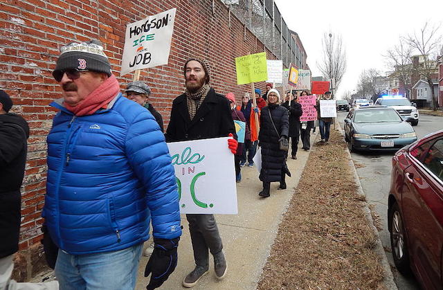
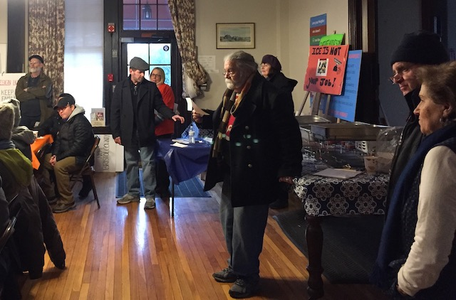

---

On January 18th, a little over a hundred people marched from William Street to the Ash Street Jail to protest the incompetence and abuses of Bristol County Sheriff Tom Hodgson, and to call for his resignation.

*"After careful consideration   
We invite your investigation   
We don’t need your fascist nation   
We don’t want your bloviation   
Down with prison exploitation   
You are always on vacation   
You turned in your Congregation   
Down with ICE participation   
You are Bristol’s humiliation..."*

Accompanied by a New Bedford Police Department escort, marchers chanted and carried signs with messages like *"Hodgson is a Failure as a Jailer," "No 287g," "Stay Home and Do Your Job," "Resign!" and "$348,922"* — the dollar amount Hodgson received from ICE and "forgot" to pay back to Massachusetts taxpayers. Others read *"Programs not Walls!"* or *"Demasiados suicidios - que verguenza!!!" (Too many suicides - shame!!!)*.

At the Ash Street jail marchers were met by about a dozen Bristol County Sheriff's officers who said nothing and for the most part simply stared at protestors. Standing outside the oldest jail in the country, Bristol County for Correctional Justice (BCCJ) members cited the neglect, abuses, and malfeasance that characterize Hodgson's administration of the jail and called for the sheriff to resign.

Protestors then marched back to Grace Episcopal Church, where there was a short speaking program followed by an opportunity for people from over a dozen groups from Providence to the Cape to exchange contact information. 

At the church BCCJ member Joe Quigley moderated the presentation. Betty Ussach talked about jail suicides, Kathy Williams about Hodgson's financial corruption and abuse of taxpayer money. Susan Czernicka covered Hodgson's medical neglect, while Marlene Pollock highlighted Hodgson's extensive contacts with white supremacists. Bishop Filipe Teixeira spoke about the struggle to visit immigrants in Hodgson's jail and Kerry Mahoney, a community member, spoke movingly about the needless death and suffering at the jail because of Hodgson's refusal to provide medically-assisted opioid treatment and other types of health care. 

Lindsay Aldworth from the Coalition for Social Justice, Richard Drolet from the New Bedford Democratic City Committee, Diane Hahn from 1199 United Health Care Workers East, Jim Pimental from the Bricklayers Union and the Labor Council all offered their organizations' support. Sally Fehervari from the Mansfield Dems and Adrian Ventura from Centro Comunidade de Trabajadores also spoke in support of ridding the county of Hodgson. Several organizations were unable to attend but sent greetings: the NAACP New Bedford Branch, FANG, Freedom for Immigrants, and Barnstable County's Safe Communities Coalition. Immigration Justice in Eastern MA (from Plymouth County) and several members of Marching Forward (Dartmouth) also attended both the march and followup meeting.

Despite the outpouring of broad community support, WBSM's Chris McCarthy — where ACLU FOIA records show Hodgson was actually offered a regular time slot — tried to portray the marchers as "the illegal alien lobby" and "the radical left," accusing them of trying to overturn the will of voters — voters who were never offered another option in 2016. This was all par for the course for the aptly-named McCarthy, whose Islamophobia and gay-bashing can be seen in his Tweets from the ACLU filing. The Standard Times did not send a reporter to cover either the march or the meeting that followed.

Regardless of how the local media chose to ignore or characterize the fight by BCCJ and other groups opposed to Hodgson's abuses — the fight goes on. 

We *will* hold the rogue sheriff accountable.